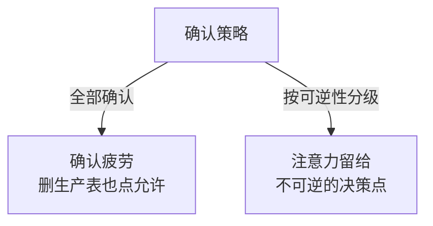

# 人在环路要设在不可逆的决策点

## 背景：每个操作都要确认，等于没用

一个 Agent 每执行一步都弹窗："要读取 a.go，允许吗？"用户点了 30 次"允许"之后开始无脑点。

第 31 次弹的是"要删除生产数据库的表"，用户照样点了允许。

**问题不是"确认不够多"，是确认得太多导致确认失去意义。** 人的注意力是有限资源，把它浪费在只读操作上，真正危险的时刻就没有注意力了。

两种确认策略，注意力花的位置不同：



## 方案：按可逆性分级

核心原则：**只在不可逆或有外部副作用的操作上要人工确认。**

### 分级模型

| 级别 | 特征 | 处理 |
| --- | --- | --- |
| L0 只读 | 读文件、查询、搜索 | **自动执行**，事后可查 |
| L1 可逆写 | 改本地文件、写临时数据 | **自动执行**，支持回滚 |
| L2 有副作用但可补偿 | 发通知、调外部 API | **自动执行 + 记录**，异常时人工介入 |
| L3 不可逆 | 删除数据、发布、转账、改生产配置 | **必须人工确认** |
| L4 高风险不可逆 | 批量删除、生产变更、资金操作 | **确认 + 二次验证（如输入确认短语）** |

**判断标准：如果这个操作做错了，能撤销吗？** 能撤销的自动执行，不能撤销的要确认。

### L3/L4 的确认要有效

无效确认：`要删除 1000 条记录，确定吗？[是][否]`

有效确认：告诉用户**具体是什么**、**影响范围**、**怎么撤销**：

```
将删除生产库 orders 表中 1,248 条 2023 年之前的记录。

影响：
  - 数据不可恢复（未配置备份）
  - 关联的 order_items 表有 3,102 条会被级联删除

如果你确认，请输入 DELETE 1248 继续。
```

要点：**要用户主动输入内容，而不是点按钮**。点按钮是肌肉记忆，输入短语需要真的读。

### 让确认发生在"计划"层，而不是"动作"层

更好的做法：**先让 Agent 给出完整计划，人工批准计划，然后自动执行。**

```
Agent：我计划执行以下操作：
  1. 读取 config.yaml
  2. 修改 db.host 为 new-host.internal
  3. 重启 api 服务
  4. 验证健康检查
  批准后我会自动执行，其中第 3 步会短暂中断服务（约 10 秒）。

[批准执行]  [修改计划]  [取消]
```

**这比逐步确认高效得多**，而且人工能看到全貌——避免"批准了 5 步之后发现方向就错了"。

## 效果与代价

**收益**

- **确认重新有效**：只有真正危险的时刻才打断人，注意力集中
- **效率大幅提升**：只读和可逆操作自动执行，不再逐条点确认
- **可审计**：每次 L3 确认都记录"谁批的、批了什么、什么时候"

**代价**

- **分级要准确**：把 L3 误判成 L2，就会出事故。**这个分类必须由人来定，不能让模型判断**
- **计划批准可能被跳过**：用户看都不看就点批准。需要在计划里**突出风险项**，而不是埋在一堆步骤里
- **不可逆操作难以完全枚举**：新加的工具可能引入新的不可逆操作，需要持续维护分级表

## 从什么地方做

**第一步：列出所有工具，标注可逆性**

拿你所有的工具，逐个标注：

| 工具 | 分级 | 说明 |
| --- | --- | --- |
| read_file | L0 | 无副作用 |
| write_file | L1 | 有 git 可回滚 |
| run_tests | L1 | 只改临时目录 |
| send_email | L2 | 不可撤回但影响有限 |
| delete_database | L3 | 高影响 |
| deploy_production | L4 | 不可逆 |

**第二步：从最危险的开始设卡**

不要一次给所有工具分级。**先把 L3/L4 堵住**，这些是会造成真实损失的。

**第三步：实现"计划-批准-执行"三段式**

对涉及 L3 的任务，改为：

```
1. Agent 生成计划（只含描述，不执行）
2. 人工批准/修改
3. Agent 按计划执行，遇 L3 再次确认
```

**第四步：记录所有确认**

```json
{
  "action": "delete_orders",
  "level": "L3",
  "approved_by": "user_8821",
  "approved_at": "2026-09-15T10:23:00Z",
  "params_hash": "a3f2...",
  "affected_rows": 1248
}
```

**参数变了要重新确认**——用 `params_hash` 绑定，防止"批准了删 10 条，实际删了 10000 条"。

**第五步：给"撤销"留窗口**

对 L3 操作，不要立即执行，而是**延迟执行 + 可撤销窗口**：

```
已排入执行队列，5 分钟后执行。在此期间可以撤销。
```

这比"确认对话框"更有效——人往往在事后才意识到做错了。

## 常见错误

**错误 1：所有操作都要确认**

前面那个案例：确认疲劳导致真正的危险操作被无脑批准。**过度确认比不确认更危险。**

**错误 2：用"确定吗？"做确认**

没有具体信息，用户只能凭感觉点。**必须给出影响范围。**

**错误 3：让模型判断操作是否危险**

模型可能判断错误，而且它可能被提示注入影响（把危险操作描述成安全的）。**分级必须是代码里的硬编码规则。**

**错误 4：确认后参数可以变**

用户批准了 A 操作，执行时参数被改成了 B。**必须用参数哈希绑定确认结果。**

**错误 5：忽略"批量的量级"**

删除 1 条和删除 100 万条，危险程度完全不同。**分级要考虑影响范围，不只是操作类型。**

相关：[[工程知识/AI 系统工程：从模型能力到生产能力/Agent与工作流/模型负责判断，运行时负责执行语义]] · [[工程知识/AI 系统工程：从模型能力到生产能力/Agent与工作流/工具是受约束的能力，不是提示词里的函数名]]

验证的锚点：审批点的有效性要演练对账——预演不可逆动作的触发路径，确认审批人拿到的材料足以判断（影响面、可撤销性、候选方案），拿演练里对不上的环节补审批材料模板。## 验证

最小验证：构造一次涉及不可逆操作的执行，在批准之后修改其中一个参数再放行，断言系统因参数哈希不匹配而重新请求确认；再构造一次批量删除，把影响行数从 10 条改成 10000 条，断言风险等级随之上升并触发更强的确认。

撤销窗口验证：对排在延迟队列中的操作发起撤销，断言操作未被执行且撤销记录入审计。

## 边界

- 确认频次与确认质量互为代价：确认点过密时人会失去判断力，危险操作反而更容易被放行。
- 风险分级不能交给模型判断：分级规则需要写在代码里，模型可被输入内容影响而把危险操作描述成安全的。
- 确认只覆盖参数确定的操作：操作的影响范围本身无法事先枚举时，确认对话框给不出可判断的信息。
- 撤销窗口需要操作本身可撤销：已经发出的通知、已经扣减的库存无法通过延迟队列撤回，这类操作要在执行前完成确认。
- 人工确认不消除模型判断错误：模型把不该执行的操作描述得合理时，人看到的是被加工过的信息。

## 机制与本质

人的注意力是有限资源，确认点的数量上升时每次确认投入的判断力下降。把确认设在不可逆的位置，使有限的注意力集中在无法事后修正的操作上；风险等级由操作类型与影响范围共同决定，因此分级规则需要在执行侧固定，而非由模型在运行时给出。

## 要解决的问题

Agent 执行的操作里有一部分无法事后修正，全部要求人工确认时确认疲劳会让危险操作被无意识放行，不设确认时误操作直接造成损失。本篇回答：哪些操作属于不可逆、风险分级依据什么、确认之后参数被改动如何发现，以及怎样给已经确认的操作留出撤销空间。

