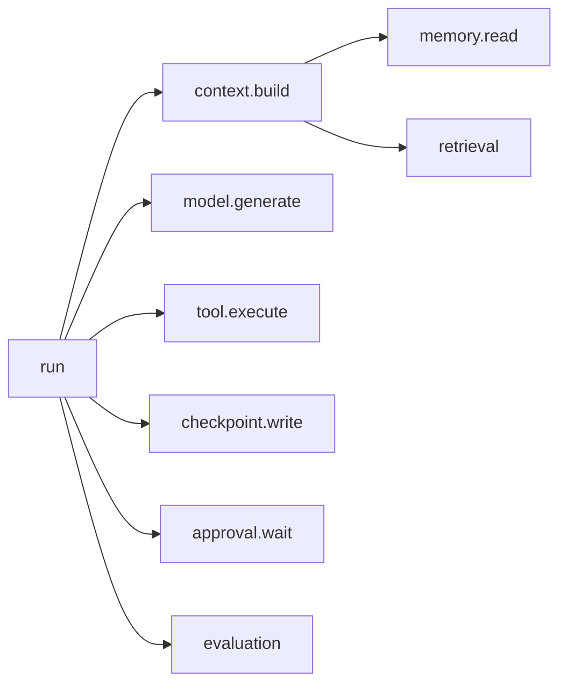

# 可观测性必须能重建一次决策

可观测性解决的是只看到最终回答，却不知道模型看了什么、调用了什么、状态何时改变的问题。核心机制是把 run、context、model、retrieval、tool、checkpoint 和 evaluation 通过稳定 ID 串起来；最小例子是回放一次失败请求，重建当时的模型版本、证据、工具参数和退出原因。
Agent 的日志不能只记录用户输入和最终回答。要定位一次失败，必须能重建：当时的目标和版本是什么，模型看到了什么，为什么选择这个动作，工具实际做了什么，状态如何变化，最终判定由哪些证据支持。

## Trace 的基本层次

trace 从一次 run 出发，按下面的层次展开，每一层都有稳定的 ID 与之对应：

- `context.build`：其中包含 `memory.read` 与 `retrieval`
- `model.generate`
- `tool.execute`：其中包含对外的请求或进程调用
- `checkpoint.write`
- `approval.wait`
- `evaluation`

一个逻辑操作即使内部重试多次，也应保留共同父级，并记录每次尝试。跨队列和后台任务要传播 trace、run、tenant 和 workflow version，避免链路在异步边界断开。

trace 从一次 run 展开的层次与包含关系：

## 必须记录的引用

| 对象 | 至少记录 |
| --- | --- |
| 运行 | run_id、主体、目标资源、revision、工作流版本、开始/结束状态 |
| 模型调用 | provider、模型快照、输入上下文版本、输出类型、token、延迟、错误 |
| 检索 | query、索引/embedding/reranker 版本、过滤条件、候选和最终证据引用 |
| 工具 | 工具/schema 版本、参数哈希、权限判定、幂等键、真实结果引用 |
| 状态 | checkpoint、事件序号、任务代际、恢复和取消原因 |
| 评价 | evaluator 版本、样本/规则、分项结果和人工修改 |

自然语言理由可以记录，但它是模型输出，不是隐藏思维的真实解释，也不能替代上述因果事实。

## 内容采集与隐私冲突

完整 prompt、检索片段和工具结果最有助于调试，也最可能包含个人数据、代码和凭据。默认记录结构和引用，内容按风险脱敏、采样或存入受控对象存储；trace 里保存内容哈希与访问引用。测试环境可以更完整，生产环境要有保留期限、访问审计和用户删除传播。

OpenTelemetry 的 GenAI 语义约定仍在演进，适合用来统一 provider、模型、token、检索和工具 span；应用自己的 run、workflow、tenant 和业务结果应放在稳定的内部 schema，再在适配层映射到标准，避免标准字段变化污染业务数据。

## 指标必须对应可行动问题

- 任务成功率下降：按模型、工作流版本、工具、租户和失败类型切片；
- P95 上升：分解模型、检索、排队、工具和人工等待；
- 成本上升：看步数、重试、上下文长度和高价模型路由；
- 工具错误上升：区分参数、权限、依赖、超时和冲突；
- 引用支持下降：分解召回、重排、上下文选择和生成使用；
- 人工接管上升：区分合理升级与系统能力退化。

只采集 token 和延迟，无法解释为什么 Agent 失败；只保存全部文本，又无法稳定聚合和保护隐私。两者需要同时设计。

## 从线上轨迹回到工程改进

高价值轨迹进入失败分类队列，脱敏后变成离线评测样本。修复可能发生在任务定义、上下文、检索、工具、控制流、运行时或模型层；必须根据 trace 定位最早出现偏差的位置，而不是一律改提示词。修复上线后用同一 trace 模式确认偏差消失，并监控是否产生新的成本或安全退化。

相关：[[工程知识/AI 系统工程：从模型能力到生产能力/质量与运营/Agent评测必须覆盖轨迹而不只看最终答案]] · [[工程知识/性能工程：从用户等待到资源瓶颈/观测与诊断/性能问题定位]]

相关（约定层）：[[工程知识/AI 系统工程：从模型能力到生产能力/质量与运营/Agent评估系统的设计约定]] —— 重放所需的任务夹具与证据包格式

验证的锚点：可观测性要与回放重建对账——预写仅凭记录能还原当时的模型版本、检索证据、工具参数与退出原因，任一项还原不出就无法重建这次决策。

## 验证

1. 回放重建：取一次失败请求，仅凭记录重建当时的模型版本、检索到的证据、工具参数与退出原因，四项与预期一致全部还原才算记录完整。
2. 链路完整：沿稳定 ID 逐层核对 run、context、model、retrieval、tool、checkpoint 与 evaluation 的关联，确认没有断链。
3. 状态变化可查：确认状态何时被谁改动记录在案，改动时间与决策时间对得上。

## 效果与代价

按稳定标识把运行、上下文、模型、检索、工具与状态串起来，换来的是失败请求可以回放到当时的输入条件，根因能定位到最早出现偏差的那一步。代价是采集面扩大后内容中可能包含个人数据与凭据，需要在结构记录与内容脱敏之间取得平衡，并为保留期限与删除传播建立流程。

## 要解决的问题

只看到最终回答，无法回答模型当时看到了哪些内容、调用了哪些工具、状态在什么时候改变、失败从哪一步开始，复现时也无法还原当时的输入条件。本篇回答：一次决策涉及哪些对象、这些对象通过什么标识串联、回放需要保存哪些字段，以及缺少哪些记录时根因判定无法完成。

