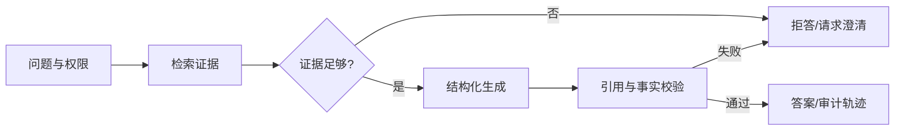

# 可靠生成需要结构、证据、拒答与回归

可靠生成解决的是模型在证据不足时仍然给出流畅但错误答案的问题。核心做法是输入、证据、结构化输出、程序校验和回归门禁共同约束；最小例子是让无答案、冲突版本和越权问题走到拒答，而不是用模型记忆补全。
“减少幻觉”不是单独调 Prompt，而是把不确定性限制在一条可验证的生产链路中。目标是让系统在证据不足时拒答，在证据充分时给出可定位的引用，并且在模型、检索器或数据变化后能发现回归。

## 可靠性边界

必须区分三类输出：

- **已验证事实**：有版本化来源、实验或线上观测支持。
- **合理假设**：来源有限或只适用于特定环境，明确标注条件和置信度。
- **未知**：没有足够证据，不用模型记忆补全。

## 工程控制点

1. **输入约束**：定义问题类型、权限、时间范围、可用工具和预算；敏感数据在进入模型前脱敏。
2. **证据约束**：检索结果带来源、版本、时间和 ACL；没有证据的字段不得由模型猜测。
3. **输出约束**：优先 JSON Schema/类型定义；引用绑定到句子或字段；拒答是合法结果。
4. **程序校验**：校验 schema、引用存在性、引用支持率、数值范围、权限和副作用确认。
5. **回归评测**：固定数据集与 grader，比较模型、Prompt、embedding、reranker、索引和工具协议变化。
6. **可观测性**：记录 trace、token、延迟、错误、工具调用、检索轨迹和版本；默认不采集原始敏感内容。

### 更多知识不必然更可靠

Prompt、RAG 片段、长期记忆和模型生成的摘要都是上下文输入，不是天然正确的增强。错误、冲突或与任务无关的知识，可能让原本答对的样本变错；因此“增加知识”必须作为可回滚变更评测，而不是凭直觉上线。

至少做三组对照：

1. **目标坏样本**：新增知识是否修复了原问题；
2. **稳定好样本**：原来正确的行为是否被误导；
3. **消融实验**：移除新增知识后结果是否退化，用来判断收益是否真的来自这次变更。

若知识只在特定版本、用户或条件下成立，必须把条件写入元数据并在检索阶段过滤。冲突来源按权威性、时间和适用范围排序；无法消解时向用户展示分歧或拒答，不让模型静默选一个“听起来合理”的版本。

## 最小评测集

| 维度 | 样本 | 通过条件 |
| --- | --- | --- |
| 事实性 | 单跳事实、数值和引用 | 每个关键结论有可定位证据 |
| 覆盖 | 多跳问题、子问题列表 | core 子问题全部回答或明确拒答 |
| 时效 | 同一事实的多个版本 | 选择符合时间范围的版本 |
| 鲁棒性 | 噪声、冲突、提示注入 | 不把无关/恶意文本当指令 |
| 权限 | 允许、拒绝、权限变更 | 不召回、不引用越权内容 |
| 运行 | 慢查询、工具失败、超预算 | 有限重试、可回退、成本受控 |
| 负回归 | 加入错误/无关知识，覆盖原本正确样本 | 坏样本改善且稳定集不退化；冲突时可拒答 |

每个失败样本记录：输入、证据、模型/工具版本、预期行为、实际行为、根因、修复和回归结果。不要只保留一个总分。

## 与 RAG 和测试的连接

- 检索召回、时效、ACL 和引用属于 [[工程知识/AI 系统工程：从模型能力到生产能力/知识与检索/RAG的核心是选择可引用证据]] 的证据链问题。
- 工具授权、确认和失败回退属于 [[工程知识/AI 系统工程：从模型能力到生产能力/Agent与工作流/构建可靠Agent应用]] 的 Agent 控制面问题。
- AI 对执行事实的声明必须通过 [[工程知识/AI 系统工程：从模型能力到生产能力/安全与治理/执行证据必须独立于AI结论]]：命令、退出码、日志、产物和 revision 由框架采集，模型只解释证据。
- 数据集、契约测试、红队和线上回放属于 [[工程知识/软件构建：让变化可以理解、验证与交付/测试与交付/测试策略从风险选择证据]] 的质量门禁。
- 模型或 API 变更的证据和复查日期写入 变更记录（方法层文档）]。
