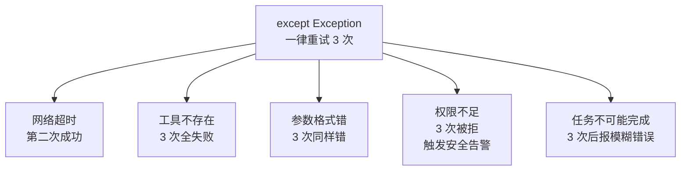
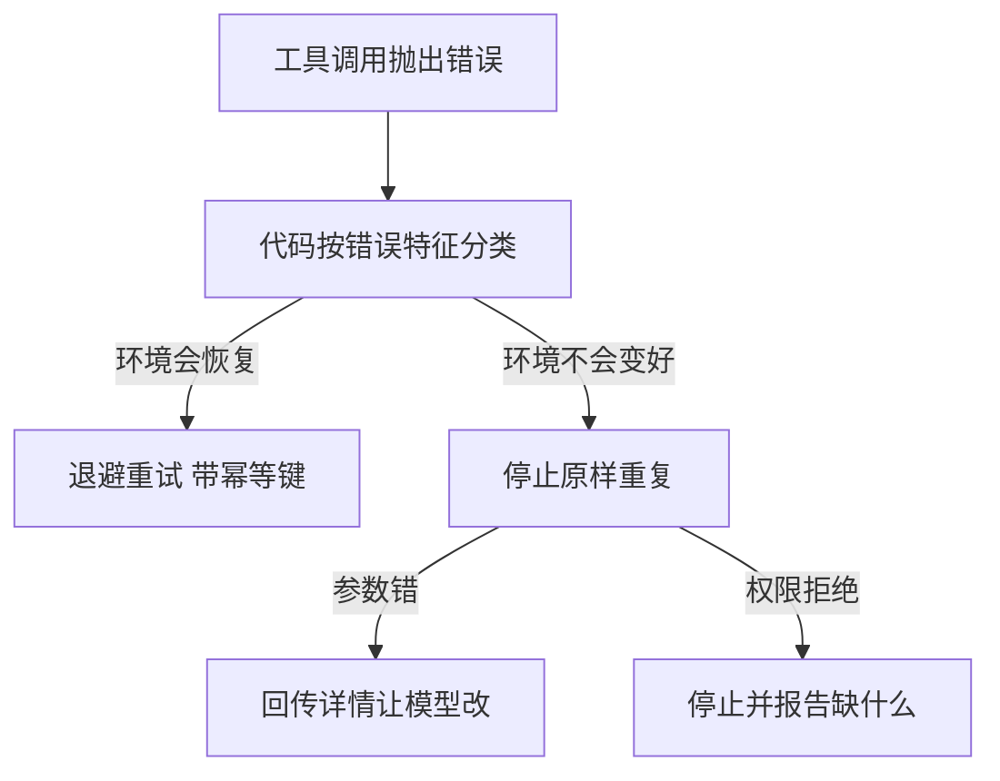

# 失败要分类才能对症下药

失败分类解决的是把超时、参数错误、权限拒绝和任务本身不可完成都当成“再试一次”时，系统既浪费预算又掩盖根因的问题。做法是由运行时按可恢复性把错误映射到退避、修正、重读、停止或人工接管；收益是重试只用于可能成功的瞬时问题，边界是分类规则必须随工具和依赖演进，模糊错误不能被模型随意解释。最小验证是对每一类故障注入一次，检查重试次数、最终状态和给用户的恢复信息都符合策略。

## 背景：所有失败都用"重试"处理

一个 Agent 的错误处理只有一种：

```python
except Exception as e:
    retry()   # 重试
```

结果：

- 工具不存在 → 重试 3 次，每次都失败，浪费 3 次调用
- 参数格式错 → 重试，还是同样的错
- 网络超时 → 重试，这次成功了（**唯一有效的场景**）
- 权限不足 → 重试 3 次被拒 3 次，还触发了安全告警
- 任务不可能完成 → 重试 3 次，然后报一个模糊的错误

**用一种策略处理所有失败，意味着大部分场景都用错了策略。**



图回答的是单一重试策略在五类失败上的真实结局：只有瞬时故障一类能靠重复执行变好，其余四类分别浪费调用、重复同样的错、触发告警、把根因拖到最后一次才暴露。

## 方案：按"能否通过重试解决"分类

### 五类失败

| 类型 | 特征 | 正确策略 | 重试？ |
| --- | --- | --- | --- |
| **瞬时故障** | 超时、503、限流、连接重置 | 退避重试 | 直接重试 |
| **输入错误** | 参数格式错、类型不对、缺必填 | 修正参数后重试 | 改了参数才行 |
| **逻辑错误** | 模型选错工具、推理错误 | 换个策略，或给模型反馈让它改 | 原样重试无效 |
| **环境阻塞** | 权限不足、依赖缺失、网络不通 | **立即停止**，报告需要什么 | 不可重试 |
| **任务不可完成** | 需求本身矛盾、信息不存在 | **立即停止**，说明原因 | 不可重试 |

同一句"调用失败"落到哪条路径，由错误特征决定，不由模型猜测：



上图给出的是分流依据：分类发生在代码里，只有环境会自行恢复的一类能靠重复执行变好，其余类别分别走向修正参数与停止报告。

### 每一类怎么识别

**瞬时故障** —— 靠错误类型判断：

```python
TRANSIENT = {
    "timeout", "connection reset", "503", "429",
    "temporarily unavailable", "too many requests",
}
```

处理：指数退避 + 抖动 + 幂等键。

**输入错误** —— 靠 schema 校验：

```python
try:
    validate(params, tool.input_schema)
except ValidationError as e:
    # 把校验错误返回给模型，让它自己修正
    return ToolResult(error=f"参数错误：{e}。请检查后重试。")
```

**关键：把具体错误告诉模型，让它自己改。** 模型修正参数的能力很强，前提是知道错在哪。

**逻辑错误** —— 靠结果判断：

```
工具调用了，返回成功，但没解决问题
（比如改了文件，但测试还是失败）
```

处理：**不要重试同样的动作**。应该：
- 记录"试过这个，没用"
- 换个角度（换个文件、换个方法）
- 连续 N 次无效 → 停止（见 [[工程知识/AI 系统工程：从模型能力到生产能力/Agent与工作流/模型负责判断，运行时负责执行语义]]）

**环境阻塞** —— 靠错误特征判断：

```python
BLOCKING = {
    "permission denied", "authentication failed",
    "no such host", "command not found",
    "disk quota exceeded", "connection refused",
}
```

**这类错误重试一万次也没用**，因为环境不会自己变好。正确做法：

```
停止 → 报告"需要安装 X"或"需要 Y 权限" → 等人工介入
```

**任务不可完成** —— 最难识别。特征：

- 多次尝试后信息仍然矛盾
- 需求里包含不可能的条件（"在不重启的情况下升级内核版本"）
- 引用的资源根本不存在

处理：明确说明为什么不可能，而不是硬做。

### 把分类写进代码

```python
def classify(error: Exception) -> FailureType:
    msg = str(error).lower()
    if any(t in msg for t in TRANSIENT):
        return FailureType.TRANSIENT
    if any(t in msg for t in BLOCKING):
        return FailureType.BLOCKING
    if isinstance(error, ValidationError):
        return FailureType.INPUT
    return FailureType.LOGIC
```

**分类必须是代码里的规则，不是让模型判断。** 理由和 [[工程知识/AI 系统工程：从模型能力到生产能力/安全与治理/提示注入和工具越权是不同威胁]] 一样：模型在出错时判断力最差。

## 效果与代价

**收益**

- **成本下降**：不再对不可恢复的错误做无效重试
- **恢复率提升**：瞬时故障被正确识别并重试
- **报告质量提升**：失败时能说清"需要什么"，而不是"失败了"
- **安全**：权限错误不再被反复触发

**代价**

- **分类规则要维护**：新增工具、新的错误类型都要更新分类表
- **可能误判**：某个错误既像瞬时又像阻塞。**不确定的按瞬时处理**（重试有上限，代价可控）
- **逻辑错误最难识别**："返回成功但没用"需要任务层面的判据

## 从什么地方做

**第一步：收集实际的失败**

跑一周，把所有 `except` 捕获到的错误记录下来。**看真实分布**——通常 60% 集中在 2-3 种错误上。

**第二步：先处理最高频的两类**

不要一次设计完整的分类体系。**先处理 TOP 2**，通常是超时（瞬时）和参数错误。

**第三步：把分类表写成常量，放在显眼的地方**

```python
TRANSIENT_ERRORS = [...]
BLOCKING_ERRORS = [...]
```

**让添加新工具时自然会想到更新它。**

**第四步：给每种类型配不同的处理路径**

```python
if type == TRANSIENT: retry_with_backoff()
elif type == INPUT:   return_error_to_model()
elif type == BLOCKING: stop_and_report()
elif type == LOGIC:   change_strategy()
```

**第五步：统计各类失败的占比**

如果 `BLOCKING` 占比很高 → 环境问题，不是 Agent 问题。
如果 `LOGIC` 占比高 → 需要改进提示词或工具描述。
**这个分布本身是最重要的诊断信号。**

## 常见错误

**错误 1：catch-all + 重试**

`except Exception: retry()` —— 前面说的所有问题都来自这里。**至少要区分可重试和不可重试。**

**错误 2：把错误详情藏起来**

返回给模型 `"工具调用失败"`，模型不知道为什么，只能瞎猜。**错误详情必须传回模型**，它修正的能力比想象中强。

**错误 3：对 BLOCKING 错误重试**

权限不足重试 5 次 → 触发安全告警、浪费预算、日志充满噪音。

**错误 4：把"返回成功但没用"当成功**

工具执行成功了，但任务没进展。**要在任务层面判断进展，不只是工具层面。**

**错误 5：分类逻辑依赖模型判断**

提示词写"如果错误不可恢复就停止"——模型判断不了。**用代码规则分类。**

相关：[[工程知识/AI 系统工程：从模型能力到生产能力/Agent与工作流/模型负责判断，运行时负责执行语义]] · [[工程知识/AI 系统工程：从模型能力到生产能力/质量与运营/成本控制要从上下文和重试两头下手]]

相关：[[工程知识/软件构建：让变化可以理解、验证与交付/测试与交付/AI 做前端与设计：可验证的打磨回路]]

相关（失败分类的一个具体分支）：[[工程知识/后端系统：在并发、失败与变化中维持服务/服务设计/一路会话只能有一个回复归属：多客户端接入时的所有者绑定]] —— 等待回复的请求超时后就地报错，属于调用方必须处理的失败分支

验证的锚点：分类策略要与逐类注入对账——预写权限拒绝与任务不可完成两类直接停止、超时类才进入退避，实测不可恢复类被反复重试，与预期对不上。

## 验证

1. 逐类注入：对超时、参数错误、权限拒绝、任务不可完成四类故障各注入一次，确认重试次数、最终状态与给用户的恢复信息都符合各自策略。
2. 不可恢复直停：确认权限拒绝与任务不可完成两类没有进入退避重试，而是直接停止或转人工。
3. 规则演进：工具或依赖变更后重跑注入用例，确认分类规则随之更新，模糊错误没有被模型自行解释成可重试。

## 机制与本质

失败分类的机制层：错误在抛出时携带的信息决定了它属于哪一类，瞬时故障与权限拒绝在外观上都是调用未成功，但重复执行带来的后果完全不同。重试在环境条件会自行恢复时有效，在输入与权限不变的条件下只是重复同样的失败；分类规则因此必须建立在错误特征上，由运行时代码判定。

## 要解决的问题

超时、参数错误、权限拒绝与任务本身无法完成都被当成同一类失败，系统对四者统一重试，既消耗预算又掩盖了真实原因。本篇回答：错误按可恢复性怎样分类、每一类对应退避还是修正还是停止还是转人工、分类规则随工具与依赖变化时怎样维护，以及模糊错误为什么不交给模型自行解释。

