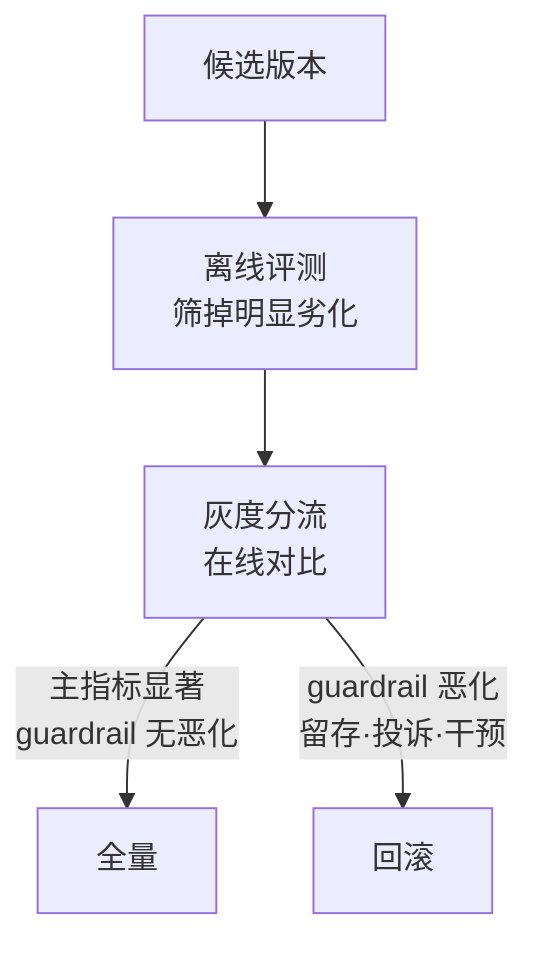

# 离线评测与在线评测回答不同问题

模型升级离线分数涨了，上线后关键指标反而跌了——两边都没说谎，它们回答的根本不是同一个问题。要解决的问题：离线评测度量模型能力，在线评测度量系统能力；把两者当同一把尺子，是 AI 系统与推荐系统里反复出现的决策事故。分清两把尺子的分工，评测体系才立得起来。

## 两把尺子的分工

| 维度 | 离线评测 | 在线评测 |
| --- | --- | --- |
| 回答 | 模型在这个分布上能力如何 | 系统在真实流量下表现如何 |
| 优势 | 快、可重复、可控变量 | 真实分布、真实反馈、真实延迟 |
| 盲区 | 分布漂移、延迟与成本、反馈效应 | 慢、贵、伦理与分流噪声 |
| 典型 | 评测集打分、基准回归 | A/B 分流、代理指标对比 |

离线的盲区有三：评测集分布与线上分布漂移（[[工程知识/AI 系统工程：从模型能力到生产能力/质量与运营/评测集的构建与维护决定所有评测的地基]] 讲怎么控）；延迟与成本不进分数但进用户体验与账单；反馈效应（用户看到结果后行为改变）离线完全测不到。在线的盲区是慢与贵：一个结论要等完整的分流周期，且只能比较有限个候选。

## 闭环：离线筛选，在线裁决

标准流程：离线评测筛掉明显劣化的候选 → 灰度分流在线对比 → 指标显著才全量。两处衔接是事故高发：离线领先的候选在线掉队（分布外泛化差），在线领先的候选长期反噬（短期点击、长期留存）。反噬的检测靠 guardrail 指标：点击率主指标之外同时监控留存、投诉率、人工干预率，任何一项显著恶化即回滚。



## 可运行示例：同一模型的两张成绩单

一个排序模型，离线与在线各算一次，两张单子会打架：

```python
# 离线：固定测试集上的 AUC
#   测试集 = 昨天的曝光点击日志，按曝光抽样
#   结果：AUC = 0.82（比线上模型高 0.01）

# 在线：A/B 实验的真实指标
#   对照组 = 线上模型，实验组 = 新模型
#   结果：CTR +0.3%，但人均停留时长 -1.2%，七日留存 -0.4%

# 打架的解释：离线测试集来自旧模型的曝光分布（点击了才会被记录），
# 新模型在离线里学的是"旧曝光分布下的排序"，上线后改变了曝光分布，
# 长尾内容曝光变多 → 单次点击率微涨，用户探索成本变高 → 时长与留存跌
```

跑一遍的收获：离线指标只能证明"在旧分布上排序更好"，分布偏移（曝光即反馈）只有在线能看见。AUC 涨 0.01 与 CTR 涨 0.3% 之间没有换算公式，任何"离线涨 X 则在线涨 Y"的承诺都是编造。

## 量化锚点：实验的最小样本

在线实验的最小样本量由效应大小倒推：要检出 CTR 相对变化 1%（基线 5% → 5.05%），在 95% 置信、80% 功效下，每组约需 77 万次曝光（比例检验的标准样本量公式）；检出 0.3% 的相对变化则要 800 万级。样本不足的实验会给出"看起来涨了"的噪声——先算最小样本，再看实验跑了多少，这一步在任何"涨跌"结论之前。

## 验证

验证的锚点：离线指标要与在线结果对账——预写历史实验结果与对应离线分数的相关性应显著，相关性与预期不符（相关性低）说明离线指标没有预测力，先修离线再谈上线。

- 离线-在线相关性校准：历史 A/B 结果与对应离线分数的相关性分析，相关性低说明离线指标没有预测力，先修离线（换指标或换评测集）再谈上线。
- 分流一致性检验：同一实验重复运行，对照组间差异应不显著（SRM 检验），否则分流有偏。
- 灰度期监控：核心指标与 guardrail 的置信区间随样本量收敛过程，不提前关实验。

## 边界

- 在线评测需要流量代价，低流量长尾场景永远凑不够样本：退化为离线评测 + 专家评审 + 灰度观察，决策依据要明说降级了。
- A/B 的伦理与合规边界：用户分层、可退出机制、数据留存策略，属于治理问题（[[工程知识/AI 系统工程：从模型能力到生产能力/安全与治理/沙箱限制能力，策略限制行为]]）。
- 多个实验同时跑的交互效应：分层正交实验设计是独立方法论，本文不展开。

## 相关

- [[工程知识/AI 系统工程：从模型能力到生产能力/质量与运营/评测集的构建与维护决定所有评测的地基]]：离线评测的地基，本文讲它与在线的分工
- [[工程知识/AI 系统工程：从模型能力到生产能力/质量与运营/Agent评测必须覆盖轨迹而不只看最终答案]]：离线评测内部的轨迹维度
- [[工程知识/软件构建：让变化可以理解、验证与交付/测试与交付/发布门禁必须绑定真实证据]]：在线评测结果如何进发布门禁
