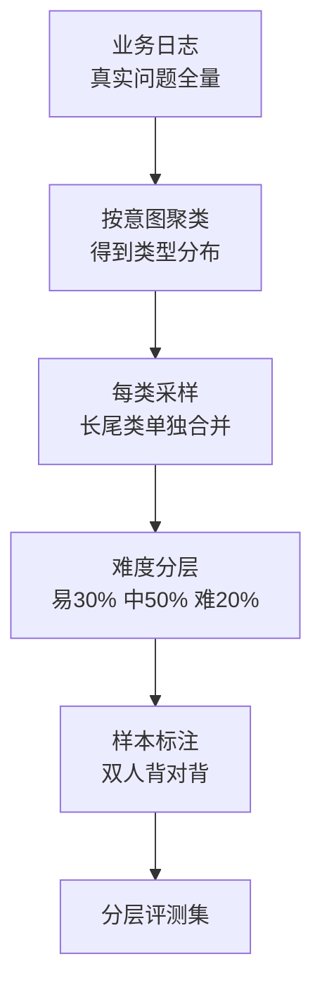
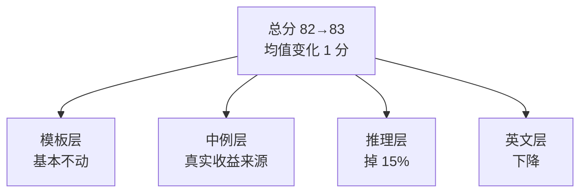

# 评测集的构建与维护：从场景采样到难度分层

## 要解决的问题

模型选型、量化（见 [[工程知识/AI 系统工程：从模型能力到生产能力/推理服务与平台/模型量化的精度经济学：位宽精度与显存的三角.md]]）、提示词迭代、Agent 配置——每个决策都要回答“这个改动让效果变好还是变差”。拍脑袋不行，单点试几个 case 也不行（方差淹没信号）。评测集要解决的问题是**把“效果好坏”变成可重复测量的工程对象**：场景覆盖、难度分层、防污染、防过拟合，让每次改动都有可比对的数字。这是 AI 系统的回归测试（传统软件的回归网思想，见 [[工程知识/缺陷分析：从个案到体系/复现与回归/从复现到回归——让证据走完一圈.md]]）在模型时代的形态。

## 机制

**场景采样：从业务出发而不是从模型出发**。评测集的第一原则是代表性：场景分布逼近真实负载。采样路径：业务日志聚类（真实问题的类型分布）→ 每类采样 → 样本标注（期望输出或评分标准）。反面模式：拿公开 benchmark（MMLU、HumanEval）当自家电评测——分布不匹配（学术题 ≠ 业务任务），过拟合公开榜（模型厂商已把榜单刷穿，见后文污染段）。采样路径的完整形态：



图回答的是样本从原始流量到可评测集合的加工路径：聚类保住类型分布，长尾单独合并防采样偏差变成盲区，标注一致率不达标先修标准。

**难度分层：均值淹没信号**。全库均分 82 → 83 看不出任何问题。分层维度：按任务难度（模板任务/知识任务/推理任务）、按长度（短/长上下文）、按语言（中/英）、按领域（通用/垂直）。改动的效果在分层的切片上显形：量化在推理层掉 15% 但模板层不动；提示词改动在中文层提升英文层下降。分层把均值的变化分解到可归因的维度：



图回答的是均值为什么淹没信号：一个 1 分的总分变化，分解到切片后四个层各自走完全不同的方向，决策要看的是切片而非总分。

**防污染：数据在模型训练截止线之前**。评测集若含模型训练数据（或近似变体），分数虚高（模型见过答案）。防御：时间戳过滤（样本创建时间 < 模型知识截止）、去重（与训练语料的 n-gram 重叠检测）、变体生成（同一知识点改写多问法）。污染检测的常用信号：模型对训练截止后事件的评测分数显著低于截止前（正常知识衰减 vs 污染虚高的分界）。

**防过拟合：评测集与开发集分离**。迭代提示词/配置时反复看同一评测集，等于在评测集上“训练”（隐式过拟合）。工程规程：开发集（调参用，可反复看）与评测集（只测不改，最终验收）物理分离；评测集定期轮换（问题变体）。这与机器学习的 train/dev/test 分离是同一原则，只是对象从参数变成提示词与配置。

## 背景与代价

思想背景：软件测试的测试金字塔与回归测试思想是直接源头（1970s 软件工程），LLM 时代的新变量是**模型输出是概率的**（同一输入多次运行结果不同，要统计显著性）与**“正确”是模糊的**（开放生成的质量无唯一标准答案，要 LLM 评审或人工）。HELM（2022，Stanford）确立多维评测框架，lm-evaluation-harness（EleutherAI）把公开 benchmark 的执行标准化。业务侧的评测集构建（从日志采样）是 2024 年后 Agent 应用潮的实践结晶。

最精巧的一笔是**难度分层把“均值信号”分成“归因切片”**。一个总分无法回答“改动好在哪、坏在哪”，分层切片让每个维度成为可独立观测的信号通道：量化决策看推理层（量化对推理伤害最大，见量化篇（上文链接）的验证段）、长上下文决策看长度层、多语言决策看语言层。评测集从“分数牌”变成“诊断面板”。代价要摆明：构建成本是持续的——场景分布漂移（业务变化，评测集半年就旧）、标注成本（期望输出的标注是人工或 LLM 辅助，LLM 标注的偏差要抽检）、维护负担（轮换与去污染不是一次性）。评测集的预算通常是系统总预算的 5-10%（Agent 系统更高），低于这个数，决策质量靠运气。

## 边界

- **公开 benchmark 只能横向筛，不能纵向决策**。选模型时用公开榜粗筛（前 10 名候选），最终选型要在自建评测集上定（分布匹配）。公开榜分数与业务分数的相关性弱（分布不匹配 + 榜单过拟合），相关性要定期实测。
- **LLM 评审的偏差要校准**。用强模型评弱模型是常见做法（GPT-4 评 7B），但 LLM 评审有系统性偏差：偏好长答案、偏好自己家族的风格、位置偏差（先出现的选项得到更高分）。校准：人工抽检（每类场景抽 5%，比照人工分与 LLM 分）、双评审（两个不同家族模型交叉）、位置随机化。无校准的 LLM 评审分数不可用于决策。
- **统计显著性不是可选项**。同一配置跑 3 次均分差 1 分，无法区分“真提升”与“采样方差”。显著性检验（bootstrap 或多次运行的置信区间）是分数比较的前提，报告要带区间不只带均值。
- **Agent 评测要覆盖轨迹不只是结果**（见 [[工程知识/AI 系统工程：从模型能力到生产能力/质量与运营/Agent评测必须覆盖轨迹而不只看最终答案.md]]）。结果对但轨迹错（绕路、侥幸成功）的 Agent 下次不保证对。轨迹评测的成本高（每步的观察与判断都要评），但漏掉的轨迹错误会在生产放大。

## 验证

- **分层信号实验**：同一评测集按难度/长度/语言切片，量化前后对比各层分数。预期：推理层下降显著、模板层不动——分层让均值 1 分的变化显形为切片 15 分的变化。分层诊断的直接证据。
- **污染检测实验**：模型对评测集中“训练截止前 vs 截止后”知识点的分数对比。预期：若截止前分数异常高（超过知识自然衰减解释），污染嫌疑；时间戳过滤后重测，分数下降即确认。污染的存在性验证。
- **LLM 评审校准实验**：每类场景抽 5% 样本人工打分，与 LLM 评审分对比。预期：一致率 80%+ 可用，低于则要修评审提示词或换评审模型。校准曲线是 LLM 评审可用性的门槛证据。

## 可运行示例与案例回流：评测集的账

```text
一个业务评测集的分层推演（通用形态）：

  场景采样：从真实流量抽样 2000 条 → 按意图聚类 → 取前 10 类各 150 条
    + 长尾类合并 500 条（采样偏差会直接变成评测盲区）
  难度分层：易（模板可答）30%、中（需推理）50%、难（易混淆/多跳）20%
    难例来源：线上badcase回流 + 边界样本人工构造
  标注质量：双人背对背标注，一致率 < 90% 说明标准没写清，先修标准再标
  维护节奏：每月回流线上新badcase 3-5%；每季度淘汰过时样本
    （模型升级后旧易例全对 → 区分度归零，评测集也要跟着换血）
  防泄漏：评测集绝不进训练数据；LLM 生成样本要查重去污染
```

案例回流：采样偏差的实录——评测集全从中高活跃用户抽样，上线后低活跃用户场景失败率是评测场景的四到五倍（行为分布不同，模型在长尾表达上没见过）；改全量分层抽样后评测与线上的差距收敛到一点二倍上下。区分度衰退的实录——模型季度升级后评测分数从 78 涨到 96，团队以为逼近上限，按难度分层一看：易例全对、难例原封不动（总分掩盖了结构）；改按层报告后，升级只在中例有真实收益。badcase 回流的实录——线上投诉只修个案不回流，同类问题每季度重复出现；建立"每个确认 badcase 进评测集再修"的规则后，同类回归被评测挡住。评测地基的分层设计见 [[工程知识/AI 系统工程：从模型能力到生产能力/质量与运营/评测集的构建与维护决定所有评测的地基.md]]、轨迹层评测见 [[工程知识/AI 系统工程：从模型能力到生产能力/质量与运营/Agent评测必须覆盖轨迹而不只看最终答案.md]]。

## 相关

- [[工程知识/AI 系统工程：从模型能力到生产能力/质量与运营/Agent评测必须覆盖轨迹而不只看最终答案.md]] —— 轨迹评测的专项展开
- [[工程知识/缺陷分析：从个案到体系/复现与回归/从复现到回归——让证据走完一圈.md]] —— 复现证据回归到评测的循环思想
- [[工程知识/AI 系统工程：从模型能力到生产能力/质量与运营/成本控制要从上下文和重试两头下手.md]] —— 评测与成本的预算平衡
- [[工程知识/AI 系统工程：从模型能力到生产能力/Agent与工作流/结构化输出的约束解码：让模型输出可解析.md]] —— 语义层校验的评测依据
- [[工程知识/AI 系统工程：从模型能力到生产能力/数据与MLOps/数据飞轮的工程闭环：日志回流清洗与标注.md]] —— 飞轮效果验收的评测基础
- [[工程知识/AI 系统工程：从模型能力到生产能力/安全与治理/红队测试与越狱防御：提示注入的攻防工程.md]] —— 安全评测集的构建同源
