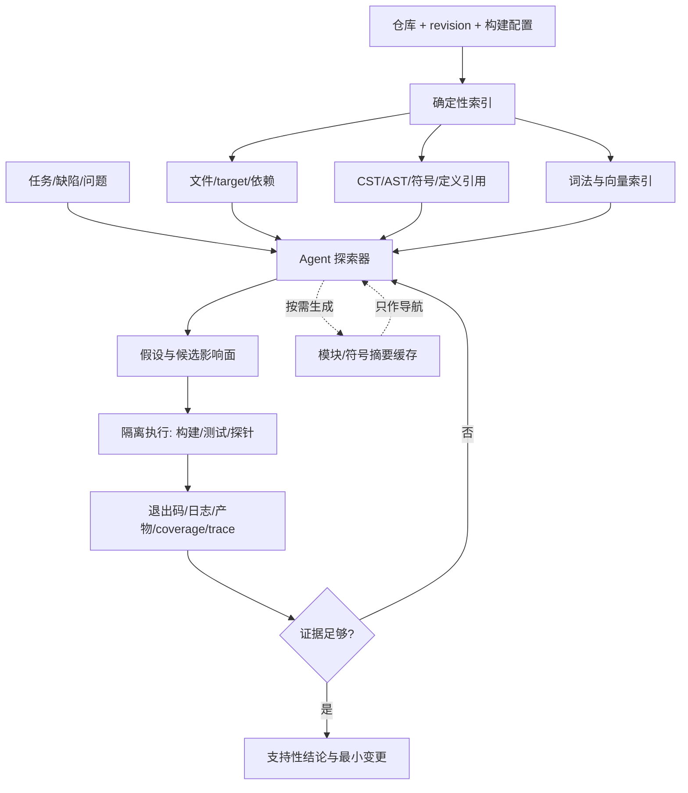

# 代码智能体需要结构索引、任务探索与运行证据

代码 Agent 要解决的不是“让模型读更多源码”，而是让它在正确的仓库版本里找到相关结构、形成可证伪假设并证明改动真的经过构建和测试。最小例子是一个跨模块缺陷：文本搜索找到报错字符串，符号索引找到调用链，运行 trace 才能证明目标分支实际被触发。
代码知识库不是“把仓库切块后做向量检索”，也不是提前让 LLM 给所有函数写摘要。可靠方案需要同时具备三条链路：

1. **自下而上的确定性索引**：从仓库、构建、语法和符号事实建立可定位的代码地图；
2. **自上而下的 Agent 探索**：从当前任务出发，按证据逐步缩小需要阅读和执行的范围；
3. **事实门禁**：用 revision、真实命令、测试、coverage/trace 和产物验证模型结论。

其中，AI 负责理解需求、形成假设、选择搜索和验证路径；框架负责索引版本、执行隔离、事实采集和一致性。LLM 摘要可以帮助导航，但不能成为“这个符号存在”“调用一定发生”或“测试已覆盖目标代码”的唯一证据。

## 为什么普通 RAG 不够

自然语言文档主要是段落之间的语义关系；代码还包含编译单元、作用域、类型、定义/引用、依赖方向、生成条件和运行时派发。仅按固定 token 切块会丢失这些边界：

- 同名函数可能属于不同包、类型、重载或构建 target；
- 调用点与定义可能跨文件、跨仓库或由生成代码产生；
- 配置、宏、反射、依赖注入和动态派发会改变实际路径；
- “静态可达”不等于“这次运行真的执行”；
- 仓库持续变化，旧 revision 的正确摘要可能成为新 revision 的错误上下文。

所以代码 RAG 的检索单元应优先是**文件、符号、定义、引用、构建 target、测试和变更集**，自然语言 chunk 只是补充。

## 能力如何演进

| 阶段 | 解决的问题 | 仍然缺少什么 | 现在的正确位置 |
| --- | --- | --- | --- |
| 文本搜索/正则 | 快速找到字符串、错误码、配置和精确标识符 | 不理解作用域、类型和同名符号 | 永远保留的低成本第一跳 |
| CST/AST 解析 | 识别函数、类、调用、导入和语法结构 | 单靠语法树无法完成跨文件类型解析 | 结构查询、切分、重写和局部依赖 |
| LSP/语义索引 | 定义、引用、实现、类型和诊断 | 依赖构建环境与语言支持；动态行为仍不确定 | 精确代码导航和符号级上下文 |
| 依赖图/调用图 | 展开影响面与候选调用路径 | 静态边通常包含误报，也可能漏掉反射/动态派发 | 规划探索顺序，不直接证明运行行为 |
| Embedding/代码 RAG | 找到语义相近的实现、测试和文档 | 数字、否定、罕见符号和版本边界不稳定 | 与词法、结构和符号检索混合召回 |
| LLM 摘要/Wiki | 压缩模块意图、协议和复杂函数 | 摘要会过期、遗漏条件或产生幻觉 | 按需生成的导航层，不是事实层 |
| Agent 探索 | 围绕任务多轮检索、读码、实验和修正 | 路径非确定、成本和错误会累积 | 由预算、停止条件和证据门禁约束 |
| 运行证据 | 证明真实进程、分支、测试和产物 | 单次运行只覆盖特定输入和环境 | 最终结论与回归验证的事实底座 |

演进的本质不是用后一层替换前一层，而是从“找文本”逐步增加结构、语义、任务规划和运行证明。越靠后越贴近问题语义，也越需要前面的确定性事实约束。

## 一套完整架构



### 仓库与构建画像

先固定 `repository + commit/revision + submodule + build configuration`。识别 workspace、包管理器、模块、生成代码、条件编译、测试 target 和依赖锁文件。没有构建画像，符号索引可能只覆盖默认模块，所谓“全仓调用链”会从一开始就不完整。

输出至少包括：

```yaml
repository: example/service
revision: <commit-sha>
languages: [java, kotlin]
build_systems: [gradle]
targets: [service, integration-tests]
generated_sources: [build/generated]
index_status:
  syntax: complete
  semantic: partial
  reason: "integration-tests 缺少私有依赖"
```

`partial` 是合法事实；不能因为一部分索引成功就投影成全仓完备。

### 确定性结构索引

索引按成本从低到高分层：

- 文件树、语言、大小、hash、owner 和最近变更；
- manifest、lockfile、workspace、build target 和模块依赖；
- Tree-sitter 等解析器生成的 CST、节点范围和结构查询；
- 编译器或语言服务器产生的 symbol、definition、reference、implementation、type 和 diagnostic；
- 可静态推导的 import、继承、调用和测试归属关系；
- README、ADR、API schema、配置、迁移和测试夹具。

[Tree-sitter](https://tree-sitter.github.io/tree-sitter/) 的准确定位是增量解析器和 CST 生成工具：它能在编辑和部分语法错误下持续提供结构，但不会自动提供完整类型系统或跨文件语义。[LSP](https://microsoft.github.io/language-server-protocol/) 标准化编辑器与语言服务器之间的定义、引用、补全等交互；离线/远程导航可以使用语义索引格式。当前代码导航生态中常见的是 [SCIP 索引](https://sourcegraph.com/docs/code-navigation/writing-an-indexer)，历史资料里的 LSIF 不应被当成唯一或固定实现。

### 混合检索，而非单路向量召回

| 查询意图 | 首选通道 | 补充通道 |
| --- | --- | --- |
| 错误码、配置键、SQL、API 名 | 精确/正则/BM25 | 符号和邻近调用点 |
| 某符号的定义、引用、实现 | LSP/SCIP/编译器索引 | 文本回退和构建 target |
| “谁会影响这个接口” | 反向引用、依赖图、变更图 | 测试映射和代码所有者 |
| “仓库里是否有相似重试逻辑” | 词法 + embedding | AST pattern 和符号过滤 |
| 某次请求实际走了哪里 | trace/coverage/profile | 静态调用图用于解释遗漏 |
| 模块为什么这样设计 | ADR、README、历史 diff、摘要 | 关键符号和契约测试 |

检索结果必须携带稳定定位：仓库、revision、文件、range、symbol ID、构建 target 和索引版本。没有版本绑定的代码引用，只能视为提示，不能用于自动修改。

### 自上而下的 Agent 探索

Agent 不需要一次读完整仓库，而应围绕问题建立逐层扩展的证据包：

```text
任务契约
  -> 精确词/符号入口
  -> 定义、引用、调用者、被调用者
  -> 构建与测试边界
  -> 形成少量可证伪假设
  -> 运行最小实验
  -> 根据新证据扩展或停止
```

每一步记录 `query -> candidates -> selection_reason -> evidence -> next_question`。AI 可以决定下一步查什么，但框架要验证它读取的是哪个 revision、执行了什么，以及结果是否真实存在。

停止条件不应写成“Agent 觉得已经理解”。至少满足：

- 所有关键声明都有文件/符号或运行事实定位；
- 候选根因存在能区分彼此的实验；
- 目标变更有编译、测试和原始问题复现；
- 未覆盖范围、索引缺口和环境阻断被显式列出；
- 达到 token、工具调用、时间或费用预算时返回部分结论而非伪装完成。

### LLM 摘要是可失效的派生数据

目录、模块、类型和复杂函数摘要可以明显降低阅读成本，但应按需、分层生成，而不是无条件重写整仓 Wiki：

```text
仓库摘要
  -> 模块摘要
     -> 包/目录摘要
        -> 类型/符号摘要
           -> 原始代码与定义引用
```

缓存键至少包含：

```text
repository + revision/content_hash + symbol_id
+ parser/indexer_version + model + prompt_version
```

依赖符号改变时，直接摘要失效；上层摘要按依赖方向重新聚合。摘要应保存来源 ranges 和生成元数据，并允许从当前源码重建。若摘要与源码或符号索引冲突，以绑定当前 revision 的确定性事实为准。

## 增量更新：可扩展性的核心

全仓重新解析、重新 embedding、重新生成摘要既昂贵又容易把版本混在一起。推荐的更新链是：

```text
Git diff/文件事件
  -> 内容 hash 去重
  -> 增量 parse
  -> 更新符号与定义引用
  -> 找到受影响的反向依赖
  -> 失效相关 embedding/摘要/测试映射
  -> 生成新索引快照
  -> 原子切换当前 revision
```

关键约束：

- 更新通过新 snapshot 构建，不能在查询中的旧 snapshot 上原地混写；
- 删除要传播 tombstone，防止被删除的符号继续召回；
- 语义索引失败时保留上个成功快照，但必须标注它属于旧 revision；
- 同一查询只读取一个一致的索引代际，不能拼接新源码与旧摘要；
- 大仓库按模块、语言和变更影响面并行，失败分区可重试但不可冒充成功。

## AI 与框架的职责边界

| AI 负责的语义决策 | 框架负责的事实约束 |
| --- | --- |
| 判断任务意图、相关模块和可能根因 | 固定仓库、revision、worktree 和索引代际 |
| 选择文本、AST、符号、向量或历史检索 | 返回真实候选、定位和索引完备度 |
| 判断应读哪些文件、展开哪条调用链 | 限制权限、上下文、步数、时间和费用 |
| 选择构建系统、测试入口、探针和回退 | 隔离执行并保存 argv、cwd、退出码和产物 |
| 解释编译、网络、权限或产品逻辑失败 | 区分未执行、执行失败、超时、环境阻断和无证据 |
| 判断补丁是否符合需求并决定下一步 | 验证 patch、compile/test、coverage/trace 与 revision 绑定 |

语义索引、测试和运行证据都可能不完整，因此系统还需要表达 `known / partial / stale / unavailable`，而不是把“不知道”压成 `false`。完整事件和投影模型见 [[工程知识/AI系统/安全与治理/执行证据必须独立于AI结论]]。

## 如何证明测试真的经过目标代码

以下证据强度递增，但每一种都有适用边界：

1. 测试文件引用目标符号：只能说明静态相关；
2. 静态调用图能到达目标：只能说明候选路径；
3. coverage 命中目标行/分支：说明该次运行经过相应位置；
4. trace 或定向探针记录目标函数及关键参数：能证明一次具体路径；
5. 删除/反转修复后测试失败，再恢复修复后通过：增强测试与行为之间的因果证据。

这些证据都要绑定相同 commit、构建产物、测试命令和环境。不能用 Maven `validate` 成功、测试进程启动或模型声称“已覆盖”替代目标行为验证。

## 评测体系

不要只评“答案看起来是否合理”，而要分层测量：

| 层 | 指标/样本 | 主要回答 |
| --- | --- | --- |
| 索引完整性 | 文件/target 覆盖、解析失败率、符号解析率、索引新鲜度 | 数据是否真的进入系统 |
| 检索 | Recall@K、MRR、定义/引用命中、正确 revision 比例 | 所需证据能否被找到 |
| 探索 | 首个有效证据步数、无效展开率、重复读取率、停止正确率 | Agent 是否高效缩小范围 |
| 理解 | 幻觉符号率、调用关系准确率、未证实声明率 | 结论是否忠于代码事实 |
| 修改 | patch apply、编译、目标测试、回归测试、影响面遗漏 | 变更是否正确且最小 |
| 运行证明 | 目标 branch/函数 coverage、trace、原始缺陷复现 | 测试是否真的验证目标行为 |
| 工程 | p50/p95、token、索引时间、缓存命中、每成功任务成本 | 系统能否持续运营 |

评测集应包含：同名符号、多模块、生成代码、动态派发、依赖缺失、旧索引、重命名、删除传播、网络失败和“没有足够证据”的样本。每次 parser、indexer、embedding、模型、Prompt 或工具协议升级都重跑对应层级，而不是只看一个总分。

## 常见失败模式

- **把 CST 当完整语义图**：语法结构存在，不代表类型、重载和跨文件绑定已解析。
- **把静态调用图当运行事实**：动态语言、反射、接口派发和配置会改变真实路径。
- **全仓预生成摘要**：成本高、更新慢，且摘要会在代码变化后悄悄失真。
- **只做向量检索**：精确符号、版本号、错误码和否定条件容易丢失。
- **把更多上下文当更好**：无关文件会稀释关键约束；应按任务逐层展开。
- **索引与代码跨 revision**：看到了正确的旧代码，却对当前分支生成错误补丁。
- **Agent 自证成功**：模型输出、命令文本或测试名称都不能替代真实执行与覆盖证据。
- **用图数据库解决一切**：图存储只是表示和查询手段；边的来源、完备度和更新一致性才决定价值。

## 最小落地顺序

1. 先提供 `rg/全文搜索 + 文件读取 + Git diff + 构建/测试`，建立真实执行和 revision 门禁；
2. 增加 Tree-sitter 结构切分和查询，改善跨语言实体定位；
3. 对核心语言接入 LSP/SCIP 或编译器索引，获得精确定义/引用；
4. 用 embedding 补充“概念相似”查询，并与词法和符号结果融合；
5. 只为高频模块按需生成带引用的分层摘要；
6. 用失败样本决定是否增加调用图、历史变更图或更复杂的 Agent 规划；
7. 最后才考虑自动发布全仓 Wiki 或可视化图谱。

系统是否成熟，不取决于图有多漂亮，而取决于它能否回答：**当前结论来自哪个 revision、哪条结构/语义事实、哪次真实执行，以及还有什么无法证明。**

## 与其他主题的关系

- 通用检索、hybrid、rerank、freshness 和评测：[[工程知识/AI系统/知识与检索/RAG的核心是选择可引用证据]]。
- AST/CST、代码改写与结构边界：[[工程知识/软件构建与质量/架构与代码/AST提供语法结构，语义仍需符号与运行证据]]。
- AI 修改、复现和测试闭环：[[工程知识/AI系统/Agent与工作流/AI辅助研发必须形成证据闭环]]。
- 命令、产物、任务代际和证据投影：[[工程知识/AI系统/安全与治理/执行证据必须独立于AI结论]]。
- 模型、应用框架和编排运行时分层：[[工程知识/AI系统/生态与选型/模型、框架、运行时与协议解决不同问题]]。
- 测试分层与回归资产：[[工程知识/软件构建与质量/测试与交付/测试策略从风险选择证据]]。

## 来源说明

本页从旧直播记录 [[知识库管理/来源/实践证据/代码知识库/技术直播原始记录]] 提炼“自下而上索引 + 自上而下探索 + 增量更新”，并用当前官方资料纠正术语和事实边界。Tree-sitter 官方将自身定义为增量解析库和 CST 生成工具；Microsoft 的 LSP 页面说明 LSP、LSIF 的原始职责；SCIP 的结构和测试方式以 Sourcegraph 当前索引文档为准。直播中的产品效果、规模和成本数字缺少可复现实验，因此没有升级为本页结论。
