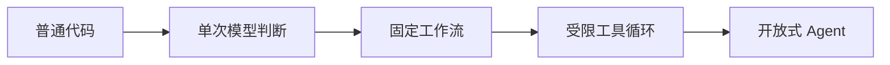

# 先用工作流，只有路径无法预先枚举时才使用 Agent

这条选择规则解决的是把固定流程无谓地交给模型，导致成本、不可预测性和审计难度上升。先判断路径是否能在设计时枚举、错误动作是否可逆、是否有外部验证；只有中间发现会改变下一步且无法经济枚举时，自治循环才可能产生净收益。
“使用大模型”和“构建 Agent”是两个决定。一次结构化抽取、固定步骤的文档处理和带模型节点的审批流都可以使用大模型，但不需要让模型决定下一步。只有当任务路径取决于中间发现，且无法经济地预先枚举时，自治循环才产生净价值。

## 区别不在调用次数，而在谁控制路径

```text
单次调用：程序决定输入和后续动作，模型返回一个结果
工作流：程序预先定义节点与边，模型在指定节点完成判断
Agent：模型根据当前状态选择下一步、工具或停止
```

多次调用不自动构成 Agent。一个十步固定流程仍然是工作流；一个模型根据搜索结果决定继续搜索、改写问题还是结束，即使只有两个工具，也已经具有 Agent 性。

| 维度 | 确定性工作流 | Agent 循环 |
| --- | --- | --- |
| 路径 | 设计时确定 | 运行时由模型选择 |
| 可预测性 | 高 | 依赖模型与上下文 |
| 测试方式 | 分支和状态转移覆盖 | 轨迹分布、停止条件和任务结果 |
| 成本上界 | 容易估计 | 必须用步数、时间和费用预算限制 |
| 恢复难度 | 已知节点恢复 | 还要恢复模型决策上下文和工具观察 |
| 适用任务 | 规则明确、风险高、流程稳定 | 开放环境、多步探索、路径依赖发现 |

## 选择自治程度，而不是选择一个标签

可以把系统按控制权逐级升级：



每升一级，都必须证明前一级无法以更低风险完成任务。

- **普通代码**：精确规则、数据库查询、权限判断、金额计算和状态迁移。
- **单次模型判断**：分类、抽取、改写、候选生成；输出经过 schema 和业务校验。
- **固定工作流**：步骤已知，但某些节点需要语义判断；例如检索、生成、证据校验、人工审批。
- **受限工具循环**：模型可在一个白名单内选择工具和顺序，有明确最大步数与停止条件。
- **开放式 Agent**：环境和路径高度不确定，例如调查陌生代码库；必须运行在隔离环境并保留完整轨迹。

## 五个判断问题

### 中间结果是否会改变下一步？

如果下一步始终相同，使用工作流。只有“观察结果决定新的动作”时，模型控制循环才有意义。

### 正确路径能否枚举？

客服路由、表单审核、文档流水线通常可以枚举。代码修复、开放式研究和复杂故障调查往往不能，因为行动空间由目标仓库、依赖和运行结果动态产生。

### 错误动作是否可逆？

读取文档和生成草稿容易回滚；付款、删库、发布和外部消息不可轻易回滚。风险越高，越应把模型限制在提出候选，由确定性流程审批和执行。

### 是否存在可验证反馈？

代码可编译、测试可运行、查询可核对，这类环境能给 Agent 外部反馈。缺乏验证器的开放任务容易形成“模型觉得已经完成”的假成功。

### 自治是否真的降低总成本？

要计算模型调用、工具调用、失败重试、人工复核和事故成本。减少人工点击但增加大量不可解释失败，不是自动化收益。

## 常用控制模式

| 模式 | 何时使用 | 完成条件 |
| --- | --- | --- |
| 路由 | 输入属于少量已知类型 | 路由置信度或保底分类成立 |
| 并行分析 | 子问题相互独立 | 所需分支已完成并通过聚合规则 |
| 编排者—执行者 | 子任务数量由输入决定 | 子任务覆盖目标，聚合结果通过检查 |
| 评审—改进 | 存在明确评价标准 | 达到阈值、无新增改进或预算耗尽 |
| 工具循环 | 下一步取决于工具观察 | 目标验证通过、明确阻断或预算耗尽 |
| 人工接管 | 风险、歧义或权限超出自动边界 | 人工批准、修改或终止 |

不要把“多 Agent”当作一种默认模式。拆成多个 Agent 只有在上下文隔离、权限隔离、并行执行或独立评价确实有价值时才合理；否则它只是增加通信损失、状态同步和评测难度。

## 失败模式

- **过早规划**：还没有观察环境就生成长计划，后续步骤建立在错误假设上。
- **无界循环**：没有最大步数、无新信息判定和墙钟预算，反复搜索或自我反思。
- **伪评审**：同一个模型在没有外部标准时评价自己的输出，只产生更自信的文本。
- **路径漂移**：工具结果带来新线索，模型逐渐偏离原始目标和验收标准。
- **多 Agent 剧场**：角色名很多，但共享同一上下文、同一模型和同一评价标准，没有真正的独立性。

## 验证设计

评测时至少保存：选择了哪条路径、每步为什么发生、工具是否必要、是否错过停止、失败后是否能恢复。把同一任务分别用固定工作流和 Agent 实现，比较任务成功率、P95 延迟、费用、人工介入和不可恢复错误；只有 Agent 在真实任务分布上提供稳定净收益，才提高自治程度。

相关：[[工程知识/AI系统/Agent与工作流/模型负责判断，运行时负责执行语义]] · [[工程知识/AI系统/质量与运营/Agent评测必须覆盖轨迹而不只看最终答案]]
