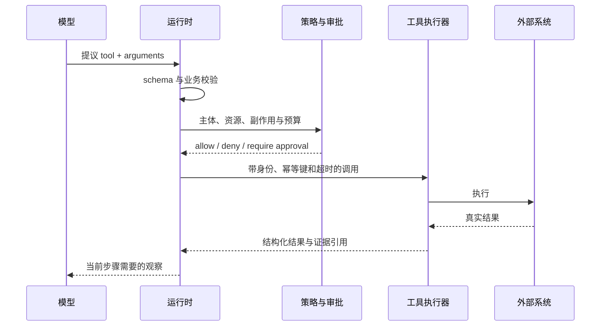

# 工具是受约束的能力，不是提示词里的函数名

工具调用解决的是模型无法直接访问外部状态或执行副作用的问题，但工具描述不是权限系统。一个退款工具的参数即使符合 JSON schema，也必须由运行时验证主体、订单、金额、幂等键和审批状态，再记录真实结果。
模型调用工具时只是在提出一个动作请求。真正的工具系统必须定义能力、身份、资源、参数、副作用和证据。工具描述写得再清楚，也不能替代执行端鉴权；模型参数再符合 schema，也不能证明业务允许执行。

## 一次工具调用的完整路径



任何一步缺失，都会把自然语言意图错误地升级为真实权限。

## 好工具减少模型需要猜测的空间

一个工具应围绕用户意图设计，而不是机械暴露底层 API。`update_customer_address(customer_id, address)` 比 `patch(path, json)` 更容易授权、验证和评测。输入字段应避免重叠语义，错误返回应告诉模型错误类型和可恢复方式，而不是一段堆栈或模糊的 `failed`。

工具契约至少包含：

```yaml
name: create_refund
version: 3
subject: delegated_user
input_schema: RefundRequest
resource_scope: order:{order_id}
side_effect: financial
approval: required_above_threshold
idempotency_key: required
timeout_ms: 5000
retry: query_before_retry
result_schema: RefundResult
audit: [actor, policy, arguments_hash, result_ref, timestamps]
```

`description` 只帮助模型选择；其余字段决定系统能否安全执行。

## 读、写和不可逆动作采用不同策略

| 等级 | 例子 | 默认策略 |
| --- | --- | --- |
| 只读、低敏感 | 查公开文档、读允许范围内的状态 | 自动执行，仍记录来源和时间 |
| 可逆写入 | 创建草稿、开临时分支 | 受限执行，提供撤销和过期清理 |
| 高影响写入 | 修改生产配置、发送外部消息 | 参数预览、明确确认、审计与幂等 |
| 不可逆或高损失 | 删除数据、付款、发布安全策略 | 确定性审批，通常不允许模型直接触发 |

审批不能只显示“Agent 想调用工具”。用户或审批系统必须看到目标资源、关键参数、预期影响和有效期；批准内容要绑定参数摘要，参数变化后重新批准。

## 工具结果也是不可信输入

网页、工单、代码注释和第三方 MCP server 可能返回诱导模型执行其他动作的文本。运行时应把工具结果标记为数据，限制结果大小和类型，过滤密钥与敏感字段，并在传回模型前保留来源边界。工具 A 的输出不能自动授予调用工具 B 的权限。

## MCP 解决互操作，不解决业务信任

MCP 规范化 Host、Client、Server 之间的能力发现和调用，使工具、资源与提示可跨应用复用。它不决定某个用户能否读取某条记录，也不证明 server 的工具描述可信。接入 MCP 仍需：

- 固定或审核 server 身份与版本；
- 按用户与租户过滤可见工具；
- 对远程 HTTP 认证验证 token audience，禁止 token passthrough；
- 对本地 stdio 限制工作目录、环境变量、文件和网络；
- 记录协议版本、工具 schema 哈希和实际执行证据；
- 对工具列表变化、同名替换和权限扩大做重新审批。

跨部署 Agent 的任务委托才考虑 A2A；同一进程内的函数调用无需为“看起来 Agent 化”而套协议。协议选择见 [[工程知识/AI系统/生态与选型/MCP连接能力，A2A委托任务]]。

## 评测工具设计

为每个工具建立 contract test 和策略测试：合法输入、缺失字段、越权主体、错误租户、重复幂等键、超时、部分成功、响应丢失、schema 版本变化和恶意结果。Agent 评测还要测工具选择是否必要、参数是否来自证据、失败后是否采取正确恢复动作。

相关：[[工程知识/AI系统/Agent与工作流/模型负责判断，运行时负责执行语义]] · [[工程知识/AI系统/安全与治理/沙箱限制能力，策略限制行为]]
