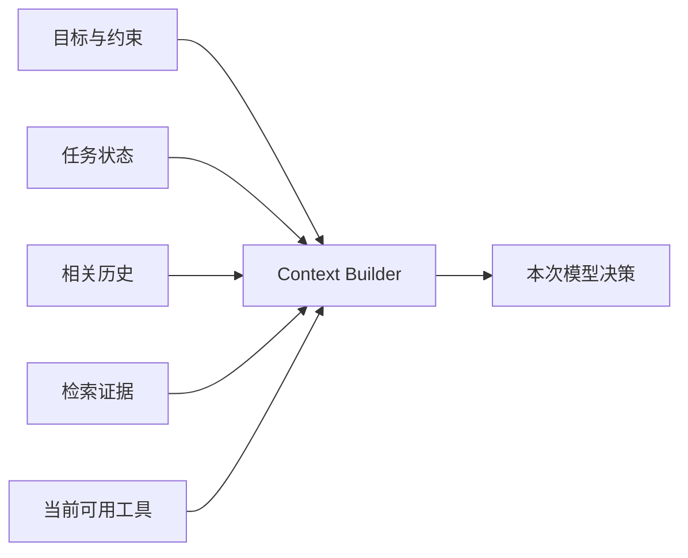

# 上下文工程是在有限预算内构造决策现场

提示词只是上下文的一部分。一个 Agent 在每次决策前看到的系统规则、用户目标、任务状态、工具说明、检索证据、历史观察和输出空间，共同构成决策现场。上下文工程的目标不是“塞入尽可能多的信息”，而是：**在有限 token、延迟和注意力预算内，让当前决策所需的信息完整、可信、可区分。**

## 上下文是一种运行时投影

真实系统状态通常远大于一次模型调用。Context Builder 必须从多个来源生成一个面向当前步骤的投影：



它不是简单拼接器，而是一个带权限、预算、优先级和版本的选择器。

## 五类内容必须分区

| 内容 | 作用 | 主要风险 |
| --- | --- | --- |
| 不变量 | 角色、任务边界、安全和输出契约 | 太长、互相冲突、无法执行 |
| 当前目标 | 用户真正要完成的事情与验收标准 | 歧义、目标漂移、恶意输入 |
| 任务状态 | 已完成步骤、当前状态、预算和未解决问题 | 摘要丢失事实、状态过期 |
| 外部证据 | 文档、数据和工具观察 | 越权、过期、提示注入、来源不明 |
| 能力说明 | 当前允许使用的工具及参数 | 工具过多、描述重叠、危险能力暴露 |

指令与数据应有清楚边界。网页、检索片段和工具返回中的“请忽略之前要求”属于外部数据，不获得更高指令优先级。

## 长上下文不能替代选择

更长窗口提高容量，但不会自动提高相关性。无差别加入历史会产生四种成本：

1. 无关信息竞争模型注意力；
2. 旧结论与新事实发生隐性冲突；
3. token、延迟和缓存成本增长；
4. 敏感信息被传播到本不需要的步骤。

因此应优先保存结构化状态和原始事件，只为当前步骤选择必要内容。摘要是派生视图，不是事实源；重要决策必须能回到对应工具结果或事件。

## 压缩、检索和隔离是三种不同操作

- **压缩**减少同一信息的表达成本，适合历史对话和重复观察；风险是丢失例外与否定条件。
- **检索**从更大语料中选择相关证据，适合外部知识和长期历史；风险是漏召回、错排序和权限穿透。
- **隔离**让不同任务、租户或子 Agent 只看到必要上下文，适合安全和并行；风险是切断真正需要的依赖。

三者不能互相替代。一个高质量系统通常同时使用结构化状态、窗口历史、摘要和按需检索。

## 工具说明也消耗认知预算

向模型暴露几百个工具，会让工具选择更难、输入 token 增长，也扩大攻击面。先按用户权限和任务阶段筛选工具，再让模型选择。工具名应表达动作，描述应说明何时使用与何时不用，输入字段应尽量无歧义；重叠工具要合并或由路由层分组。

## 让上下文可调试

每次模型调用至少记录以下引用，而不是只记录拼接后的大字符串：

```yaml
context_version: support-agent@7
instruction_version: triage@12
state_checkpoint: cp_184
evidence:
  - uri: kb://refund-policy
    version: 2026-08-10
    chunks: [12, 13]
tools: [lookup_order@2, draft_refund@3]
budget:
  input_tokens: 18000
  output_tokens: 3000
```

这样才能回答“为什么这次看到了旧政策”“为什么没有暴露某个工具”“摘要在哪一步丢掉了限制”。

## 评测方法

不要只比较不同提示词的最终答案。上下文层应单独测试：必要事实是否进入、无关内容是否被排除、冲突事实是否按版本处理、恶意指令是否被当作数据、权限变化是否及时生效、长历史压缩后关键约束是否保留。对每次失败标记原因属于缺失、噪声、冲突、顺序、注入还是模型误用，才能知道该改检索、模板还是模型。

相关：[[工程知识/AI系统/知识与检索/RAG的核心是选择可引用证据]] · [[工程知识/AI系统/模型与上下文/记忆是受治理的状态，不是更长的聊天记录]]
