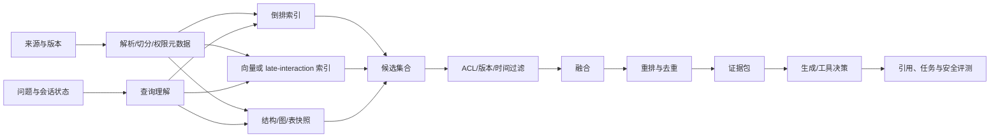

# RAG 前沿：重排、自动优化与开放索引

RAG 的基础流程“切块、向量化、召回、拼上下文、生成”仍然有用，但它只是一个最低可运行基线。现在真正需要掌握的是：如何在不同问题上选择证据、如何把候选排序成模型真正会使用的上下文、如何让索引跟随权限和版本变化，以及如何用可复现的评测自动寻找更好的管线。

一个合格的 RAG 系统不是“用了哪个框架”，而是能回答四个问题：

1. **目标证据在哪里？** 倒排、向量、结构和图索引是否能召回它？
2. **为什么把这些证据放到前面？** 融合、重排和上下文构造是否有可解释的依据？
3. **证据不够时怎么办？** 系统会改写、补查、拒答，还是让模型凭记忆补全？
4. **这次改动真的更好吗？** 是否在固定问题集、权限、版本和成本约束下超过基线？

## 先建立正确的分层



| 层 | 主要职责 | 典型方法 | 不能替代的部分 |
| --- | --- | --- | --- |
| 数据与元数据 | 把来源变成可追溯知识单元 | 结构解析、层级切分、版本、ACL、hash | 不能由 embedding 修复丢失的表格或权限 |
| 候选召回 | 在大库中尽量不漏掉目标 | BM25/倒排、向量 ANN、SQL、图遍历 | 不能保证前几名就是最适合回答的证据 |
| 融合 | 合并不同召回器的信号 | RRF、加权分数、学习排序 | 不能弥补所有召回器都没有目标的情况 |
| 精排 | 在小候选集中比较 query 与文档的关系 | Cross-Encoder、late interaction、学习排序 | 不适合全库逐篇运行，也不负责 ACL |
| 证据构造 | 控制模型真正看到什么 | 去重、父子扩展、压缩、引用定位 | 长上下文不等于证据充分 |
| 生成与行动 | 根据证据回答或调用工具 | 引用约束、结构化输出、工具校验 | 不能把没有证据的断言变成事实 |
| 评测与优化 | 判断改动是否有真实收益 | 标注集、回归、搜索实验、自动优化 | 单一 LLM judge 或 benchmark 不能代表线上质量 |

## 倒排索引为什么一直重要

倒排索引把“词项 → 出现它的文档列表”组织起来，BM25 等词法模型再用词频、逆文档频率和字段长度计算相关性。它看起来比向量检索传统，却仍然是工程 RAG 的基础设施：

- 订单号、错误码、函数名、版本号、配置键和法律条款通常需要精确匹配；
- 否定词、数字范围、大小写、拼写和稀有 token 不能放心交给语义相似度；
- 命中片段可以保留原始 token，便于解释、过滤和回指来源；
- 倒排结果通常便宜、稳定，适合先做高召回候选或作为向量召回的兜底。

倒排索引不是“只做老式搜索”。可以把字段权重、同义词、短语、过滤和时间衰减组合起来，也可以与向量召回并行执行。OpenSearch 的 RRF 实现明确按各结果列表的**排名**融合，不要求 BM25 分数和向量相似度处于同一量纲；`rank_constant` 和候选列表仍需用本地判断集调参。[OpenSearch RRF](https://docs.opensearch.org/latest/vector-search/ai-search/hybrid-search/rrf/)

## 混合检索解决“不同证据线索”

向量召回适合语义近似，倒排召回适合精确线索。混合检索的关键不是把两个分数随便相加，而是明确：

1. 两个召回器各自产生带来源和版本的候选；
2. 在过滤越权、删除和失效版本后再融合；
3. 去除同一知识单元的重复表示，并保留每个召回器的排名；
4. 通过 RRF、归一化加权或学习排序合并；
5. 用分桶评测比较词法命中、语义改写、数字/代码和多语言问题。

如果目标文档不在任何候选集合中，先修解析、切分、embedding、字段映射或过滤；不要直接增加重排模型。融合只能重排已经找到的候选。

## Cross-Encoder 重排解决“候选里谁最相关”

双编码器（bi-encoder）分别编码 query 和文档，可以预先建立文档向量并快速做 ANN；Cross-Encoder 把 query 与候选文档一起输入模型，直接学习二者的交互，通常有更强的细粒度相关性判断，但无法为全库每篇文档实时计算。因此它应放在**候选召回之后、上下文构造之前**：

```text
全库 -> BM25/向量/混合召回 top-50~500
     -> ACL、版本、时间过滤
     -> Cross-Encoder 或 late-interaction 重排 top-N
     -> 去重、父文档扩展、证据打包 top-K
```

Cross-Encoder 适合区分“提到了同一个词但没有回答问题”的候选，也能利用 query 与段落之间的否定、条件和局部关系。代价是每个 query-doc 对都要做一次联合推理，候选越多，延迟和显存越高；在多租户系统中还要考虑模型冷启动、批处理和语言/领域迁移。Hugging Face 的 reranker 指南将这类模型定义为对文本对输出相关性分数的 Cross-Encoder，并把训练数据、负例和评测作为独立工程问题。[Training rerankers](https://huggingface.co/blog/train-reranker)

重排上线至少要记录：召回 top-K、重排 top-K、每个阶段的分数和模型版本、p50/p95 延迟、缓存命中、最终引用覆盖率。不要把 Cross-Encoder 的分数当成跨模型的概率，也不要用它越过权限过滤。

### Cross-Encoder 与 late interaction 的边界

ColBERT 一类 late-interaction 方法为 query 和文档保留多个 token 表示，再用 MaxSim 等交互进行检索；它位于“独立向量”和“完整 Cross-Encoder”之间，试图在质量与可扩展性之间取平衡。[ColBERT](https://arxiv.org/abs/2004.12832)

选型应由候选规模、语言、硬件、延迟目标和标注数据决定，而不是把“Cross-Encoder”当成先进 RAG 的必选标签。小库可直接精排；大库通常先用倒排/ANN/late interaction 缩小范围。

## 查询改写、分解与 Agentic Retrieval

这些技术改变的是“查什么”，不是“如何排序”：

| 方法 | 有效场景 | 新增风险 |
| --- | --- | --- |
| 查询改写 | 多轮追问、省略主语、口语表达 | 改写改变原意；必须保存原问题并可回放 |
| 多查询扩展 | 同一意图有多种术语或语言 | 查询数量膨胀、重复候选和成本上升 |
| 问题分解 | 多条件、多跳或需要分别取证 | 子问题遗漏、错误组合、停止条件不清 |
| HyDE/假设答案 | 语义表达很抽象、直接召回偏弱 | 假设文本可能注入错误实体和事实 |
| Agentic retrieval | 需要根据已得证据决定下一次查询 | 无界循环、来源污染、延迟和费用不可控 |

有状态检索必须把每一次查询、改写、候选、证据缺口和停止理由写入轨迹。**“模型决定继续查”不是停止条件**；停止应由最大轮数、预算、证据覆盖、冲突检测或人工接管共同约束。

## AutoRAG：自动寻找管线，不是魔法自我进化

“AutoRAG”在生态中至少指两类东西，不能混为一个承诺：

- AutoRAG 论文和工具把解析、切分、索引、召回、重排、prompt 和生成模块放进实验空间，用问题集自动运行组合，依据检索/答案指标选择较优管线；
- 新一代 AutoRAG 项目还可作为自演化资料代理，持续抓取、整理和搜索个人资料库。它改变的是知识维护工作流，不等于线上回答会自动变正确。

评测驱动优化可以抽象为：

```text
固定语料 + 固定问题/参考证据 + 约束
        -> 生成候选配置
        -> 运行可追踪实验
        -> 分层评测召回、排序、引用、答案、延迟和费用
        -> 在保留集/线上影子流量验证
        -> 接受、拒绝或回滚配置
```

搜索空间可以包括切分策略、embedding、BM25 参数、融合方法、reranker、查询改写、prompt、模型和上下文预算。真正重要的是**目标函数和实验边界**：

- 训练/调优集与保留集分离，避免对少量题目过拟合；
- 同时设质量、延迟、token、费用、安全和新鲜度约束，不能只追求一个 judge 分数；
- 合成问题必须抽样人工核验，避免“模型给模型出题、模型给模型打分”的闭环偏差；
- 每次实验锁定语料快照、索引版本、模型、prompt、代码和硬件；
- 线上自动调整只允许在受限参数、影子流量和可回滚配置中进行。

AutoRAG 官方文档将“自动运行模块组合并选择最佳结果”建立在用户自己的评测数据上；因此它应被看成 RAG 的 AutoML/实验编排层，而不是替代数据治理和事实门禁。[AutoRAG 文档](https://marker-inc-korea.github.io/AutoRAG/index.html) · [优化机制](https://marker-inc-korea.github.io/AutoRAG/optimization/optimization.html) · [论文](https://arxiv.org/abs/2410.20878)

## 结构化索引、图索引与开放表格式不是一回事

“前沿架构”经常把几个层次混在一起。应按它们管理的对象区分：

| 对象 | 管理什么 | 在 RAG 中的角色 |
| --- | --- | --- |
| 倒排索引 | token 到文档的映射 | 精确检索、过滤、解释和兜底 |
| 向量/ANN 索引 | embedding 空间中的近邻 | 语义候选召回 |
| late-interaction 索引 | 多 token 表示和局部交互 | 质量与规模之间的折中 |
| 图索引 | 实体、关系、社区和路径 | 多跳、关系和全局主题问题 |
| SQL/列式索引 | 可计算字段和聚合 | 精确状态、统计和结构化约束 |
| 文件格式 | 单文件内的编码布局 | Parquet/ORC 等存储效率，不负责表事务 |
| 开放表格式 | 文件集合的元数据、快照和提交协议 | 让增量、删除、回溯和多引擎读取可验证 |

Apache Iceberg、Delta Lake、Hudi 等开放表格式位于开放文件之上，提供 schema、快照、事务、时间旅行和增量读取等数据层能力；它们可以成为 RAG 的可信摄取和索引版本层，但本身不是 BM25、ANN 或 reranker。[Apache Iceberg](https://iceberg.apache.org/) · [Delta Lake open table formats](https://delta.io/blog/open-table-formats/) · [Apache Hudi](https://hudi.apache.org/blog/2026/07/14/what-is-an-open-table-format/)

这一区分很重要：如果文档更新、删除或撤权无法在一个可验证的快照中表达，任何“最新 RAG”都会继续读到旧证据；如果只修复表快照却没有重建或增量更新检索索引，查询仍然可能看不到新内容。数据层和检索层要通过 `source_version -> index_version -> evidence_id` 绑定。

## 现代 RAG 的最小可用组合

不要默认把所有前沿组件串起来。对于一套新系统，先建立下面的可解释基线：

1. 结构化解析和知识单元元数据（来源、层级、版本、ACL、时间、hash）；
2. 倒排 + 向量的并行召回，RRF 或经过校准的融合；
3. 小候选集上的 Cross-Encoder 或 late-interaction 重排；
4. 去重、父子扩展、证据定位和结构化引用；
5. 无答案、冲突、过期和越权的显式拒答；
6. 按问题类型分桶的检索、引用、答案、延迟和成本评测。

只有基线在真实问题上暴露出明确缺口，才逐个引入查询分解、GraphRAG、agentic retrieval、自动优化或开放表格式。每个新增组件都要有“加入前/加入后”的证据，否则只是架构名词堆叠。

## 发布门槛

一项 RAG 改动至少需要通过以下检查：

| 检查 | 必须回答 |
| --- | --- |
| 召回 | 必需证据是否进入候选？Recall@K 是否改善？ |
| 排序 | 证据是否进入模型实际可见位置？nDCG/MRR 是否改善？ |
| 支持 | 每个关键断言是否能回指证据片段？ |
| 时效 | 查询时有效的版本是否覆盖旧版本？ |
| 权限 | 撤权、租户隔离和删除传播是否正确？ |
| 行为 | 无证据或证据冲突时是否拒答/澄清？ |
| 成本 | p95 延迟、token、GPU/CPU 和存储开销是否在预算内？ |
| 回归 | 保留集、线上影子流量和故障样本是否没有退化？ |

任何自动优化结果都必须生成可复现的实验记录和回滚配置。模型说“这次更好”只能算候选结论，不能替代真实检索、引用和系统证据。

## 继续阅读

- [[工程知识/AI系统/知识与检索/RAG的核心是选择可引用证据]]
- [[工程知识/AI系统/知识与检索/混合检索、重排与查询改写各自解决什么问题]]
- [[工程知识/AI系统/知识与检索/RAG数据管道从文档到可引用证据]]
- [[工程知识/AI系统/知识与检索/GraphRAG适合关系与全局问题但成本更高]]
- [[工程知识/AI系统/知识与检索/检索从一次查询演进为有状态的证据获取]]
- [[工程知识/AI系统/质量与运营/RAG评测要分离检索质量与生成质量]]
- [[工程知识/AI系统/生态与选型/AI技术动态]]
