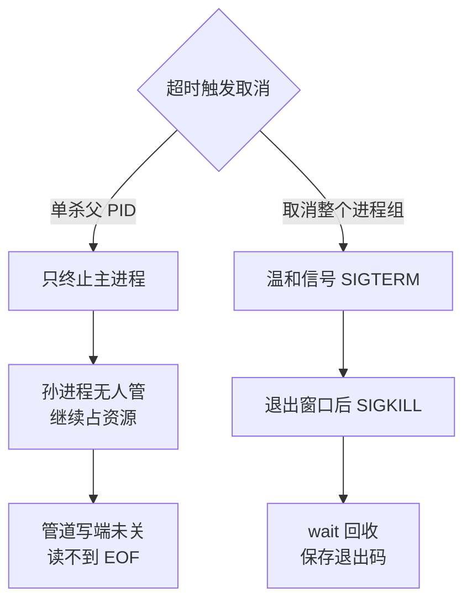

# 任务生命周期必须覆盖进程、日志、超时与清理

它解决的是长任务“看似完成、实际泄漏或失联”的问题：没有明确 owner 和回收路径，超时会留下孙进程、管道和临时资源，最终表现为 fd 耗尽、重复执行或无法判断的假成功。核心做法是把进程组、日志、状态、超时和清理租约绑定到 task generation，并用进程树、退出码、产物和资源计数验证；代价是需要 observer 和持久化状态，边界是它不能替业务判断结果正确。

长任务系统最难的不是“启动一条命令”，而是确保进程、文件描述符、日志、超时和清理在父进程异常时仍有明确归属。

## 核心模型

一次 task/run 要绑定的资源有下面几类：

- 进程组、容器或 cgroup
- stdin/stdout/stderr 管道
- 已打开的文件、socket、锁
- 超时、取消信号、退出状态
- 产物与清理租约

文件描述符是进程内指向 open file description 的整数句柄；文件、管道、socket、eventfd 都会占用 fd。`fork` 后子进程继承描述符，`exec` 时只有设置 close-on-exec 的描述符会关闭。fd 泄漏不仅影响打开文件，还会让 pipe/socket/subprocess 以 `EMFILE` 失败。

## 必须显式处理的生命周期

- 启动时设置工作目录、环境、资源上限、进程组和输出管道。
- 不需继承的 fd 使用 `O_CLOEXEC`/`FD_CLOEXEC`，避免锁和 socket 被子进程意外保活。
- 父进程关闭自己不使用的 pipe 端，否则读取端可能永远收不到 EOF。
- 取消/超时先向进程组发温和信号，留出退出窗口，再强制终止；单杀父 PID 会留下孙进程。
- 回收子进程并保存 wait status；不 `wait` 会留下 zombie，丢失退出原因。

超时后按哪种范围取消，结局差在孙进程的归属，两条路径分岔如下图：



- 任务外部 observer 监测 heartbeat、进程树和租约；父进程被 OOM/SIGKILL 时不能依赖它自己更新状态。

## fd 与并发容量

粗略容量不是“每个子进程 3 个 fd”。实际还包括捕获 stdout/stderr 的 pipe、网络连接、日志、临时文件、watcher 和框架内部句柄。上线前观察：

```bash
ulimit -n
ls -1 /proc/<pid>/fd | wc -l
lsof -p <pid>
cat /proc/<pid>/limits
```

容量估算以高水位和泄漏趋势为准，避免在达到限制后才重试；无界重试会同时加剧 fd、进程和端口耗尽。

## 失败分类

| 现象 | 证据 | 处理 |
| --- | --- | --- |
| `Too many open files` | fd 数随任务单调增长、`EMFILE` | 找未关闭路径；上下文管理；并发上限 |
| 命令超时但进程仍在 | 孙进程不属于同一可控 group | 建立 process group/cgroup；组级取消 |
| stdout 读取卡住 | pipe 写端仍被某个继承进程持有 | 关闭无用 fd；检查进程树 |
| 状态永远 running | 主进程终止，内部超时/心跳一起停止 | 外部 lease/observer 纠正孤儿状态 |
| 清理破坏其他任务 | 资源没有 owner/generation/引用计数 | 绑定 task generation；清理前检查租约 |

## 与 AI 执行框架的关系

AI 可以决定执行何种构建、测试或诊断命令，但框架必须采集真实 argv、cwd、pid/process group、退出码、信号、stdout/stderr 和产物；并以 task/attempt/revision 绑定这些事实。详细边界见 [[工程知识/AI 系统工程：从模型能力到生产能力/安全与治理/执行证据必须独立于AI结论]]。

关联：[[工程知识/后端系统：在并发、失败与变化中维持服务/任务与并发/后台任务不能依赖终端会话维持生命周期]]、[[工程知识/后端系统：在并发、失败与变化中维持服务/分布式可靠性/健康检查只能提供有时效的失败证据]]、[[工程知识/软件构建：让变化可以理解、验证与交付/测试与交付/测试策略从风险选择证据]]、[[工程知识/缺陷分析：从个案到体系/资源与容量/周期任务只进不出的集合：清理动作自己也要被清理]] —— 周期任务的完成纪律与工作量守恒监控。

任务生命周期的机制与本质：把后台任务看成一个微型系统——进程是它的身体（起了要有收），日志是它的记忆（出事要能回放），超时是它的心跳（卡了要有判定），清理是它的遗嘱（退场要还资源）；
本质问题是任务在异常路径上的每一步都有人负责——正常路径人人都会写，生命周期治理管的全是异常路径。


## 验证

1. 描述符泄漏：让同一任务循环拉起带 stdout 管道的子进程，用 `ls -1 /proc/<pid>/fd | wc -l` 跟踪数量，预期在高水位附近振荡；若单调增长，按未关闭的 pipe、socket 与临时文件逐类排查。
2. 超时取消：构造一条会 fork 孙进程的命令并触发超时，预期整个进程组收到信号后退出，用 `ps -o pid,ppid,pgid` 确认没有遗留孙进程；只按父 PID 终止的对照实现应留下可观察的孤儿。
3. 管道阻塞：父进程保留 pipe 写端不关闭，预期读取端在子进程结束后仍收不到 EOF；关闭无用描述符后读取正常结束。
4. 状态无响应：用 `SIGKILL` 终止主进程，预期外部 observer 依据租约与心跳把任务状态修正为失败，而不是长期停留在 running。
5. 回收核对：退出后子进程已被 `wait` 回收且无 zombie，退出码与产物路径写入任务记录，清理动作绑定的 generation 与当前任务一致。

## 要解决的问题

长任务看起来已经结束，实际留下了未被回收的子进程、管道与临时资源，或者超时之后仍在对同一份数据重复执行，表现为描述符耗尽、重复写入与无法判断的假成功。本篇回答：任务的归属关系怎样确立、进程组与日志与状态与超时与清理各自绑定在什么标识上、回收路径由谁负责，以及判定任务结束要核对哪些记录。

