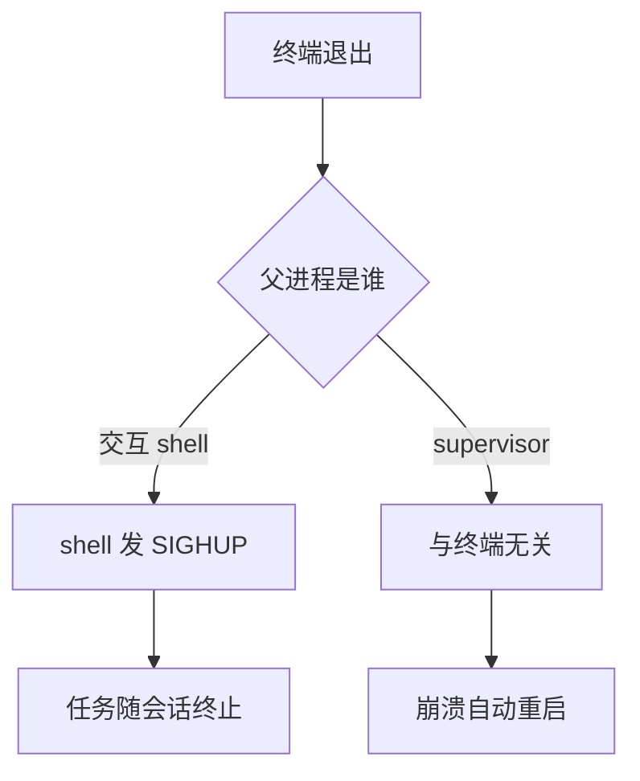

# 后台任务不能依赖终端会话维持生命周期

它解决的是终端退出、SSH 断开或 shell 崩溃后任务失去监督的问题。核心机制是把任务交给拥有重启、日志、资源和状态语义的 supervisor 或 job runtime；收益是生命周期可观察、可恢复，代价是增加部署和运维组件，边界是进程托管不等于业务幂等或结果正确。用断开会话、杀父进程、重复提交和磁盘满实验验证恢复与清理。

命令末尾加 `&` 只把 job 放到 shell 后台，不自动解决终端关闭、日志、退出码、重启、资源上限和状态恢复。

## 机制边界

| 方式 | 适用 | 不提供 |
| --- | --- | --- |
| `cmd &` / shell job control | 当前交互会话短任务 | 脱离终端、重启、集中日志 |
| `nohup cmd >run.log 2>&1 &` | 一次性、允许人工检查的简单任务 | 监督重启、资源隔离、可靠状态 |
| tmux/screen | 人工交互、调试和会话重连 | 生产服务管理和自动恢复 |
| systemd/supervisor | 单机长期服务 | 跨机调度、业务幂等 |
| container/job scheduler | 可声明资源和重试的批处理 | 应用级正确性、证据和补偿 |

表格之外的机制：终端退出时任务死活，由父进程是谁决定：



## 启动前记录

- 可复现命令、cwd、环境/配置版本和代码 revision；
- stdin/stdout/stderr 去向，日志轮转和敏感信息规则；
- pid/process group、启动时间、owner 和 task ID；
- timeout、取消、退出码和产物路径；
- CPU/内存/磁盘/网络上限与并发预算。

## 安全的一次性模式

```bash
nohup ./run-job --config config.yaml >run.log 2>&1 &
job_pid=$!
printf '%s\n' "$job_pid" >run.pid
```

这只适合低风险临时任务。PID 可能复用，`run.pid` 不是身份保证；停止前还应核对启动时间、命令、cwd 和任务代际。不要使用宽泛 `pkill -f` 或未确认的 PID 杀进程。

## 取消和清理

长任务应建立独立 process group/cgroup，先发送可处理的终止信号，等待宽限期，再强制终止整个组；随后回收子进程、保存退出状态、关闭 fd、完成/回滚临时产物。详细机制见 [[工程知识/后端系统：在并发、失败与变化中维持服务/任务与并发/任务生命周期必须覆盖进程、日志、超时与清理]]。

## 应用与判断

选型按三个问题走：任务运行多久、失败后是否自动恢复、状态是否被其他系统查询。交互调试对应 tmux；跑一夜的一次性脚本对应 nohup 加日志重定向；随宿主存活的常驻服务交给 systemd 或 supervisor 并配置重启策略；需要跨机调度与重试语义的批处理交给 job scheduler。托管成本逐档递增，按需求最低档选择，超出需求的高档组件带来的是额外运维面。

看完本篇应能做的判断：给一个具体任务指出它该用哪一档托管，验收时构造哪几类中断（断开连接、杀父进程、重复提交、资源耗尽），并说出每档托管不提供的保证——这部分保证缺失时要靠任务自身的幂等与清理纪律补足。

## 生产验收

- [ ] 进程退出、OOM、宿主重启和网络中断都有明确状态。
- [ ] 任务可查询、取消、限时，日志与产物绑定 task/attempt/revision。
- [ ] 重试写操作幂等；后一次失败不覆盖已确认成功事实。
- [ ] 清理只作用于自己拥有且租约失效的资源。
- [ ] 外部 observer 检测孤儿任务，不依赖主进程自报。

关联：[[工程知识/AI 系统工程：从模型能力到生产能力/安全与治理/执行证据必须独立于AI结论]]、[[工程知识/后端系统：在并发、失败与变化中维持服务/分布式可靠性/租约必须配合FencingToken阻止过期持有者]]、[[工程知识/后端系统：在并发、失败与变化中维持服务/基础设施/Kubernetes管理资源状态，不管理业务正确性]]、[[工程知识/后端系统：在并发、失败与变化中维持服务/任务与并发/后台任务的守护链：进程托管与会话脱离是可靠性的底线配置]]。

## 验证

1. 会话脱离：用 supervisor 或 `nohup` 启动任务后关闭终端与 SSH 连接，预期任务继续运行、日志按轮转规则写入文件；以 `cmd &` 启动的对照任务应随会话结束收到 SIGHUP 而终止。
2. 父进程退出：对托管任务发送 `SIGKILL` 强制结束父进程，预期 supervisor 按重启策略拉起新实例，并在日志中记录退出原因与重启次数；用 `ps -o pid,ppid,pgid,lstart -p <pid>` 核对新实例的进程组与启动时间，确认它属于新一代。
3. 重复提交：在任务仍在运行时提交同一任务，预期被去重或拒绝，不应出现两个实例写同一份产物。
4. 资源耗尽：把输出目录所在文件系统写满或收紧磁盘配额，预期任务以明确退出码结束、日志记录失败原因，清理动作只回收自己拥有的临时产物。
5. 断言锚点：断开连接、杀掉父进程、重复提交、资源耗尽四类中断都有可查询的最终状态与退出记录，孤儿任务能被外部 observer 发现。

## 要解决的问题

终端断开、会话退出或父进程结束时，后台任务失去监督，运行状态无法查询，失败之后也没有重启路径。本篇回答：任务的生命周期应当交给哪一类组件、这类组件提供哪些保证、它们不提供哪些保证，以及验收恢复能力需要构造哪几种中断场景。

