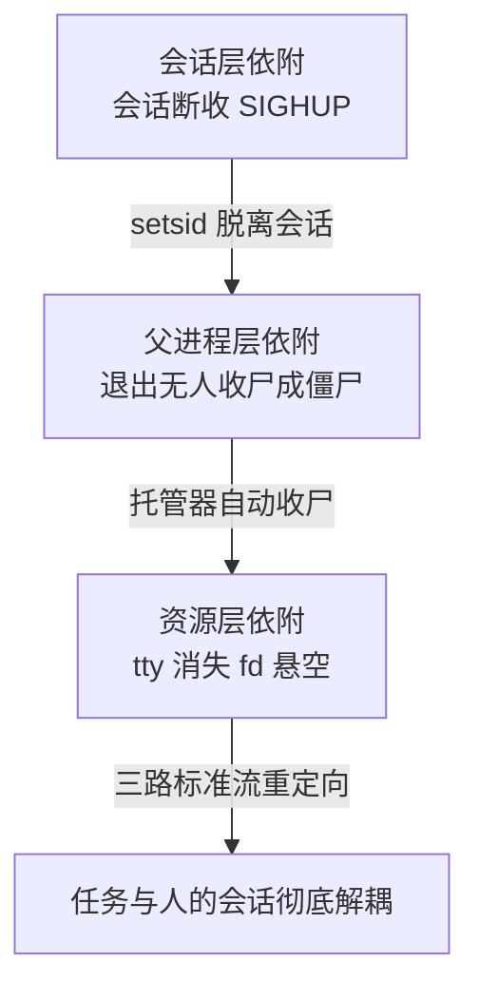

# 后台任务的守护链：进程托管与会话脱离是可靠性的底线配置

> **要点**：后台任务依附在终端会话或交互式 shell 下，会话一断任务就没了——可靠性的底线是进程托管（systemd/容器重启策略）+ 会话脱离（setsid/nohup 的正确组合）+ 日志重定向，三件套缺一，任务的生命周期就挂在了人的会话上。

## 要解决的问题

"在服务器上跑个长任务"有一类经典事故：**任务通过 SSH 起在交互会话里，运维下班断开连接，任务随会话终止**——数据迁移跑到一半停了，批量回填无人知晓，第二天发现"任务消失了"。本库后端域"后台任务不能依赖终端会话维持生命周期"已从 SIGHUP 信号机制的角度解剖过根因；本篇把防线体系按"守护链"展开：一个能长期存活的后台任务，从进程托管、会话脱离到日志归属的三层底线配置，每一层的失守形态不同，配齐三层才构成完整守护。

## 机制：任务生命周期的三层依附

一个交互式启动的进程，生命周期挂在三层依附关系上，每层断开都有对应的失效方式：

**会话层依附（SIGHUP）**：交互 shell 启动的子进程挂在会话的进程组里，会话终止时内核向控制进程发 SIGHUP，默认动作是终止。`nohup` 忽略 SIGHUP，`setsid` 干脆让进程脱离控制终端——两个工具解决的同一层问题，语义有别：nohup 保留会话关系只免疫信号，setsid 建立新会话彻底脱离。**只免疫信号不脱离终端的进程，仍会在终端关闭路径上遇到其他收尾行为**（如 tty 缓冲的刷新异常），生产守护进程的标准做法是 setsid 完整脱离。

**父进程层依附（僵尸与孤儿）**：父进程退出后子进程被 init 收养，这一步无害；有害的形态是**父进程活着但不管子进程**——子进程退出后成僵尸，占着进程表项。托管的进程树要有收尸方（systemd 对它起的服务自动收尸，容器运行时对 PID 1 有专门约定），自行编写的管理脚本要显式 wait 或用双 fork 让守护进程被 init 收养。

**资源层依附（文件描述符与工作目录）**：进程的 stdout/stderr 指向的 tty 随会话消失，后续写日志失败或写进已删除的文件；工作目录被卸载时进程在悬空目录里继续跑。底线配置是启动时重定向三路标准流到文件或日志系统、工作目录切到持久路径——**这两步不做，进程活着也等于聋哑**。

三层的对应关系决定了守护链的检查顺序：进程还活着吗（托管）→ 活着但还在干活吗（日志在涨、指标在跳）→ 干活的输出去哪了（重定向）。逐层排查能把"任务消失了"这类事故在五分钟内定位到具体层。

三层依附各在什么环节失守、底线配置是什么，按下图逐层看：



## 修复与防线

**第一优先用进程托管器**：systemd unit 是生产环境的标准答案——Restart 策略（on-failure/always）、自动收尸、日志进 journald、开机自启，四件事一个 unit 文件全解决。容器环境的等价物是重启策略与存活探针。**手写 nohup 脚本只用于一次性任务**，需要"长期"二字的任务一律托管。托管换来的收益是进程生命周期与人的会话彻底解耦、故障自愈有退避；代价是 unit 文件本身成为要维护的配置，且托管器的行为（依赖顺序、启动超时）需要团队理解——收益远大于代价，代价通过验收清单消化。

**一次性任务的最小守护配置**：确实只能手动起的任务（临时修复脚本），最小配置三件套：`setsid` 脱离会话、标准流重定向到文件、`disown` 移出 shell 作业表——三件套能撑过会话断开，但没有重启能力，任务崩溃不会自愈，所以只配一次性。

**日志的归属先于任务的启动**：重定向目标用带轮转的日志路径或 journald，裸重定向到固定文件会在长任务下写出巨型文件——日志方案在启动命令里一起定，事后补救要重启任务。

**托管配置的验收**：systemd unit 上线前跑一遍验收——kill 进程确认自动重启、断开会话确认无感知、查看 journald 确认日志已写入。**没有验收的托管配置与没有托管一样不可信**。

## 边界

三条边界防止防线走形。

**重启策略要配退避**：Restart=always 对立刻崩溃的任务会形成重启风暴（崩溃循环打满日志）——systemd 的 start-limit 与退避间隔是配套项，"无限重启"的正确形态是"带退避的无限重启"。

**托管不替代任务内的幂等**：进程被重启后从哪继续，是任务自身的检查点设计（本库正确性域"可恢复批处理的幂等与断点续跑"讨论）——托管保证进程活着，幂等保证活着的进程重复执行不产生副作用，两层互补不可互替。

**setsid 与容器环境的关系**：容器内 PID 1 由运行时管理，任务不应再自行 daemonize（容器以"前台进程"为容器主进程的模型）——容器的重启策略承担托管职责，进程内再 setsid 反而让容器认为主进程退出。环境的托管模型决定进程的守护形态。

## 验证

可复现的验证路径：

1. 托管验收：systemd unit 启动任务 → kill -9 主进程 → 确认按策略自动重启且退避生效（连续 kill 触发 start-limit）；
2. 会话验收：SSH 会话内起 setsid 任务 → 断开会话 → 重连确认任务存活、日志持续写入；
3. 日志验收：journald 或重定向文件里能看到任务的输出与错误，轮转配置生效；
4. 断言锚点：**长期任务在托管器里有 unit、重启有策略有退避、日志有归属有三路重定向**；三者缺任一即不满足上线标准。

```text
托管断言 = kill 后自动重启，风暴有退避
会话断言 = 会话断开任务存活
日志断言 = 三路标准流有归属，轮转生效
```

守护链三件套是后台任务的最低可靠性配置——它保证的是"任务有机会跑完"，任务能不能跑对是幂等与检查点的事，两层都在才算可靠。验证时预期与实际的对照规则提前写明：kill 后预期自动重启且连续 kill 触发退避，对不上（不重启或风暴式重启）即托管策略与 start-limit 配置有误；会话断开后任务预期存活、日志持续，对不上（任务消失或日志停更）即会话脱离不完整，按三层依附逐层排查。

## 相关

- [[工程知识/后端系统：在并发、失败与变化中维持服务/任务与并发/后台任务不能依赖终端会话维持生命周期]] —— 根因篇：SIGHUP 与会话生命周期的信号机制
- [[工程知识/后端系统：在并发、失败与变化中维持服务/服务设计/优雅停机的完成语义：排空连接与任务交接]] —— 守护链管"活着"，停机语义管"退场"，同一生命周期的两端
- [[工程知识/缺陷分析：从个案到体系/稳定性/失败转移的最后一站：找不到去向的失败要留在原地报错]] —— 任务存活后的失败处理纪律，与守护链同属后台任务可靠性
- [[工程知识/软件构建：让变化可以理解、验证与交付/开发工具/词汇即接口：Linux与容器命令的词源与设计]] —— setsid/nohup/disown 等命令的设计语义
- [[工程知识/性能工程：从用户等待到资源瓶颈/观测与诊断/监控体系按四个问题分层：坏了没、坏了哪、为什么坏、会再坏吗.md]] —— 托管与守护产生的信号进四层监控体系
相关：[[工程知识/性能工程：从用户等待到资源瓶颈/操作系统与运行时/fd 泄漏先用 lsof 对账：每类套接字都有名有姓才算干净.md]] —— 守护链的 fd 继承与对账细节
