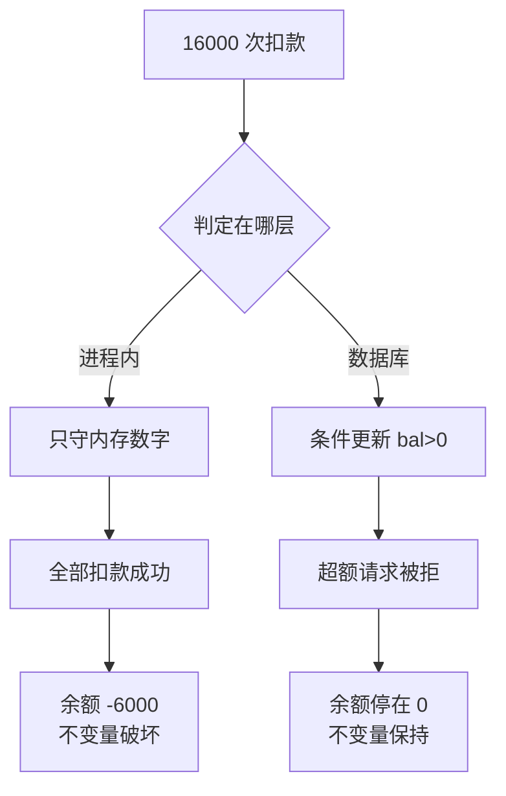

# 并发控制先定义共享状态和完成条件

并发问题的核心不是“加锁”，而是多个执行单元同时读写状态时，哪些不变量必须保持、谁拥有状态、何时算完成。互斥锁、原子操作、消息传递、事务、版本号和租约是不同范围的工具，不能互换。

例如“扣减库存并创建订单”不是把两个函数分别加锁就完成了：锁只覆盖单进程内存时，进程崩溃、重复请求或另一个服务写入仍会破坏库存不为负的约束。先写出共享状态、所有者和提交点，再选择锁、CAS、事务或事件，才能知道保护范围是否覆盖真正的副作用。

## 选择路径

| 场景 | 机制 | 需要验证 |
| --- | --- | --- |
| 同一进程短临界区 | mutex/atomic | 锁顺序、内存可见性、持有时间 |
| 生产者与消费者 | channel/queue | 容量、阻塞、取消、关闭和背压 |
| 跨进程共享状态 | 数据库事务/锁 | 隔离、死锁、恢复和唯一约束 |
| 跨主机长任务 | lease + fencing | 过期持有者不能继续写 |
| 可重放事件 | 版本/状态机 | 重复、乱序和旧事件被拒绝 |

线程安全只说明某个数据结构不会发生未定义竞争，不说明业务操作原子；异步函数也可能在 await 前后被其他任务插入。取消、超时、异常和资源释放必须沿并发边界传播。

## 三种实现的实测差异

判断并发控制是否到位，不能只看"有没有加锁"，要看业务不变量是否被守住。下面三种实现对同一组请求操作同一余额（初始 10000，8 线程各扣 2000 次，共 16000 次请求，Python 3.9.6）：

| 实现 | 最终余额 | 成功扣款 | 算术一致 | 业务不变量（余额 ≥ 0） |
| --- | --- | --- | --- | --- |
| 无保护 | -6000 | 16000 | 是 | **破坏** |
| 进程内锁 | -6000 | 16000 | 是 | **破坏** |
| 数据库条件更新 | 0 | 10000 | 是 | 保持 |

前两种的余额与扣款次数完全对得上——算术层面没有竞争，竞态测试如果只断言"余额 == 初始 - 扣款次数"会通过。但余额被扣到 -6000，说明它们保护的是**内存里的数字**，不是"余额不能为负"这条业务约束。第三种把约束写进 `WHERE bal > 0`，超额请求被拒绝（`rowcount = 0`），余额停在 0，成功扣款恰好 10000 次。

判定在哪一层，结局就分岔在哪一层，两条路径如下图：



代价也真实：数据库条件更新耗时 293ms，进程内锁 2.4ms，相差约两个数量级。这组数字说明选择不是"哪个更安全"，而是**保护范围与延迟的交换**——跨进程约束必须付出持久化的往返成本。

复现脚本（每线程独立连接，共享单个 sqlite 连接在多线程下会段错误，这本身就是一条外部副作用的教训）：

```python
import sqlite3, threading, os

DB = "/tmp/acct.db"
ITER, WORKERS, START = 2000, 8, 10000

def setup():
    if os.path.exists(DB):
        os.remove(DB)
    c = sqlite3.connect(DB)
    c.execute("PRAGMA journal_mode=WAL")
    c.execute("CREATE TABLE acct(id INT PRIMARY KEY, bal INT)")
    c.execute("INSERT INTO acct VALUES(1, ?)", (START,))
    c.commit(); c.close()

def worker(times, lk):
    con = sqlite3.connect(DB, timeout=30)
    for _ in range(ITER):
        cur = con.execute("UPDATE acct SET bal=bal-1 WHERE id=1 AND bal>0")
        if cur.rowcount:
            with lk:
                times.append(1)
        con.commit()
    con.close()

setup()
times, lk = [], threading.Lock()
ts = [threading.Thread(target=worker, args=(times, lk)) for _ in range(WORKERS)]
[t.start() for t in ts]; [t.join() for t in ts]
print("成功扣款:", len(times), "总请求:", ITER * WORKERS)
# 期望：成功扣款 = 10000，总请求 = 16000
```

## 常见错误

- 检查后使用（TOCTOU）：状态在检查与动作之间已经变化。
- 锁保护内存却没有保护外部副作用，释放后仍可能重复提交——上面的 -6000 就属于这一类，且它通过了算术一致性断言。
- 无界线程池、队列或 future 把过载变成内存和延迟事故。
- 只测无竞争成功路径，不测取消、超时、进程暂停和恢复。
- 用"算术一致"代替"业务不变量成立"，把竞态测试写成恒真断言。

## 失效长什么样

真正的共享状态常常不在加锁的位置上。[[工程知识/缺陷分析：从个案到体系/并发/案例十九：在回调里改自己——清理路径的重入与回收后复用]] 里，对象被回收后回调仍在同一条清理路径上重入，锁保护的是对象内部的字段，而失效发生在**生命周期的交界处**——回收与复用之间没有定义完成条件。

[[工程知识/缺陷分析：从个案到体系/并发/案例二十：关闭之后还有人在用——生命周期的时序竞态]] 是同一个骨架的另一断点：关闭流程宣布完成，但仍有持引用者继续读写。两例共同的机制是**完成条件没有覆盖所有持有者**，锁的粒度再细也拦不住，因为锁的对象不是争用的对象。

[[工程知识/缺陷分析：从个案到体系/并发/案例三十一：回收之后还在飞——跨线程复用可回收对象]] 进一步说明：跨线程传递后，原线程的"已完成"对接收方没有意义，完成条件必须定义在共享状态的归属层，而不是单个执行单元的视角。

## 边界

这套判断的前提是：**能够明确指出共享状态的所有者和提交点**。在以下情况它不再直接适用——状态所有者本身在多副本间漂移（此时先解决归属，见 [[工程知识/后端系统：在并发、失败与变化中维持服务/分布式可靠性/一致性模型与共识解决不同问题]]）；副作用发生在无法参与事务的外部系统（此时需要幂等与对账，而非更强的一致性）；以及完成条件依赖wall-clock时间而非状态版本（此时 [[工程知识/后端系统：在并发、失败与变化中维持服务/分布式可靠性/时间顺序与因果必须显式建模]] 是前置）。

## 验证

验证的锚点：并发结论要与不变量对账——预写重复提交、竞态读写与取消场景下余额守恒应成立，实测出现重复扣款或资源未释放，与预期对不上。

为不变量写并发测试和故障注入：重复提交、竞态读写、锁顺序反转、队列满、消费者崩溃、取消时资源释放、旧版本写入。对长任务结合 [[工程知识/后端系统：在并发、失败与变化中维持服务/分布式可靠性/租约必须配合FencingToken阻止过期持有者]]。

最小实验：让两个 worker 同时读取同一余额并各自扣款，分别用无保护、进程内锁、数据库条件更新三种实现；在 worker 被杀和请求重试后检查余额、扣款次数和审计记录。若只有数据库条件更新仍能保持不变量，说明真正的共享状态不在进程锁范围内。

断言要写成业务约束（`assert bal >= 0`），别写成算术恒等式（`assert bal == START - times`）。

## 要解决的问题

多个执行单元同时读写同一份状态时，把问题直接归结为加锁，加完之后仍然出现不一致，或者出现新的死锁与性能下降。本篇回答：哪些不变量必须始终保持、状态归谁所有、什么条件下算完成、互斥与原子操作与消息传递与事务与版本号与租约各自适用于哪个范围。

## 相关

关系：[[工程知识/缺陷分析：从个案到体系/并发/案例十九：在回调里改自己——清理路径的重入与回收后复用]] · [[工程知识/缺陷分析：从个案到体系/并发/案例二十：关闭之后还有人在用——生命周期的时序竞态]] · [[工程知识/缺陷分析：从个案到体系/并发/案例三十一：回收之后还在飞——跨线程复用可回收对象]]

- [[工程知识/后端系统：在并发、失败与变化中维持服务/分布式可靠性/租约必须配合FencingToken阻止过期持有者]] —— 跨主机长任务的完成条件
- [[工程知识/后端系统：在并发、失败与变化中维持服务/分布式可靠性/时间顺序与因果必须显式建模]] —— 完成条件依赖时间时的前置
- [[工程知识/后端系统：在并发、失败与变化中维持服务/分布式可靠性/一致性模型与共识解决不同问题]] —— 所有者漂移时先解决归属
- [[工程知识/软件构建：让变化可以理解、验证与交付/语言与运行时/内存模型决定并发读写何时可见]] —— 锁之下的可见性基础
- [[工程知识/后端系统：在并发、失败与变化中维持服务/任务与并发/限流熔断与隔离控制故障半径]] —— 无界并发的另一半后果
- [[工程知识/缺陷分析：从个案到体系/并发/回调必须回到属主线程：完成通知的线程归属纪律]] —— 属主串行域纪律在回调场景的展开

- [[工程知识/AI 系统工程：从模型能力到生产能力/模型与上下文/跨会话状态的一致性先于记忆的长度]] —— 记忆层的同构问题
