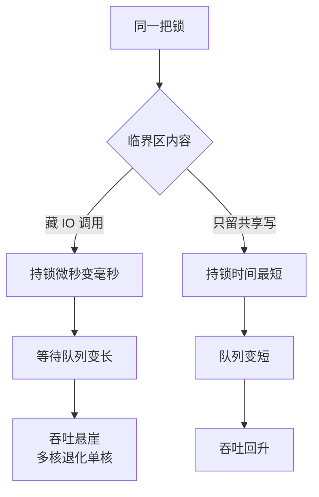

# 锁的竞争要按临界区治理：缩小范围、读写分离、分片加锁三路走

> **要点**：锁竞争的性能悬崖不在锁本身在临界区——治理三路：缩小临界区（只护真正共享的写操作，慢调用移出锁外）、读写分离（读多写少用读锁并行）、分片加锁（按 key 分片把全局锁变局部锁）；每路的前提是先定位竞争点（哪个锁、哪段代码、竞争度多少），三路可叠加。

## 要解决的问题

服务在低并发下正常、并发上来后吞吐不升反降（线程堆栈全在等同一把锁）——**锁竞争把多核机器退化成单核**。本库任务与并发域"案例三十七"给过一个争用案例；本篇展开成完整的治理方法：**竞争的度量（怎么确认瓶颈是锁）、三路治理各自的适用前提与交换、常见反模式**——锁竞争的诊断意义在于它伪装成容量问题（"加机器"对单进程内的锁完全无效，跨进程也常常无效）。

## 机制：定位、度量与三路治理

**定位与度量**：竞争的确认靠三类证据——线程转储的锁等待分布（大量线程 BLOCKED 在同一把锁）、性能分析的锁竞争热点（profiler 的 lock contention 视图）、竞争度指标（锁的等待队列长度、等待时间占比）。**先确认竞争存在与位置，再谈治理**——"感觉有锁就优化锁"是过早优化的变体。

线程转储里 BLOCKED 线程长什么样，真实面板给一个样例：


上图取自 [perfmatrix 的线程转储分析页](https://perfmatrix.com/thread-dump-analysis/)：上半是持锁线程的调用栈快照（`- locked` 标出锁地址），下半是依赖图把阻塞关系连成一串——定位锁竞争时看到的就是这两样。

**第一路：缩小临界区**。锁内的代码只留"必须互斥的共享状态读写"，其余全部移出——**锁内出现 IO、网络调用、长计算是竞争的头号放大器**（一把锁的持有时间从微秒变毫秒，竞争度放大千倍）。缩小后的收益：持锁时间缩短 → 等待队列变短 → 吞吐回升；交换：代码结构变复杂（锁内外分段），正确性要求不变。上游 BookKeeper 的一个复现修复是缩小 LedgerHandle 的 metadataLock 持有范围（把元数据锁内的非必要操作移出）——同一手法的上游实践。

**第二路：读写分离**。读多写少的共享状态用读写锁（读锁共享、写锁独占）——**适用前提是读远多于写**（写占比超过两三成时读写锁的管理开销反超收益），且读操作不加锁也能保证一致性快照（读锁内不能有写穿插的假设要成立）。JDK 的StampedLock 提供乐观读（无锁读 + 版本验证），读占比极高的场景收益更大，代价是 API 更复杂、误用面更大。

**第三路：分片加锁**。全局一把锁按 key 分片成 N 把（按 hash 取模选锁）——竞争从全局降到分片内，**吞吐按分片数放大**。适用前提：操作只涉及单个 key 的状态（跨 key 操作要么用全局锁、要么设计多锁获取顺序防死锁）；交换：跨 key 操作的复杂度、分片数的选择（太少竞争降不够、太多内存与上下文开销）——**分片数按竞争度目标反推**（如"单分片竞争度 < 10%"）。

**三路叠加的顺序**：先缩小（所有场景的第一步）、再分片（把竞争分散）、读写分离（对读多场景）——缩小是前提：临界区不缩，分片只把大临界区复制 N 份。

同一把锁，临界区里藏没藏长动作，结局分岔如下图：



## 看完能判断：常见反模式与边界

**三个反模式**：锁内调用外部服务（持锁做 RPC，持锁时间不受自己控制）；锁的粒度漂移（起初护一行，后来顺手护了整个方法，没人收窄）；双检锁的失效实现（无 volatile/内存屏障的懒加载，检查通过但对象未初始化完）——**反模式的共同点是一把锁承担了两种职责**（互斥 + 可见性/时序），职责分开后方案自然清晰。

**竞争与死锁的分界**：竞争是性能问题（等得久但会来），死锁是正确性问题（永远不来）——分片加锁引入多锁获取时，**固定获取顺序**（按 key 全序）防死锁，这条纪律写进代码评审清单。

**跨进程的锁**：单进程内的锁治理三路不直接适用于跨进程（分布式锁、数据库行锁）——分布式锁的持锁成本更高（网络往返），**跨进程场景优先用无锁的原子机制**（CAS、队列串行化），锁是最后手段。

## 验证

可复现的验证路径：

1. 竞争复现：并发压测临界区含 IO 的服务，预期吞吐在并发超过核数后不升反降、线程转储显示 BLOCKED 聚集——竞争形态复现；
2. 治理验证：按三路逐一改造后重压，预期吞吐按治理路数放大（缩小的收益看持锁时间下降、分片的收益看分片数比例）；
3. 正确性验证：分片 + 并发写同一 key 的竞态测试（多线程对同一 key 并发操作，断言结果一致）——分片不引入正确性回退；
4. 断言锚点：**锁的持锁时间有性能分析基线、竞争度指标（等待队列/等待占比）进监控、多锁获取的顺序纪律在评审清单**——三项齐备，锁竞争从"并发一高就悬"变成按度量治理的常规项。

```text
度量断言 = 持锁时间与等待占比有基线
治理断言 = 三路改造后吞吐可量化
纪律断言 = 多锁顺序进评审清单
```

锁竞争的治理顺序是度量先行、缩小打底、分片与读写分离按场景叠加——三路走完，多核的吞吐才真正兑现成服务的容量。

## 相关

- [[工程知识/缺陷分析：从个案到体系/性能/案例三十七：锁自己变成了瓶颈——争用背后的临界区错配.md]] —— 争用案例的个案视角
- [[工程知识/后端系统：在并发、失败与变化中维持服务/任务与并发/并发控制先定义共享状态和完成条件.md]] —— 锁之外的并发治理层
- [[工程知识/后端系统：在并发、失败与变化中维持服务/分布式可靠性/重试的正确姿势：退避、抖动与重试预算.md]] —— 锁外的并发正确性手段
- [[工程知识/数据系统：在并发与故障中保存事实/事务与存储/事务隔离决定并发读写能观察到什么]] —— 数据库层的并发控制视角
