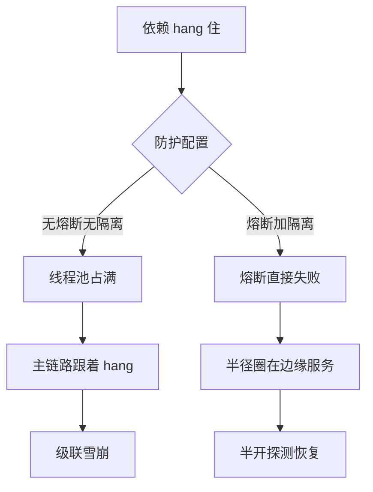

# 限流熔断与隔离控制故障半径

它解决的是过载和依赖故障沿重试、队列、线程池扩散成级联故障的问题。限流先控制进入量，熔断停止已证明无效的调用，隔离保留关键资源；效果是故障半径和恢复时间可控，代价是拒绝部分流量并可能降低瞬时利用率。用逐步压测和半故障注入验证拒绝速度、核心租户容量、恢复和成本上界。

过载和依赖故障会通过队列、连接池、线程池和重试扩散。限流控制进入量，熔断停止无意义调用，舱壁/资源池隔离让一个租户或依赖不能耗尽全部容量；它们都不能替代修复根因和定义降级结果。

## 设计对象

| 机制 | 控制 | 关键参数 |
| --- | --- | --- |
| rate/concurrency limit | 请求速率或并发 | 租户、优先级、突发、拒绝码 |
| timeout/deadline | 等待时间 | 总预算、传播、取消 |
| circuit breaker | 暂停失败依赖 | 错误分类、窗口、半开探测 |
| bulkhead | 资源池故障域 | 线程/连接/队列、保留容量 |
| load shedding | 超载时丢弃低价值工作 | 优先级、降级、可恢复性 |

重试必须计入限流和总预算，否则“恢复机制”会制造重试风暴。AI 服务还要限制输入/输出 token、Agent 步数、工具并发和 GPU 队列，而不是只限制 HTTP QPS。

## 组合顺序

先用 admission control 拒绝已经超出预算的工作，再用有界队列和 deadline 限制等待；依赖错误持续出现时熔断，关键租户或操作使用独立资源池。顺序反过来会让请求先占满线程和连接，再由熔断器报告故障，已经太晚。

最小实验：逐步把依赖延迟从正常值提高到超过 deadline，同时发送高、低优先级流量；比较无门禁、只限 QPS、加入并发隔离和熔断四种配置的 p99、拒绝率、核心租户成功率、队列长度和恢复时间。

## 四个控制位置

1. **入口限速**控制单位时间接受多少请求，适合按租户和优先级分配配额。
2. **并发上限**控制同时占用多少线程、连接、GPU slot 或工具调用，通常比只限 QPS 更接近真实容量。
3. **有界队列**让上游看到下游已经跟不上；队列满时拒绝、降级或丢弃低价值工作，不能继续堆内存。
4. **负载丢弃**在系统接近失控前保住核心请求；被拒绝的结果要明确可重试、不可重试或转异步。

自适应门禁可以根据排队时间和尾延迟收缩并发，但仍要有硬上限。没有硬上限的“动态调整”会在观测延迟期间继续放大过载。

## 验证

验证的锚点：故障半径结论要与注入对账——预写依赖超时后拒绝应快速返回、核心租户容量应保留，实测慢调用把线程池占满，与预期对不上。

逐步提高到饱和，注入依赖超时、错误、半故障和恢复；测拒绝是否快速、核心租户是否保留容量、熔断是否恢复、降级是否可用、队列/内存/成本是否有界。检查重试、缓存回源和后台任务不会绕过门禁。

关系：[[工程知识/后端系统：在并发、失败与变化中维持服务/分布式可靠性/超时、重试与幂等共同定义调用语义]] · [[工程知识/AI 系统工程：从模型能力到生产能力/推理服务与平台/推理服务的核心矛盾是延迟、吞吐、显存与质量]]

- [[工程知识/后端系统：在并发、失败与变化中维持服务/服务设计/服务降级是有损服务，损什么损多少要变成业务决策]] —— 限流之后的降级阶梯

## 可运行示例与案例回流：故障半径的账

```text
三件套的分工与配置（通用形态）：

限流（入口端，挡多余的量）：
  单机 1000 QPS × 8 副本 = 8000 容量 → 全局限流 7200（留 10% 余量）
  超出部分快速失败（返回 429 + Retry-After），不是排队慢慢磨

熔断（调用端，断传染链）：
  依赖 C 错误率 >50%（10 秒窗口、至少 20 个样本）→ 熔断打开 30 秒
  打开期间直接失败（不再打 C）→ 半开探测 → 成功则恢复
  没有熔断：C hang 住 → 调用方线程池全被占住 → 调用方也 hang → 级联雪崩

隔离（舱壁，圈住半径）：
  线程池/信号量按依赖分池：核心库 100 线程、推荐服务 30、报表 10
报表依赖挂起只耗尽它的 10 线程，核心交易不受影响
  不隔离：一个边缘依赖拖垮整个进程
```

案例回流：缺熔断的实录——推荐服务 hang 住（某次配置推送让它全量阻塞），调用它的主链路线程池随之耗尽，主业务跟着不可用（故障半径从边缘服务扩到核心链路），按依赖隔离 + 熔断上线后同类事故半径缩到边缘服务自身。限流配置错位的实录——限流值拍脑袋设 1 万（单机容量 800 × 8 = 6400），流量 7000 时服务已过载但限流未触发，限流值要按实测单机容量乘副本数算（与 [[工程知识/性能工程：从用户等待到资源瓶颈/存储与网络/节流参数与容量匹配：全局限流值要按单点容量乘副本数算.md]] 同一公式）。三件套的验证姿势：故障注入逐项验证（限流阈值、熔断窗口、隔离池各打一轮，实测行为与配置对账）。

同一依赖 hang 住，防护配置不同，故障半径分岔如下图：



## 边界

- 限流只约束请求进入的速率：下游本身已经饱和时，限流值按上游容量设定，过载仍会从下游继续传导。
- 自适应门禁需要硬上限：只依据观测到的延迟收缩并发，观测窗口内的请求仍在继续放大过载。
- 有界队列是前提：队列没有上限时排队会把过载转化为内存增长与整体延迟上升。
- 熔断恢复依赖探测流量：半开状态的探测比例过高会再次打穿下游，过低则恢复缓慢。
- 重试、缓存回源与后台任务会绕过入口门禁：只对入口限流时，这些路径仍能压满下游。

## 要解决的问题

一个下游服务开始变慢之后，上游仍按原速率送入请求，排队长度与内存同步上涨，故障从一个接口扩散到整条链路。本篇回答：限速、并发上限、有界队列与负载丢弃各自约束什么、自适应门禁为什么必须有硬上限、熔断之后怎样恢复，以及哪些路径会绕过入口的门禁。

## 相关

- [[工程知识/后端系统：在并发、失败与变化中维持服务/服务设计/缓存穿透击穿与雪崩是三种不同的失效模式|缓存穿透击穿与雪崩是三种不同的失效模式]]——讲穿透/击穿/雪崩各自的首选防御，与限流互补成缓存失效的防线
- [[工程知识/后端系统：在并发、失败与变化中维持服务/分布式可靠性/重试的正确姿势：退避、抖动与重试预算.md]] —— 持续性故障时重试的止血搭档
- [[工程知识/后端系统：在并发、失败与变化中维持服务/服务设计/连接池的容量数学：池大小与排队等待的权衡.md]] —— 池作为天然限流器
- [[工程知识/后端系统：在并发、失败与变化中维持服务/服务设计/背压的传递链路：从下游饱和到上游减速.md]] —— 过载防御三件套的分工
- [[工程知识/后端系统：在并发、失败与变化中维持服务/服务设计/健康检查的三层语义：存活就绪与深度.md]] —— 错误率侧的摘除搭档
- [[工程知识/后端系统：在并发、失败与变化中维持服务/服务设计/分布式限流的四种算法：计数漏桶令牌与滑动窗口.md]] —— 限流在过载防御中的位置
