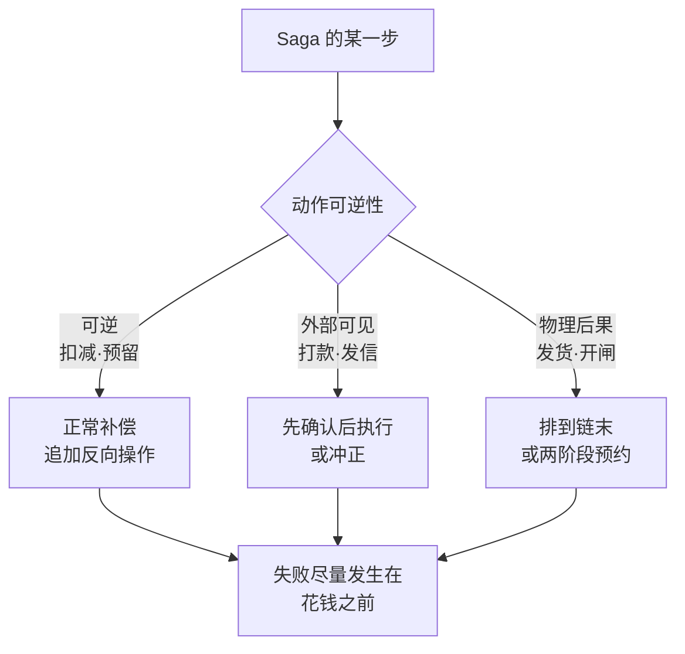

# Saga把长事务变成补偿链，代价是失去隔离性

跨多个服务的业务操作（下单 = 扣库存 + 创建订单 + 扣款 + 发通知）无法放进一个数据库事务——各服务有自己的库，两阶段提交在跨服务场景的可用性与性能代价过高。Saga 的解法是**把原子性变成补偿链**：每一步本地提交，失败时执行前面各步的补偿动作（回滚扣减、取消订单），用一串本地事务加补偿换掉一个全局事务。

这个交换的账要算清楚：**原子性保住了，隔离性丢了**。本地事务逐个提交意味着中间状态对其他请求可见——库存已扣、订单还没建成的窗口里，并发请求看到的是半成品状态。Saga 不是"更灵活的事务"，是"用隔离性换可用性"的明确取舍。

## 要解决的问题：长事务的两种形态与取舍

| 形态 | 驱动方式 | 优点 | 代价 |
| --- | --- | --- | --- |
| 编排式 | 中央协调器逐步调用 | 流程一处可见，好排查 | 协调器是单点，逻辑集中 |
| 协同式 | 各服务订阅事件自行决定 | 无单点，服务解耦 | 流程散在各处，没人看得全 |

编排式适合流程常变、排查优先的场景；协同式适合服务自治性要求高的场景。选择判据是**流程归属**：流程是业务资产（经常审视与修改）就选编排，流程是实现细节（稳定且分散）就选协同。

## 补偿的语义边界

补偿不是回滚。回滚恢复到"从未发生"，补偿是**追加一个反向操作**：扣了 100 元再存 100 元，账面恢复但流水多了两条。这个差别决定了 Saga 的适用边界：

- 补偿后的最终状态与回滚等价（可逆动作：扣减、预留）→ 适合 Saga。
- 动作外部可见即不可逆（钱已打给用户、邮件已发出）→ 补偿只能"冲正"不能"撤销"，必须设计成**先确认后执行**或人工介入。
- 动作触发物理后果（发货、开闸）→ 补偿语义不存在，这类步骤要么排最后（前面全成功才执行），要么引入两阶段预约。

设计补偿链时的排序规则因此是：**可逆步骤在前，不可逆步骤在后**，让失败尽量发生在花钱之前。

补偿链上每一步按可逆性分流，处置各不相同：



## 隔离性缺失的防御

中间状态可见带来的经典问题是脏读与重复扣减，防御机制三层：

1. **语义锁**：业务状态标记"处理中"（订单状态 PENDING），并发请求读到该标记就知道在途事务存在，选择等待或拒绝。这是应用层隔离，替代数据库隔离级别。
2. **幂等执行**：补偿与正向步骤都可能被重试触发（超时后重发），每一步必须幂等，否则补偿链自身制造重复扣减。幂等的设计与调用语义见 [[工程知识/后端系统：在并发、失败与变化中维持服务/分布式可靠性/超时、重试与幂等共同定义调用语义]]。
3. **对账兜底**：防御性机制都可能失效，最终防线是定期对账——每条 Saga 实例的终态要么"全部完成"要么"补偿到底"，停在中间的实例清单就是对账的输出。对账作为静默失败的最终检测，方法见 [[工程知识/缺陷分析：从个案到体系/正确性/静默失真的检测靠对账与不变量而不是报错]]。

## 与消息投递的一致性边界

Saga 的每一步跨服务调用都要面对消息投递与业务提交的一致性问题（见 [[工程知识/后端系统：在并发、失败与变化中维持服务/分布式可靠性/消息投递与业务提交需要显式的一致性边界]]）：本地事务提交了但"下一步"消息没发出，链就断了。工程答案是**事务性发件箱**（本地事务里写发件箱表，后台中继发送）——Saga 每步的实现都要过这道检查。

## 可运行示例与案例回流：补偿链的账

```text
订票 Saga（订机票 → 订酒店 → 订租车）的两种走向：

正向链：T1 订机票 ✓ → T2 订酒店 ✓ → T3 租车 ✗（无车）
补偿链：C2 退酒店 ✓ → C1 退机票 ✓ → 用户收到"预订失败"
  补偿的语义：每个 T 必须配一个 C（业务上的反向操作，非数据库回滚）
  C 的要求：必须成功（重试到成功），否则中间态永久留存

失去隔离性的实录形态（与其他事务并发时）：
  T1 订了机票（ Saga 未完成），另一事务读到"已有机票"做了联动决策
  → T3 失败整链补偿，机票退了 → 联动决策基于了一个从未"提交"的事实
  → 隔离性缺失的代价：中间态对外可见，别的读者不知道这是半成品

缓解：中间态显式化（状态字段"预订中"让读者知情）、
  业务上允许补偿（订票可退）、读侧容忍（联动决策加确认步骤）
```

案例回流：补偿不幂等的实录——退票补偿接口重复执行（补偿消息重投），第一笔真退款 + 第二笔报错（单号已退），补偿停在半途，整链状态悬置；补偿幂等化（按原单号去重）后重投安全。补偿不重试的实录——补偿调用超时后任务直接标记失败（没有重试），机票扣着酒店没订，用户资金占用两天才发现；补偿必须配重试与最终对账（每天对账任务扫悬置链）。适用边界的实录——强一致场景（资金实时扣减对账）勉强套上 Saga，中间态可见引发业务纠纷，改二阶段提交 + 缩短事务范围才对（与 [[工程知识/后端系统：在并发、失败与变化中维持服务/分布式可靠性/消息投递与业务提交需要显式的一致性边界.md]] 的一致性边界选择衔接）。

## 边界

Saga 的适用前提是**步骤可枚举、补偿可定义**。探索型流程（步骤由运行时决定、补偿依赖不可预测的上下文）不适合预定义补偿链，这类流程的正确性要靠工作流引擎的显式状态机（见 [[工程知识/软件构建：让变化可以理解、验证与交付/架构与代码/状态机把隐式状态变成显式约束]]）。

Saga 不解决并发同一业务对象的问题：两个 Saga 同时操作同一订单，语义锁只防"读到中间态"，不防"两个都成功但业务上互斥"——互斥约束要么前移到单点（库存服务串行化），要么靠业务规则事后裁决。这再次印证事务边界应覆盖完整业务用例的原则（见 [[工程知识/数据系统：在并发与故障中保存事实/事务与存储/事务边界应覆盖完整业务用例]]）：能放进单库事务的，不要改用 Saga。

## 验证

失败注入实验：给 Saga 链的第 3 步注入失败，检查补偿链是否按逆序执行、语义锁是否释放、对账清单里该实例是否收敛到"已补偿"。再注入补偿自身的失败（第 2 步补偿超时），确认重试幂等且最终对账可见。

并发实验：同一业务对象并发起两个 Saga，确认语义锁行为符合预期（拒绝或排队），没有出现双份扣减。

## 相关

关系：[[工程知识/后端系统：在并发、失败与变化中维持服务/分布式可靠性/消息投递与业务提交需要显式的一致性边界]] · [[工程知识/后端系统：在并发、失败与变化中维持服务/分布式可靠性/超时、重试与幂等共同定义调用语义]] · [[工程知识/数据系统：在并发与故障中保存事实/事务与存储/事务边界应覆盖完整业务用例]] · [[工程知识/后端系统：在并发、失败与变化中维持服务/分布式可靠性/分布式事务的分类与各自失败形态]]

- [[工程知识/软件构建：让变化可以理解、验证与交付/架构与代码/状态机把隐式状态变成显式约束]] —— 编排器的实现骨架
- [[工程知识/缺陷分析：从个案到体系/正确性/静默失真的检测靠对账与不变量而不是报错]] —— 中间态悬置实例的对账兜底
- [[工程知识/后端系统：在并发、失败与变化中维持服务/分布式可靠性/部分失败决定分布式系统的设计]] —— 补偿链要处理的故障模型
- [[工程知识/后端系统：在并发、失败与变化中维持服务/任务与并发/幂等性的完整谱系：从操作语义到删除接口的天然陷阱.md]] —— 补偿操作的幂等前置：从语义层到键实现
- [[工程知识/后端系统：在并发、失败与变化中维持服务/服务设计/事件驱动架构的解耦代价：最终一致与可追溯性.md]] —— 长流程的编排化方案