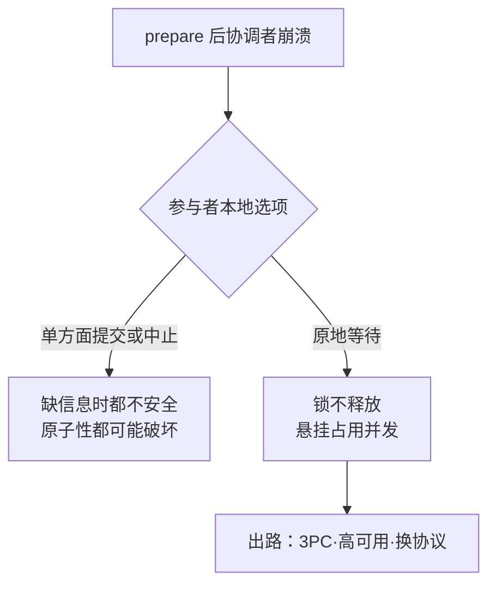

# 两阶段提交的悬挂事务：协调者故障后参与者的两难与出路

> **要点**：2PC 的参与者在"prepare 成功、commit 未决"的窗口里被锁住，协调者故障把窗口变成悬挂——参与者的两难（单方面提交或中止都可能破坏原子性）没有本地解，出路由协议机制（三阶段提交、协调者高可用、事务日志）与环境假设共同决定；悬挂的处置预案在选型时就要定。

## 背景与本质：锁在不确定里的参与者

两阶段提交的悬挂问题要解决的是：参与者在"prepare 成功、commit 未决"的窗口里如何自处。协议这样运作：协调者先问所有参与者能否提交（prepare），全部同意后再下达提交令（commit）。**协议的脆弱点在两个阶段之间**：参与者回了"同意"，就把自己锁进"只能等命令"的状态——本地既不能提交（协调者可能决定中止）也不能中止（协调者可能已经决定提交）。**协调者在这时崩溃，参与者面对一个无解的问题：命令永远不会来，锁还在身上**。

这个两难是协议证明的代价面：原子性要求参与者服从协调者，服从意味着在不确定窗口放弃自主权。**悬挂事务要解决的问题本质是"不确定窗口 × 协调者故障概率 × 事务时长"的乘积暴露**——窗口越长（跨服务事务、慢资源）、协调者越不可靠，悬挂越从理论问题变成运维现实。本库后端域"分布式事务的分类与各自失败形态"给过 2PC 的失败分类；本篇深挖悬挂这一种：**它的形成、它的两难结构、三类出路各自的交换**。

## 机制：两难的结构与三类出路

**两难的结构**：参与者已投"同意"票后的本地选项只有两个——**单方面提交**：若协调者最终决定中止，原子性破坏（部分提交）；**单方面中止**：若协调者最终已决定提交，同样破坏原子性。**两个选项在缺信息时都不安全**——这就是为什么协议要求参与者原地等待。等待的资源代价是锁（prepare 阶段加的锁不释放），**锁的持有时间 = 不确定窗口长度**，下游的并发能力被悬挂事务逐步占用。

prepare 之后的本地选项与各自结局：



**出路一：三阶段提交（3PC）**：在 prepare 与 commit 之间插入 pre-commit（全票通过后先同步这个事实），参与者在协调者故障时可以根据"是否见过 pre-commit"决策（见过 → 安全提交，没见过 → 安全中止）。**代价是多一轮通信 + 对网络分区的脆弱**（分区恢复后可能出现两个协调者视角）——3PC 在实践中的地位是教学价值大于生产价值：它用复杂度换掉悬挂，换来对分区的敏感。

**出路二：协调者高可用**：悬挂的前提"协调者故障不恢复"被高可用消灭（主备切换、事务日志持久化）——参与者等的命令在协调者恢复后必然到达。**交换是协调者层的可用性成本**，以及一个残留风险：切换期间参与者的锁还在持有（窗口 = 切换时长），**切换时长要进事务超时预算**。

**出路三：换协议**：TCC（业务层两阶段）、Saga（补偿链，本库已有专篇）、基于共识的协调者（Raft 复制事务状态，上游 BookKeeper 类系统用日志复制保证协调者状态不丢）——**各自的交换在隔离性、侵入性与复杂度之间移动**，悬挂事务的概率随之下降到可运维的水平。

## 看完能判断：悬挂的处置与选型核对

**处置预案的三要素**（选型时定，不是出事后补）：一是**超时语义**——参与者的锁等待有上限，超时后的动作（默认中止、默认提交、告警人工介入）要有明确选择，**默认中止在"可能已提交"场景下会造成不一致，默认提交在"可能已中止"场景下同样**——两害取其轻按业务读一致性要求定；二是**悬挂监控**——不确定窗口内的事务单独计数与告警（正常事务在毫秒级完成，窗口内滞留秒级即异常）；三是**协调者恢复后的对账**——悬挂期间人工放行的决策要与协调者最终命令核对，冲突时按业务语义修复。

**选型的核对清单**：协调者状态是否持久化（事务日志）且高可用？参与者的超时语义是否可配置且与业务匹配？不确定窗口的监控是否内置？跨服务的边界（参与者是外部系统时，2PC 不可用）——**四个问题过不了两个，这个 2PC 部署的悬挂事务就是定时炸弹**。

**与锁的关系要显式**：悬挂持有的是 prepare 加的锁，**锁的粒度（行、页、表）决定受影响的并发范围**——行级锁悬挂只锁几行，表级锁悬挂会阻塞整表访问；高冲突表的 2PC 要谨慎评估锁粒度。

## 边界

三条边界防止防线走形。

**2PC 不是分布式事务的全部**：跨服务的业务事务多数场景用 Saga 或最终一致更合适（放弃隔离性换可用性）——**2PC 适用的前提是参与者都在协议内且可用性可牺牲**，把它当万能方案会在服务边界上碰壁。

**悬挂时间不等于锁等待超时**：参与者本地超时只是本地动作，协调者侧事务还在——**两侧的超时语义要联动设计**（参与者超时后协调者的命令到达时如何处置），单侧配超时制造出新的不一致窗口。

**恢复后的对账不能省**：任何悬挂处置（人工放行、默认动作）都要与最终真相对账——**对账 skipped 等于接受静默不一致**，它在下次读取时以数据矛盾的形式重新出现。

## 验证

可复现的验证路径：

1. 悬挂复现：测试环境在 prepare 后 kill 协调者，预期参与者锁保持、超时语义按配置触发、协调者恢复后命令到达并与本地动作按预案对账；
2. 切换演练：协调者主备切换期间提交事务，预期切换时长内的窗口行为与预案一致、无永久悬挂；
3. 锁占用验证：构造悬挂事务持有行锁，预期相关行的并发访问按锁语义阻塞，悬挂清除后恢复；
4. 断言锚点：**协调者状态有持久化日志、悬挂监控与告警在管、超时语义在选型文档里写明、对账流程演练过**——四件齐备，悬挂从事故变成预案内场景。

```text
悬挂断言 = 协调者故障可恢复且对账闭环
窗口断言 = 窗口内滞留有监控告警
锁断言 = 锁范围与恢复动作可预期
```

2PC 的悬挂两难没有免费的出路——每条出路都是用另一种成本（复杂度、可用性、隔离性）换掉"无限等待"。选型时把出路与代价写清楚，悬挂才从理论上无解变成运维上可控。

## 相关

- [[工程知识/后端系统：在并发、失败与变化中维持服务/分布式可靠性/分布式事务的分类与各自失败形态]] —— 失败分类的全景，本篇深挖悬挂一种
- [[工程知识/后端系统：在并发、失败与变化中维持服务/分布式可靠性/Saga把长事务变成补偿链，代价是失去隔离性]] —— 出路三的补偿路线
- [[工程知识/后端系统：在并发、失败与变化中维持服务/分布式可靠性/Raft选举与日志复制把共识变成工程实现]] —— 协调者状态持久化与高可用的机制来源
- [[工程知识/数据系统：在并发与故障中保存事实/事务与存储/事务隔离决定并发读写能观察到什么]] —— 本地锁协议与分布式悬挂锁的关系
