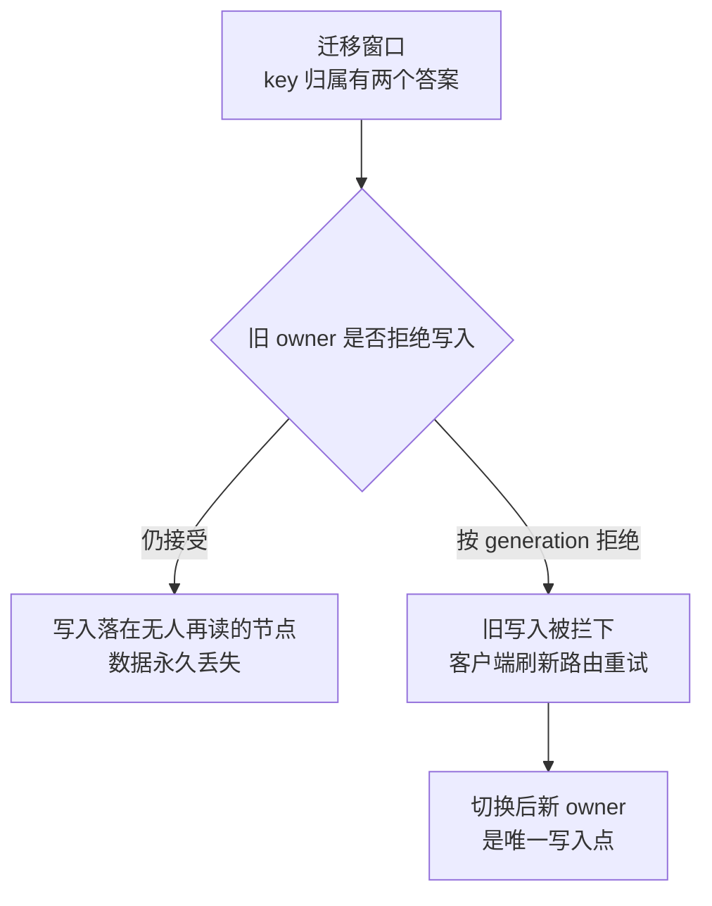

# 复制分片与再平衡改变数据归属

复制（replication）和分片（sharding）都解决"单节点不够用"，但方式相反：**复制把同一份数据放多个节点，分片把不同数据放不同节点。**

它们共同改变了两件事：**同一条数据"在哪"，以及"能不能看到最新版"。** 这两件事一旦变成动态的，就是分布式系统里大部分一致性问题的来源——读到旧值、写了丢失、扩容期间时有时无，都出自这里。

这一页讲清楚：复制的同步/异步权衡与 Quorum 读写、分片的三种路由策略、以及**再平衡为什么是最容易出事的时刻**（数据归属在迁移期间有两个答案），并给出迁移状态机和上线前必须做的破坏性测试。

| | 做法 | 解决 |
| --- | --- | --- |
| **复制** | 同一份数据放多个节点 | 读吞吐、可用性、容错 |
| **分片** | 不同数据放不同节点 | 容量、写吞吐 |

## 背景（要解决的问题）：扩容后，用户看到的数据"时有无"的机制

一个用户服务，从 2 个分片扩到 4 个。扩容后收到投诉：

- 有的用户**刷新几次，资料时有时无**
- 有的用户**改了昵称，一半请求读到旧的**
- 日志里出现`stale routing`警告，但没人当回事

排查发现三个问题同时存在：

| 现象 | 真因 |
| --- | --- |
| 资料时有时无 | **旧路由**：客户端缓存的分片表没更新，还在查旧节点 |
| 一半请求读到旧值 | **迁移未完成就切换了路由**，部分数据还在源节点 |
| 改了昵称没生效 | **请求被发到了旧 owner**，而旧 owner 已经不持有这份数据了 |

**根因：扩容期间，"这条数据在哪个节点"这个问题有两个答案。** 处理不好就会出现丢失、重复、读到旧值。

## 从 0 开始：复制

### 为什么需要

```
单节点：
  - 挂了就全不可用
  - 读吞吐有上限
  - 数据丢了就没了

三个副本：
  - 挂一个还有两个
  - 读可以分散
  - 数据有多份
```

### 同步 vs 异步（核心权衡）

**同步复制**：

```
写请求 → 主节点 → 等所有（或多数）副本确认 → 返回成功
```

**异步复制**：

```
写请求 → 主节点写入 → 立即返回成功 → 后台同步给副本
```

| | 同步 | 异步 |
| --- | --- | --- |
| 数据安全性 | 高（确认了才返回） | 低（主节点挂了可能丢） |
| 写入延迟 | 高（要等副本） | 低 |
| 可用性 | 副本挂了就写不了 | 副本挂了照样写 |

**生产常见配置**：

- **MySQL 半同步**：至少一个从库确认才返回（折中）
- **Kafka `acks=all`**：所有 ISR 副本确认
- **多数派（Quorum）**：N 个副本中 W 个确认（如 3 副本中 2 个）

**Quorum 读写**：

```
N = 副本数，W = 写需要确认数，R = 读需要查询数

保证读到最新：W + R > N
例：N=3, W=2, R=2  → 2+2 > 3 ✓（读写副本必有交集）
```

### 复制带来的问题

| 问题 | 说明 |
| --- | --- |
| **复制延迟** | 异步复制下从库落后（几毫秒到几秒）→ 读到旧值 |
| **主节点故障** | 要选新主，期间不可写；且可能丢未同步的数据 |
| **脑裂** | 网络分区导致两个节点都认为自己是主 → **数据冲突** |
| **冲突解决** | 多主写入时同一条数据被改两次 → 需要版本/时间戳/业务规则解决 |

**脑裂是最危险的**：两个主都接受写入，恢复后发现数据冲突。防护手段是 **fencing token**（见 [[工程知识/后端系统：在并发、失败与变化中维持服务/分布式可靠性/租约必须配合FencingToken阻止过期持有者]]）。

## 从 0 开始：分片

### 分片键决定一切

```
分片路由：shard_id = hash(shard_key) % shard_count
```

**分片键的选择决定了**：

- 数据是否分布均匀（避免热点）
- 查询是否能路由到单个分片（避免跨片）
- 后续扩容的难度

详见 [[工程知识/数据系统：在并发与故障中保存事实/事务与存储/分库分表只在单库成为瓶颈后使用]]。

### 三种分片策略

| 策略 | 做法 | 扩容时 |
| --- | --- | --- |
| **取模** | `hash(key) % N` | ❌ N 变了几乎全部数据要迁移 |
| **一致性哈希** | 哈希环，节点负责一段范围 | ✅ 只迁移 1/N 的数据 |
| **范围分片** | 按 key 范围划分（如 A-M, N-Z） | 中等，但要处理范围热点 |

**一致性哈希的原理**：

- 把节点和数据都映射到一个哈希环上
- 数据顺时针找到的第一个节点就是它的归属
- 新增节点时，只影响环上它和前一个节点之间的数据，迁移量 = 总数据 / 节点数

**实践改进**：**虚拟节点**（每个物理节点对应环上多个点），让分布更均匀。

## 再平衡：最容易出事的时刻

### 为什么危险

再平衡（resharding / rebalance）期间：

- 数据正在从 A 搬到 B
- 有的 key 已经在 B
- 有的还在 A
- 客户端的路由表可能是旧的
- 网络可能有延迟

此时"这个 key 在哪"有两个答案

旧 owner 与新 owner 同时可写的窗口里，两种收场分岔如下图：



### 正确的迁移状态机

```
1. 准备：目标节点 B 就绪，但还不接收流量
2. 复制：B 开始从 A 同步数据（A 继续服务）
3. 追赶：B 追上 A 的增量（此时 A 的写入持续同步给 B）
4. 校验：比对 A 和 B 的数据（checksum / 行数）
5. 切换：路由切到 B，A 对这批 key **拒绝写入**
6. 清理：确认无流量后，A 删除这批数据
```

**关键是第 5 步**：切换后旧 owner 必须**拒绝**这批 key 的写入。如果旧 owner 还接受写入，那些写入会**永久丢失**（因为没人再从它读）。

**实现手段：fencing token / generation 号**

```go
func (n *Node) Write(key string, val []byte, gen int64) error {
    if gen < n.currentGen(key) {
        return ErrStaleRouter    // 路由版本过旧，拒绝
    }
    ...
}
```

### 路由版本化

**客户端/代理缓存的路由表必须有版本号**：

- 请求带上：routing_version = 42
- 节点发现：当前是 43
- 返回 ErrStaleRouting + 新路由表
- 客户端刷新后重试

**没有版本化的后果**：旧路由把请求发到错误的节点，而那个节点可能已经不持有数据了（数据丢失）。

### 迁移期的读写策略

| 阶段 | 读 | 写 |
| --- | --- | --- |
| 复制中 | 从 A 读 | 写 A（同步给 B） |
| 校验完成 | 从 A 读 | 写 A（同步给 B） |
| 切换瞬间 | **短暂不可用**或双读 | **短暂拒绝** |
| 切换后 | 从 B 读 | 写 B（A 拒绝） |

**切换瞬间的处理**：

- 最简单：**短暂拒绝**（毫秒到秒级），客户端重试
- 更平滑：**双写 + 双读**，确认一致后停掉一边

## 生产怎么用

### 容量规划

```
需要容量 = 数据总量 × (1 + 增长预期) × 副本数
分片数 = 需要容量 / 单分片建议容量

单分片建议：
  - 关系型数据库：2-5 TB 以内
  - Kafka 分区：考虑吞吐，通常每分区 < 10 MB/s
```

**留余量**：不要按当前数据量算，要算 1-2 年后。

### 避免热点的手段

| 手段 | 做法 |
| --- | --- |
| **加盐** | 在 key 前加随机前缀打散（但查询时要查所有分片） |
| **复合键** | `shard_key = hash(user_id) + 时间戳` |
| **单独处理大客户** | 超大租户单独一个分片 |
| **读热点用副本** | 加副本分散读（**不能解决写热点**） |

**写热点只能靠分开 key**，读热点可以靠加副本。

### 监控必须覆盖

| 指标 | 异常含义 |
| --- | --- |
| 各分片数据量 | 倾斜（某个分片明显大） |
| 各分片 QPS | 热点 |
| 复制延迟 | 从库落后（影响读到新值） |
| 迁移进度 | 卡住了 |
| 路由版本分布 | 有客户端还在用旧路由 |
| 跨片查询比例 | 分片键选得不好 |

## 验证：怎么测

**再平衡的破坏性测试**（上线前必做）：

```
1. 造一个热点分片，数据量 100GB
2. 开始迁移到新节点
3. 在以下时刻分别杀进程 / 断网：
   a. 复制进行中（50%）
   b. 校验刚完成
   c. 切换瞬间
   d. 清理阶段
4. 每次检查：
   - 有没有数据丢失？
   - 有没有重复？
   - 读到的版本对不对？
   - 旧 owner 是否拒绝了写入？
   - 回滚要多久？
```

**没有做过这些测试，"支持在线扩容"这句话是不可信的。**

## 常见错误

**错误 1：迁移未完成就切路由**

读到空/旧值。**必须有校验阶段 + 校验通过才切换。**

**错误 2：切换后旧 owner 仍接受写入**

**这些写入会永久丢失。** 必须用 generation/fencing 拒绝。

**错误 3：路由表没有版本**

客户端用旧路由 → 请求发到错误节点。**必须版本化 + 主动失效。**

**错误 4：以为加副本能解决写热点**

副本只能分散读。**写热点必须分开 key。**

**错误 5：取模分片**

扩容时几乎全部数据要迁移。**用一致性哈希或预分片。**

**错误 6：不看复制延迟就做读写分离**

延迟 5 秒时读从库 → 用户刚提交的数据看不到。**要监控延迟并做写后读一致性。**

**错误 7：不测故障就上再平衡**

出问题时不知道会不会丢数据。**必须做破坏性测试。**

关系：[[工程知识/后端系统：在并发、失败与变化中维持服务/分布式可靠性/一致性模型与共识解决不同问题]] · [[工程知识/后端系统：在并发、失败与变化中维持服务/分布式可靠性/租约必须配合FencingToken阻止过期持有者]] · [[工程知识/数据系统：在并发与故障中保存事实/事务与存储/分库分表只在单库成为瓶颈后使用]]

## 边界

再平衡不改变键到值的业务语义：迁移只搬归属，业务读写的键路由在迁移窗口内可能出现新旧视图短暂不一致，读旧写新要按快照与租约纪律处理——再平衡是容量操作，不承担正确性修复，正确性问题走数据修复路径。

