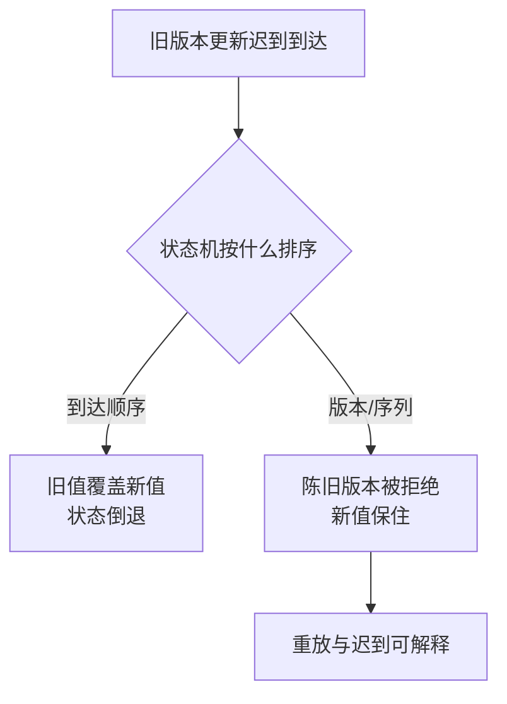

# 时间顺序与因果必须显式建模

它解决的是把到达顺序误当发生顺序，进而覆盖新状态、错误聚合或重复执行的问题。做法是为业务事实携带事件时间、版本、序列或逻辑时钟，并让状态机拒绝陈旧更新；效果是重放、迟到和跨节点比较可解释，代价是元数据、存储和冲突处理增加。通过时钟回拨、乱序、重复和重放测试验证不变量。

分布式节点的墙上时钟会漂移、跳变和不同步；消息到达顺序不等于事件发生顺序，也不等于因果顺序。业务若依赖“最新”“先发生”“只处理一次”，必须携带版本、序列、逻辑时钟或状态条件。

## 三种时间

- **事件时间**：事实发生的时间，适合业务窗口和审计。
- **处理时间**：系统观察到的时间，适合调度和资源计量。
- **可见时间**：数据对某个读者可见的时间，受复制、索引和缓存影响。

Lamport/向量时钟可以表达部分因果关系，但不能替代真实时间或全局排序。数据库自增 ID、Kafka offset、UUID 和时间戳表达的是不同范围的顺序，不能混用。

## 状态更新规则

先定义哪些事件可以并发合并，哪些必须拒绝陈旧版本，再选择时间戳、单调序列、CAS 或逻辑时钟。墙上时钟适合展示和窗口统计，却不能单独决定“最后写入者”；offset 只能表达某个分区的消费位置，也不能证明跨分区因果。

同一条迟到旧更新，排序规则不同结局相反：



最小实验：让两台时钟相差数秒，交错发送同一实体的更新，并重复/延迟其中一条；分别用到达时间、事件版本和因果标记排序。检查最终状态、重放结果和审计解释是否一致，确认排序规则确实覆盖业务不变量。

## 一天不总是 24 小时

墙上时钟的非线性不是理论风险，它每年在启用夏令时的时区里发生两次。以柏林为例（2024 年，UTC 锚点计算）：

| 日期 | 实际秒数 | 小时 | 按 86400 折算 |
| --- | --- | --- | --- |
| 2024-03-30（普通日） | 86400 | 24 | 1.0000 天 |
| 2024-03-31（春季前拨） | 82800 | 23 | 0.9583 天 |
| 2024-10-27（秋季拨回） | 90000 | 25 | 1.0417 天 |

任何按"总秒数 ÷ 86400"预算容量、再按步长逐个填充的代码，都会在前拨日撞上这个缺口。下面这段能直接复现越界：

```python
import datetime, zoneinfo

tz = zoneinfo.ZoneInfo("Europe/Berlin")

def utc(dt):
    return dt.astimezone(datetime.timezone.utc)

start = datetime.datetime(2024, 3, 30, 0, 0, tzinfo=tz)
end = datetime.datetime(2024, 4, 2, 0, 0, tzinfo=tz)

total = (utc(end) - utc(start)).total_seconds()   # 255600.0
budget = int(total // 86400)                       # 预算 2 个元素

n, cur = 0, start
while cur < end:                                   # 逐日推进
    n += 1
    cur = datetime.datetime.combine(
        (cur + datetime.timedelta(days=1)).date(),
        datetime.time(0, 0), tzinfo=tz)

print(budget, n)   # 2 3 —— 预算 2 个，实际 3 个，越界
```

预算 2 个，实际推进 3 个。秋季拨回方向相反（实际少于预算），少写无害、多写致命——这个不对称解释了为什么此类缺陷只在春季前拨暴露。

直接对两个带 `tzinfo` 的本地时间做减法会得到 86400 秒的"正确"答案：`(b - a)` 在同一 tzinfo 下抵消了偏移，转换到 UTC 锚点后才显现真实的 82800 秒。**对本地时间做算术之前先归一化**，这句话的具体含义就在这里。

## 失效长什么样

[[工程知识/缺陷分析：从个案到体系/稳定性/案例二十二：时间也是输入——夏令时让序列生成越界]] 是这套规则被违反的直接现场：Spark 的 `sequence()` 按总秒数预算数组容量、按步长逐个填充，在春季前拨日多写出一个元素，数组越界、查询失败。缺陷不在时间字段的解析上，而在**把时间当算术常数**——"一天 24 小时"这个前提在切换日失效。

同类断裂出现在按天聚合的窗口边界、定时任务的"每天 2 点"、证书与租期的到期计算上。它们的共同点是：时间出现在计算的**输入**位置，却没被当作需要边界检查的输入。

[[工程知识/缺陷分析：从个案到体系/正确性/案例十：类型说谎时——静默删数据的 TTL 与算错的比较]] 从另一个方向说明同一件事：TTL 与比较运算在类型与语义不匹配时静默删数据，被破坏的对象是"谁算旧"的判定规则。排序规则一旦选错，删除与保留会整体反转。

## 边界

这套做法的前提是**事件可以携带可信的事件时间或版本**。在以下情况需要换手段：写入方时钟不可信且无法校时（改用服务端单调序列而非客户端时间戳）；只有单副本且无重放需求（墙上时钟足够，不必引入向量时钟）；以及因果关系本身无法由数据表达（此时应由业务规则显式声明冲突处理，见 [[工程知识/后端系统：在并发、失败与变化中维持服务/分布式可靠性/一致性模型与共识解决不同问题]]）。

逻辑时钟表达部分因果，不能推出全局先后。它不能替代真实时间做窗口统计，也不能替代全局排序做"最后写入者胜"。

## 验证

验证的锚点：因果结论要与时钟注入对账——预写时钟回拨后状态机应拒绝旧版本、窗口修正正确，实测旧值覆盖了新值，与预期对不上。

测试时钟回拨、时区/DST、NTP 不可用、消息乱序/重复、跨分区事件和重放；检查状态机拒绝旧版本、窗口正确修正、缓存不过期覆盖新值、RAG freshness 和审计时间可解释。

关系：[[工程知识/缺陷分析：从个案到体系/稳定性/案例二十二：时间也是输入——夏令时让序列生成越界]] · [[工程知识/缺陷分析：从个案到体系/正确性/案例十：类型说谎时——静默删数据的 TTL 与算错的比较]]

- [[工程知识/后端系统：在并发、失败与变化中维持服务/分布式可靠性/一致性模型与共识解决不同问题]] —— 顺序之上的一致性归属
- [[工程知识/后端系统：在并发、失败与变化中维持服务/分布式可靠性/消息投递与业务提交需要显式的一致性边界]] —— 顺序标记与提交时点的关系
- [[工程知识/后端系统：在并发、失败与变化中维持服务/分布式可靠性/租约必须配合FencingToken阻止过期持有者]] —— 时间驱动的持有权失效
- [[工程知识/数据系统：在并发与故障中保存事实/数据管道与流处理/CDC把数据库变化传播为可重放事实]] —— 事件时间在生产中的体现
- [[工程知识/软件构建：让变化可以理解、验证与交付/算法与数据结构/算法复杂度连接规模与资源成本]] —— 预算与实际用量失配的通用形态
- [[工程知识/后端系统：在并发、失败与变化中维持服务/分布式可靠性/电源与时钟：UTC与单调钟的工程含义.md]] —— 时间戳不等于因果的完整论证

## 机制与本质

时间顺序与因果的机制层：墙上时钟会漂移、跳变、互相不同步，消息的到达顺序由网络路径决定，两者都无法表达事实发生的先后。业务状态依赖"最新"或"先发生"时，判定要建立在一个单调、可比较的顺序标记上；事件时间、版本号与逻辑时钟各自覆盖不同范围的顺序，选定哪一种决定了重放、迟到与跨节点比较能不能被解释清楚。

## 要解决的问题

把消息到达的顺序当成事件发生的顺序，导致新状态被旧状态覆盖、聚合结果错误、同一条消息被重复执行。本篇回答：业务事实需要携带哪些时间与顺序信息、逻辑时钟与序列号各自解决什么、状态机怎样拒绝过期更新，以及重放与迟到消息怎样处理。

