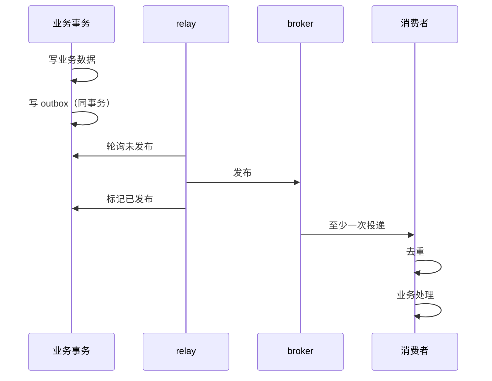
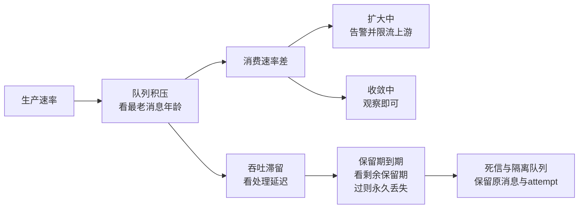

# 消息投递与业务提交需要显式的一致性边界

**写数据库**和**发消息**是两个独立的系统，无法放在同一个事务里。但这个"缝隙"会导致：库里有了、消息没发（下游永远不知道），或者消息发了、库里回滚了（下游看到了不存在的事实）。

这一页讲怎么处理这个缝隙：Transactional Outbox 模式、投递语义的真实边界、以及为什么"恰好一次"在跨系统时是个伪承诺。

## 背景：那个"已付款但没发货"的订单

一个电商系统，支付成功后发消息通知仓库发货。

**代码**：

```go
func Pay(orderID string) error {
    if err := db.Exec("UPDATE orders SET status='paid' WHERE id=?", orderID); err != nil {
        return err
    }
    return mq.Publish("order.paid", orderID)     // ← 这里
}
```

看起来没问题。**但每个月都会出现几笔"已付款、未发货"的订单**，用户投诉后人工补发。

排查发现三种失败：

| 顺序 | 失败点 | 结果 |
| --- | --- | --- |
| 先写库，再发消息 | 消息发送失败/超时 | **库里有，消息没发** → 永远不发货 |
| 先发消息，再写库 | 写库失败回滚 | **消息发了，库里没有** → 仓库发了不存在的订单 |
| 两个都"成功" | 进程在中间崩溃 | 状态不确定 |

**根本原因**：数据库事务和消息队列是**两个独立的系统**，没有跨系统的事务能保证它们原子。

**分布式系统的基本事实是：跨系统的两个动作之间必然存在中间态。** 它要靠在应用侧引入模式来解决，重试解决不了中间态本身。

## 从 0 开始：为什么不能直接发

```
数据库提交：本地事务，原子
消息发送：  网络调用，可能超时（不知道成功没有）

两个动作之间：进程可能崩、网络可能断、消息系统可能不可用
```

**"先写库再发消息"和"先发消息再写库"都会出问题**，只是出的问题不同：

| 顺序 | 失败后果 | 严重性 |
| --- | --- | --- |
| 先库后消息 | 消息丢失 → 下游不知道 | 高（业务没触发） |
| 先消息后库 | 幽灵消息 → 下游处理了不存在的数据 | **更高**（可能造成资损） |

**结论：都不能用。** 正确做法是 **Transactional Outbox**。

## 方案：Transactional Outbox

### 核心思路

**把"要发的消息"先写进数据库的 outbox 表，和业务数据在同一个事务里。**

```
BEGIN;
  UPDATE orders SET status='paid' WHERE id=?;     -- 业务数据
  INSERT INTO outbox (event_id, topic, payload)
VALUES (?, 'order.paid', ?);                   -- 消息先写入数据库
COMMIT;
```

这样：**业务数据提交成功 ⟺ outbox 记录存在**。原子性由数据库保证。

然后由一个**独立的 relay 进程**读取 outbox 并发布：

```
relay: SELECT * FROM outbox WHERE published_at IS NULL
         → 发到 broker
         → UPDATE outbox SET published_at = now()
```

### 完整链路



### 关键实现细节

**1. event_id 必须由生产者生成并稳定**

```sql
CREATE TABLE outbox (
    id           BIGSERIAL PRIMARY KEY,
    event_id     UUID NOT NULL UNIQUE,      -- 幂等键，消费者用它去重
    aggregate_id VARCHAR(64) NOT NULL,      -- 订单 ID，用于分区
    topic        VARCHAR(128) NOT NULL,
    payload      JSONB NOT NULL,
    schema_ver   INT NOT NULL,
    created_at   TIMESTAMP NOT NULL DEFAULT now(),
    published_at TIMESTAMP                  -- NULL = 未发布
);
CREATE INDEX idx_outbox_unpublished ON outbox (id) WHERE published_at IS NULL;
```

**2. relay 的两种实现**

| 方式 | 做法 | 优点 | 缺点 |
| --- | --- | --- | --- |
| **轮询** | 定时 `SELECT ... WHERE published_at IS NULL` | 简单、可靠 | 有延迟（轮询间隔）；给数据库压力 |
| **CDC（推荐）** | 读 binlog（Debezium） | 延迟低、不查表 | 需要额外组件 |

**小项目用轮询**（每秒一次足够），**大流量用 CDC**。

**3. 不要直接序列化数据库行当事件**

```go
// 差：泄漏内部结构，schema 一改就崩
payload, _ := json.Marshal(orderRow)

// 好：显式的事件约定
type OrderPaid struct {
    EventID    string    `json:"event_id"`
    OrderID    string    `json:"order_id"`
    Amount     int64     `json:"amount_cents"`
    PaidAt     time.Time `json:"paid_at"`
    SchemaVer  int       `json:"schema_ver"`
}
```

**原因**：数据库行会随重构变化，事件约定发布之后要长期兼容。**两者要解耦。**

## 投递语义：真实边界

### 三种语义的含义

| 语义 | 保证 | 实现 | 消费者要做什么 |
| --- | --- | --- | --- |
| **最多一次** | 可能丢，绝不重复 | 先确认 offset 再处理 | 要能接受丢失 |
| **至少一次** | 可能重复，绝不丢 | 先处理再确认 | **必须幂等** |
| **恰好一次** | 不丢不重 | 事务或幂等+去重 | 只在特定边界内成立 |

### "恰好一次"的真相

**Kafka 事务能保证什么**：Kafka 内部的原子性（写多个 topic、提交 offset 原子）。

**保证不了什么**：你的业务数据库。

```
Kafka 事务：
  处理业务（写 MySQL）+ 提交 Kafka offset  → Kafka 管不到 MySQL

所以跨系统时，"恰好一次"实际是：
  至少一次（传输层）+ 幂等（业务层）= 效果上的恰好一次
```

**结论**：**不要指望 broker 的"恰好一次"能让你不用写幂等逻辑。** 幂等必须在消费者侧实现。

### 消费者侧的幂等

```go
func Handle(msg Message) error {
    return db.Transaction(func(tx *Tx) error {
        // 1. 去重检查（唯一约束兜底）
        if exists, _ := tx.InboxExists(msg.EventID); exists {
            return nil     // 已处理，直接确认
        }
        // 2. 业务处理
        if err := doBusiness(tx, msg); err != nil {
            return err
        }
        // 3. 记录已处理（和业务处理同事务）
        return tx.InboxInsert(msg.EventID)
    })
}
```

**关键**：业务处理和去重记录**必须在同一个事务**。否则会出现"业务做了但没记录"或反过来。

## 事件与命令：不要混淆

| | 事件（Event） | 命令（Command） |
| --- | --- | --- |
| 语义 | **已经发生的事实** | **请求对方做某事** |
| 命名 | 过去式：`OrderPaid` | 祈使句：`ShipOrder` |
| 可被拒绝 | 不能（已经发生了） | 可以 |
| 消费者数量 | 任意多个 | 通常一个 |

**常见错误**：

```
❌ 把命令伪装成事件："订单已创建，请发货"
   → 模糊了所有权：谁负责发货？如果仓库服务拒绝了怎么办？

❌ 把数据库快照当事件发：每次变更后发整个订单对象
   → 无法审计历史：不知道到底变了什么
```

**正确做法**：

```
✅ 事件：OrderPaid { order_id, amount, paid_at }
✅ 命令：ShipOrder { order_id, address, deadline }（发给特定的接收者）
```

## 积压、背压与重放

### 积压要看什么

积压要看下面几项，队列长度只作参考：

| 指标 | 为什么 |
| --- | --- |
| **最老消息的年龄** | 真正反映延迟（长度可能是正常的） |
| 生产/消费速率差 | 在扩大还是在收敛 |
| 分区倾斜 | 是不是某个分区卡住了 |
| 处理延迟 | 消费者慢了还是 broker 慢了 |
| 失败/重试比例 | 有没有毒丸消息 |
| 剩余保留期 | **会不会因为积压过久导致消息过期被删** |

**最后一条最危险**：积压超过保留期 → 老消息被删除 → **永久丢失**。

积压从产生到永久丢失是一条链，各环节要看的指标不同：



### 重放的注意事项

重放历史消息前必须确认：

- 消费者代码版本是否还兼容旧事件
- schema 是否双向兼容
- **去重记录是否还在**（如果清理了，重放会导致重复处理）
- 外部副作用（重放会真的再调一次外部 API）

**不要把死信批量塞回主队列** —— 可能重复触发已完成的操作，或再次压垮下游。

### 顺序与死信

消息系统通常只保证分区或队列内的局部顺序。需要同一订单有序时，把稳定业务键映射到同一分区，并让消费者显式处理版本；全局顺序会牺牲并行度，通常不值得。扩分区、重平衡和消费者重启都要验证顺序假设。

失败消息不能无限重试。超过次数或总时长后进入死信或隔离队列，保留原消息、失败类别、attempt、消费者版本和 trace；修复后通过受控重放恢复。死信队列是待处理失败，不是成功终点，必须有告警、owner 和清理策略。

验证的锚点：投递语义要与业务影响对账——at-least-once 的重复消息、at-most-once 的丢失消息各自跑一遍故障注入（消费中途崩、确认后崩两种时序），实测的重复率与丢失率与业务容忍度对账，对不上的场景补幂等或换事务消息。

一致性边界的机制与本质：本地事务的原子性在跨服务时失效——两条腿（库提交与消息发送）任何一条独立失败都产生中间态；
本质问题是把隐式的应当一起成功改成显式的边界声明：事务消息（先本地事务再投递）、本地消息表（同库同事务写消息）、或对账补偿（允许中间态但定时收敛），三选一必须显式写进设计。


## 验证：怎么测

**在每个间隙注入崩溃**（这是必须的）：

```
1. 业务事务提交前崩
2. 业务事务提交后、outbox 发布前崩
3. outbox 发布中崩（消息可能已发但没标记）
4. broker 已确认、消费者处理前崩
5. 消费者处理完、确认前崩
6. 消费者确认后、下游处理前崩
```

**每次检查**：最终状态是否正确？有没有丢失？有没有重复？

**还要测**：

- 重复投递同一事件 → 最终状态不变
- 乱序投递（旧事件晚到）→ 被版本/状态机拒绝
- 新旧 schema 双向兼容 → 部署顺序安全
- 制造积压 → 验证告警和恢复时间

## 常见错误

**错误 1：先写库再发消息（或反过来）**

双写问题。**必须用 outbox。**

**错误 2：以为 broker 的"恰好一次"能跨系统**

管不到你的数据库。**消费者必须幂等。**

**错误 3：直接序列化数据库行当事件**

内部结构泄漏，schema 演进失控。**定义显式事件约定。**

**错误 4：去重和业务处理不在同一事务**

并发下会重复处理。**必须同事务 + 唯一约束。**

**错误 5：只看队列长度判积压**

**要看最老消息年龄**和剩余保留期。

**错误 6：死信批量塞回主队列**

重复触发副作用或再次压垮下游。**逐个分析后再决定。**

**错误 7：清理去重记录后重放**

会导致重复处理。**重放前确认去重记录还在。**

相关：[[工程知识/后端系统：在并发、失败与变化中维持服务/分布式可靠性/消息投递与业务提交需要显式的一致性边界]] · [[工程知识/后端系统：在并发、失败与变化中维持服务/分布式可靠性/一致性模型与共识解决不同问题]] · [[工程知识/数据系统：在并发与故障中保存事实/事务与存储/事务边界应覆盖完整业务用例]]

## 效果与代价

把消息写入与业务提交放进同一个事务，换来的是业务数据与待发事件在同一个提交点上同时存在或同时不存在，投递侧的失败只会表现为延迟而不会表现为丢失。代价是多出一张 outbox 表与一个中继进程，事件约定需要显式定义并长期兼容，消费者侧必须实现去重，积压还会带来保留期内的丢失风险。

## 要解决的问题

写数据库与发消息分属两个系统，无法放进同一个事务，于是出现库里已有而消息未发出，或者消息已发出而数据库回滚，两侧就此长期不一致。本篇回答：这类不一致以哪些形态出现、可用哪些手段让两侧的提交结果一致、每一种手段留下了什么中间状态，以及出现重复投递时业务侧怎样处理。

