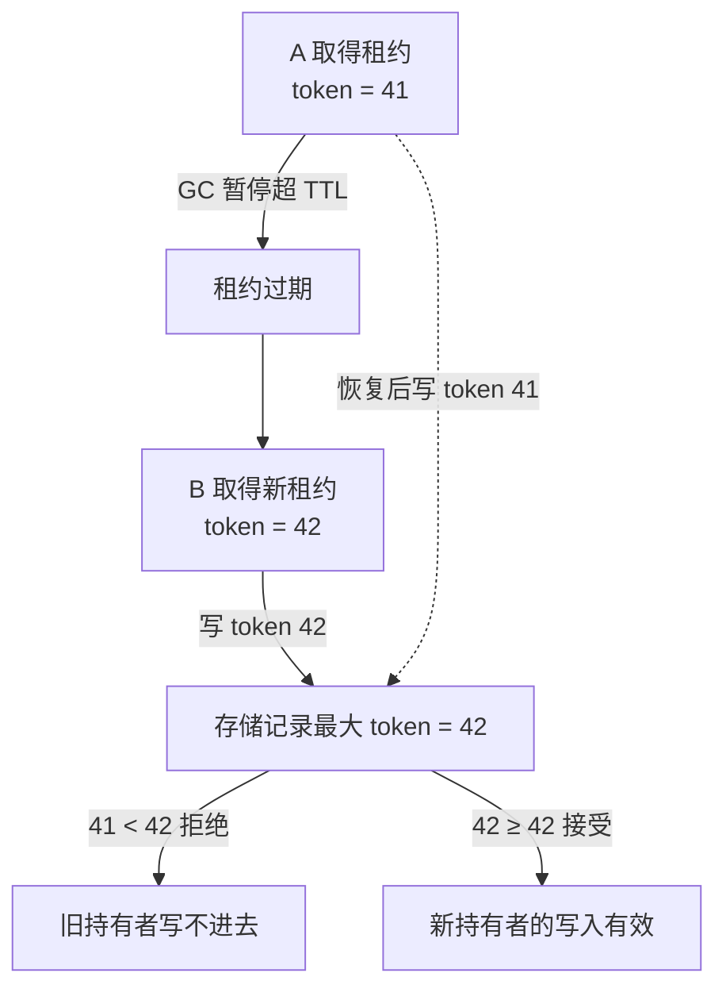

# 租约必须配合 Fencing Token 阻止过期持有者

它解决的是租约过期后旧持有者因网络暂停而继续写入的陈旧执行问题。核心做法是协调器为每次取得租约发放单调 token，并让下游拒绝更小 token；收益是把“谁现在持有”变成下游可验证的事实，代价是所有写入点都必须传递并检查 token。用暂停、时钟漂移、续租失败和主备切换验证旧 owner 永远不能覆盖新 owner。

锁只解决“此刻谁可以进入临界区”，不自动解决资源归属、进程终止、跨主机一致性和陈旧持有者问题。

## 先区分机制

| 机制 | 作用域/语义 | 适用 | 边界 |
| --- | --- | --- | --- |
| `flock` | 通常绑定打开文件描述与文件；共享/排他、阻塞/非阻塞 | 单机进程协调、脚本互斥 | 网络文件系统语义可能不同；advisory lock 要求参与者合作 |
| POSIX record lock (`fcntl`) | 可对字节范围加锁，语义与进程/文件关闭有关 | 需要区间锁的单机程序 | 继承与关闭语义容易误用；不等同于分布式锁 |
| 原子创建/rename | 依赖文件系统原子操作 | 发布文件、简单 leader 标记 | 无 TTL；崩溃后需清理策略 |
| 数据库条件更新 | 用事务和版本号竞争状态 | 业务任务、跨进程协调 | 依赖数据库可用性和隔离级别 |
| 分布式租约 | owner + TTL + renew + fencing token | 跨主机长期任务 | 需处理时钟、网络分区和陈旧持有者 |

## 正确的锁使用

先判断业务是否真的需要分布式锁。创建唯一业务对象优先用数据库唯一约束，状态更新优先用版本号/CAS，任务分片优先用稳定 owner；这些机制直接保护业务不变量，通常比“先拿锁再写”更容易验证。多个进程必须独占一个无法原子更新的外部资源时，才进入租约设计。

最常见的错误是把“锁还在”当作“旧持有者已经停止”。实例 A 暂停超过 TTL 后，实例 B 会取得新租约；A 恢复时仍可能继续写。因此续租只能降低过期概率，不能阻止旧 owner，最终必须由资源侧检查单调递增的 fencing token。

```python
with open(lock_path, "a+") as handle:
    fcntl.flock(handle.fileno(), fcntl.LOCK_EX)
    # 临界区：短、可恢复，不调用不受控的长网络操作
```

- 锁对象的生命周期必须覆盖临界区；关闭 fd 通常会释放相应锁。
- 非阻塞获取失败是正常状态，调用者需选择跳过、排队、退避或返回冲突。
- 把 owner、task generation、revision 写入受保护元数据，便于诊断；不要把文件存在本身当成锁仍有效。
- 锁内操作尽量短；长任务使用租约，并让外部协调者续租和检测过期。

## 为什么任务系统需要 fencing token

仅有 TTL 的租约可能在网络暂停后出现旧持有者“复活”：新任务已经取得租约，旧任务仍向下游写入。每次成功取得租约生成单调递增的 fencing token，下游拒绝小于当前 token 的写入，才能阻止陈旧执行者。



图的关键在存储那一格：它记下见过的最大 token，之后每次写入都拿 token 跟它比——41 小于 42，A 恢复后的写入被拒之门外。租约本身只能让「B 大概率拿到新租约」，拦不住「A 复活后接着写」；把「谁新谁旧」变成下游可验证的事实，靠的是单调 token 在每个写入点的检查。这也是为什么所有写入点都必须传递并检查 token：漏掉一个点，陈旧执行就从那里钻进去。

```text
lease owner=A token=41  --暂停/过期-->
lease owner=B token=42  -> 下游接受 token=42
A 恢复并写 token=41    -> 下游拒绝
```

## 清理不是拿到锁就删除

删除 worktree、缓存或运行目录前检查资源 owner、generation、活跃租约、进程树和引用计数。锁只能保护检查与状态更新的原子区间；真正删除还要绑定明确资源标识，不能使用宽泛路径或未解析的 glob。

关联：[[工程知识/AI 系统工程：从模型能力到生产能力/安全与治理/执行证据必须独立于AI结论]]、[[工程知识/后端系统：在并发、失败与变化中维持服务/任务与并发/任务生命周期必须覆盖进程、日志、超时与清理]]、[[工程知识/后端系统：在并发、失败与变化中维持服务/分布式可靠性/部分失败决定分布式系统的设计]]。
- [[工程知识/数据系统：在并发与故障中保存事实/可靠性与运维/RAID等级与数据可靠性：镜像与纠删的数学.md]] —— 分布式冗余的脑裂防护是另一维度的可靠性
- [[工程知识/数据系统：在并发与故障中保存事实/可靠性与运维/复制的三种模式：主从、多主与无主的失败形态.md]] —— 切换窗口的脑裂防御
- [[工程知识/数据系统：在并发与故障中保存事实/可靠性与运维/分区再平衡的三种策略：固定取模与一致性哈希.md]] —— 归属切换瞬间的脑裂防御

## 验证

1. 暂停旧持有者：持租约的实例 A 用 `SIGSTOP` 暂停超过 TTL，让 B 取得新租约并写入，再恢复 A 让它继续写。预期下游拒绝 A 携带的较小 token，事实源只保留 B 的写入。
2. 时钟漂移：调整协调器与被测节点的时钟偏差，观察租约过期判定与续租是否仍按单调时间推进，避免出现两个实例同时认为自己持有租约。
3. 续租失败：切断 A 与协调器之间的连接但保持 A 与下游可通信，预期续租失败后 A 主动停止写入，而不是凭本地判断继续。
4. 主备切换：执行一次协调器故障转移，核对新协调器发放的 token 严格大于旧值，切换窗口内的写入被统一按 token 大小裁决。
5. 断言锚点：每个写入点都传递并检查 token，token 生成单调，续租失败有停止写入路径，暂停与分区场景下旧持有者从未覆盖新持有者。

## 要解决的问题

持有租约的一方因进程暂停或网络延迟暂时失去联系，重启之后旧持有者仍在向存储写入，新持有者的状态被覆盖。本篇回答：单调递增的令牌怎样让下游识别陈旧持有者、令牌在哪些位置必须传递与检查、续租失败之后旧持有者要做什么，以及主备切换期间哪些写入会被拒绝。

