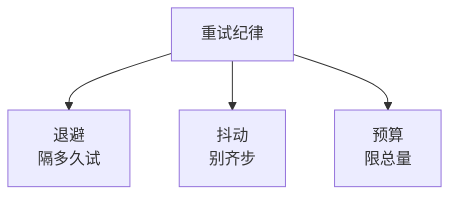

# 重试的正确姿势：退避、抖动与重试预算

## 要解决的问题

重试要解决的问题是对抗瞬时故障：网络抖一下、依赖闪断一下、GC 停顿半秒，这些故障不值得让请求失败，重发一次就能过。但重试是双刃剑：系统性故障（依赖过载）时，重试等于给正在崩溃的系统加倍施压。超时、重试与幂等共同定义调用语义（见 [[工程知识/后端系统：在并发、失败与变化中维持服务/分布式可靠性/超时、重试与幂等共同定义调用语义.md]]），本文把"重试"一角展开成可执行的纪律。

## 三件武器：退避、抖动、预算

**退避（backoff）**：连续失败后等待时间指数增长（1s、2s、4s），给依赖喘息窗口。固定间隔重试的问题：N 个客户端在整秒点齐步重发，故障恢复的瞬间又被打回去。

**抖动（jitter）**：退避时长加随机量（退避 × 0.5 ~ 1.5 之间取随机），打散客户端的重发时刻。AWS 构建者手册的经典结论：全同步重试会在恢复瞬间形成尖峰，加抖动后尖峰摊平成缓坡。没有抖动的退避只是把齐步走改成了慢速齐步走。

**重试预算（retry budget）**：限制重试流量占比（如重试不超过总请求的 10%）。实现方式有两种：客户端侧计数（每发 100 个请求最多 10 个是重试），或令牌桶统一分配。预算的本质是承认重试是特权流量——它比首次请求更有可能命中故障中的依赖，所以必须限量。

三件的关系：退避管"隔多久试"，抖动管"大家别一起试"，预算管"总共还能试几次"。只做退避不做抖动，齐步问题没解；只做退避抖动不做预算，系统性故障时重试风暴照样发生。

三件武器各管一件，缺一件的后果各不相同：



## 背景与代价

这套纪律的思想背景，是对"重试加剧故障"的承认。早期实践把重试当成免费的可靠性工具（失败就重发，多试几次总没错），直到若干大规模事故证明：雪崩的放大器往往就是客户端的重试逻辑。它替代的是"无脑重试三次"的默认配置——那个配置在依赖正常时无害，在依赖过载时是凶器。

最精巧的一笔是重试预算把重试从个体决策变成系统决策。每个客户端只看见自己的失败，觉得"我多试一次没什么"；预算让重试总量在系统层面可见、可限。代价是预算的实现复杂度：跨客户端的预算需要公共的计数载体（服务网格的 sidecar 是现成位置），应用内自行实现时预算只能约束自己进程内的重试。

## 可运行示例与案例回流：重试预算的账

```python
def call_with_retry(req):
    budget = RetryBudget(per_window=0.1)   # 全局：重试流量 ≤ 总请求 10%
    for attempt in range(3):
        try:
            resp = call(req, timeout=budget.remain() / (3 - attempt))
            return resp
        except RetryableError:
            if not budget.allow():        # 预算耗尽 → 直接失败，不再加重
                raise CircuitOpen
            backoff = min(2 ** attempt * 0.1, 2.0)   # 指数退避 0.1/0.2/0.4s
            sleep(backoff * random.uniform(0.8, 1.2))  # 抖动 ±20%
    raise FinalFailure
```

三要素的分工：退避管"间隔多久"，抖动管"大家一起退吗"，预算管"总共试多少"。缺预算的后果是下游过载时所有调用方同时重试，重试流量可达原始的 3 倍，过载被重试放大成雪崩，重试从止损手段变成故障放大器。

案例回流：无预算重试的实录——下游抖动 30 秒期间，上游三层各自重试 3 次（3 的三次方 = 27 倍放大），下游刚恢复就被重试洪峰再次打挂（重试风暴的二次过载），加了全局预算（重试流量超 10% 即熔断）后同场景恢复时间从 40 分钟缩到 3 分钟。无抖动的实录——定时任务整点批量失败后整点重试（退避基数相同），同步洪峰每分钟一次；加 ±20% 抖动后洪峰摊平。只重试幂等操作的纪律见 [[工程知识/后端系统：在并发、失败与变化中维持服务/任务与并发/幂等性的完整谱系：从操作语义到删除接口的天然陷阱.md]]——重试与幂等是一对约束，缺一个另一个就是事故。

## 边界

- **不是所有失败都该重试**。可重试的：超时、连接拒绝、503。不可重试的：400 参数错、401 鉴权错、业务规则拒绝——重试一万次结果不变，还浪费时间与配额。
- **重试必须配幂等**。非幂等操作重试会双扣款，幂等键的工程实现见 [[工程知识/后端系统：在并发、失败与变化中维持服务/任务与并发/幂等性的完整谱系：从操作语义到删除接口的天然陷阱.md]]。
- **重试风暴的极限情况要交给熔断**。预算管常态，连续失败率高到阈值时熔断直接止血，见 [[工程知识/后端系统：在并发、失败与变化中维持服务/任务与并发/限流熔断与隔离控制故障半径.md]]。重试与熔断的分工：重试对抗瞬时故障，熔断对抗持续性故障。
- **重试加深层级放大**。A 调 B 调 C，每层重试 3 次，C 的一次故障在 A 层放大成 27 次调用。多层链路要只有最外层或最关键层持有重试权，内层把失败快速上抛。
- **排队中的请求重试要谨慎**。下游排队论视角下，重试等于往队列再塞一个任务，见 [[工程知识/性能工程：从用户等待到资源瓶颈/观测与诊断/排队论给容量一个可推导的模型.md]]。

## 验证

- **故障注入验证**：对依赖注入 500ms 闪断，预期：带退避抖动的客户端在恢复后 5 秒内成功率回到基线，重试流量占比不超过预算。对不上就停下查：抖动区间是否生效、预算计数是否把重试都记进去了。
- **风暴演练**：注入持续性 5xx（非瞬时），预期：重试预算触顶后请求快速失败（不再消耗下游），熔断在连续失败阈值处打开。预期总流量增幅不超过预算上限的 1.x 倍，若观察到流量翻倍，说明预算没兜住。
- **多层放大验证**：三层调用链每层配 3 次重试，底层注入一次超时，数底层实际收到的调用量，预期 27 次以内（若各层还有超时叠加，实际数与推导数对不上就查超时预算传递）。

## 相关

- [[工程知识/后端系统：在并发、失败与变化中维持服务/分布式可靠性/超时、重试与幂等共同定义调用语义.md]] —— 重试在调用语义三件套里的位置
- [[工程知识/后端系统：在并发、失败与变化中维持服务/任务与并发/限流熔断与隔离控制故障半径.md]] —— 持续性故障的止血机制
- [[工程知识/后端系统：在并发、失败与变化中维持服务/任务与并发/幂等性的完整谱系：从操作语义到删除接口的天然陷阱.md]] —— 重试安全性的前置条件
- [[工程知识/后端系统：在并发、失败与变化中维持服务/分布式可靠性/超时的层次设计：连接、读写与整链路的预算分配.md]] —— 超时定下时限之后的重试纪律
- [[工程知识/后端系统：在并发、失败与变化中维持服务/基础设施/长连接网关的工程要点：心跳推送与连接迁移.md]] —— 重连风暴的退避纪律
