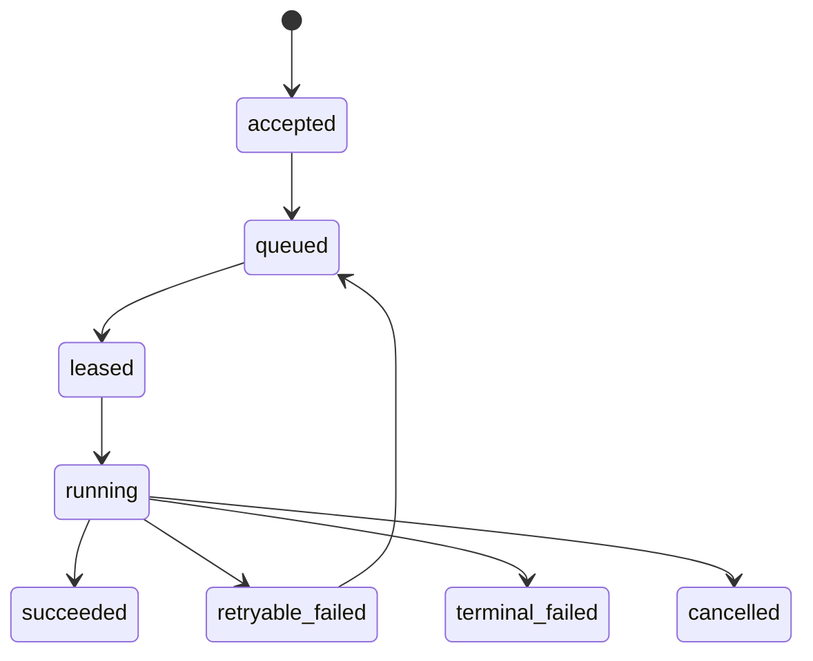

# 后端系统：在并发、失败与变化中维持服务

后端工程的核心不是掌握多少中间件，而是让一个请求或任务在并发、超时、重复、依赖故障和版本变化中仍有明确结果。HTTP 服务、异步任务、数据管道和 AI 推理平台的外形不同，但共享同一组问题。

## 一条完整执行路径

~~~mermaid
flowchart LR
    C[客户端] --> E[入口与鉴权]
    E --> A[应用服务]
    A --> D[(事实数据)]
    A --> Q[队列/任务]
    A --> X[外部依赖]
    Q --> W[Worker]
    W --> D
    E -.request id.-> O[日志、指标、Trace]
    A -.状态与错误.-> O
    W -.attempt 与产物.-> O
~~~

每一条边都要说明：身份如何传播，deadline 是多少，是否可重试，重复如何识别，容量如何限制，失败如何记录，调用者最终看到什么。

## 六个设计对象

| 对象 | 需要定义的不变量 |
| --- | --- |
| API/命令 | 输入输出 schema、错误语义、版本兼容、授权 |
| 状态 | 唯一事实源、事务边界、派生数据、所有者 |
| 调用 | deadline、取消、重试、幂等、并发上限 |
| 任务 | 状态机、attempt、lease、检查点、产物、清理 |
| 容量 | admission、队列上限、背压、租户配额、降级 |
| 变更 | additive 兼容、迁移、灰度、观测门禁、回滚 |

## 地基与扩展

后端基础不止 HTTP。请求要先经过 API 约定、认证授权、服务发现和缓存，再进入并发控制、队列或事务；多节点扩展后还要处理复制、分片、一致性、共识、容器和网络拓扑。

- API 与兼容：[[工程知识/后端系统：在并发、失败与变化中维持服务/服务设计/API接口约定定义输入输出和演进边界]]
- 身份与权限：[[工程知识/后端系统：在并发、失败与变化中维持服务/服务设计/认证授权决定请求能看什么和做什么]]、[[工程知识/后端系统：在并发、失败与变化中维持服务/服务设计/ACL 把权限挂在资源上]]
- 缓存与读取：[[工程知识/后端系统：在并发、失败与变化中维持服务/服务设计/缓存改变读写路径、一致性与故障模式]]
- 路由与发现：[[工程知识/后端系统：在并发、失败与变化中维持服务/服务设计/服务发现与负载均衡决定请求发往哪里]]
- 并发、队列与过载：[[工程知识/后端系统：在并发、失败与变化中维持服务/任务与并发/并发控制先定义共享状态和完成条件]]、[[工程知识/后端系统：在并发、失败与变化中维持服务/任务与并发/队列和流系统用时间与容量换取解耦]]、[[工程知识/后端系统：在并发、失败与变化中维持服务/任务与并发/限流熔断与隔离控制故障半径]]
- 多节点一致性与因果：[[工程知识/后端系统：在并发、失败与变化中维持服务/分布式可靠性/一致性模型与共识解决不同问题]]、[[工程知识/后端系统：在并发、失败与变化中维持服务/分布式可靠性/复制分片与再平衡改变数据归属]]、[[工程知识/后端系统：在并发、失败与变化中维持服务/分布式可靠性/时间顺序与因果必须显式建模]]
- 运行边界：[[工程知识/后端系统：在并发、失败与变化中维持服务/基础设施/容器隔离资源边界与镜像身份]]
- 通信治理：[[工程知识/后端系统：在并发、失败与变化中维持服务/基础设施/服务网格统一通信治理但不负责业务正确性]]

## 同步请求与异步任务

同步调用适合能在连接和 deadline 内完成、调用者需要即时结果的操作。异步任务适合执行时间长、需要削峰、可暂停恢复或需要独立扩缩的工作。把同步改成队列不会消除失败，只会把失败从调用栈变成状态机：

“消息已投递”只证明队列接受了消息，不证明业务完成；“worker 返回 0”也不必然证明目标状态正确。任务完成应绑定事实状态和产物验证。

## 可靠性来自有界行为

- 所有等待有 deadline，取消沿调用链传播。
- 重试只用于被分类为暂时性的错误，并受总预算约束。
- 写操作有幂等键或并发版本，无法判断是否提交时进入 reconciliation。
- 队列、线程池、连接池、内存和下游并发都有上限。
- 超载时尽早拒绝、排队或降级，不能用无限队列掩盖容量不足。
- 依赖故障有隔离范围；熔断是减少无效调用，不是替代恢复设计。

## 分布式不是默认答案

模块化单体通常提供更简单的本地事务、调用链和部署。只有当边界需要独立扩缩、故障隔离、技术约束或团队所有权时，独立服务才抵得过网络、数据一致性、兼容和值班成本。消息队列也只有在需要异步、削峰、广播或重放时才引入。

## 阅读路径

- 调用语义：[[工程知识/后端系统：在并发、失败与变化中维持服务/分布式可靠性/超时、重试与幂等共同定义调用语义]]
- 部分失败：[[工程知识/后端系统：在并发、失败与变化中维持服务/分布式可靠性/部分失败决定分布式系统的设计]]
- 长任务：[[工程知识/后端系统：在并发、失败与变化中维持服务/任务与并发/任务生命周期必须覆盖进程、日志、超时与清理]]
- 公平与背压：[[工程知识/后端系统：在并发、失败与变化中维持服务/任务与并发/调度必须同时处理优先级、公平与背压]]
- 流量入口：[[工程知识/后端系统：在并发、失败与变化中维持服务/服务设计/流量入口只负责路由与连接，不负责业务正确性]]
- 数据正确性：[[工程知识/数据系统：在并发与故障中保存事实/数据系统：在并发与故障中保存事实]]

验证的锚点：后端系统的验收要与负载对账——每一类变更（扩容、限流、缓存、降级）上线前写预期指标，压测或灰度后拿实测对账，对不上的变更回滚并回到容量假设重新算。

后端系统的机制与本质：把后端系统看成分层的失败处理机器——每一层（接入、服务、缓存、存储、基础设施）把上一层的请求变形并向下传递，同时吸收本层固有的失败模式；
本质问题是变化（流量、数据、代码、拓扑）持续到来时，每层用多少冗余与多少协调去维持服务承诺。

## 验证

最小验证：对同一份服务代码，逐项构造并发写入、调用超时、重复请求、依赖不可用与版本不一致五类场景，断言每一种场景下系统给出的结果是明确的（成功、失败或明确的中间状态），而不是未定义的中间态。再对每一次重复请求，断言业务事实只被写入一次。

配置核对：逐项核对超时、重试次数、并发上限与队列长度在目标环境中的生效值，与实际配置不一致时按环境漂移处理。

## 效果与代价

让请求与任务在并发、超时、重复与依赖故障下仍有明确结果，收益是故障可定位、恢复路径清楚，代价是需要在状态、超时、幂等与观测上做额外设计，且这些设计在业务迭代中需要同步维护。

## 要解决的问题

一个请求在并发写入、调用超时、重复投递与依赖故障同时出现时，系统给出的结果无法解释，也无法判断业务事实被写入了几次。本篇回答：HTTP 服务、异步任务、数据管道与推理平台共享哪一组问题、每一项在这组问题里对应什么设计动作，以及后端能力的判断依据是什么。

