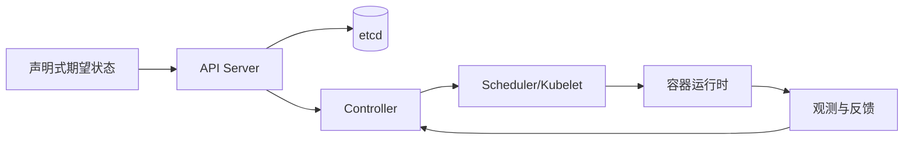

# Kubernetes 管理资源状态，不管理业务正确性

## 核心要点

| 维度 | 回答 |
| --- | --- |
| 要解决的问题 | 多个进程和节点需要按期望状态调度、发现、重启和扩缩，但人工维护每个实例会放大部署和故障处理成本。 |
| 本质 | 控制器持续比较声明的期望状态和集群观察状态，并通过 API、调度器、kubelet 和运行时收敛资源。 |
| 做法 | 定义资源请求、探针、拓扑、发布顺序、权限、配置版本、网络策略和业务状态的外部事实源。 |
| 效果与代价 | 降低资源编排和发布操作成本；代价是控制面、网络、调度、可观测性和数据迁移复杂度。 |
| 边界 | Pod 重启、自愈和 readiness 不等于业务正确、数据一致或容量足够；回滚应用也不能自动回滚数据。 |
| 验证 | 分别注入 Pod/节点故障、陈旧 Endpoint、资源耗尽、网络/DNS 故障和部分发布，核对请求、状态、数据与恢复证据。 |

一个 Pod 被重新调度只能说明资源控制器完成了替换，不能说明处理中订单、消息 offset 或数据库迁移已经安全恢复。把 Kubernetes 事件、容器状态和业务事实分开记录，才能避免“Pod Running”被误读为服务恢复。

## Kubernetes 解决什么

Kubernetes 通过声明式对象和控制循环提供调度、服务发现、滚动发布、自愈和资源隔离。它不自动解决数据库一致性、业务幂等、容量规划、权限设计或错误处理。



## 生产边界

- Pod 只是故障域中的进程；请求仍需超时、取消、重试、幂等和背压。
- readiness 决定是否接流量，liveness 只用于重启异常容器；探针不能依赖脆弱的下游全链路。
- requests/limits、HPA、节点容量和拓扑分布共同决定调度；只设 limit 不等于容量规划。
- ConfigMap/Secret 有版本和权限边界；镜像固定 digest，依赖和供应链可追溯。
- 发布要有灰度、指标门禁、数据库兼容迁移和回滚；回滚应用不一定能回滚已执行的数据变更。

## 排障顺序

```text
入口/路由 -> Service/Endpoint -> Pod 状态 -> 容器日志
         -> 资源/调度 -> 网络策略/DNS -> 依赖服务和数据层
```

## 关联

- [[工程知识/后端系统：在并发、失败与变化中维持服务/后端系统：在并发、失败与变化中维持服务]]
- [[工程知识/软件构建：让变化可以理解、验证与交付/软件构建：让变化可以理解、验证与交付]]
- [[工程知识/性能工程：从用户等待到资源瓶颈/性能工程：从用户等待到资源瓶颈]]

## 案例回流：K8s 管对了资源、业务仍然错的实录形态

案例回流：探针全绿但服务不可用是最典型的形态——就绪探针只检查进程能应答 `/healthz`，不检查依赖的数据库连接池是否耗尽，Pod 全部 Ready、流量全进来、每个请求都 500；K8s 的语义是"进程活着且能应答探测"，业务正确性要靠探测设计自己补（探针端点做依赖轻量检查）。副本扩容救不了有状态错误的实录见 [[工程知识/缺陷分析：从个案到体系/稳定性/案例三十六：写被自己的回调堵住——挂起的 add 回调.md]]——回调挂起是应用层问题，加多少副本每个副本都同样挂起，K8s 把副本数维持到位（它承诺的），业务错误原样复制到每个副本。资源状态的收敛语义与 [[工程知识/后端系统：在并发、失败与变化中维持服务/基础设施/基础设施选型先比较责任边界与故障模型.md]] 的责任约定直接对应：控制器保证的是"期望副本数、期望版本、期望调度"，业务语义的保证永远是应用自己的事，探测与就绪设计是把业务正确性接回资源层的唯一接口。

## 验证

1. 探针语义核对：把探针端点分别指向只检查进程存活与检查关键依赖两种实现，制造依赖不可用，预期前者保持 Ready 而请求大量报错、后者被摘出流量。两种表现对得上，才说明业务可用性判断确实由探测设计承担。
2. 故障注入：逐项驱逐 Pod、封锁节点、把 Service 后端指向已停止的 Pod、把 requests 调到节点无法满足、切断 DNS，每项记录 Deployment、Endpoint、容器状态与业务侧错误码，确认资源层收敛完成与业务恢复完成是两个可以分别观察的时刻。
3. 回滚边界核验：对一次包含数据变更的发布执行应用回滚，预期旧版本进程恢复，而数据状态停留在新版本写入之后。这条核验用于确认回滚应用不改变已执行的数据变更。
4. 断言锚点：探针端点覆盖关键依赖，每类注入都留下资源状态与业务事实两份记录，发布流程包含数据兼容检查与回滚演练记录。

