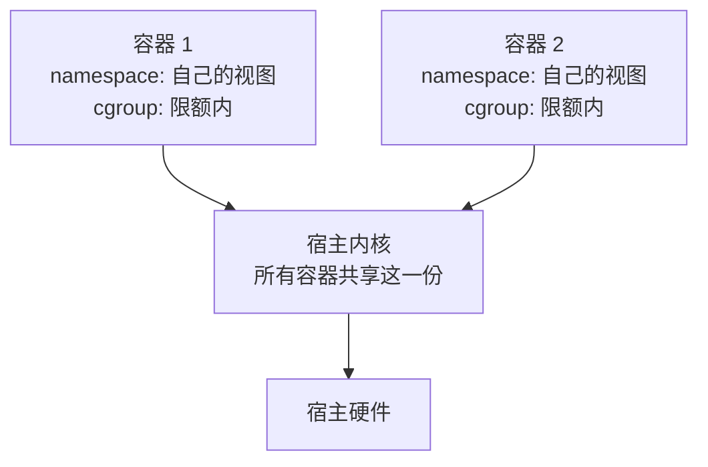

# 容器隔离资源边界与镜像身份

一个内部 Agent 需要执行第三方脚本：脚本会读工作区、发起网络请求并启动子进程。第一版直接用 root 容器、`latest` 镜像和宿主目录挂载；结果是一次内存泄漏拖垮节点，下一次重启拉到了不同依赖，日志里还出现了不该读取的宿主文件。这个事故同时暴露了三条边界：容器隔离的是进程和资源，不是完整虚拟机；镜像标签不是产物身份；资源上限和安全策略必须在启动前声明。

## 容器到底隔离了什么

| 机制 | 主要解决 | 不能自动保证 |
| --- | --- | --- |
| **namespace** | PID、网络、挂载、用户和 IPC 视图隔离 | 宿主内核仍共享；错误的特权配置仍可扩大权限 |
| **cgroup** | CPU、内存、PID、设备等资源配额 | limit 内的程序一定正确；CPU limit 还可能造成 throttling |
| **capabilities** | 把 root 权限分成可单独撤销的能力 | `CAP_SYS_ADMIN` 等高权限能力安全 |
| **seccomp/LSM** | 限制系统调用和安全策略 | 应用逻辑越权、供应链恶意代码 |
| **镜像层** | 固定运行时文件和依赖 | 标签永远指向同一内容、镜像本身可信 |

因此，容器适合资源隔离和部署封装，但不是对抗高权限攻击者的完整沙箱。运行不可信代码时，应把它放到更强的 VM、专用节点或明确的沙箱产品里，并缩小网络、凭据和文件系统暴露面。

这张剖面图说明隔离的两条轴——namespace 切「看得见什么」，cgroup 切「用得了多少」——两条轴之下的内核始终只有一份：



namespace 给每个容器一套独立的进程号、网络栈与挂载视图；cgroup 给每个容器划走 CPU、内存与 PID 配额；但系统调用最终都进同一个内核——特权配置、内核漏洞与共享状态都在这条共享通道上。

## 先固定镜像身份

`my-app:latest` 只是一段可变的名字，不能回答“这次运行的到底是哪一份代码”。生产发布至少要记录：

- 镜像 digest（例如 `image@sha256:...`），而不是只记录 tag；
- 构建提交、基础镜像 digest、依赖锁文件和 SBOM；
- 签名、provenance、漏洞扫描结果和例外审批；
- 运行用户、开放端口、需要的 capability 和挂载清单。

回滚也要回到**已验证的 digest + 配置版本**，不能重新拉一次同名 tag。镜像扫描只告诉你已知漏洞，不能替代最小权限和运行时观测。

## 生产最小安全基线

### 进程和文件系统

- 默认非 root，固定 UID/GID；删除不需要的 Linux capabilities，通常从 `drop: [ALL]` 开始再按证据加回。
- 使用 runtime 默认 seccomp，叠加 `no-new-privileges`；禁止 `privileged`、host PID、host IPC 和 host network，除非有书面边界和专门节点。
- rootfs 只读，把可写目录显式挂到临时盘或专用卷；不把宿主 `/var/run`、Docker socket 或整个工作区直接挂进去。
- Secret 以短生命周期、最小权限的方式注入，避免写进镜像、命令行和普通日志。

### 网络和身份

- 服务账号只拥有这个工作负载需要的 API 权限；不同租户或不同风险等级使用不同身份和资源池。
- 出站网络按域名/IP/端口建立 allowlist；工具执行器默认不能访问云元数据、内网控制面和任意公网。
- 记录 DNS、连接失败、被策略拒绝的请求和凭据访问，而不是只记录 HTTP 500。

### 资源和生命周期

- 为 CPU、内存、PID、临时盘和 GPU 显式设置 request/limit；limit 不是容量规划，必须结合 OOM、throttling、队列和 p99 观察。
- 限制单容器子进程数、文件描述符、并发工具调用和请求 token；无界 worker 或临时文件会绕过 CPU limit 变成节点级事故。
- 配置启动、就绪和存活探针，区分“进程活着”和“可以接收业务”；停止时先摘流量、停止接收新任务、等待在途请求，再发送终止信号。

一个 Kubernetes 工作负载的基线可以长这样（数值必须按压测改，不应照抄）：

```yaml
securityContext:
  runAsNonRoot: true
  allowPrivilegeEscalation: false
  readOnlyRootFilesystem: true
  capabilities:
    drop: ["ALL"]
resources:
  requests: {cpu: "250m", memory: "512Mi"}
  limits: {cpu: "1", memory: "1Gi", ephemeral-storage: "2Gi"}
```

这段配置只建立默认边界，不能证明应用在 OOM、CPU throttling、磁盘满或节点迁移时仍然正确。

## AI 和工具执行要再隔一层

AI 服务的模型权重可以只读挂载，推理进程与工具执行进程分离；工具容器使用独立服务账号、短时 token、受限 egress 和有界并发。GPU device、驱动、拓扑和显存不是普通 CPU 资源，必须单独测量；输入 token、输出 token、Agent 步数和工具调用次数都要进入预算，否则容器资源 limit 只能让任务更快 OOM，不能控制成本。

## 最小隔离实验

在非生产节点运行一个故意违反边界的测试容器，逐项比较：root 与非 root、可写与只读 rootfs、默认与 drop capabilities、默认网络与 egress allowlist、无 limit 与有界 cgroup。测试动作包括：读取宿主路径、访问云元数据、创建大量子进程、分配超过内存、填满临时盘、打开大量文件、发送 SIGTERM 后继续工作。记录系统调用拒绝、OOMKilled、CPU throttling、网络拒绝、退出码和残留资源。

实验要保留镜像 digest、节点内核/runtime 版本和安全策略版本；它证明的是当前配置的边界，不是“容器永远安全”。

## 发布、回滚和验证

上线前做静态门禁：拒绝 `latest`、特权容器、hostPath/host namespace、root 用户和未签名镜像；再做 canary，观察启动失败、就绪耗时、OOM、throttling、重启次数、网络拒绝和业务成功率。回滚时使用上一次已验证 digest，确认旧配置、数据库兼容性和消息消费版本仍可用。

关系：[[工程知识/AI 系统工程：从模型能力到生产能力/安全与治理/沙箱限制能力，策略限制行为]] · [[工程知识/后端系统：在并发、失败与变化中维持服务/基础设施/Kubernetes管理资源状态，不管理业务正确性]] · [[工程知识/后端系统：在并发、失败与变化中维持服务/任务与并发/限流熔断与隔离控制故障半径]]
- [[工程知识/后端系统：在并发、失败与变化中维持服务/基础设施/代理与网关的谱系：正向反向与sidecar各自解决什么.md]] —— sidecar 的部署形态基础
- [[工程知识/后端系统：在并发、失败与变化中维持服务/基础设施/网络命名空间与容器网络：vethbridge与overlay.md]] —— 隔离单元与网络维度的关系

验证的锚点：资源边界要与压测对账——limit 设定后压到目标负载，看 throttling 计数与 P99，实测与预期对不上的（频繁被限流或长期用不满）按实测重设边界，镜像身份以 digest 校验为准。

## 验证

最小验证：让容器执行一个刻意申请超出限额内存的脚本，断言进程被内核终止而非拖垮宿主；再让脚本读取宿主目录，断言路径不可见；重复执行多次，断言每次拉取的镜像 digest 相同。

配置核对：逐项核对 CPU 限额、内存上限、用户身份、挂载点与网络策略在容器内的生效值，与声明的配置不一致时按环境漂移处理。

## 效果与代价

用容器隔开进程与资源的收益是单个任务的异常不扩散到宿主、产物身份可核对，代价是需要在启动前声明限额与策略，且容器提供的隔离范围小于虚拟机，涉及内核的操作仍需额外手段。

## 要解决的问题

一个内部任务执行第三方脚本时，内存失控拖垮节点、重启后拉到了不同依赖、日志里出现了不该读取的宿主文件。本篇回答：容器隔离的实际范围是什么、镜像标签与产物身份之间差在哪里、资源上限与安全策略在什么时机生效，以及启动前需要声明哪些内容。

