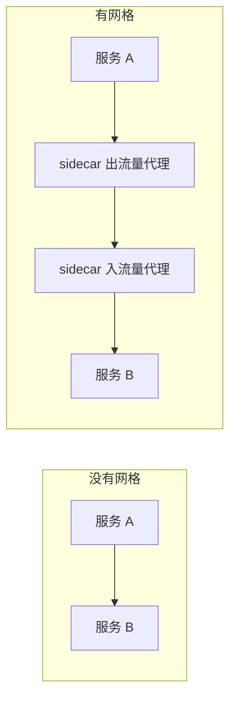

# 服务网格统一通信治理但不负责业务正确性

## 要解决的问题：可观测性驱动实施，治理能力先于业务语义到达

团队引入服务网格的动因通常是可观测性：不改业务代码就拿到流量指标、拓扑和重试统计。实施后的常见落差是，通信层能力先于业务语义到达——重试、超时、熔断都在，但哪个策略该作用于哪条业务链路，仍需要人把治理配置和业务语义对上。

一个团队为了解决"服务之间调用看不见"的问题，引入了 Istio。三个月后：

- **延迟增加**：每个请求多两跳 sidecar，p99 从 80ms 涨到 110ms
- **排障更难了**：出问题时要同时看应用日志、Envoy 日志、Istio 控制面——**三个地方都对不上**
- **没人敢改配置**：VirtualService、DestinationRule 的规则复杂，改错一次就全站 503
- **原来的问题没解决**："这个请求失败了，是业务逻辑问题还是网络问题"——**还是答不上来**

**服务网格解决的是"服务之间怎么通信"，不是"业务为什么出错"。** 它给的是通信层的治理能力（mTLS、重试、熔断、流量切分），但**业务可观测性要在应用里做**。

## 从 0 开始：服务网格到底是什么

### 一句话

**服务网格 = 把"服务间通信的治理"从应用代码里抽出来，放到一个独立的基础设施层。**

### 机制：Sidecar 代理

没有网格时，重试、超时、熔断这些治理逻辑写在每个服务自己的代码里，每种语言各实现一遍。有网格之后，流量先经过 sidecar，治理逻辑挪进代理层，应用代码不再感知：



**所有进出服务的流量都经过 sidecar**，所以：

- 重试、超时、熔断可以在 sidecar 上统一配置（不用每个语言实现一遍）
- mTLS 证书由控制面自动签发和轮换
- 流量指标天然可采集（因为都经过代理）

## 方案：它擅长什么、不擅长什么

### 它真正擅长的四件事

| 能力 | 说明 | 不用网格的代价 |
| --- | --- | --- |
| **mTLS（服务间加密）** | 自动签发、轮换证书 | 每个服务自己实现，容易出错 |
| **流量管理** | 灰度、金丝雀、流量镜像 | 要在网关或应用里做 |
| **统一的重试/超时/熔断** | 配置一次，所有语言生效 | 每种语言各实现一遍，行为不一致 |
| **通信层指标** | 每个调用的成功率、延迟 | 要自己埋点 |

### 它不解决的（误解集中在这里）

| 误解 | 现实 |
| --- | --- |
| "上了网格就有可观测性" | ❌ 只有**通信层**指标（成功率、延迟），没有业务语义 |
| "能看到请求为什么失败" | ❌ 只知道"失败了、状态码 500"，不知道**业务原因** |
| "能替代链路追踪" | ❌ 网格能传递 trace header，但**span 要在应用里埋** |
| "能替代日志" | ❌ 完全不相关 |
| "能提升性能" | ❌ **会降低**（多两跳代理，通常 +1-5ms） |

## 可观测性实施：正确的顺序

**服务网格是可观测性的一部分，不是全部。** 正确的实施顺序：

### 第 1 步：先做应用内的埋点（最重要）

**没有这一步，后面全是空的。**

```
每个请求生成 trace_id
  → 传给所有下游调用（HTTP header / 消息头）
  → 每个服务记录自己的 span（耗时、状态、关键字段）
  → 日志里带上 trace_id
```

用 **OpenTelemetry**（语言无关的标准），不要自己造：

```go
ctx, span := tracer.Start(ctx, "order.create")
defer span.End()

span.SetAttributes(
    attribute.String("order.id", orderID),
    attribute.Int("item.count", len(items)),
)
```

**这一步投入产出比最高**，且没有网格也能做。

### 第 2 步：统一日志格式

结构化日志 + trace_id：

```json
{"ts":"...","level":"info","trace_id":"8f14e45f",
 "span_id":"a3f21b","service":"order-api",
 "msg":"order_created","order_id":"...","amount":1234}
```

**关键**：trace_id 必须出现在每条日志里，否则无法串联。

### 第 3 步：采集链路追踪

部署 collector（如 OTel Collector、Jaeger），采样存储。

**采样策略**：错误和慢请求全采，正常请求按比例采（1-10%）。

### 第 4 步：指标和告警

```
RED 指标（每个服务）：
  Rate     - 每秒请求数
  Errors   - 错误率
  Duration - 延迟分布（p50/p95/p99）
```

**告警要基于症状，不是原因**："错误率 > 1%" 而不是 "CPU > 80%"。

### 第 5 步：这时候才考虑网格

如果满足以下**全部**条件：

- 服务数量 > 10 个（否则收益不抵复杂度）
- 需要跨语言的统一治理（否则用各语言的库就行）
- **需要 mTLS 或复杂的流量管理**（这是网格最不可替代的价值）
- 有专职人员运维（网格出问题时需要懂 Envoy 的人）

**不满足就别上。** 用各语言的 OTel SDK + 一个网关就够了。

## 如果决定上：降低风险的做法

### 逐步接入，不要一次性全量

```
1. 先在非关键服务的 namespace 开启注入
2. 观察 2 周：延迟变化、错误率、sidecar 资源占用
3. 确认没问题后逐步扩大
4. 每个阶段保留快速关闭的能力（改 label 即可）
```

### 明确 sidecar 的资源成本

每个 Pod 多一个容器：

```
Envoy sidecar：通常 50-100m CPU、128-256MB 内存
1000 个 Pod = 额外 50-100 核、128-256 GB
```

**这是一笔真实的成本**，要算进容量规划。

### 只配置你理解的功能

Istio 有几百个配置项。**常用的就这几个**：

| 功能 | 配置 |
| --- | --- |
| 超时 | `VirtualService.timeout` |
| 重试 | `VirtualService.retries` |
| 熔断 | `DestinationRule.trafficPolicy.connectionPool` |
| 灰度 | `VirtualService.http.route.weight` |
| mTLS | `PeerAuthentication` |

**不要启用你不理解的特性**——比如复杂的故障注入、流量镜像，它们会在你不注意时造成问题。

### 监控网格本身

```
控制面：Istiod 是否健康、配置推送是否成功
数据面：sidecar 注入率、Envoy 的 CPU/内存、配置同步状态
```

**网格自己也会挂**，而且要能发现。

## 效果与代价

**收益**

- **跨语言统一治理**：重试、超时、熔断配置一次，所有语言生效
- **mTLS 自动化**：证书签发和轮换不用管
- **通信层指标开箱即用**
- **流量管理能力强**：灰度、镜像、故障注入

**代价**

- **延迟增加**：每跳 +1-5ms（两跳 sidecar）
- **资源开销**：每 Pod 多一个容器
- **运维复杂度陡增**：需要懂 Envoy/Istio 的人
- **排障多一层**：应用 → sidecar → 网络 → sidecar → 应用
- **升级风险**：网格升级可能影响所有服务

## 从什么地方做

**第一步：先问"我要解决什么问题"**

| 问题 | 需要网格吗 |
| --- | --- |
| 看不到调用链 | ❌ 用 OTel 埋点 |
| 不知道为什么失败 | ❌ 用结构化日志 + trace |
| 需要 mTLS | ✅ 网格最省事 |
| 需要跨语言统一重试/超时 | ⚠️ 网格可以，也可以各语言用库 |
| 需要复杂的灰度发布 | ✅ 网格擅长 |
| 服务只有 3 个 | ❌ 完全不需要 |

**第二步：先做 OTel 埋点**

**这是最优先的。** 做完这一步，80% 的可观测性问题就解决了。

**第三步：统一日志 + trace 串联**

确保 trace_id 在日志、链路、指标里都能对上。

**第四步：评估是否真的需要网格**

按上面的条件清单。**不满足就用网关 + 各语言库。**

**第五步：如果上，逐步接入 + 监控网格本身**

## 常见错误

**错误 1：为了可观测性上网格**

网格只给通信层指标。**业务可观测性必须靠应用内埋点。**

**错误 2：一次全量接入**

出问题影响所有服务。**逐步接入，每步可回滚。**

**错误 3：忽略 sidecar 的资源和延迟成本**

1000 个 Pod 多出几十核，延迟 +30%。**要算进容量规划。**

**错误 4：用了复杂的配置却不理解**

照抄网上的 VirtualService 配置 → 出问题时不知道为什么。**只配理解的。**

**错误 5：不监控网格本身**

Istiod 挂了 → 配置无法更新，但已有流量还在跑 → **问题被延迟发现**。

**错误 6：以为网格能传递 trace context 就等于有追踪**

网格能传递 header，但**span 要在应用里创建**。没有 span 就没有链路。

**错误 7：服务很少也上网格**

3 个服务上 Istio：**复杂度远超收益**。

相关：[[工程知识/性能工程：从用户等待到资源瓶颈/观测与诊断/系统指标与观测]] · [[工程知识/后端系统：在并发、失败与变化中维持服务/分布式可靠性/部分失败决定分布式系统的设计]] · [[工程知识/AI 系统工程：从模型能力到生产能力/质量与运营/可观测性必须能重建一次决策]]

## 边界

网格治理通信不治理数据：重试、超时、熔断都在调用层生效，业务侧的幂等与去重仍是服务自己的责任——把幂等寄托在网格重试上，会在重试与业务提交之间制造重复订单，治理边界画在通信层是架构决策，画到业务层就是事故。

## 验证

1. 治理生效验证：注入网络故障（延迟/丢包），预期网格的重试与熔断行为与配置一致（错误率与降级路径可观察）。
2. 幂等边界验证：人为触发一次重试，核对业务侧无重复提交（幂等键生效），预期重复请求被业务层挡住。
3. 断言锚点：治理策略有故障注入实测、幂等键进调用约定。

