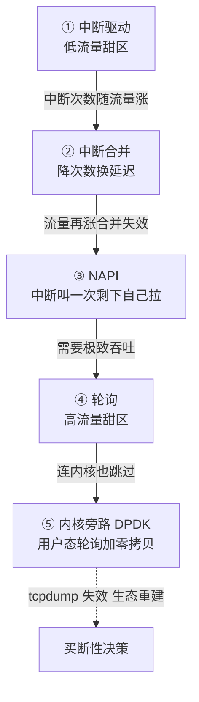

# 网卡与内核旁路：中断与轮询的取舍

## 要解决的问题

包到达网卡后要进应用，这段路怎么走决定了网络处理的上限。传统路径：网卡收包 → 硬中断通知 CPU → 内核协议栈处理 → socket 缓冲区 → 应用。这条路的成本大头不在协议栈本身，在**每次包都打断 CPU**：硬中断的上下文切换、软中断的处理调度，把 CPU 时间切碎。低流量时无所谓（包少打扰少），高流量（百万 PPS）时 CPU 被打断到没法干正事，包处理吞吐反而上不去。要解决的问题本质：**事件通知（中断）与持续检查（轮询）之间的成本权衡**，流量越高，中断的开销越离谱，轮询的浪费越可接受。

## 机制

**中断驱动：包到才通知，低流量最优**。每个包（或每批包）一个硬中断，CPU 立刻响应，延迟最小。但吞吐上去后中断风暴（interrupt storm）：CPU 全在响应中断，正经处理排队。经典病：10 Gbps 线速小包（14.88 Mpps）时，中断开销吃掉全部 CPU。

**轮询驱动：主动拉取，高流量最优**。不要中断，应用（或内核线程）持续查网卡队列有没有包。低流量时轮询是空转（CPU 白烧），高流量时队列几乎永远非空，轮询没有浪费且免去中断开销。

**NAPI：自适应的混合模式**。Linux 内核的答案：低流量用中断（第一口），中断触发后切到轮询模式（软中断上下文批量收包），队列空了再切回中断模式。自适应切换让两种模式各吃各的甜区：低流量的低延迟 + 高流量的高吞吐。NAPI 的批量处理还有二次收益：协议栈处理批量化（每包的处理成本摊薄）、锁竞争减少。

**内核旁路：干脆绕开内核**。DPDK 的路线：网卡直接映射到用户态（hugepage 收包缓冲、UIO/VFIO 驱动），应用轮询网卡队列（PMD，poll mode driver），包不进内核协议栈。协议栈在应用里自己实现（或用轻量的用户态协议实现）。收益：包到应用的路径从"中断+内核+拷贝"缩到"内存读取"，单核百万 PPS。代价：CPU 独占（PMD 线程 100% 空转轮询）、协议栈重写（TCP 要自己实现或采用商业实现）、运维复杂（内核的观测工具全失效）。RDMA绕过内核但要付出可运维性代价（见 [[工程知识/性能工程：从用户等待到资源瓶颈/存储与网络/RDMA绕过内核但要付出可运维性代价.md]]）是同类取舍在存储/消息场景的实例。

## 背景与代价

思想背景：中断 vs 轮询是计算机体系结构的老命题（1960s 起就有），早期设备慢、中断赢得干净。网络提速（1G→10G→100G）把天平推向轮询：每秒百万级事件时，"每个事件都打断 CPU"在数学上不成立。NAPI（2003 年前后进内核）与 DPDK（2010 年代，Intel 开源）是同一洞察的两个实现方向：内核内的自适应混合 vs 内核外的彻底旁路。

最精巧的一笔是**NAPI 的"中断只叫一次，剩下自己拉"**。第一个包中断唤醒，后续包靠轮询收割，队列空再回中断模式。这个状态机把中断频率与流量解耦（高流量时中断频率反而降），单点设计同时拿到两端收益。代价要摆明：旁路方案（DPDK）拿吞吐的代价是放弃了内核生态——netfilter 防火墙、tcpdump 抓包、socket 语义、多进程共享，全部要在用户态重建。旁路是"买断性"决策：一旦走旁路，内核协议栈的演进红利（BBR、io_uring 等）与你无关。socket读写缓冲区（见 [[工程知识/后端系统：在并发、失败与变化中维持服务/基础设施/socket读写缓冲区：拥塞窗口与应用层背压的连接点.md]]）写的内核路径，就是被旁路掉的那段。



五种方案排成一条频谱，从纯事件通知到纯持续检查，流量越高越往下走：低流量时中断最省（包少打扰少），线速小包时中断风暴吃光 CPU，NAPI 用「中断只叫一次」的状态机把两端甜区接起来，DPDK 干脆把整个内核跳过去。频谱下移的每一步都在用「专用性与运维税」换吞吐——DPDK 拿到单核百万 PPS 的同时，tcpdump、netfilter、socket 语义全部失效，所以它是买断性决策，上之前先把运维税算进总账。

## 边界

- **混合模式的切换点是调优点**。NAPI 的轮询预算（budget，每次软中断最多收多少包）与切换阈值影响延迟与吞吐的平衡：预算大吞吐高但单次软中断占用久（调度延迟上升）。网卡队列数与 RSS（接收侧扩展，多队列哈希分发到多核）的配置在高 PPS 场景是基本功。
- **旁路方案不解决所有网络问题**。DPDK 擅长固定路径的高吞吐包处理（防火墙、负载均衡、NFV），不适合需要完整 TCP 语义的通用服务。协议栈是几十年工程积累，重写它的隐性成本（边角 case、安全漏洞、互通性）远超最初的估计。
- **中断亲和性是低成本调优第一站**。把网卡中断绑到特定核（irq affinity + stop_machine 效果），减少跨 NUMA 的缓存弹跳（NUMA 的代价见 [[工程知识/性能工程：从用户等待到资源瓶颈/处理器与内存/NUMA让跨槽访问付出带宽与延迟代价.md]]），比直接上 DPDK 便宜两个数量级。调优顺序：先内核参数与亲和性，量不够再旁路。
- **"零拷贝"是营销词，真相是"少拷贝"**。内核路径至少两次拷贝（DMA 到内核缓冲、内核到用户缓冲），优化手段（mmap、sendfile、splice）省的是第二次。旁路方案省的是全部内核环节。看到"零拷贝"要问具体省了哪一次，见[[工程知识/后端系统：在并发、失败与变化中维持服务/基础设施/网络命名空间与容器网络：vethbridge与overlay.md]]里 veth 的转发路径对照。

## 验证

- **NAPI 行为观测**：`cat /proc/net/softnet_stat`（第2列 packet_budget_exhausted / time_squeeze 高说明轮询预算不够，软中断没收完就到时限）+ ethtool -S 网卡统计。高流量下预期 time_squeeze 随 PPS 增长；调大 budget 后重测，预期 squeeze 计数下降、吞吐上升。计数不变化则瓶颈不在这层，查应用处理速度。
- **中断亲和性实验**：绑定网卡队列中断到固定核前后对比 p99 延迟与 cache-misses（perf stat），预期：绑定后跨核迁移的中断处理消失，p99 收窄。对照实验是最便宜的调优证据。
- **旁路收益实测**（如有环境）：同一台机 DPDK testpmd 与内核路径（pktgen 打流）对比转发 PPS，预期：DPDK 单核 PPS 数倍于内核路径。注意公平性：DPDK 用了独占核与 hugepage，对照组也要给内核路径最优配置（NAPI 调优、RSS 开满），否则对比不诚实。

## 可运行示例与案例回流：旁路的账

```text
一次收包路径的推演账（通用形态，量级为公开典型值）：

  中断模式：每包一次硬中断 → 10G 线速小包约 14.8Mpps → 中断打满 CPU，
    实际业务只分到 30-40% 处理能力
  中断合并：攒 N 微秒再触发 → 中断次数降 90%，单包延迟 +几十微秒
    （吞吐换延迟的经典旋钮）
  轮询（NAPI）：包多时切轮询，包少时回中断 → 空载不空转、忙时不风暴
  内核旁路（DPDK 类）：用户态轮询 + 零拷贝，绕过协议栈
    吞吐再翻倍，代价：独占 CPU 核（业务线程少核可用）、
    失去内核协议栈的全部便利（tcpdump 抓不到、conntrack 失效）
```

案例回流：中断风暴的实录——百万 QPS 网关单机小包洪峰，软中断吃满 8 核里的 6 核，业务线程抢不到 CPU；开中断合并 + RPS 多队列分发后软中断占比从 75% 降到 30%。旁路运维税的实录——DPDK 化后故障排查失明（tcpdump 看不到用户态收包路径，协议栈统计全失效），一次丢包问题排查时长翻 3 倍；旁路端要配套自建统计与镜像口，运维税要在选型时算进总账。轮询空转的实录——低峰期固定轮询线程空转烧 CPU（20% 常驻占用），改 NAPI 式自适应后空载归零。中断与队列的接力细节见 [[工程知识/性能工程：从用户等待到资源瓶颈/存储与网络/网卡丢包先看环形缓冲区溢出：队列、中断与软中断的接力.md]]、整机视角见 [[工程知识/性能工程：从用户等待到资源瓶颈/处理器与内存/CPU性能来自有效执行与数据供给.md]]。

## 相关

- [[工程知识/后端系统：在并发、失败与变化中维持服务/基础设施/socket读写缓冲区：拥塞窗口与应用层背压的连接点.md]] —— 被旁路掉的内核路径与背压
- [[工程知识/性能工程：从用户等待到资源瓶颈/存储与网络/RDMA绕过内核但要付出可运维性代价.md]] —— 同类旁路取舍的存储场景
- [[工程知识/性能工程：从用户等待到资源瓶颈/处理器与内存/NUMA让跨槽访问付出带宽与延迟代价.md]] —— 中断亲和性与跨槽代价
