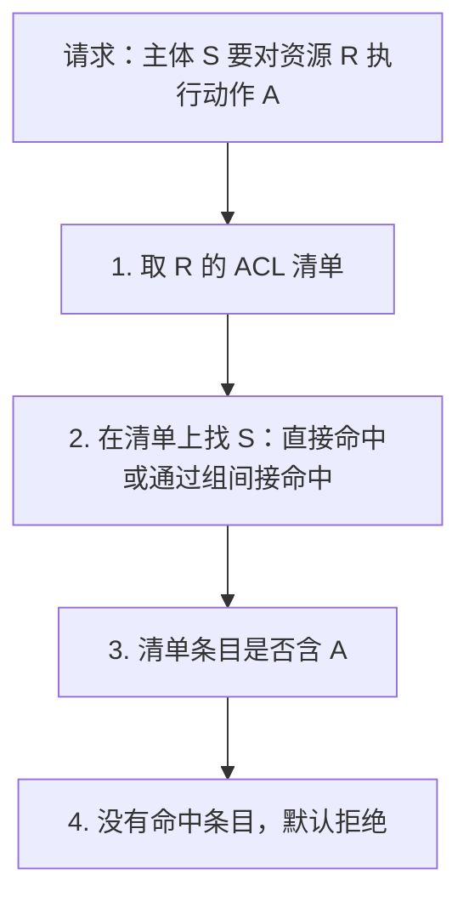

# ACL 把权限挂在资源上

**ACL（Access Control List，访问控制列表）** 回答"谁能对这个资源做什么"：每个资源自带一份清单，逐条列出主体与允许的动作。判断权限时，拿请求者去这份清单上查。

它是三种授权模型里最直白的一种。RBAC 把权限挂在**角色**上，ABAC 靠**属性**算，ACL 挂在**资源**上。差别不在优劣，在于"权限记录在哪里"——这一页讲清 ACL 的结构、它天然擅长什么、以及它为什么会悄悄失效。

与 [[工程知识/后端系统：在并发、失败与变化中维持服务/服务设计/认证授权决定请求能看什么和做什么]] 是同一层的两个视角：那一页分别讲认证与授权、比较 RBAC/ABAC/ReBAC；这一页把 ACL 单独讲透。

## 本质与要解决的问题：一份贴在资源上的名单

一个文档系统，`doc:42` 是一份合同。系统里存着这样一份清单：

```
doc:42
  alice@example.com   read, write
  bob@example.com     read
  team:legal          read
```

Alice 请求写入 `doc:42`：查清单，有 `write`，放行。Carol 请求读取：清单上没有她，拒绝。

权限信息**跟着资源走**，不跟着用户走。想知道谁能访问这份合同，翻它的清单即可；想撤销 Bob 的访问，从这份清单上删掉一行。

这就是 ACL 的全部形态。它的所有优点与所有麻烦，都来自"清单贴在资源上"这一件事。

## 三种挂法的对照

| 模型 | 权限记录在哪 | 判断方式 | 典型形态 |
| --- | --- | --- | --- |
| **ACL** | 资源上 | 查这个资源的清单里有没有我 | 文件系统、Redis ACL、对象存储 bucket policy |
| **RBAC** | 角色上 | 我的角色含不含这个权限 | 后台管理系统、企业内部系统 |
| **ABAC** | 规则里 | 我的属性与资源属性是否满足条件 | 动态策略、合规规则 |

换成同一件事来看差别——"只有订单的买家能看这个订单"：

| 模型 | 表达方式 | 结果 |
| --- | --- | --- |
| ACL | `order:7` 的清单上写着 `buyer:alice read` | 自然 |
| RBAC | 给"买家"角色加"查看订单" | 那样能看所有订单，表达不了 |
| ABAC | 规则 = `user.id == order.buyer_id` | 自然 |

**ACL 与 ABAC 都能表达资源归属，RBAC 不能。** 这是 ACL 至今仍被广泛使用的核心原因——共享类场景（文档协作、网盘、消息队列的主题）天然是"这个资源允许谁"的形态。

## 从 0 开始：一条 ACL 判断经过什么



三步里每一步都有具体的坑。

### 第 1 步：清单从哪来

清单的存放位置决定了它的行为边界。

| 存放方式 | 代表 | 特点 |
| --- | --- | --- |
| 资源元数据里 | POSIX 文件的 `mode + uid/gid`、扩展 ACL | 与资源一体，删除资源即删除清单 |
| 独立的权限表 | 数据库里的 `acl` 表 | 可查询、可批量修改，但要自己保证与资源同步 |
| 集中的配置 | Redis ACL、Kafka ACL | 服务端统一加载，判断快，但配置本身是攻击面 |

**关键约束：清单的生命周期必须与资源一致。** 资源删了清单还在，就是残留权限；资源重建了清单没跟上，新资源可能继承了旧的权限。

### 第 2 步：主体怎么匹配

主体很少是单个人，通常是用户、组、服务账号的混合。匹配要考虑三类问题：

**间接成员**：Bob 通过 `team:legal` 间接获得权限。判断是否命中要展开组关系，而组可能嵌套。嵌套展开有成本，也可能成环。

**通配符与模式**：Redis ACL 允许 `~cache:*` 这样的键模式，让一条规则覆盖一批键。方便，但模式语法本身就是解析复杂度的来源——模式写错可能匹配到预期外的键。

**优先级与冲突**：同一主体既在允许条目里、又在拒绝条目里时听谁的。多数系统的约定是**显式拒绝优先**，但必须明确定义并写下来，不能靠实现顺序。

### 第 3 步：动作粒度

动作定义得粗放，ACL 就表达不了细粒度需求；定义得详细，清单条目数量会爆炸。

| 粒度 | 动作集合 | 代价 |
| --- | --- | --- |
| 粗粒度 | read / write | 表达不了"能读但不能列出" |
| 细粒度 | read / list / write / delete | 表达力强，条目变多 |

一个常被忽略的动作是 **list（列举）**。只给 `read` 不给 `list`，用户就无法枚举资源空间——这是最小权限的常见做法。

## 为什么 ACL 会悄悄失效

ACL 的结构简单，失效方式却不简单。下面是几类超出"清单写错了"的失效。

### 清单查了，但数据不是走清单那条路出去的

这是最严重也最常见的一类：**权限检查发生在正确的位置，而数据从另一个位置出去了**。

Redis 的一个真实病例：客户端缓存的失效广播会把"某个键变了"推送给订阅者。命令路径上每次访问都过 ACL 检查，**但推送路径上没有"接收方是谁"这个上下文**——代码只排除了发起修改的连接，没有按每个订阅者的权限逐键过滤。结果是低权限账号收到了自己无权读取的**键名**。

值得停下来看清楚这里泄露的是什么：它进不去那个键（GET 照样返回 NOPERM），**但它知道了这个键存在**。泄露的是元数据，不是数据内容。

```text
门禁（命令路径）：好使 —— 刷不开 B 栋 202
公告栏（推送路径）：没查门禁 —— 看见了 "B栋202" 这个门牌号
```

这类缺陷的形态是：**每一条路径都要单独证明自己查了 ACL，而不能因为"主路径查了"就认为整条链路安全**。缓存、广播、搜索索引、导出、备份、日志——每一条都是独立的数据出口。

### 清单本身是输入，会被非法值污染

ACL 配置通常是字符串或模式表达式，需要被解析。解析路径如果缺少校验，非法配置会被存进去，然后在**下一次读取时**炸掉。

同一个 Redis 模块的另一个病例：`ACL SETUSER` 收下了一个权限位缺失的裸模式 `%`。存进去时没报错，之后任何一次 `ACL LIST` / `GETUSER` / `SAVE` 触发解析，实例直接崩溃，全部客户端断连。

两个要点：**配置写入时要当场拒绝非法值，而不是等到解析时才失败**；以及**错误配置的破坏可能延迟到读取时才发生**，这让它的影响面从"一次写操作"变成"整个实例"。

### 清单能表达"能不能访问"，表达不了"有没有被访问"

ACL 是静态的判断依据，它不记录自己被怎样使用。于是产生一类盲区：无法回答"这个资源最近被谁访问过"、"这条权限条目最后一次命中是什么时候"。

缺少这层信息，就无法发现权限过度授予——一条 `alice: write` 挂了三年没人用过，从 ACL 本身看不出它该被收回。**审计日志必须独立于 ACL 存在**。

### 清单会膨胀，且没人负责清理

共享类场景里，ACL 条目随协作增长。一个人离职，他在几百份文档清单上的条目不会自动消失。这与 [[工程知识/缺陷分析：从个案到体系/正确性/案例二十九：离开的人还占着座位——机架信息的陈旧映射]] 是同构的问题：**离开是被动判定，散落在多个模块，没人认领清理责任**。

## 常见错误

**错误 1：主路径查了 ACL，就认为整条链路安全**

缓存、广播、导出、搜索、备份都是独立出口。**逐条证明，不能靠推断。**

**错误 2：认为"进不去"等于"没泄露"**

键名、ID、存在性都是信息。**元数据泄露独立于越权访问存在。**

**错误 3：非法配置存进去，等读取时才发现**

写入时当场校验并拒绝。**错误配置的破坏会延迟放大。**

**错误 4：无权限返回 403**

这会确认"资源存在"，可用于枚举。返回 404（与 [[工程知识/后端系统：在并发、失败与变化中维持服务/服务设计/认证授权决定请求能看什么和做什么]] 中的结论一致）。

**错误 5：条件查询时先查后判**

应当把权限条件写进查询条件，而不是取出来再判断。后者容易漏，且泄漏了"存在性"。

**错误 6：把 ACL 当成审计记录**

ACL 回答"能不能"，不回答"有没有"。**审计要独立建。**

**错误 7：默认允许**

清单上没有条目时，必须是拒绝。**默认允许会让所有漏配变成漏洞。**

**错误 8：忽略 list 权限**

能读不等于能列举。**最小权限要区分 read 与 list。**

## 验证：怎么测

```yaml
- name: 未授权访问
  action: 清单外的用户请求资源
  assert: 404，且响应与"资源不存在"不可区分

- name: 元数据泄露
  action: 低权限用户订阅广播 / 列表接口
  assert: 响应中不含任何无权访问的资源标识

- name: 组嵌套展开
  action: 用户通过三层嵌套的组获得权限
assert: 正确命中；成环时不进入无限循环

- name: 非法权限配置
  action: 提交语法错误的模式串
  assert: 写入时被拒绝，且不残留部分生效的状态

- name: 权限回收
  action: 从清单移除条目后立即访问
  assert: 立刻失效（不依赖 TTL 或缓存自然过期）

- name: 资源删除后的清单
  action: 删除资源，再用同名重建
  assert: 新资源不继承旧清单

- name: 动作粒度
  action: 只有 read 权限的用户调用列举接口
  assert: 被拒绝
```

## 什么时候该用 ACL

| 场景 | 适合度 | 原因 |
| --- | --- | --- |
| 文档/文件共享 | 高 | 天然是"这个资源允许谁" |
| 消息主题、队列 | 高 | 资源数量有限，清单可控 |
| 键值存储的键空间 | 中高 | 靠模式匹配批量授权，模式本身要小心 |
| 多租户数据隔离 | 中 | 更推荐行级安全，让数据库强制 |
| 企业内部功能权限 | 低 | RBAC 更合适，ACL 条目会爆炸 |
| 需要动态规则（时间、合规） | 低 | ABAC 更合适 |

**判断依据：权限主要随"资源"变化还是随"人的角色"变化。** 前者用 ACL，后者用 RBAC，需要按属性动态计算则用 ABAC。

关系：[[工程知识/后端系统：在并发、失败与变化中维持服务/服务设计/认证授权决定请求能看什么和做什么]] · [[工程知识/后端系统：在并发、失败与变化中维持服务/服务设计/API接口约定定义输入输出和演进边界]] · [[工程知识/缺陷分析：从个案到体系/安全/案例二十六：公告栏没查门禁——Redis 的 ACL 键名泄露与解析崩溃]]
