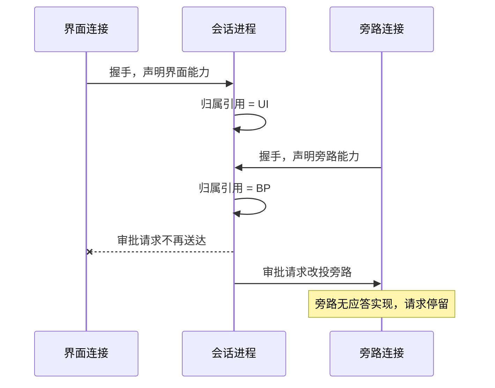

# 一路会话只能有一个回复归属：多客户端接入时的所有者绑定

带界面的会话都有一次「把问题交到人面前」的动作：这次改动放不放行、这几个选项选哪一个、要不要执行这条命令。这类请求与普通的流式输出不同，它会一直等到有人回答才继续。既然要等一个答案，就必须确定答案从哪来 —— 一次会话在同一时刻只能有一个回复归属。

界面工具把这条规则写进了规范。语言服务器协议（Language Server Protocol，LSP）规定服务器在一次会话中只服务一个客户端；模型上下文协议（Model Context Protocol，MCP）的会话同样绑定到建立它的那条连接。规则本身没有争议，出问题的地方在实现：这个归属怎么建立、怎么维护、怎么交还。

## 要解决的问题

一个会话可能被多条连接接入。常见的形态有三类：编辑器的界面连接、一个想自动放行审批的旁路程序、一个想读取进度的监控面板。它们各自建立连接，各自声明能力。

如果「回复归属」用的是「最后一个完成握手的连接」，那么后接入的旁路程序会直接接管应答权。此时：

- 真实界面收不到请求，用户看到的界面不再弹出审批；
- 旁路程序若只打算旁观，没有应答实现，请求就停在原地；
- 旁路程序中途断开，归属还指着它，后续所有请求都投给一条已经关闭的连接。

三种情况的结果都是同一个：工具调用一直等待，日志里只有一条查无状态的警告。用户看到的界面上什么都没有发生。

## 归属机制：一个槽位，多个写入者

回复归属通常实现成一个进程内的引用，握手完成时写入，发送请求时读取。这类引用多是一个全局变量，配一个 `setConnection` 方法负责写入：连接握手完成就调用它把这个连接设为当前应答者，发送请求时再读出来。



这套结构有三个必须回答的问题，每一个都决定了它可靠与否。

**写入判据是什么。** 若判据只是「连接建立」，那么任何接入者都能当选。合理的判据是「这个连接声明了处理交互的能力」，即能力协商的结果参与归属判定。规范里能力字段的作用正是区分「能接界面的连接」与「只订阅事件的连接」，实现里把这个信息丢掉，归属就退化成了时序竞争。`setConnection` 只做一次赋值，它本身不区分调用者是谁，覆盖与否由写入前的判据决定。

**归属是独占还是可共享。** 请求与事件是两类东西。事件流可以广播给所有订阅者，新增订阅者不影响已有订阅者；请求必须送到唯一的收件人手里，因为答案只能有一个。把两者当作同一件事处理，会导致旁路接入必然打断主界面。

**何时交还。** 归属应当绑定在连接的存活状态上：连接关闭就清理，回退到上一个仍存活的合格连接；没有合格连接时归属置空，投递当场失败。依靠定期探测判断持有者是否还在，会存在时效盲区，理由见 [[工程知识/后端系统：在并发、失败与变化中维持服务/分布式可靠性/健康检查只能提供有时效的失败证据]]。

有一类设计可以绕开这些争论：让旁路不建立自己的连接。旁路改成读取会话已经持久化的记录（日志文件、事件流水），完全不进入归属槽位。代价是数据有延迟，用定期探测判断「此刻是否卡住」会不准；收益是主界面的应答权丝毫不受影响。这与 [[工程知识/缺陷分析：从个案到体系/并发/只读旁观者不能改变被观察对象的状态]] 是同一个取舍：接入方是否写入共享状态，决定了它是旁观还是参与。

## 边界

**能力协商是连接级的，不是会话级的。** 同一份配置换一个客户端就可能少挂载一类工具，因为新客户端的能力声明不同。排查「工具为什么不见了」时，先核对握手阶段的声明，再查归属。

**归属的唯一性只覆盖需要回复的请求。** 流式输出、进度通知、状态变更这些单向消息可以同时推给多个订阅者，不受归属约束。把两者混在一起考虑，会得出「多客户端接入必然冲突」的错误结论。

**断开行为没有统一规定。** 规范通常描述正常时序，通道断开后等待中的请求如何处理由实现决定。这就是「工具挂起、日志只有一条警告」的来源。

**归属判定过松等于没有判定。** 若判据是「连接存在且未关闭」，一条刚刚建立、没有声明任何能力的连接依然可以接管。判据需要具体到能力字段。

## 验证

核对归属是否稳定，用连接标识采样三次：会话开始、接入一个旁路之后、旁路断开之后。

```bash
grep -o 'connectionId=[^ ]*' "$CLIENT_LOG" | sort | uniq -c
```

**预期**是三次采样里承接请求的连接标识保持为界面连接那一个，接入旁路与旁路断开都不改变它。**对不上**说明归属被写入过，回到写入判据上查是哪一个条件没有区分能力。

再核对一次「查无状态」告警是否出现：

```bash
grep -c 'No state found' "$CLIENT_LOG"
```

**预期**是零。这条告警出现的含义是请求发往了一条已经不在注册表里的连接，属于归属错误已经发生的直接证据。

## 影响与代价

- 归属绑定到能力声明：多客户端接入不再互相打断，代价是接入方必须如实声明自己的能力，声明错了就没有功能。
- 归属绑定连接关闭事件：清理及时，代价是必须保证关闭事件在所有退出路径上都被触发。
- 旁路走日志与流水：主界面零影响，代价是观测数据有延迟，不能用于判断实时状态。
- 请求投递加上超时与就地报错：最坏情况有界，代价是调用方必须有处理失败的分支，否则只是把等待换成上游出错，处理策略见 [[工程知识/AI 系统工程：从模型能力到生产能力/质量与运营/失败要分类才能对症下药]]。

## 从什么地方做

1. **先定义能力字段**：区分「能接交互的连接」与「只订阅事件的连接」，让归属判据有可用的输入。
2. **再收窄写入条件**：只有声明了交互能力的连接才能写入归属槽位；旁路连接只订阅事件流。
3. **再绑定交还**：归属清理挂在连接关闭事件上，回退到上一个合格连接，没有则置空。
4. **最后加兜底**：等待回复的请求加超时，超时后就地报错并说明客户端已断开。

相关：[[工程知识/AI 系统工程：从模型能力到生产能力/质量与运营/投递指针的选举与失效：连接注册表的四个健壮性缺陷]] · [[工程知识/AI 系统工程：从模型能力到生产能力/生态与选型/编辑器与编码代理的通信通道：能力协商与连接归属]] · [[工程知识/AI 系统工程：从模型能力到生产能力/质量与运营/AI 客户端会话需要守护：审批、委托与断线的接管层]]

相关（归属失效之后）：[[工程知识/缺陷分析：从个案到体系/稳定性/订阅者断线之后路由指向谁：请求被静默丢弃的识别]] —— 槽位没有清理或回退时，请求发往已删除连接并被静默丢弃