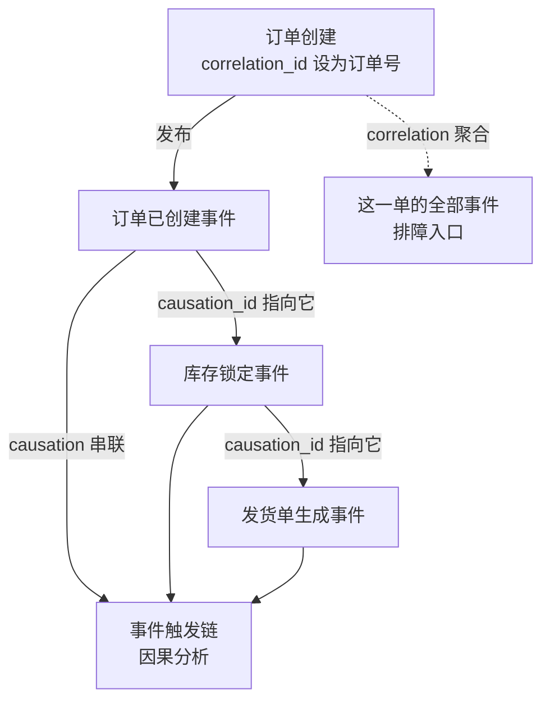

# 事件驱动架构的解耦代价：最终一致与可追溯性

## 要解决的问题

服务间调用从同步（RPC 链）改成异步（事件总线）：发布方发事件不等人、订阅方按自己节奏消费，两方解耦（不知道彼此存在）。收益硬（削峰、隔离故障、独立演进），代价也硬：**调用链变成时间上分离的两段，一致性从“同步可见”降级为“最终一致”，排障从“一条链路 trace”变成“跨时间跨服务的拼图”**。要解决的问题是把这个代价显式化：解耦换来了什么、最终一致的窗口如何管理、可追溯性如何重建。这是队列和流系统（见 [[工程知识/后端系统：在并发、失败与变化中维持服务/任务与并发/队列和流系统用时间与容量换取解耦.md]]）的架构级展开。

## 机制

**解耦的形态学**。
- 事件通知（event notification）：发布方只说“发生了 X”，订阅方自己来查详情。最松耦合（发布方不知道谁消费、消费什么），但消费方要回查（额外往返 + 回查时状态可能已变）。
- 事件携带状态（event-carried state transfer）：事件里带全部数据（订阅方无需回查），耦合从“调用耦合”变成“数据格式耦合”（发布方的 schema 变更影响全部订阅方）。
- 事件溯源（event sourcing）：事件是事实的唯一源（状态是事件的折叠），最强形态（完整审计 + 时间旅行），但查询复杂（要投影建视图）、心智负担重。

**最终一致的窗口管理**。同步调用的响应即确认（成功/失败立即可见），事件驱动的确认延迟到消费（发布成功 ≠ 消费成功 ≠ 处理成功）。窗口内的状态：用户下单（发布方视角）已成功、库存扣减（消费方视角）还没发生——中间态对外可见（用户看到订单但库存查询还是旧值）。窗口管理三件套：窗口时长的 SLA（P99 消费延迟监控）、中间态的产品话术（“处理中”状态显式化）、补偿路径（消费失败的重试与死信，见幂等与重试（见 [[工程知识/数据系统：在并发与故障中保存事实/数据管道与流处理/数据编排要保证依赖、重试与幂等.md]]））。

**可追溯性的重建**。同步链路有 trace（一个请求 ID 串全程），事件链路的 trace 断在队列两侧（发布方的 trace 到 broker 为止，消费方新开 trace）。重建手段：因果 ID 的传播（事件头带 causation_id 指向触发它的事件、correlation_id 贯穿业务流），事件总线上的链路追踪（broker 的消息 ID + 两端的关联）。工具成熟度：OTel 的 messaging 语义约定在完善，跨队列的 trace 拼接仍要工程补齐。

**编排与协同（choreography vs orchestration）**。多服务的业务流（下单 → 扣库存 → 发货）两种组织方式：协同（各服务订阅各自关心的事件、各自反应，无中心）与编排（一个协调者发命令、监结果，流程显式）。协同的流程逻辑散在各订阅方（新功能要改多方、排障要拼全链），编排的协调者是新单点（但流程可视化）。大流程用编排（saga 协调者，见 Saga 补偿链（见 [[工程知识/后端系统：在并发、失败与变化中维持服务/分布式可靠性/Saga把长事务变成补偿链，代价是失去隔离性.md]]）），小联动用协同（一两个订阅方的局部反应）。

## 背景与代价

思想背景：事件驱动架构的思想源头是企业集成（EIP，2003，Hohpe 与 Woolf 的集成模式），消息中间件（MQ 系列）是 2000s 的企业标配。微服务潮（2014+）让它复兴（服务间异步解耦），Kafka（2011 诞生，2014+ 普及）把日志型事件流做成基础设施（回放、多订阅者、持久化）。Martin Fowler 的事件模式三分类（通知/携带状态/溯源，2017 整理）是概念澄清的标志。

最精巧的一笔是**correlation_id 把“业务流”与“技术链路”分开追踪**。同步世界的 trace ID 是技术链路（一次调用链），事件驱动的业务流跨多次发布与消费、跨多个服务、跨时间（分钟到天），correlation_id（业务流 ID，如订单号）贯穿全程，causation_id（因果 ID）记录事件间触发关系。两个 ID 的分工：correlation 找“这单业务的全部事件”（排障入口），causation 还原“事件触发链”（因果分析）。这一笔承认异步世界的可追溯性需要业务语义的 ID（纯技术 ID 追不到跨队列的因果），与同步世界“一个 trace ID 走天下”的做法分道。代价要摆明：最终一致的窗口是产品代价（用户看到中间态），窗口 SLA 与产品话术要协同设计（技术说 P99 5 秒，产品文案“处理中”，两边对齐）；事件 schema 的演进是持续税（订阅方越多、schema 变更的影响面越大，schema registry 的兼容策略要前置）；协同式流程的可理解性随订阅方数量下降（事件风暴图是补丁不是解药，超过 5 个服务的协同流要考虑编排化）；死信与重试的堆积是慢性病（消费失败的事件堆在 DLQ，无人治理的 DLQ 是数据黑洞——每周清点、按错误类型归因、修不完的进工单）。

图里两个 ID 各管一条线：correlation_id 用业务身份（订单号）把跨服务、跨时间、跨多次发布消费的事件归成「这一单的全部事件」，是排障时的入口；causation_id 记录事件之间的触发关系，把「谁引发谁」还原成因果链。单看一个事件时两者都只是头部字段，聚合起来才成为跨队列的可追溯性——同步世界一次调用链一个 trace ID 就够，异步世界必须靠业务语义 ID 把时间上分离的两段接起来。

## 边界

- **解耦的收益要用“变化频率”衡量**。发布方与订阅方独立演进（变化不同步）收益大；两方总是同步变（schema 联动改）解耦是假的（改 schema 要改双方 + 全量重放）。判断：过去半年两方发布节奏是否独立？
- **事件携带状态 vs 回查的选择**。携带状态省往返但 schema 耦合深（订阅方依赖发布方的数据形状）；回查松耦合但消费方要调发布方（“解耦”退化成“延迟耦合”）。高吞吐场景携带状态（省回查的放大），低频关键场景回查（保证读到最新状态）。
- **死信队列不是垃圾桶是待办清单**。DLQ 的事件要有 Owner 与 SLA（多快处理、什么情况放弃），监控 DLQ 深度与错误分类。无主 DLQ 等于把失败静默化。
- **编排与协同不是信仰是规模函数**。2-3 个服务的流程协同够用（少一层协调者的维护），5+ 服务的流程要编排（流程可视化与失败恢复集中化）。从协同起步、到规模再编排化，是常见演化路径。

## 验证

- **一致性窗口实测**：发布事件到订阅方处理完成的端到端延迟分布（P50/P99）。预期：正常时段秒级、堆积时段分钟级（窗口的动态性）。窗口 SLA 的实测锚点。
- **trace 拼接演练**：一次业务流的全部事件按 correlation_id 聚合、按 causation_id 连因果链。预期：聚合后可完整还原业务流（谁触发谁、哪步慢、哪步失败）。可追溯性重建的可行性证据。
- **DLQ 治理审计**：统计 DLQ 的错误类型分布与年龄。预期：多数错误集中在少数模式（schema 不兼容、下游 bug），年龄长的积压说明治理缺位。治理优先级的依据。

## 相关

- [[工程知识/后端系统：在并发、失败与变化中维持服务/任务与并发/队列和流系统用时间与容量换取解耦.md]] —— 队列机制的展开
- [[工程知识/后端系统：在并发、失败与变化中维持服务/分布式可靠性/Saga把长事务变成补偿链，代价是失去隔离性.md]] —— 长流程的编排化方案
- [[工程知识/数据系统：在并发与故障中保存事实/数据管道与流处理/数据编排要保证依赖、重试与幂等.md]] —— 消费侧的重试与幂等
- [[工程知识/软件构建：让变化可以理解、验证与交付/架构与代码/领域建模的实施路径：从事件风暴到聚合边界.md]] —— 聚合间靠事件同步，代价在事件驱动链路篇展开
- [[工程知识/后端系统：在并发、失败与变化中维持服务/服务设计/微服务划分的判据：从团队认知到数据边界.md]] —— 划分后簇间靠事件同步，代价一起算进划分的账
