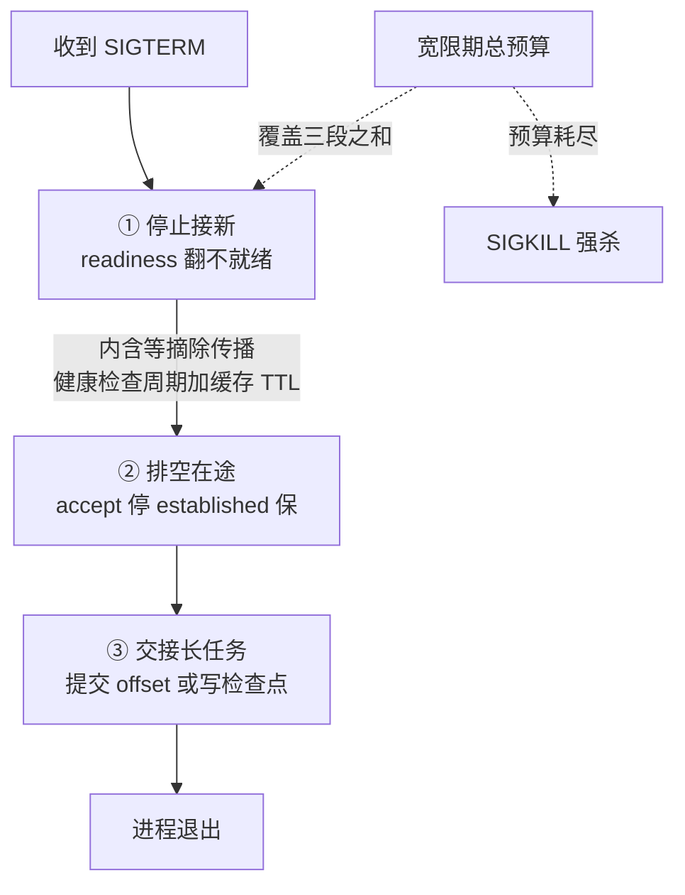

# 优雅停机的完成语义：排空连接与任务交接

## 要解决的问题

滚动部署、缩容、节点维护都要停服务实例，但“停”有讲究：直接 SIGKILL 让在途请求半路中断（用户看到 5xx、数据写一半）、消息消费者的任务丢（消息处理到一半没 ack，重投后重复消费）、后台任务断（导出到一半的文件残留）。优雅停机要解决的问题是**把“停机”从瞬时切断变成有序退场**：停止接新、排空旧的、交接长任务的三个阶段，每个阶段有明确的完成判据。这是部署流水线（部署与发布的分离，见 [[工程知识/软件构建：让变化可以理解、验证与交付/测试与交付/配置与特性开关分离部署与发布.md]]）的实例层保障，与健康检查三层语义（见 [[工程知识/后端系统：在并发、失败与变化中维持服务/服务设计/健康检查的三层语义：存活就绪与深度.md]]）的 readiness 语义衔接（摘流量是排空的前半步）。

## 机制

**三阶段退场**。
- 停止接新：readiness 翻不就绪（LB 摘除、注册中心下线），新请求不再来。这一步要等 LB 的摘除传播完成（摘除不是瞬时的，LB 轮询周期 + 缓存 TTL）。
- 排空在途：存量请求处理完（HTTP 请求等到响应、RPC 等到完成）。判据：在途计数归零或超时（最长等待 = 请求 SLA 上限）。排空期间进程拒绝新连接但继续服务旧连接（accept 停、established 保）。
- 交接长任务：处理不完的（长任务、消息消费）按语义交接——消息消费者的未 ack 消息停止拉取、等当前消息处理完再退出（重平衡机制接手）；后台任务的检查点（checkpoint）或回滚（任务可重跑）；在写数据的原子提交点退出（不留半写状态）。

**信号与超时的编配**。SIGTERM 触发优雅流程，宽限期（grace period）是总预算：停新（等摘除传播，1-10s）+ 排空（等在途，10-30s）+ 交接（等长任务，任务依赖）。预算耗尽 SIGKILL 强杀（强杀是不可达 SLA 的兜底，不是常规路径）。宽限期的设置要对齐最长的常规路径（消息处理 P99 + 重平衡时间），不是拍的默认 30s。



三个阶段按顺序推进，每一段各有一个完成判据：停新要等摘除传播生效，排空要等在途计数归零，交接要等 offset 提交或检查点写完。宽限期是三段预算之和，任一段超支都会把后面的动作挤到强杀——所以宽限期要按真实路径实测来设，摘除传播延迟与消息处理耗时都是它的一部分。

**各协议的排空细节**。
- HTTP：LB 摘除后等在途连接（keep-alive 连接的排空要显式关：Connection: close 响应头让客户端不复用）。
- gRPC：goaway 帧（server 主动告知“我要关了”，客户端重连到别的实例），goaway 后的在途 RPC 等完成。
- 消息消费者：停止拉新（revoke 分配）、处理完手上的、提交 offset、退出。Kafka 的 cooperative rebalance 让交接平滑（不带 rebalance 风暴）。
- 数据库连接：还回池、关闭（不留在途事务——长事务的回滚代价要算进宽限期）。

**任务的持久化交接**。长任务（超过宽限期）的交接靠检查点：任务的进度写入磁盘（已完成的部分 + 剩余部分），新实例从检查点续跑。没有检查点的长任务（不可分段）要在停机前等它完成（停机窗口避开任务运行时段）或接受中断重跑（幂等设计兜底，见幂等（见 [[工程知识/数据系统：在并发与故障中保存事实/数据管道与流处理/数据编排要保证依赖、重试与幂等.md]]））。

## 背景与代价

思想背景：优雅停机随滚动部署（2010s 云原生）成为必修：蓝绿与滚动要求“下线的实例不留尾巴”。Kubernetes 的 terminationGracePeriodSeconds（默认 30s）与 preStop 钩子把三阶段流程标准化。gRPC 的 goaway、Kafka 的 cooperative rebalance（2019）是协议层的配合。ECS/Nomad 的 deregister 与 drain 分离同构。

最精巧的一笔是**“摘除传播的等待”被显式设计进停机窗口**。直觉的停机是“收到 SIGTERM 就开始排空”，但 LB 的摘除有传播延迟（健康检查周期、缓存 TTL），提前排空的实例仍会收到新请求（LB 还认为它健康）——排空“完成”后新请求又来，排空永远完不成。解法是 preStop 钩子里 sleep（等摘除传播）或应用层的双重确认（摘除生效信号后才进排空阶段）。这一笔把分布式系统里“状态的传播需要时间”这个基本事实编进停机协议，与“删除一个服务前先下线它的全部调用方”的治理动作同构。代价要摆明：优雅停机拉长部署时间（每实例宽限期 30s × 滚动批次，大集群的部署窗口分钟级到十分钟级），频繁部署的团队要在部署速度与完整性之间选平衡（小宽限期快但险，大宽限期稳但慢）；宽限期内的资源占用是双份（旧实例没退、新实例已起，滚动期间的容量要算重叠）；长任务的检查点机制是开发成本（每个长任务都要实现断点续跑，不做检查点的任务只能赌宽限期够长）。

## 边界

- **宽限期要对齐真实路径，默认值靠不住**。消息消费者的宽限期 = 消息处理 P99 + 提交 offset 时间；HTTP 服务的宽限期 = 摘除传播 + 在途 P99。K8s 默认 30s 对多数场景不够（尤其摘除传播慢的 LB），要按协议实测。
- **“处理完手上再退”是消息消费者的底线**。退出时未 ack 的消息会重投（至少一次语义），重复消费要求处理逻辑幂等。停机流程不改变投递语义（at-least-once 不因停机变 at-most-once），幂等是停机安全的伙伴。
- **强杀是兜底策略之外的最后一手**。宽限期耗尽的 SIGKILL 意味着退场失败（在途请求中断、事务断），要当作事故复盘（为什么宽限期不够），不属于“正常选项”。频繁触发强杀说明宽限期设置或任务设计有问题。
- **连接的排空要区分协议语义**。HTTP keep-alive 的复用连接、gRPC 的长连接、WebSocket 的会话连接，排空机制不同（close 头、goaway 帧、会话迁移提示）。统一按“HTTP 短连接”处理会漏长连接（排空判据失真）。

## 验证

- **滚动部署零错误实测**：正常负载下滚动部署全量实例，观测 5xx 与消息重复消费数。预期：优雅停机配置正确时 5xx = 0、重复消费可被幂等吸收。退场完整性的直接证据。
- **宽限期压测**：注入长请求（P99 超过宽限期）的滚动部署。预期：宽限期耗尽触发强杀、在途请求 5xx（宽限期不足的边界暴露）。边界数据是宽限期调整依据。
- **摘除传播时延实测**：标记 SIGTERM 时刻与 LB 实际停止发流量的时刻，统计间隔。预期：间隔 = 健康检查周期 + 缓存 TTL（数秒级），preStop sleep 时长据此设定。传播时延的量化证据。

## 可运行示例与案例回流：停机的账

```text
一次滚动的推演账（通用形态）：

  信号账：SIGTERM 到达 → 停止接新请求（从注册表摘除 + 就绪探针失败）
    → 等在途请求做完（排空窗口，如 30s）→ 关资源 → 退出
  摘流先行的账：摘除有传播延迟（注册表缓存 10-30s）
    → 新实例已起、旧实例已摘，但调用方缓存里还有旧地址 → 仍会打进来
    → 排空窗口要覆盖最长传播延迟，连接层面也要拒绝新连接
  任务交接账：批处理/异步任务没法 30 秒做完 → 检查点续跑（重启后从断点继续）
    或任务外置队列（实例退出，任务不退出）
  强杀兜底账：SIGKILL 前的宽限期要配好，排空卡死时要有止损手段
```

案例回流：摘流不先行的实录——发布时先停进程再等 K8s 摘 endpoint，传播窗口里的请求全打在已停止的进程上，每次发布 P99 峰值翻 5 倍；改为收到 SIGTERM 先摘流再排空后发布无感。排空不够长的实录——排空窗口 10 秒，长连接推送场景里连接建立要慢握手，窗口内没排完的用户收到断连重试风暴（排空窗口按最长请求 + 连接特性算，拍脑袋定 10 秒是隐患）。任务丢档的实录——批处理实例被滚动重启，跑了一半的任务直接消失，数据停在中间状态（任务改外置队列 + 检查点续跑后滚动发布与批处理共存）。摘流量顺序的操作细节见 [[工程知识/性能工程：从用户等待到资源瓶颈/存储与网络/滚动重启的摘流量顺序：先停新请求，再让旧请求做完.md]]、注册表缓存的传播延迟见 [[工程知识/后端系统：在并发、失败与变化中维持服务/服务设计/服务发现与负载均衡决定请求发往哪里.md]]、探针与摘流的配合见 [[工程知识/后端系统：在并发、失败与变化中维持服务/服务设计/健康检查的三层语义：存活就绪与深度.md]]。

## 相关

- [[工程知识/后端系统：在并发、失败与变化中维持服务/服务设计/健康检查的三层语义：存活就绪与深度.md]] —— readiness 摘除是排空前半步
- [[工程知识/数据系统：在并发与故障中保存事实/数据管道与流处理/数据编排要保证依赖、重试与幂等.md]] —— 消息交接的幂等兜底
- [[工程知识/软件构建：让变化可以理解、验证与交付/测试与交付/配置与特性开关分离部署与发布.md]] —— 部署与发布的分离
