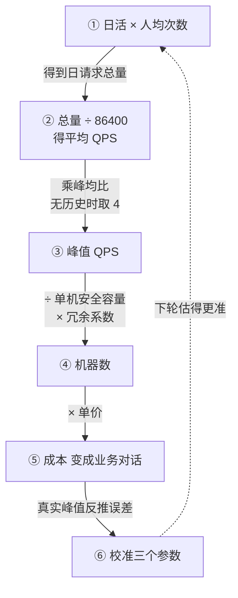

# 容量估算的通用骨架：从峰值QPS到机器数的推导演练

## 要解决的问题

容量估算要解决的问题，是把"业务说要有多少人用"翻译成"系统需要多少台机器"。没有这层翻译，扩容就是拍脑袋：高峰前临时加机器、事后回收，要么浪费要么不足。容量规划与压测要用同一个负载模型说话（见 [[工程知识/后端系统：在并发、失败与变化中维持服务/基础设施/容量规划与压测要用同一个负载模型说话.md]]），估算正是这套语言的起点：先有可推导的数字，压测才有靶子，扩缩容才有依据。

## 推导链

从业务量到机器数，整条链六步，每步的误差来源单独可控：

1. **日活 → 日请求总量**。DAU × 人均请求次数。人均次数拿真实日志统计，不拍：一个用户一次会话刷新列表 5 次、点开详情 3 次，人均 20 次与人均 5 次意味着四倍机器。这个参数是整条链里最常被拍的，也是事后最好校准的。
2. **日请求总量 → 平均 QPS**。总量 ÷ 86400。平均数只在规划阶段做粗校用，真正决定机器数的是峰值。
3. **平均 → 峰值 QPS**。有历史数据直接取历史峰均比；没有历史时用集中度粗估：80% 流量集中在 20% 时间，峰值系数 ≈ 4。促销秒杀类场景不适用，见边界一节。
4. **峰值 QPS → 机器数**。峰值 QPS ÷ 单机安全容量，再乘冗余系数。单机容量不是核数，是压测压出来的"该服务在该硬件上的最大安全 QPS"（通常留 30% 余量）。冗余系数是可用性决策：单 AZ 用 1.2（日常波动余量），双 AZ 用 2.0（单 AZ 故障时另一半接管），异地多活 2.5 以上。这步的本质是把"可用性等级"翻译成钱——双 AZ 的代价就是机器数翻倍，这个账必须摆上桌。
5. **机器数 → 成本**。机器数 × 单价。到这里第一次出现钱，才和"业务口中的 X 万人用"对上账。估算结果是不可接受的 500 台？说明要么技术方案（缓存、CDN、异步化）要重做，要么 SLA 要调整。估算在这里变成一个业务对话工具。
6. **校准**。真实流量进来后，拿真实峰值反推误差，修正人均次数与峰值系数。估算的最终产物是"下次估得更准的模型"，服务本身就是自己的校准器。

## 背景与代价

这套推导替代的是两种更粗的做法：一是"CPU 高了就加机器"（滞后，且没有预算感），二是"拿 CPU 利用率公式直接算机器数"（忽略流量分布与可用性决策）。Google SRE 的容量规划是这条路线的代表，其核心思想是把容量当成需求与成本之间的翻译器，让"扩容"从一个指令变成一个可谈判的成本条目。

设计里最精巧的一步是**冗余系数显式化**。多数容量讨论把冗余混在"多加几台"里糊涂过去；这条链把它单列，让"双 AZ 的代价是机器数×2"成为桌面上可谈判的条目，而不是埋在 CPU 公式里的隐形支出。代价本质要摆明：估算换来了决策依据，付出的是维护成本——人均次数、峰值系数、单机容量这三个参数每季度都要拿真实数据重新校准，不校准的估算模型比没有模型更危险（它带着错误的自信）。



图从天级业务量一路推到钱：人均次数拿日志统计，平均 QPS 只作粗校，真正定机器数的是峰值；峰值除以压测压出来的单机安全容量，再乘冗余系数——单 AZ 用 1.2、双 AZ 用 2.0，可用性等级在这里被翻译成成本。虚线是闭环：上线后拿真实峰值反推，修正人均次数、峰值系数、单机容量三个参数，让这套模型自己变准。整条链的价值在于把「扩容」从一句指令变成一个可推导、可对账、可谈判的条目。

## 可运行示例与案例回流：容量推演的账

```text
峰值 QPS 5 万的推导演练（通用骨架）：

第 1 步 列出目标：峰值 5 万 QPS、P99 200ms、可用性 99.95%
第 2 步 分解路径：网关 → 业务服务 → 缓存(95%命中) → 数据库(5%回源)
第 3 步 算各层负载：
  业务服务：5 万 QPS × 单机 1000 QPS = 50 台 → 冗余 30% = 65 台
  数据库：5 万 × 5% = 2500 QPS 回源，主库写 5000 QPS → 一主三从
  缓存：5 万 QPS，单节点 10 万 → 2 节点带主从
第 4 步 压对账：
  按推演配置压测 → 实测单机只有 600 QPS（假设偏差 40%）
  → 机器数改 84 台，容量结论以实测为准，推演值只是起点
第 5 步 留故障余量：挂 20 台还能扛峰值吗？→ 剩 64 台 < 65 台需求 → 不达标
  → 要么加机器到 84，要么确认降级预案能砍 20% 流量
```

案例回流：跳过对账的实录——推演按"单机 1000 QPS"算好 50 台上线，真实流量一来 CPU 100%（单机实际只有 550），扩容救场；偏差来源是推演用的基准数来自别人家的压测报告（硬件、数据形态都不同）。另一实录是只算均值不算余量——容量刚好够峰值，一个可用区挂掉全站过载（故障余量那一步存在的意义）。推演的纪律与 [[工程知识/性能工程：从用户等待到资源瓶颈/观测与诊断/基准测试必须先定义负载和测量误差.md]] 同源：假设可对账、数字报误差、结论带边界。

## 边界

- **秒杀类瞬时洪峰不适用**。开售瞬间百倍流量不能乘峰值系数，要单独建瞬时模型（漏桶整形 + 队列），否则机器数虚高一个量级。
- **自动扩缩容不替代估算**。估算管"常态应保有的水位"，自动扩缩容管"临时波动"。把常态水位交给自动策略，扩容速度赶不上流量增速时，峰前就是小马拉大车。两者的关系是"估算定底盘、自动策略管波动"，共用同一个负载模型。
- **读写比悬殊的服务要分开估算**。读链路与写链路分别走这条链（读侧可加缓存层折减），不能拿一个混合 QPS 一起除。
- **依赖方容量是隐藏项**。估算自家机器数时，同步依赖（数据库、下游 RPC）的容量缺口会以超时形式表现，误判为自家容量不足。整链路超时预算见 [[工程知识/后端系统：在并发、失败与变化中维持服务/分布式可靠性/超时、重试与幂等共同定义调用语义.md]]。

## 验证

- **对账验证**：拿一个已运行服务，用这条链从 DAU 重新推机器数，与实际机器数对不上时查三个参数——人均次数（日志值 vs 假设值）、峰值系数（历史峰均比 vs 粗估 4）、单机容量（压测值 vs 经验值）。误差全部来自这三个参数，对不上就停下查，不许硬凑。
- **演练验证**：新服务上线 30 天后，拿真实峰值反推，把误差从倍数级收敛到 ±20% 以内。预期一轮校准后三个参数进入该服务的容量档案，下次估算直接复用。

## 相关

- [[工程知识/后端系统：在并发、失败与变化中维持服务/基础设施/容量规划与压测要用同一个负载模型说话.md]] —— 估算链与压测共用负载模型
- [[工程知识/性能工程：从用户等待到资源瓶颈/观测与诊断/排队论给容量一个可推导的模型.md]] —— 单机承载上限的排队论解释
- [[工程知识/后端系统：在并发、失败与变化中维持服务/服务设计/服务降级是有损服务，损什么损多少要变成业务决策.md]] —— 估算失守后的降级阶梯
- [[工程知识/后端系统：在并发、失败与变化中维持服务/服务设计/连接池的容量数学：池大小与排队等待的权衡.md]] —— 容量推导的通用骨架
