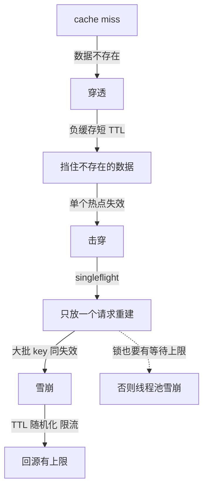

# 缓存改变读写路径、一致性与故障模式

## 核心要点

| 维度 | 回答 |
| --- | --- |
| 要解决的问题 | 事实源读取成本或延迟过高，且相同请求会重复读取相同结果。 |
| 本质 | 复制一份可丢弃的读取状态，缩短路径，但引入陈旧、失效、淘汰和回源竞争。 |
| 做法 | 先定义事实源、允许陈旧窗口、键的身份维度、写入/失效顺序、击穿保护、容量和故障回退，再选择 cache-aside 等模式。 |
| 效果与代价 | 降低命中请求的延迟和源站负载；代价是额外内存、失效复杂度、回源峰值和数据不一致窗口。 |
| 边界 | TTL 只限制最晚陈旧时间，不保证立即一致；缓存不能绕过租户、权限、版本和删除语义。 |
| 验证 | 测命中率、陈旧窗口、回源 QPS、热点、重启、网络分区、撤权和版本切换，确认故障时仍不会读到越权数据。 |

缓存用空间和失效复杂度换取更短读取路径。它不是“加一个 Redis”这么简单：必须明确事实来源、可接受陈旧度、键的身份范围、失效触发、淘汰、并发击穿和故障时的回退。

例如用户刚撤销权限后，旧的“用户 + 资源”缓存仍可能返回可见内容；这不是 TTL 过短或 Redis 性能问题，而是权限版本没有成为缓存身份且撤销事件没有进入失效路径。缓存设计要先回答“错多久、错给谁、错了如何收敛”。

## 常见路径

| 模式 | 读取 | 写入 | 适用边界 |
| --- | --- | --- | --- |
| cache-aside | 先查缓存，未命中查源并回填 | 先写源再删/更新缓存 | 灵活，需处理并发和失效窗口 |
| read-through | 缓存代理加载源 | 由缓存层协调 | 简化调用方，控制面更集中 |
| write-through | 同步写缓存和源 | 成功后返回 | 一致性较强，写延迟更高 |
| write-behind | 先写缓存，异步写回数据源 | 需要持久队列 | 适合可接受延迟的数据，丢失风险高 |

TTL 只限制最晚陈旧时间，不保证更新立即可见；主动失效、版本键和事件通知各有传播延迟。键必须含租户、权限、语言、模型/索引版本等维度，避免跨主体污染。

## 写入路径决定一致性窗口

最常用的 cache-aside 写路径是“先提交事实源，再删除缓存”。顺序反过来时，另一个读请求可能在数据库提交前把旧值重新写回缓存。即便顺序正确，删除也可能失败，因此高一致性场景要把失效事件放进与业务写入一致的 outbox，再由消费者重试删除或推进版本键。

延迟双删只能缩小特定并发窗口，不能替代可证明的传播机制；同步双写数据库和缓存则会引入两个事实源。任何方案都应明确：允许错多久、对谁可见、失效丢失后如何收敛，以及数据库成功但缓存操作失败时由谁恢复。

## 失败模式

| 模式 | 本质 | 常用保护 |
| --- | --- | --- |
| 穿透 | 请求的数据根本不存在，每次都回源 | 输入校验、负缓存、Bloom Filter；负缓存 TTL 要短 |
| 击穿 | 单个热点 key 失效，大量请求同时重建 | singleflight/互斥重建、逻辑过期、热点预热 |
| 雪崩 | 大批 key 同时失效或缓存整体不可用 | TTL 随机化、分批预热、回源限流、熔断与降级 |

热点不均、淘汰抖动和故障回源同样会把容量压力转移到数据库。所有保护都必须有并发和队列上限；锁住重建却让十万请求无限等待，只是把数据库雪崩改成线程池雪崩。



三种失效的差别在「谁失效了」：穿透是数据本身不存在，负缓存用短 TTL 把「查过没有」记住；击穿是一个热点 key 过期，大量请求同时去重建同一个值，靠互斥重建或逻辑过期只放一个请求进去；雪崩是大批 key 同时失效或缓存整体不可用，TTL 随机化把过期时刻打散，回源限流给数据库兜底。虚线提醒的是保护措施自身的边界：互斥重建如果让十万个请求无限等待，压力就从数据库搬到了线程池，所有保护件都必须配等待上限。

## 可运行示例与案例回流：读写路径的实录

```text
同一份用户资料，加缓存前后的读写路径账：

读路径（Cache-Aside 通用形态）：
  命中：应用 → 缓存（1ms）→ 返回           ← 95% 的请求走这条
  未命中：应用 → 缓存 miss → 数据库（20ms）→ 回填缓存 → 返回
  命中率 95% 时平均读延迟 = 0.95×1 + 0.05×21 ≈ 2ms（原来 20ms）

写路径（缓存与库两步，一致性从这里开始出问题）：
  先更库后删缓存（推荐形态）：更新 DB → DEL cache
  失败窗口 1：删缓存失败 → 缓存留旧值直到过期（脏读窗口 = TTL）
  失败窗口 2：读请求在"更库后、删缓存前"读到旧缓存（毫秒级窗口）
  补偿：删除失败进重试队列 + 订阅 binlog 兜底删

故障模式的账：缓存挂 = 流量全量回源
  库容量按"5% 回源"设计，100% 回源直接过载 → 限流与熔断是兜底件
```

案例回流：脏读窗口实录——先删缓存后更库的旧写法，删后到更库前的并发读把旧值回填（回填窗口与写库耗时同量级），用户改了昵称刷新还是旧值；改"先更库后删"加 binlog 兜底后归零。回源过载实录——缓存集群重启未预热，100% 回源打挂库（库的容量假设是命中 95%），修复是重启带预热与接入限流（与 [[工程知识/后端系统：在并发、失败与变化中维持服务/服务设计/缓存穿透击穿与雪崩是三种不同的失效模式.md]] 的失效模式账互为姊妹——那篇讲 key 级失效，本篇讲路径级失效）。

## 验证

验证的锚点：缓存行为要与撤权与更新对账——预写更新事实源并撤权后旧值不应再被读出，实测命中旧键返回已撤权内容，与预期对不上。

测命中率、p95/p99、陈旧窗口、回源 QPS、淘汰、重启、网络分区、热点、撤权和版本切换。RAG 缓存尤其要验证文档删除/撤权、embedding 版本和 query 可见时间，不能让缓存绕过 ACL。

最小实验：写入一条带权限和版本的记录，随后更新事实源、撤权、切换 schema/embedding 版本并重启缓存；分别观察命中旧键、回源、失效事件丢失和冷启动重建。通过读取主体、版本和陈旧时间断言缓存只提供允许范围内的派生结果。

关系：[[工程知识/数据系统：在并发与故障中保存事实/数据系统：在并发与故障中保存事实]] · [[工程知识/AI 系统工程：从模型能力到生产能力/知识与检索/RAG数据管道从文档到可引用证据]]

## 相关

- [[工程知识/后端系统：在并发、失败与变化中维持服务/服务设计/缓存穿透击穿与雪崩是三种不同的失效模式|缓存穿透击穿与雪崩是三种不同的失效模式]]——把失效分成穿透/击穿/雪崩三种模式分别给防御，是本篇失效轴的展开
- [[工程知识/后端系统：在并发、失败与变化中维持服务/基础设施/DNS解析的全链路：递归缓存与失效传播.md]] —— DNS 是缓存一致性命题在命名系统的实例
- [[工程知识/后端系统：在并发、失败与变化中维持服务/基础设施/CDN的回源与边缘缓存：静态加速背后的机制.md]] —— CDN 是缓存一致性命题的地理轴实例
