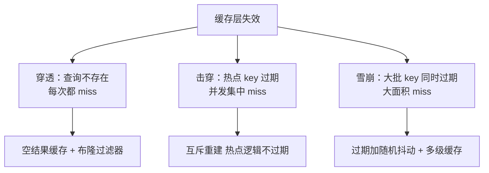
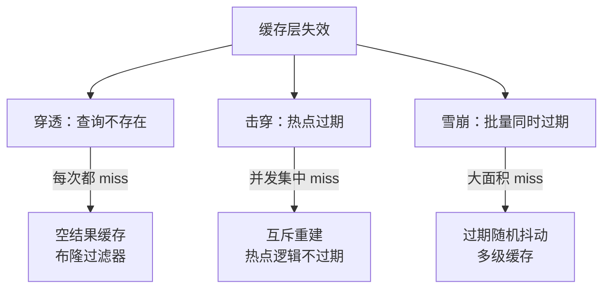

# 缓存穿透击穿与雪崩是三种不同的失效模式

缓存失效经常被说成一件事，实际是三种失效模式，防法不同、防错一种另外两种照样发生。要解决的问题：缓存层是数据库前面的减压阀，失效模式决定了失效瞬间流量打到数据库的形状——是无中生有的流量、还是集中一点、还是全量洪峰，对应的防御工事完全不同。

## 机制：三种失效模式对照表

| 模式 | 触发条件 | 流量形状 | 数据特征 | 首选防御 |
| --- | --- | --- | --- | --- |
| 穿透（penetration） | 查询的 key 在缓存与数据库都不存在 | 恶意或爬虫制造无中生有查询 | 每次都 miss | 空结果缓存/布隆过滤器 |
| 击穿（breakdown/hotspot invalid） | 热点 key 过期瞬间 | 单 key 集中放行 | miss 集中在一个 key | 互斥重建/singleflight |
| 雪崩（avalanche） | 大批 key 同时过期或缓存整体宕机 | 全量洪峰 | 大面积 miss | 过期时间加随机抖动/多级缓存 |

穿透的防御核心是承认"不存在的数据"也是一个可缓存的查询结果：数据库返回空也写进缓存（短 TTL），或前置布隆过滤器（位数组+多哈希函数的结构，能断言"一定不存在"，有误判率但不会漏判）拦截必然 miss 的 key。击穿的防御核心是让并发重建收敛成一次回源：互斥锁或 singleflight 让一个请求去数据库、其余等待结果。雪崩的防御核心是把同时性打散：TTL 加随机抖动避免集体过期，缓存高可用避免整体宕机，或用多级缓存把洪峰摊薄。

三者的收益都是缓存命中率恢复后压力归位；代价与权衡：空结果缓存占内存、布隆有误判、互斥重建让等待请求的延迟变高、抖动只是降低同时性不消除洪峰。

三种失效打向数据库的流量形状不同，防御工事也就不通用：



上图给出的是三者各自的核心机制与首选工事；把限量熔断叠在最后一道，才覆盖住雪崩的兜底。

## 失效防御的收益判断与验证

防御是否值得做，取决于缓存层失效瞬间的数据库余量：排队论视角（见 [[工程知识/性能工程：从用户等待到资源瓶颈/观测与诊断/排队论给容量一个可推导的模型|排队论给容量一个可推导的模型]]）下，全量洪峰超过数据库吞吐则队列发散、延迟爆炸。验证方法：
```bash
# 压测时故意制造三种失效再观察数据库 QPS 形状
redis-cli --hotkeys                 # 找热点 key（击穿排查）
redis-cli monitor | grep -c "miss"  # miss 率观察
```
治理上与 [[工程知识/后端系统：在并发、失败与变化中维持服务/任务与并发/限流熔断与隔离控制故障半径|限流熔断与隔离控制故障半径]] 配套：限流是雪崩的最后防线，布隆是穿透的前置闸门，两者不可互相替代。

## 可运行示例、量化锚点与案例回流：三种失效的账

```text
三种失效模式的对照账：

穿透（查不存在的数据，缓存与库都没有）：
  攻击者拿随机 key 打接口 → 每次都打到库 → 库被打满
  防御：空值缓存（查无此 key 也缓存 30s）+ 布隆过滤器（先过一层"肯定没有"）

击穿（一个热点 key 到期瞬间，并发全打到库）：
  热 key 过期的一毫秒内 1000 个并发请求同时 miss → 1000 次相同查询砸向库
  防御：互斥重建（只放一个请求去库，其余等缓存回填）+ 热点不过期（逻辑过期）

雪崩（大量 key 同一时刻过期或缓存集群宕机）：
  零点批量任务写入的缓存统一 1 小时过期 → 1 小时后集体 miss
  防御：过期时间加随机抖动（±20%）+ 缓存集群高可用 + 限流兜底

数字锚点：一次击穿对库的冲击 = 该 key 的并发倍数（千级并发直击库），
  布隆过滤器的误判率 1% 时穿透流量被挡 99%；
  过期抖动把雪崩的同步洪峰摊成 20% 宽度的分布，峰值降为 1/5。
```

案例回流：雪崩实录的通用形态——缓存集群重启后所有 key 同时失效（冷启动），库被瞬间打挂，重启脚本要带预热步骤（先读热点数据回填缓存再放量）；抖动的纪律与 [[工程知识/数据系统：在并发与故障中保存事实/数据管道与流处理/数据编排要保证依赖、重试与幂等.md]] 的重试抖动同源——任何"同批同时发生"的机制（过期、重试、定时任务）都是同步洪峰的候选源，都要摊开。缓存与库的一致性失效模式见 [[工程知识/后端系统：在并发、失败与变化中维持服务/服务设计/缓存改变读写路径、一致性与故障模式.md]]。

三种失效打向数据库的流量形状不同，防御工事也就不通用：



上图把三者并在一起看：穿透是无中生有的流量、击穿集中在单个 key、雪崩是全量洪峰，三种形状对应三套工事，限量熔断叠在最后一道兜底。

验证的锚点：三失效的防御要与压测对账——穿透用随机 key 打（看布隆过滤与空值缓存拦了多少）、击穿用热 key 过期瞬间的并发打（看互斥重建生效）、雪崩用批量过期场景打（看抖动摊峰），实测拦截率与库压力与设计对账，对不上的防御是纸面防御。

## 边界

本篇讲缓存层的失效模式分类与防御选型。缓存与数据库的一致性（失效之外的另一大类问题）见 [[工程知识/后端系统：在并发、失败与变化中维持服务/服务设计/缓存改变读写路径、一致性与故障模式|缓存改变读写路径、一致性与故障模式]]。本库已有 [[工程知识/后端系统：在并发、失败与变化中维持服务/服务设计/缓存改变读写路径、一致性与故障模式|缓存改变读写路径]] 总纲，本篇是它在"失效"轴上的展开。布隆过滤器的结构细节与误判率推导是独立主题，此处按概念自包含只给定义，不展开。

## 相关

- [[工程知识/后端系统：在并发、失败与变化中维持服务/服务设计/缓存改变读写路径、一致性与故障模式]]——缓存总纲，本篇是其失效轴展开
- [[工程知识/后端系统：在并发、失败与变化中维持服务/任务与并发/限流熔断与隔离控制故障半径]]——雪崩的兜底防线
