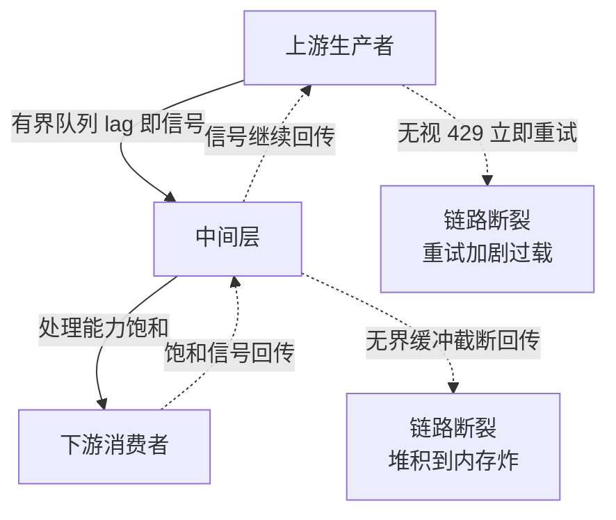

# 背压的传递链路：从下游饱和到上游减速

## 要解决的问题

系统过载时有两个选择：硬扛（无限缓冲，内存炸）或丢弃（无界失败，数据丢）。背压（backpressure）选第三条路：**把下游的饱和状态回传给上游，让上游减速**——生产者的速度对齐消费者的速度，系统在过载时优雅降速而不是崩溃。要解决的问题是背压的传递机制（饱和信号怎么穿过层层调用链回传）与断裂点（哪层丢了这个信号，过载就变成局部灾难）。这是 socket读写缓冲区（见 [[工程知识/后端系统：在并发、失败与变化中维持服务/基础设施/socket读写缓冲区：拥塞窗口与应用层背压的连接点.md]]）的应用层续篇，与限流熔断与隔离（见 [[工程知识/后端系统：在并发、失败与变化中维持服务/任务与并发/限流熔断与隔离控制故障半径.md]]）构成过载防御的三件套（限流挡入口、熔断断路径、背压传减速）。

## 机制

**背压的物理层原型**。TCP 的流控是背压的教科书模型：接收方通告窗口（rwnd）缩小时发送方减速，接收方处理不过来时窗口归零，发送方暂停。这个模型的三个要素（饱和信号显式、传递实时、生产者强制响应）是应用层背压的设计模板。

**应用层的传递机制**。
- 同步链路：响应延迟即信号。调用方等响应（阻塞），被调方慢则调用方自然慢（线程被占住），过载沿调用链反向传导。问题：线程是昂贵资源，阻塞传导的“减速”以线程耗尽为代价（连接池耗尽、线程池满，见连接池（见 [[工程知识/后端系统：在并发、失败与变化中维持服务/服务设计/连接池的容量数学：池大小与排队等待的权衡.md]]））。
- 异步链路：队列长度即信号。消息队列的堆积长度是显式信号（消费 lag），生产者可观测 lag 决定减速（暂停生产、降采样）。Reactive Streams 的协议（request(n) 信号）把它标准化：订阅者按消化能力 request，发布者按 request 发送，无 request 不发送——背压成为协议语义而非最佳实践。
- 跨系统：显式的限速回传。下游过载时通过协议头（HTTP 429 + Retry-After、gRPC 的 RESOURCE_EXHAUSTED）告知上游，上游按信号减速（降并发、降采样）。这要求上游“听得见”：无视 429 的上游把显式信号当错误处理（重试加剧过载）。

**断裂点：背压在哪断**。常见断裂：上游无视信号（重试风暴，把减速信号转成更多负载）；中间层无界缓冲（“缓冲解耦”变成“缓冲藏问题”，堆积后内存炸或超时雪崩）；边界层无协议（服务间有背压、对外的 API 无信号，外部流量持续涌入）。断裂点的本质是**某一层把“减速”私自翻译成了“扛住”或“丢弃”**，链路的整体弹性就在这层破产。

图上实线是数据流向下、虚线是饱和信号回传，两个断裂点分别画在中间层与上游：中间层用无界缓冲把回传路径截断，信号传不上去，上游继续全速生产；上游把回传信号当错误处理，收到 429 仍立即重试，减速信号反而变成更多负载。背压是链路性质，断在任何一层，整链就失去意义。

**背压与用户路径的权衡**。系统级减速传导到用户侧是体验损失（页面慢、请求被拒）。设计决策：哪些路径允许背压到用户（可降级的后台任务直接降速）、哪些路径必须缓冲或拒绝（用户交互路径宁可明确拒绝不可悬挂）。这是把过载保护（限流的拒绝语义）与背压（减速语义）按路径组合的业务决策。

## 背景与代价

思想背景：背压一词源于流体力学（管道下游压力回传上游），流控与拥塞控制（TCP 1981+，Jacobson 1988）是工程原型。应用层背压的标准化是 Reactive Streams（2013-2017，Netflix/Pivotal 等联合规范，Java 的 Flow API 成型）把 request(n) 做成协议。分布式链路的背压实践（消息队列 lag 控制、429 生态）在微服务潮后普及。Linux 内核的 memcg 与 write-back 背压（2010s）是 OS 层的同类机制。

最精巧的一笔是**Reactive Streams 把背压从“实现细节”升成“协议语义”**。此前的背压靠各框架私约（Netty 的水位线、Akka 的 mailbox 限制），互操作时信号丢失。规范定义了四个接口（Publisher/Subscriber/Subscription/Processor）与最小协议（request(n) 与 cancel），任何实现只要遵守协议，背压信号就能跨框架、跨进程传递（gRPC 侧的 flow control 与应用侧的 RS 协议对接）。这一笔把“层间私约”统一成“公共约定”，背压从每层的最佳实践变成全链路的可组合性质。代价要摆明：背压的传递要求链路上每一层都“听得见、传得动”——任何一层无界缓冲或无视信号，整链失效（背压是木桶性质，短板层决定上限）；全链路背压的实现成本高（每层要实现信号语义，跨系统要协议支持），多数系统只做部分链路（入口限流 + 关键队列 lag 控制），全链路是理想形态不是默认形态；减速传导到用户是体验代价，过载时的用户路径策略（拒绝、降级、排队）要业务参与决策（见服务降级是有损服务（见 [[工程知识/后端系统：在并发、失败与变化中维持服务/服务设计/服务降级是有损服务，损什么损多少要变成业务决策.md]]）），纯技术不能替业务定损。

## 边界

- **背压是链路性质，实现要逐层检查**。上线前画链路图逐层标注：这层有信号吗（队列长度、池利用率）？响应信号吗（减速或拒绝）？信号传给上游吗？标注不出的层就是断裂点。
- **无界缓冲比直接失败更危险**。堆积掩盖过载（延迟上升但系统“看起来正常”），堆积到内存极限时雪崩更猛。队列大小一律有界，满时的行为显式设计（拒绝或降速）。
- **429/RESOURCE_EXHAUSTED 的客户端礼仪要生态化**。服务端发信号只是半件事，客户端按 Retry-After 减速、按信号降并发才闭环。调用方的共享 SDK 统一实现退避逻辑（指数退避 + 抖动），生态级一致性靠公共库。
- **背压不替代限流，两者分工**。限流是入口的硬保护（过量直接拒），背压是链路的软调节（传导减速）。只有限流：过载阈值内的链路问题无人传导；只有背压：突发洪峰直接冲进系统。组合才是完整防御。

## 验证

- **全链路过载演练**：下游注入慢（μ 拉长），观测上游传导。预期：有背压链路上游吞吐自动下降（生产减速），无背压链路（中间无界缓冲）堆积到内存告警。传导与断裂的对照证据。
- **429 响应实验**：上游客户端在收到 429 后的行为观测（带退避的 SDK vs 无礼客户端）。预期：带退避 SDK 的重试间隔按 Retry-After 拉长，无礼客户端立即重试加剧过载。信号礼仪的差异实证。
- **队列 lag 控制实验**：消费 lag 超阈值触发生产降速，观测 lag 曲线。预期：降速后 lag 从发散转为收敛（背压生效的动态证据）。

## 相关

- [[工程知识/后端系统：在并发、失败与变化中维持服务/基础设施/socket读写缓冲区：拥塞窗口与应用层背压的连接点.md]] —— 背压的传输层原型
- [[工程知识/后端系统：在并发、失败与变化中维持服务/服务设计/连接池的容量数学：池大小与排队等待的权衡.md]] —— 池耗尽的减速传导
- [[工程知识/后端系统：在并发、失败与变化中维持服务/任务与并发/限流熔断与隔离控制故障半径.md]] —— 过载防御三件套的分工
- [[工程知识/后端系统：在并发、失败与变化中维持服务/服务设计/健康检查的三层语义：存活就绪与深度.md]] —— 过载防御的链路视角
- [[工程知识/后端系统：在并发、失败与变化中维持服务/服务设计/分布式限流的四种算法：计数漏桶令牌与滑动窗口.md]] —— 拒绝与减速的两种响应
- [[工程知识/软件构建：让变化可以理解、验证与交付/架构与代码/错误处理的分类学：错误类型与恢复策略的映射.md]] —— 429 是瞬态错误标准信号，分类先于恢复动作
