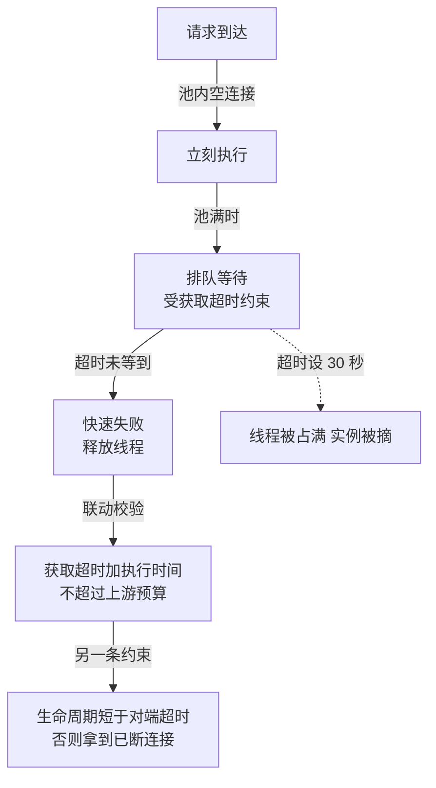

# 连接池参数的联动校验：池大小、超时与队列深度是一组约束

> **要点**：连接池的池大小、获取超时、连接最大生命周期三个参数各管一段排队论，单独调任何一个都会把问题挤到另一段——三者的合法组合是联动约束，配置校验要在启动时把矛盾组合拦下来。

## 要解决的问题

连接池的参数调优有一类高频翻车：**参数单独看都合理，合起来互相冲突**。形态一：池大小按 CPU 核数算（合理），获取超时设 30 秒（单独看合理），下游数据库抖动 10 秒——300 个请求线程各持一个"获取中"的空转等 30 秒，线程池被占满，健康检查超时，实例被摘流量，**一次 10 秒的下游抖动放大成全面故障**。形态二：连接最大生命周期设了 4 小时，数据库侧的空闲连接超时是 1 小时——应用池里的连接被数据库悄悄断掉，应用拿到已失效的连接报通讯错误，重试又拿到另一条失效连接，**故障在两个参数的夹缝里周期性出现**。本库后端域"连接池的容量数学"已解决"池多大"的推导；本篇解决另一半：**参数之间的联动约束**——合法组合的校验规则，以及矛盾组合各自的故障形态。

## 机制：三参数各管一段排队系统

连接池是一段排队系统，三个参数对应三段不同的控制：

**池大小管并发容量**：同时有多少请求能真正到达数据库。池太小，并发被池卡住（排队在池外，等待获取连接）；池太大，数据库被压垮（排队在数据库内，锁等待、连接数上限）。容量数学给出静态推导，这里的重点是**池大小决定"获取连接"这段等待的基线时长**。

**获取超时管故障的扩散半径**：等不到连接时等多久放弃。超时长，故障被"捂住"——上游线程被长时间占用，故障从数据库层扩散到应用线程池再到整个实例；超时短，故障被"释放"——请求快速失败，重试或降级接手。**获取超时的本质是故障扩散速度的旋钮**，它必须与上游的超时预算联动（获取超时 + 执行超时 < 上游整链路预算），独立设置必然出事。

**最大生命周期管连接的新鲜度**：连接用多久强制换新。它与**对端的空闲/最大连接超时**构成联动——应用侧的生命周期必须短于对端的超时，否则对端先动手，应用拿着已失效的连接。**生命周期参数是跨系统约定**，单边设置等于把对端的超时当成"未知风险"。

三段联合的校验规则：获取超时 + 执行超时 ≤ 上游预算的某个比例；生命周期 + 安全余量 < 对端超时；池大小 × 实例数 ≤ 数据库连接上限的合理份额。**每条规则跨了两个参数（或跨了系统边界），任何单参数视角的调优都无法发现违规**。



三段排队各由一个参数看住：池大小决定「有多少请求能同时到达数据库」，获取超时决定「等不到时多久放弃」（放弃得快，故障就停在连接池内；放弃得慢，等待蔓延到上游线程池），生命周期决定「连接多久换新」。联动校验是这张图的关键——获取超时加执行时间不能超过上游预算，生命周期必须短于对端超时，池大小乘实例数不能超过数据库连接上限。任何一条被破坏都不会在启动时报错，只会在第一次下游抖动或连接老化时变成事故。

## 为什么联动矛盾在启动时不可见

矛盾组合能上线，因为**校验时机错位**：

**配置校验按参数各查各的**：常规配置校验查单参数的合法范围（超时是正数、池大小是正整数），跨参数关系没有检查项——矛盾组合全部通过校验。

**故障延迟到运行时**：生命周期与对端超时的矛盾要等连接老到那个年龄才爆发（可能数小时后）；获取超时与下游抖动的矛盾要等第一次抖动——**启动时的全绿不代表运行时的正确**，联动校验必须在启动时静态做（配置层面可判的），动态可判的进健康检查。

**参数的"合理值"手册各写各的**：池大小的推荐文章讲池大小，超时的推荐文章讲超时——**调优知识按参数组织而不是按约束组织**，照着各篇调出来的组合天然缺乏联动审视。

## 修复与防线

**启动时联动校验**：连接池初始化时执行约束检查——获取超时 + 最大执行时间与上游超时预算比对、生命周期与对端超时比对、总连接数与数据库上限比对，**违规即拒绝启动**（fail-fast，本库缺陷分析域的既定纪律）。检查逻辑进连接池封装层，全项目共享。

**对端超时的显式约定**：数据库的空闲超时、代理的最大连接时长是连接池配置的**输入**——把它们查清楚写进配置注释（"对端 wait_timeout=3600s，故 maxLifetime=1800s"），跨系统约定显式化，后人改参数时看得见依据。

**抖动演练校验超时预算**：在预发环境注入下游延迟（10 秒级），观察应用线程池与健康检查的反应——**超时参数的组合是否正确，演练给出的答案是运行时监控给不出的**（监控看到的是已经扩散后的结果）。

**监控按排队段分列**：获取等待时长、执行时长、连接年龄分布三个指标分列监控——故障发生时按"哪段排队异常"直接定位到对应参数，排查不再从全部参数重新猜起。

## 边界

三条边界防止防线走形。

**约束值不是全局常量**：不同业务的上游预算不同（同步接口 3 秒、异步任务 30 秒），连接池约束按用途分级配置——一套全局值必然对某些用途过紧、某些过松。

**池外并发也要算进容量**：多个实例共享一个数据库时，"池大小 × 实例数"才是数据库侧的真实并发——单实例视角的池大小推导在多实例部署下要重新按总量核对，约束检查按部署形态取数。

**连接池不是万能缓冲**：池的队列只是排队系统的第一段，上游的线程池、消息队列各自是更上游的段——**排队链的每段预算相加才是整链路延迟**，任何一段的超预算都会把等待挤压到别的段。排队论给的是全链模型，连接池只是其中一段。

## 验证

可复现的验证路径：

1. 静态校验验证：配置矛盾组合（生命周期 > 对端超时），启动应被联动校验拒绝并指出冲突项；
2. 演练验证：预发注入下游 10 秒延迟，确认获取超时按预算快速失败、线程池不占满、健康检查存活；
3. 老化验证：把生命周期临时调到超过对端超时（测试环境），确认通讯错误周期出现；恢复正确配置后错误消失——验证"生命周期 < 对端超时"约束的真实性；
4. 断言锚点：**联动校验在连接池封装层常驻；三个排队段指标分列；对端超时数值在配置注释中可查**。

```text
启动断言 = 矛盾组合拒绝启动并指出冲突
演练断言 = 注入延迟后快速失败，实例不被摘
老化断言 = 生命周期 + 余量 < 对端超时成立
```

三个参数、三段排队、三条跨参数约束——联动校验把"各查各的"配置升级为"合起来自洽"的配置，连接池的故障形态从"参数夹缝里的偶发"收敛为"可推导、可演练、可拦截"。验证时预期与实际的对照规则提前写明：矛盾组合预期在启动时被拒绝并指出冲突项，对不上（照常启动）即联动校验未覆盖该约束；注入下游延迟后预期获取快速失败、线程池不占满、实例不被摘，对不上（请求堆积、实例下线）即超时预算组合仍不成立，回到预算算式重推。

## 相关

- [[工程知识/后端系统：在并发、失败与变化中维持服务/服务设计/连接池的容量数学：池大小与排队等待的权衡]] —— 池大小的静态推导，本篇补跨参数约束
- [[工程知识/后端系统：在并发、失败与变化中维持服务/分布式可靠性/超时的层次设计：连接、读写与整链路的预算分配]] —— 超时预算联动的总纲
- [[工程知识/后端系统：在并发、失败与变化中维持服务/服务设计/容量估算的通用骨架：从峰值QPS到机器数的推导演练]] —— 排队系统的全链视角
- [[工程知识/性能工程：从用户等待到资源瓶颈/观测与诊断/tcpdump与抓包定位网络问题的现场方法]] —— 连接类故障的现场定位方法
- [[工程知识/性能工程：从用户等待到资源瓶颈/存储与网络/TIME_WAIT是连接收尾的代价与设计]] —— 连接生命周期参数的机制背景
