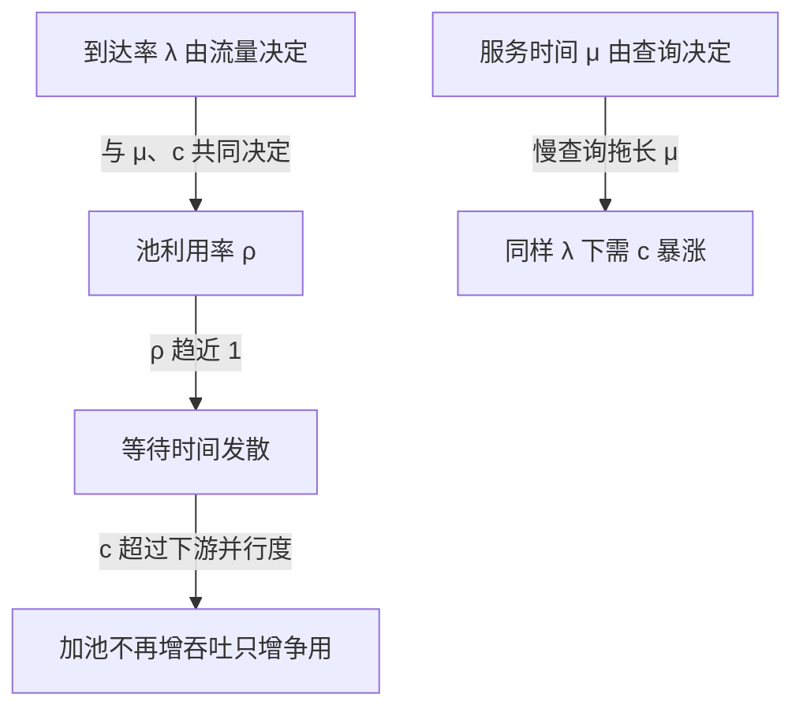

# 连接池的容量数学：池大小与排队等待的权衡

## 要解决的问题

应用与数据库（或下游服务）之间的连接池，池大小是容量决策：太大压垮下游（数据库的连接是重资源，每连接内存与切换成本），太小让请求排队（等待连接的延迟进用户路径）。拍脑袋的“池 = CPU 核数 × 2” folklore 遮住了真正的数学。要解决的问题是**把池大小从 folklore 还原成排队论的推导**：到达率、服务时间、并行度三要素决定最优池，让扩容决策（加池子还是加机器）有可计算的依据。这是容量估算的通用骨架（见 [[工程知识/后端系统：在并发、失败与变化中维持服务/服务设计/容量估算的通用骨架：从峰值QPS到机器数的推导演练.md]]）在连接层的特化，底层是排队论（见 [[工程知识/性能工程：从用户等待到资源瓶颈/观测与诊断/排队论给容量一个可推导的模型.md]]）。

## 机制

**池的数学模型**。池是 M/M/c 排队系统的 c 个服务员：请求以 λ 到达，每个占一个连接 μ⁻¹ 时间（含网络往返 + 查询执行），c 个连接并行服务。三个推论：池未满时等待时间由利用率 ρ = λ/(cμ) 决定（ρ→1 等待时间发散）；池满时新请求排队（队列长度与等待时间同发散）；c 超过下游并行能力后加池无效（数据库的磁盘 IO 与锁让并行收益封顶）。

三个输入共同决定同一个利用率：λ 由流量决定，μ 由查询与下游决定，c 才是我们能调的旋钮。ρ 趋近 1 时等待时间发散，这是池排队的数学边界；另外两条说明两个反直觉后果——c 加到超过下游并行度就不再增吞吐，μ 一恶化需求连接数会成倍上涨。所以池打满时的第一动作是查 μ，加 c 放在最后。

**HikariCP 的经验公式与它的适用边界**。pool size = connections = core_count × 2 + spindle_count：核数×2 假设任一时刻一半线程等 IO（连接闲置）+ 磁盘数（每盘一个并行 IO）。这个公式的隐含前提：单机单池、请求均匀、CPU 与 IO 均衡。超出前提（多实例共享一个数据库、突发流量、慢查询拖长 μ）时公式失效，要回到排队论重推。

**多实例的总账**。每个应用实例有自己的池，数据库看到的是 N × pool_size 个连接。容量规划要按数据库侧算总账：数据库 max_connections 是硬顶（PostgreSQL 默认 100），N 个实例各开 30 连接，4 个实例就顶满。实例扩容（N 涨）与池扩容（c 涨）冲突时，解法是引入集中式代理池（PgBouncer 类，事务级复用把 N×c 压成 c'），用一层间接解两层直连的加法爆炸。

**μ（服务时间）才是隐藏的杠杆**。池大小的推导里 μ 决定一切：慢查询（μ 大）让同样 λ 下需要的 c 暴涨（ρ = λ/cμ），修慢查询（μ 降）比扩池（c 涨）便宜且有效得多。池打满的 incident 里，八成根源是 μ 恶化（慢查询、锁等待、下游变慢），不是 c 不够。先查 μ 分布再谈扩池，是容量决策的顺序。

## 背景与代价

思想背景：连接池与数据库连接的昂贵性（TCP 握手 + 认证 + 服务端进程/线程分配）同古，J2EE 时代的 DataSource 池化是标配。HikariCP（2013+）以性能与“小池哲学”成为 Java 生态默认，它的 README 明确反对大池（“池越大越快”是误区，连接多 = 数据库上下文切换多 = 全体变慢）。排队论在容量规划的应用是 1990s 电话网络 Erlang-C 的老传统（呼叫中心的人员配置与池大小是同构问题）。

最精巧的一笔是**“小池哲学”：反直觉的容量上限**。直觉是“池大 = 吞吐大”，但数据库侧的并行能力（CPU 核 + 磁盘 IO）是硬顶，超过它的连接不增吞吐只增争用（上下文切换、锁队列、buffer pool 争用）。HikariCP 的公式把池压到“恰好喂饱下游并行度”，多余连接是负资产。这一笔把容量思维从“资源多备”转到“对齐下游能力”，与排队论的 Erlang-C（服务员数对齐到达强度，不盲目冗余）同构。代价要摆明：小池的代价是排队（ρ 高时等待时间进入请求路径），它把“下游过载的痛”前移成“池排队的痛”——这恰是保护（池是天然的限流器，见限流熔断与隔离（见 [[工程知识/后端系统：在并发、失败与变化中维持服务/任务与并发/限流熔断与隔离控制故障半径.md]]）），但用户侧延迟的账要算清楚：池等待时间 P99 是容量 SLA 的一部分。集中代理池（PgBouncer）解多实例爆炸的同时引入新单点与事务语义边界（事务级 vs 会话级复制的 prepared statement 陷阱）。

## 边界

- **池大小没有普适公式，只有按负载推导**。HikariCP 公式的三个前提（单机单池、均匀负载、IO 均衡）在微服务场景常破。正确路径：实测 μ 分布（P50/P99 查询时间）与 λ 峰值 → 排队论算 c → 灰度验证 P99 → 回归修正。
- **池打满的第一反应是查 μ 不是加池**。慢查询、锁等待、下游抖动让 μ 恶化，加池只会加速压垮下游。incident runbook 的顺序：查 μ 分布 → 查 λ 异常 → 最后才考虑 c。
- **等待超时与失败语义要显式设计**。池等待超时（connection timeout）后的行为（快速失败 vs 无限等）是可用性决策：快速失败让上游重试（重试风暴风险），无限等让线程堆积。超时值与上游重试策略要联动设计。
- **多实例总账要进容量模型**。数据库侧的 max_connections 是共享硬顶，实例数 × 池大小 ≤ 顶的约束要在扩容评审时检查。接近顶时上代理池，别等到连接风暴。

## 验证

- **池大小扫描实验**：固定负载下 c 从 2 扫到 64，测吞吐与 P99 等待。预期：吞吐先升后平（下游并行度封顶），P99 等待在 c 小时高、越过拐点后不再改善。拐点即下游并行能力的实测值。
- **μ 恶化模拟**：注入慢查询（μ P99 拉长 10 倍），观测池行为。预期：同样 λ 下池利用率飙到 1.0、等待时间发散（ρ=λ/cμ 的数学），加池缓解有限。μ 是隐藏杠杆的直接证据。
- **多实例总账演练**：N 实例 × c 连接的部署，数据库侧连接数与争用指标（上下文切换、锁等待）观测。预期：N×c 超过数据库并行度后全体查询变慢（小池哲学的镜像证据）。

## 相关

- [[工程知识/后端系统：在并发、失败与变化中维持服务/服务设计/容量估算的通用骨架：从峰值QPS到机器数的推导演练.md]] —— 容量推导的通用骨架
- [[工程知识/性能工程：从用户等待到资源瓶颈/观测与诊断/排队论给容量一个可推导的模型.md]] —— 池数学的理论基础
- [[工程知识/后端系统：在并发、失败与变化中维持服务/任务与并发/限流熔断与隔离控制故障半径.md]] —— 池作为天然限流器
- [[工程知识/后端系统：在并发、失败与变化中维持服务/服务设计/背压的传递链路：从下游饱和到上游减速.md]] —— 池耗尽的减速传导
- [[工程知识/后端系统：在并发、失败与变化中维持服务/服务设计/分布式限流的四种算法：计数漏桶令牌与滑动窗口.md]] —— 池作为隐式限流器
- [[工程知识/缺陷分析：从个案到体系/资源与容量/资源泄漏的三段式排查法：预筛确认与归因.md]] —— 连接泄漏让池耗尽，池指标是泄漏第一观测面
- [[工程知识/性能工程：从用户等待到资源瓶颈/存储与网络/cache分配策略与命中率：LFU与LRU的实证对比.md]] —— 容量-收益拐点思维与连接池容量同构
- [[工程知识/后端系统：在并发、失败与变化中维持服务/服务设计/连接池参数的联动校验：池大小、超时与队列深度是一组约束]] —— 本篇推导池大小，续篇补池大小、超时、生命周期之间的联动约束
