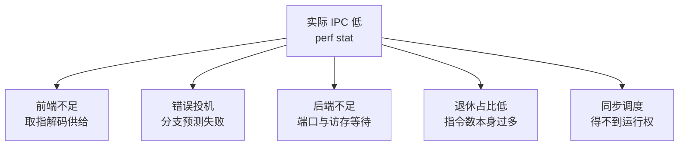
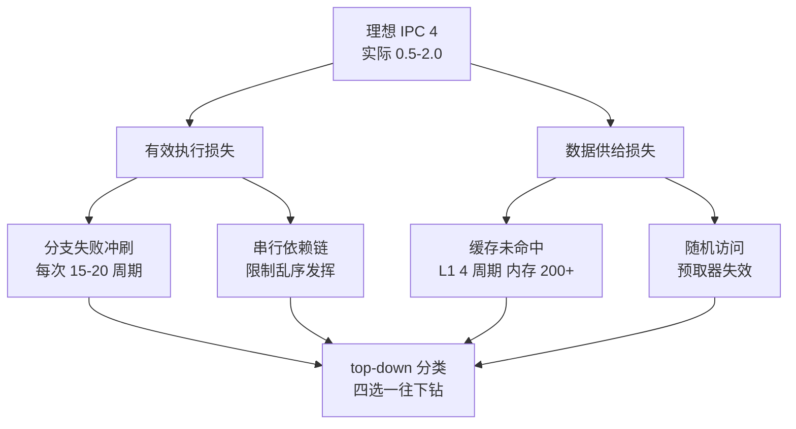

# CPU 性能来自有效执行与数据供给

CPU 性能问题要区分计算、前端供给、内存访问、分支投机、同步和调度。主频、核心数或使用率单独都不能证明瓶颈。

同一个服务在 CPU 使用率 60% 时也可能因为内存停顿或锁等待变慢，在 100% 时反而仍满足 SLO。先把用户延迟映射到有效退休、数据供给和等待时间，再决定是否改算法、布局、线程或频率。

性能分析因此要同时看“核心做了多少有效工作”和“为了拿到数据或获得资源等了多久”，而不是追逐一个孤立的利用率数字。

## 运行路径

~~~mermaid
flowchart LR
    F[取指/解码] --> S[分支与投机]
    S --> E[执行端口]
    E --> M[缓存/内存]
    M --> R[Retiring 有效退休]
    E --> L[锁/调度/IO 等待]
~~~

常见瓶颈：

- **Frontend bound**：指令缓存、解码或分支目标供给不足。
- **Bad speculation**：分支预测错误或错误投机造成流水线浪费。
- **Backend bound**：执行端口、缓存未命中、内存带宽或依赖链等待。
- **Retiring**：有效指令占比高；仍需判断算法和指令数量是否合理。
- **同步/调度**：锁、上下文切换、cgroup 配额或虚拟化导致线程得不到运行。

五类瓶颈在流水线上的位置各不相同，同一份低 IPC 曲线对应的归类：



图回答的是低 IPC 的五种归类各自的位置证据：前端与投机看流水线前段计数器，后端看端口占用与缓存未命中，退休占比看指令效率，同步调度看运行队列与等待时间，归类不同处置路径完全不同。

## 定位方法

1. 固定负载、版本、CPU 亲和性、频率策略和数据规模，记录 p50/p95/p99、吞吐和错误率。
2. 用 top、vmstat、sar 观察运行队列、user/sys/iowait、上下文切换和频率；不要把 load average 当作 CPU 使用率。
3. 用 perf 采样调用栈，再用硬件计数器判断 cycles、instructions、IPC、cache miss、branch miss 和 stalled cycles。
4. 将热点函数与调用路径、锁等待和内存/IO 证据相互对照；一次只改变一个变量。
5. 用相同工作负载重复基准，确认收益是否转移到内存、网络、锁或成本。

## 优化边界

- 先改算法复杂度、数据布局、批处理和不必要的工作，再考虑编译器或绑核。
- 绑核和 NUMA 本地化只在测量证明调度/远程访问是瓶颈时使用；否则可能降低负载均衡。
- 高频率不等于高吞吐；功耗、温度、内存带宽和下游等待都会限制收益。
- 任何优化都要保留回滚阈值和相邻负载的回归样本。

## 内存层次把计算与数据连接起来

寄存器、L1/L2、共享缓存、本地 DRAM、远程 NUMA 内存和存储形成越来越慢的层次。容量足够不代表访问足够快：

- 随机访问和指针追逐容易造成 cache/TLB miss 与延迟停顿；
- 多核顺序扫描可能打满内存带宽，增加线程不再提高吞吐；
- 频繁分配、回收、GC 和碎片会同时增加 CPU 与尾延迟；
- page fault、swap 或 cgroup reclaim 会把内存问题变成毫秒级等待。

区分泄漏、工作集增长、正常 page cache 和碎片。结合 RSS、缺页、reclaim、swap、分配 profile 和业务对象数判断，不能只看“used 百分比”。

## NUMA 是局部性约束

多 socket 系统把 CPU、内存控制器和设备划分为 NUMA 节点。线程访问本地页通常更稳定，远程访问增加延迟并消耗互连。用 lscpu、numactl、numastat、perf 和业务 trace 对照线程、页和设备位置。

cpuset、cpunodebind 或 membind 的启用前提是测得调度迁移或远程访问构成瓶颈。绑核会减少调度选择，也可能破坏负载均衡、容错和容器配额；数据库或推理服务还要同时考虑网卡、GPU 和后台线程的拓扑。

## 关联

- [[工程知识/性能工程：从用户等待到资源瓶颈/性能工程：从用户等待到资源瓶颈]]
- [[工程知识/性能工程：从用户等待到资源瓶颈/观测与诊断/性能问题定位]]
- [[工程知识/性能工程：从用户等待到资源瓶颈/观测与诊断/性能剖析与火焰图]]
- [[工程知识/性能工程：从用户等待到资源瓶颈/处理器与内存/GPU性能取决于计算、访存、并行与通信]]

机制与本质：CPU 性能取决于每周期能真正退休的指令数，本质问题在于有限的发射宽度与访存带宽被谁占用。

## 可运行示例与案例回流：有效执行的账

```text
IPC（每周期指令数）的分解账（通用量级）：

理想 IPC = 4（四发射流水线），实际程序 0.5-2.0，差距去哪了：

  有效执行损失（流水线停顿）：
    分支预测失败：每次 15-20 周期冲刷 → 循环内随机分支是大头
    依赖链：下一条指令要等上一条的结果 → 串行依赖链限制乱序发挥

  数据供给损失（访存停顿）：
    L1 命中 4 周期、内存 200+ 周期 → 一次缓存未命中等于几十条指令的时间
    数组遍历访存连续（预取器友好）vs 链表跳转（预取失效）差一个量级

  定位顺序：perf stat 看 IPC → IPC 低再看 top-down 分类
    （前端不足/后端不足/分支错误预测/访存等待，四选一往下钻）
```

理想 IPC 与实际 IPC 的差额流向两类损失，各自有独立的定位路径：



图回答的是 IPC 差额的两种去向与各自的细因：执行侧的损失查分支与依赖链，供给侧的损失查缓存层次与访问模式，两条线汇到同一个 top-down 定位入口。

案例回流：盲优化的实录——热点函数手写 SIMD 向量化，改完性能持平（瓶颈在数据供给不在执行），profile 显示访存等待占六成，改成连续内存布局（结构体数组换数组结构体）后吞吐翻倍——有效执行的账要先算哪边亏再补哪边。分支的实录——热路径上按概率排分支顺序（likely 在前）拿到 5-8% 提升，零代码复杂度代价。机制的展开见 [[工程知识/性能工程：从用户等待到资源瓶颈/处理器与内存/CPU缓存与分支决定有效执行时间.md]]（缓存行与分支预测的细节账）、与 [[工程知识/性能工程：从用户等待到资源瓶颈/观测与诊断/性能剖析与火焰图.md]] 的定位方法衔接（先火焰图找热点，再 top-down 分型）。

## 验证

1. 计算与供给分离：用 `perf stat` 采集 IPC、各级缓存命中与内存带宽，同时记录主频、使用率与有效吞吐，确认下降来自执行效率还是数据供给。
2. 单变量对照：固定输入与并发，只增加线程数，记录吞吐曲线与内存带宽占用，预期在带宽打满后吞吐不再上升。
3. 内存压力核对：用 RSS、缺页、reclaim、swap 与分配 profile 对照业务对象数，区分泄漏、工作集增长与正常页缓存。
4. 局部性核验：用 `lscpu`、`numastat` 与 perf 对照线程与页所在节点，确认跨节点访问是否构成可测量的延迟增量。
5. 断言锚点：瓶颈层级有计数器支撑，单变量实验可复跑，内存判断结合多类指标而非单看使用率。

## 要解决的问题

主频、核心数与使用率都看不出异常，而服务的处理能力已经下降，无从判断是计算、数据供给、内存访问、分支投机还是调度造成了等待。本篇回答：这几种限制各自的观测特征是什么、为什么单项指标无法证明瓶颈、定位时先区分哪一层，以及验证结论需要哪些计数器与业务指标配合。

## 相关

- [[工程知识/性能工程：从用户等待到资源瓶颈/处理器与内存/NUMA让跨槽访问付出带宽与延迟代价|NUMA让跨槽访问付出带宽与延迟代价]]——讲跨槽访问的带宽延迟代价表，是数据供给维度在多路机器上的放大
- [[工程知识/性能工程：从用户等待到资源瓶颈/处理器与内存/SIMD与数据并行：一行代码的多个通道.md]] —— 算力批发在向量通道，有效执行要算上通道利用率
- [[工程知识/性能工程：从用户等待到资源瓶颈/存储与网络/CPU降频的三个阀门：温度墙、功耗墙与电流墙.md]] —— 算力上限还会被温度与供电整段压低，是"频率不变但吞吐掉档"的另一种来源
