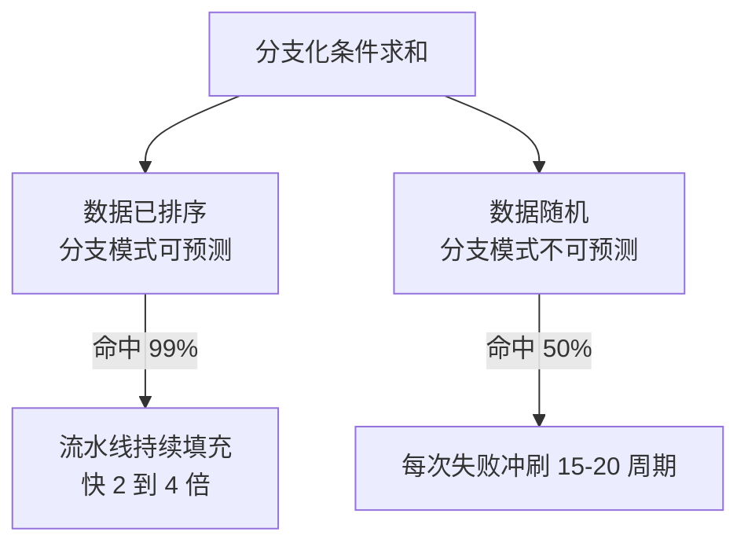
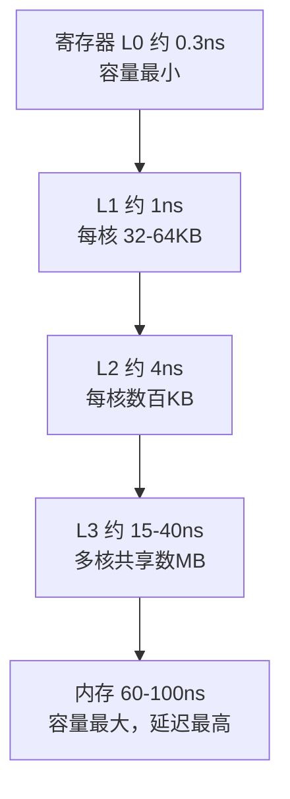

# CPU 缓存与分支决定有效执行时间

优化时先把数据布局、访问局部性和分支可预测性变成可观测假设，再用计数器和业务延迟验证；只改编译选项或绑核通常不能解释收益。缓存命中和预测准确率改善的是等待与流水线利用率，但可能增加内存占用、代码体积或功耗。

CPU 性能取决于指令是否能持续供给和数据是否及时到达。寄存器、L1/L2/L3、内存和远端 NUMA 的延迟/带宽差异，分支预测、指令窗口、向量化和线程调度共同决定每条指令的实际代价。

## 最小局部性实验

用同一批数据对照顺序数组遍历、随机指针访问和可预测/不可预测分支，固定编译器、频率和线程数；记录 cycles、instructions、cache/branch miss、内存带宽和 p99。归因要求计数器变化与业务耗时同向；缓存预热或调度噪声造成的波动会在同向性检查里现形。

## 看懂瓶颈

- cache miss 让核心等待数据；顺序访问、局部性和数据布局往往比微小算术优化更重要。
- 分支预测失败清空部分流水线；数据相关或不可预测分支会限制吞吐。
- 多线程可能提升吞吐，也可能因共享缓存、锁、带宽和上下文切换互相干扰。
- NUMA 远端访问、CPU 亲和性和频率/热限制会改变同一程序的结果。

## 测量边界

CPU 利用率高不等于有效执行高；可能是在 cache miss、锁或自旋上浪费周期。`perf stat` 计数器、采样 profile、off-CPU trace 和业务 latency 要互相对照，计数器名称和含义随架构变化。

## 可运行示例：一次遍历的时间差直接量

行序与列序遍历同一个二维数组，缓存行的效果当场可见：

```c
// a[8192][8192] 的 int 数组（256MB，远超 L2/L3 的有效覆盖）
// 行序遍历：内存地址连续，每 64B 缓存行用满 16 个 int
for (i = 0; i < N; i++)
    for (j = 0; j < N; j++)
        sum += a[i][j];
// 列序遍历：步长 32KB，每次访问都换缓存行，行内其余 15 个 int 浪费
for (j = 0; j < N; j++)
    for (i = 0; i < N; i++)
        sum += a[i][j];

// 典型读数：列序比行序慢 5-10 倍（数据总量不变，只换访问次序）
// perf stat -e cache-misses 可见：列序的 cache-misses 高一个量级
```

分支预测的同场实验：排序后数组上的分支化条件求和比未排序数组明显更快（同一段代码两个数据集，perf 的 branch-misses 计数相差一个数量级）——分支预测器对有序模式接近全中、对随机模式约一半失败，每次预测失败付出 15-20 个周期的流水线冲刷。

同一段分支代码，只因为数据有序程度不同，跑出两种差距数倍的结局：



上图说明：分支的性能代价不在分支本身，在预测器能否看出模式；数据有序化与无分支写法是同一问题的两条出路。

## 量化锚点与案例回流

层级延迟的账（数量级必须记住）：L1 约 1ns（4 周期）、L2 约 4ns、L3 约 15-40ns、内存 60-100ns——一次 L3 未命中等于几百次加法。缓存行 64B 意味着"数组 of 结构体"里只改一个字段也会拖整行（热字段分离是高频优化的第一刀），伪共享（两线程写同一缓存行的不同变量）让多核互踩——`perf c2c` 直接定位。案例衔接：[[工程知识/性能工程：从用户等待到资源瓶颈/操作系统与运行时/虚拟内存与文件系统把地址和持久化分层.md]] 的 TLB 账与本篇的缓存账是姐妹账（页表项命中失败与缓存行命中失败是两种"地址翻译税"）；[[工程知识/软件构建：让变化可以理解、验证与交付/语言与运行时/CPU微架构与流水线：分支预测乱序执行对程序员的可见影响]] 是本篇机制在 JIT 域的实录形态。

从寄存器到内存，每一层都换回容量而付出延迟，这条反向关系是所有布局优化的出发点：



上图说明：越往下容量越大、延迟越高，一次 L3 未命中的等待等于几百次加法，布局与预取的价值就在把访问留住上面几层。

## 验证

验证的锚点：缓存与分支的结论要与对照实验对账——预写同一算法在两种数据布局下各自的缺失率，实测差距与预期对不上时先查基线是否被频率或亲和性污染。

固定 CPU 频率/电源、亲和性、数据集、预热和并发，比较 cache miss、branch miss、cycles/instructions、带宽、上下文切换、p95 和成本。一次只改变数据布局、批量、线程数或算法，确认收益没有转移到内存或尾延迟。

关系：[[工程知识/性能工程：从用户等待到资源瓶颈/处理器与内存/CPU性能来自有效执行与数据供给]] · [[工程知识/性能工程：从用户等待到资源瓶颈/观测与诊断/性能剖析与火焰图]]

## 机制与本质

处理器的执行速度与内存供给速度之间存在数量级差距，缓存层级与分支预测共同把这条差距隐藏在流水线里。数据布局决定一次访问要拖入多少缓存行，分支形状决定流水线是否能持续填充；两者都作用在等待与利用率上，改变它们的效果取决于当前哪一项先成为限制。

## 要解决的问题

把数据布局与分支形状的调整当作可优化项，改动之后延迟没有变化，或者这一项改善了而另一项恶化，无法判断变化来自哪里。本篇回答：缓存层级与分支预测各自影响执行时间的哪一段、局部性与可预测性怎样写成可观测假设、单次改动的收益要怎样确认没有转移到内存占用或尾延迟上，以及编译选项与绑核为什么通常解释不了收益。

## 相关

- [[工程知识/性能工程：从用户等待到资源瓶颈/处理器与内存/NUMA让跨槽访问付出带宽与延迟代价|NUMA让跨槽访问付出带宽与延迟代价]]——讲 NUMA 拓扑下远程访问的代价与伪共享的区分，承接本篇缓存层级
- [[工程知识/软件构建：让变化可以理解、验证与交付/语言与运行时/CPU微架构与流水线：分支预测乱序执行对程序员的可见影响.md]] —— 测量微架构效应的方法论
- [[工程知识/AI 系统工程：从模型能力到生产能力/模型基础与训练/GPU执行模型与显存层级：SIMT与合并访存.md]] —— 同源的内存层级优化思想
- [[工程知识/性能工程：从用户等待到资源瓶颈/处理器与内存/缓存行与伪共享：64字节里的并发性能.md]] —— 缓存行既是数据供给单位也是一致性单位，并发下后者成为瓶颈
- [[工程知识/性能工程：从用户等待到资源瓶颈/处理器与内存/大页与TLB：地址翻译的隐藏成本.md]] —— dTLB miss 藏在 cache miss 阴影里，供给延迟要合并算账
