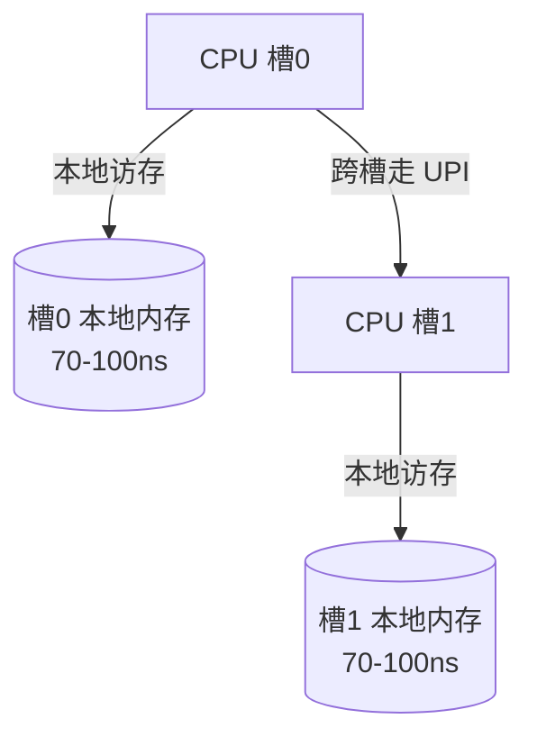

# NUMA让跨槽访问付出带宽与延迟代价

多路服务器不是一块统一的内存挂在所有 CPU 上，而是每个 CPU 槽位独占本地内存、通过互联总线访问别人的内存。要解决的问题：线程跑在 A 槽、数据分配在 B 槽，每次访存都要穿过互联总线，带宽减半、延迟翻倍，而这类损失在常规指标里不可见——top 看不出内存是远程的，必须用 NUMA 视角的工具才能看到。

## 机制：本地内存与远程内存的代价表

NUMA（Non-Uniform Memory Access，非统一内存访问）的物理拓扑：每个 socket 直连自己的内存控制器（本地内存），socket 之间靠 UPI/Infinity Fabric 互联。跨槽访问一次的成本：

两个槽位各带本地内存、经互联总线相连，跨槽与本地访问走的路径不同：



| 访问路径 | 相对代价 | 说明 |
| --- | --- | --- |
| 本地 DRAM | 1x（基线） | 约 70-100ns |
| 远程 DRAM（跨槽） | 延迟 1.5-2x，带宽显著下降 | 走互联总线，与对向流量竞争 |
| 本地 LLC 命中 | 约 1/3 基线 | 末级缓存吸收 |
| 互联总线饱和 | 全局带宽塌陷 | 所有人抢同一条总线 |

代价随拓扑级联：2 槽是单跳，4 槽常见两级（NUMA distance 不止两档）。收益是多路扩容的内存容量与核数；代价是"内存位置"从硬件细节变成软件必须管理的资源，调度器、分配器、线程绑定都要参与。

与伪共享（false sharing）的区分：伪共享是缓存一致性问题——两个核各写不同变量，但变量位于同一个缓存行（64B），一致性协议让这行在两个核的缓存间来回弹，写吞吐塌到总线速度。它发生在单槽内部甚至单核内部，与 NUMA 无关；两者叠加时（跨槽伪共享）最致命。

## 验证

验证的锚点：跨槽代价要与绑定对照对账——预写同一基准在全本地与跨节点两种绑定下的延迟差，实测对不上就说明访存热点并不在远端节点。

公开可复现的实测方法：
```bash
numactl --hardware          # 看 NUMA node 拓扑与 distance 矩阵
numactl --cpunodebind=0 --membind=1 ./benchmark   # 故意跨槽：内存绑到 node1
numactl --cpunodebind=0 --membind=0 ./benchmark   # 全本地对照
perf c2c record -a -- ./benchmark                  # perf c2c 直接定位伪共享缓存行
```
对照跨槽与本地的吞吐差即互联代价。伪共享用 perf c2c 的 HITM 事件直接抓到地址级证据。跨槽比对延迟的权威基线是 Drepper 的《What Every Programmer Should Know About Memory》实测表，写代码时的直觉校准可以用它。

## 边界

本篇讲硬件拓扑级的代价机制。进程内并发原语（锁、原子操作）怎么尽量减少跨核缓存行争用，见 [[工程知识/软件构建：让变化可以理解、验证与交付/语言与运行时/Go并发以所有权、取消与错误传播为边界|Go并发以所有权、取消与错误传播为边界]]（把数据所有权收进单 goroutine 就消除伪共享）。JVM 的堆在 NUMA 上的分配策略属于运行时层，见 [[工程知识/性能工程：从用户等待到资源瓶颈/操作系统与运行时/垃圾回收与内存分配决定延迟尾部|垃圾回收与内存分配决定延迟尾部]]。内存带宽耗尽（本地也救不了）的容量判断见 [[工程知识/性能工程：从用户等待到资源瓶颈/观测与诊断/排队论给容量一个可推导的模型|排队论给容量一个可推导的模型]]。容器环境里 NUMA 拓扑被 cgroup 掩盖的问题见 [[工程知识/后端系统：在并发、失败与变化中维持服务/基础设施/容器隔离资源边界与镜像身份|容器隔离资源边界与镜像身份]]。

## 相关
- [[工程知识/性能工程：从用户等待到资源瓶颈/处理器与内存/ECC内存把单比特错误挡在报告之前|ECC内存把单比特错误挡在报告之前]]——同属处理器与内存的硬件基础层：NUMA 讲访问代价，ECC 讲可靠性代价

- [[工程知识/性能工程：从用户等待到资源瓶颈/处理器与内存/CPU性能来自有效执行与数据供给]]——数据供给是 CPU 性能的一半
- [[工程知识/性能工程：从用户等待到资源瓶颈/处理器与内存/CPU缓存与分支决定有效执行时间]]——缓存层级是 NUMA 代价的下游承接
- [[工程知识/软件构建：让变化可以理解、验证与交付/语言与运行时/CPU微架构与流水线：分支预测乱序执行对程序员的可见影响.md]] —— 跨槽访存代价与伪共享区分
- [[工程知识/后端系统：在并发、失败与变化中维持服务/基础设施/网卡与内核旁路：中断与轮询的取舍.md]] —— 中断亲和性与跨槽代价
- [[工程知识/性能工程：从用户等待到资源瓶颈/处理器与内存/缓存行与伪共享：64字节里的并发性能.md]] —— 一致性粒度是缓存行，行内独立写也会乒乓失效
- [[工程知识/性能工程：从用户等待到资源瓶颈/处理器与内存/大页与TLB：地址翻译的隐藏成本.md]] —— TLB 与 NUMA 同在物理布局层收税：页覆盖半径与跨槽距离
