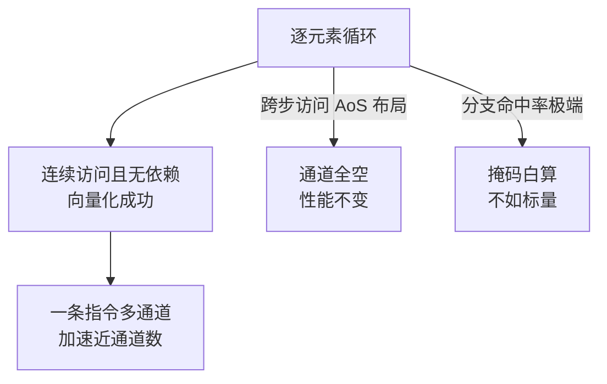

## 要解决的问题

同样一份循环加法，一份跑出 4 倍吞吐，一份和标量版没差别。差别在指令的通道数：SIMD（Single Instruction Multiple Data）让一条指令同时处理一个向量寄存器里的多个数据。CPU 的算力大头在向量单元（AVX-512 一个时钟周期最多 512 bit 的算术），多数代码却只用标量通道跑。问题的本质：**高级语言的语义是逐元素的，硬件的算力供给是按向量通道批发的，中间缺一个向量化转换层**——编译器自动向量化、SIMD intrinsics、GPU 的 SIMT 都是这个转换层的不同实现，理解它们的边界才知道提速什么时候兑现、什么时候无法兑现。

## 机制

**通道数：从 MMX 到 AVX-512 与 NEON**。x86 从 MMX（64 bit）、SSE（128 bit）、AVX/AVX2（256 bit）到 AVX-512（512 bit）；ARM 的 NEON/SVE（128 bit 起，SVE 可变长）。一个 256 bit 寄存器装 8 个 float32，一条 vaddps 完成 8 个加法。通道数是并行度的硬上限：向量化后加速比不会超过通道数（浮点 FMA 峰值再翻倍要靠双发射端口）。

**向量化三条件：连续访问、无依赖、无分支干扰**。编译器自动向量化（LLVM LoopVectorizer、GCC -O3）对循环的判定：内存访问步长可证明连续（数组下标线性、无 alias 指针）、迭代间无依赖（ reductions 有专门识别）、分支可转为掩码（select/masked load）。三个条件任一不满足就回落标量。`__restrict`、`#pragma clang loop vectorize` 是给编译器的依赖与意图承诺，OpenMP `#pragma omp simd` 是显式指令。

**掩码执行：分支的向量化出路**。循环里有 if 时，标量思路（跳过）不能直接批量。SIMD 用掩码：所有通道都执行，不满足条件的通道结果丢弃（masked load/store）。代价是不满足的通道白算。分支命中率极端（99% 走一边）时掩码反而亏（100 通道只有 1 个有效），这类模式退回标量或数据重排（把同分支的数据聚到一起）更优。

同一段逐元素代码落在哪种形态，直接决定向量化能不能兑现：



上图给出的是判据的落点：布局与分支形状先决定循环落在哪条路上，改代码之前先看这两项。

**数据布局决定供给**。AoS（Array of Structs）布局下取同字段要跨步访问，向量化失效；SoA（Structure of Arrays）布局让同字段连续，加载即成通道。这就是列存数据库与数值计算库（NumPy 的 ndarray、Eigen）都按列组织的原因：**向量化先于计算发生在布局层**。缓存行供给（64 字节一次搬一行）与通道宽度匹配，布局对了缓存行与寄存器都满载。

## 背景与代价

思想背景：SIMD 源自向量超级计算机（Cray-1，1976，向量寄存器与链式流水）。桌面 CPU 的 SIMD 从 Intel MMX（1996，为多媒体）起步，SSE/AVX 逐步扩宽。GPU 把 SIMT（同一指令流的多线程执行）做成大规模数据并行的主流形态。编译器自动向量化从学术研究（1990s 的 vectorizing compiler）到 LLVM LoopVectorizer 成为 -O2/-O3 默认动作，JIT（V8、.NET RyuJIT）也带运行时向量化。

最精巧的一笔是**掩码执行把控制流转成数据流**：标量世界的 if（跳过不执行的路径）在向量世界变成 mask（全执行、选择性提交），控制依赖降级为数据依赖。这一笔让带分支的循环也能向量化，代价是"白算的通道"。GPU 的 warp divergence 是同一问题的规模化形态（同 warp 分支不一致时两边都执行、各 mask 一半线程）。代价要摆明：AVX-512 的寄存器压力与降频争议（部分 Intel SKU 因功耗预算降频，Sky Lake X 时代实测争议大，Ice Lake 后缓解），向量宽度的收益依赖供给（内存带宽跟不上时计算通道空转）；自动向量化的脆弱性（相邻依赖的小改动让向量化静默失效，性能悄悄回落，无告警）；intrinsics 的可移植性差（每代指令集重写），多数项目只该用编译器自动向量化 + 少量热点手写。

## 边界

- **内存带宽是第一堵墙**。乘加密集（FMA）的计算受限于算力，访存密集（流式加总）受限于带宽。流式场景 AVX2 与 AVX-512 吞吐无差（带宽先满），向量化宽度白费。判定：计算强度（FLOP/byte）高才值得追宽向量。
- **短向量与调用开销吃掉收益**。向量长度小于寄存器宽度时通道空转；函数调用边界阻止跨函数向量化（inline 后才有机会）。热点函数内联 + 循环体足够长（迭代次数过百）是向量化的现实门槛。
- **跨平台指令集不统一**。x86 的 AVX 各代不齐（AVX-512 在消费级缺席多年），ARM NEON/SVE 语义不同。可移植路径：编译器 intrinsics 封装层（ highway）、C++ std::simd 标准化、或只依赖自动向量化 + 运行时分发（CPUID 检测选实现）。
- **向量化不修复算法复杂度**。O(n²) 的循环向量化后快 8 倍，仍是 O(n²)。数据并行换常数因子，算法选择换量级。先选对算法，再谈通道数。

## 验证

- **自动向量化观测实验**：写连续求和循环，编译并查汇编。预期：`clang -O3 -Rpass=loop-vectorize` 报告向量化成功，汇编出现 vmovups/vaddps；把循环改成跨步 2 访问，向量化报告消失、回到标量指令。向量化条件存在性的对照证据。
- **AoS vs SoA 实测**：粒子系统按 AoS 与 SoA 两种布局写同样的更新循环，测吞吐。预期：SoA 版向量化命中、吞吐数倍于 AoS 版（AoS 跨步访问不可向量化）。布局对通道供给的决定性证据。
- **掩码开销实验**：循环内 if 条件命中率从 50% 扫到 99%，测掩码向量化版与标量版吞吐交叉点。预期：命中率接近 1 时标量反超（掩码白算比例上升）。掩码执行的代价边界可实测复现。

## 可运行示例与案例回流：通道的账

```text
10 亿元素求和的推演账（通用形态，量级为公开典型值）：

  标量循环：每周期处理 1 个元素，内存带宽受限下约 4-8 GB/s 有效吞吐
  SIMD（AVX2，256 位）：一次 8 个 float → 吞吐 4-8 倍（对齐连续数据时）
  SIMD（AVX-512，512 位）：一次 16 个 float → 再翻倍（功耗与降频要权衡）
  前提账：数据连续（数组非链表）、对齐（32/64 字节边界）、
    分支少（分支让通道空转）、循环边界可向量化（编译器能认出来）

  自动向量化的落差：
    编译器 -O3 能自动向量化简单循环（求和、逐元素运算）
    有一行 if（数据依赖分支）就放弃 → 手写 intrinsic 或改写无分支形式
    改写示例：mask = (a > 0); sum += a & mask ← 把分支变位运算
```

案例回流：白改的实录——团队手写 AVX2 优化图像处理循环，性能持平（编译器早已自动向量化同样形态）；用性能分析确认热点后才动手是前置纪律，向量化收益要先测标量基线。分支毁通道的实录——过滤函数带一个"跳过异常值"的分支，向量利用率归零；改无分支掩码形式后 4 倍加速。链表踩坑的实录——把 vector 改 list 想提升局部性结果适得其反（SIMD 要求连续内存，链表指针追逐让通道全空）；数据布局先于指令选择。内存带宽与通道数的联动见 [[工程知识/性能工程：从用户等待到资源瓶颈/处理器与内存/缓存行与伪共享：64字节里的并发性能.md]]（SIMD 的前提是数据喂得饱）、向量化的应用层实例见 [[工程知识/数据系统：在并发与故障中保存事实/查询与索引/列存与向量化执行：OLAP引擎快的两个来源.md]]。

## 相关

- [[工程知识/性能工程：从用户等待到资源瓶颈/处理器与内存/缓存行与伪共享：64字节里的并发性能.md]] —— 通道供给依赖缓存行搬运，布局正确时行与寄存器宽度匹配满载
- [[工程知识/数据系统：在并发与故障中保存事实/查询与索引/列存与向量化执行：OLAP引擎快的两个来源.md]] —— 数据系统的规模化应用：列存布局 + 向量化执行是 OLAP 引擎快的两个来源
- [[工程知识/性能工程：从用户等待到资源瓶颈/处理器与内存/CPU性能来自有效执行与数据供给.md]] —— SIMD 通道数是有效执行的一部分，供给跟不上通道就空转
