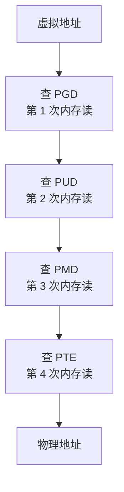

## 要解决的问题

程序访问内存用的虚拟地址，硬件要先翻译成物理地址才能读写。翻译不是免费的：页表多级查找（x86-64 四级，48 bit 虚拟地址）每次访问最坏要 4 次内存读。为摊薄这个成本，MMU 内置 TLB（Translation Lookaside Buffer），一小撮超快的翻译缓存。问题在 TLB 容量极小（L1 dTLB 几十到几百项，L2 STLB 几千项），按 4KB 页算只能覆盖几 MB 到几十 MB 的地址空间。大内存工作负载（数据库缓冲池、JVM 堆、大数组科学计算）的工作集远超 TLB 覆盖，每次地址翻译都可能 miss，页表走查（page walk）的内存读比数据本身的读还贵。问题的本质：**地址翻译是每条访存指令都要过的一道税，页大小决定 TLB 的覆盖半径，4KB 的默认页是面向小内存时代的设计，大内存工作负载要么按页粒度重配、要么为 TLB miss 付持续税**。

## 机制

**页表走查：翻译的完整成本**。x86-64 四级页表（PGD→PUD→PMD→PTE），一次翻译缺 TLB 时最坏 4 次内存访问（每级一次）。TLB hit 时翻译一两个周期，miss 走查几十到几百周期，缺 TLB 时沿四级页表逐级走查：

x86 用 MMU 缓存（PDE cache 等）缓解中间级，ARM 把中间级缓存在 walk cache。**数据访问的延迟里含着翻译延迟**，报表里看不到"TLB miss"单独一行，它藏在 cache miss 的阴影里（一次访存 miss 可能同时是 dTLB miss）。

**大页的两种形态：Hugetlbfs 与 THP**。显式大页（Hugetlbfs / mmap MAP_HUGETLB）：启动时预留 2MB/1GB 物理大页池，应用显式 mmap，翻译项从"每 4KB 一项"降到"每 2MB 一项"，覆盖半径扩大 512 倍。透明大页（THP，Transparent Huge Pages）：内核在缺页时自动尝试用 2MB 页补齐（madvise(MADV_HUGEPAGE) 引导或 always 全局），无需应用改造。两种形态的取舍：显式大页可靠无碎片风险但要预留管理（数据库场景的标准配置，Oracle/PostgreSQL 文档都写明步骤）；THP 零改造但有碎片与延迟代价（分配时 compaction 抓狂、运行中 split/merge 抖动）。

**TLB 分层与页大小收益的边界**。L1 dTLB 几十项、L2 STLB 几千项，2MB 页把两者覆盖半径放大 512 倍（L2 从 ~16MB 到 ~8GB 量级）。但收益只兑现在**访问的地址空间跨度大且局部性差**的工作负载：数据库随机扫描大堆、JVM 大堆 GC 扫描、HPC 大数组遍历。顺序小堆的工作负载（多数 Web 服务）TLB 本来就够用，开 THP 只有管理开销。判定靠 `perf stat -e dTLB-load-misses`（或 dtlb_load_misses.stlb_hit 比例）：miss 率高且工作集大才值得上大页。

**碎片：大页的现实约束**。2MB 物理连续页在长期运行的系统上稀缺（内存碎片化），分配失败触发 compaction（迁移内存腾连续块，代价是暂停与 IO）。`/proc/buddyinfo` 看连续块分布，`/sys/kernel/mm/transparent_hugepage/` 看分配成功/失败统计。THP defrag 策略（always/defer/madvise）就是在这个代价与收益间的旋钮。

## 背景与代价

思想背景：虚拟内存与页表是 1960s 概念（Atlas 机 one-level store），多级页表随地址空间扩大而必然。TLB 作为翻译缓存从 MIPS R2000（1986，全硬件 TLB miss 处理器）与 SPARC（软件走查）的两条路线走来。大页需求在数据库时代显性化（Oracle 1990s 末推动 hugetlb），THP 由 Andrea Arcangeli（Red Hat，2010s 前后进主线）做成透明方案。1GB 页（x86-64 PDPE 直接映射）是 HPC 与超大内存机器的选项。

最精巧的一笔是**THP 把"页大小选择"从应用配置降级为内核默认**：显式大页要求每个应用懂 mmap 与预留池（部署门槛高），THP 让内核在缺页路径上自动尝试大页、失败回落 4KB，零改造拿到大部分收益。代价要摆明：THP 的延迟尖刺（compaction 与 split 在运行中发生，延迟敏感服务被偶然 10ms 级停顿打中，这是 2010s 多起线上事故的根源，Redis 文档直接建议关闭 THP）；内存浪费（大页内部碎片：2MB 页只用到一小块时按整页计，RSS 虚胖，内存富余度小的机器放大 OOM 风险）；分配失败率随 uptime 上升（碎片化不可逆趋势，预留池的显式大页更稳）。**大页是数据库/大堆/JVM 这类"大跨度+长驻"负载的药，不是普适优化**；THP 的 always 模式在生产上争议大，madvise 定向使用是稳妥档位。

## 边界

- **收益判定先看 dTLB miss 率与工作集跨度**。工作集 < L2 STLB 覆盖（4KB 页下约几十 MB）的负载收益趋零。数据库缓冲池、大堆 GC、HPC 数组是典型受益者；小堆微服务开 THP 是纯风险。
- **延迟敏感服务慎用 THP always**。compaction/merge 的偶发停顿对 P99 是实打实的尖刺来源。定向方案：关键路径进程 prctl(PR_SET_THP_DISABLE) 关闭或 madvise 只给大数据区开。
- **容器与大页的错配**。默认 cgroup 内存记账按 4KB 页粒度，THP 大页 charge 到首个触碰进程，容器间内存配额统计会失真；Kata/KVM 场景反倒是 EPT 大页（宿主 2MB 映射到客户机）常见收益点。虚拟化两层翻译（客户机虚拟→客户机物理→宿主物理）的 EPT TLB miss 是另一层税，大页同样缓解。
- **1GB 页的适用面极窄**。数量级更少的 TLB 项（L2 STLB 装不下几个 1GB 项）换 TB 级覆盖，只对超大数据集（HPC、内存数据库 TB 级堆）有意义；预留 1GB 页对启动时内存状态要求苛刻，一般系统不碰。

## 验证

- **dTLB miss 测量实验**：大数组（数 GB）随机访问基准，`perf stat -e dTLB-load-misses,dTLB-loads` 对比 4KB 页与 madvise 大页两版。预期：4KB 版 miss 率显著高（页表走查吃掉延迟），大页版 miss 率塌降、吞吐上升。TLB 成本的可复现证据。
- **THP 分配行为观测**：`cat /sys/kernel/mm/transparent_hugepage/khugepaged/pages_scanned` 与 defrag 统计，观察长时间运行系统的分配成功率变化。预期：uptime 越长分配失败率越高（碎片化），compaction 事件集中。THP 现实约束的运行时证据。
- **数据库案例读法**：PostgreSQL/Oracle 官方文档的大页配置章节，读到预留池步骤与收益描述（TLB miss 降低的直接动机）。第三方生产负载的公开证据。

## 相关

- [[工程知识/性能工程：从用户等待到资源瓶颈/操作系统与运行时/虚拟内存与文件系统把地址和持久化分层.md]] —— 大页是页表机制的一个配置维度，本篇是翻译成本的专门展开
- [[工程知识/性能工程：从用户等待到资源瓶颈/处理器与内存/NUMA让跨槽访问付出带宽与延迟代价.md]] —— TLB 与 NUMA 都在物理布局层收税：一个按页覆盖半径、一个按跨槽距离
- [[工程知识/性能工程：从用户等待到资源瓶颈/处理器与内存/CPU缓存与分支决定有效执行时间.md]] —— TLB miss 藏在 cache miss 里，两级缓存的供给延迟要合并算账
