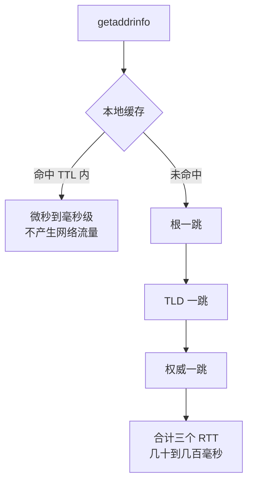

# DNS解析是延迟与故障的隐形入口

页面白屏、SDK 连接失败、服务间调用偶发超时——排查半天网络栈，最后发现是域名解析。要解决的问题：DNS 在请求路径的最前面，它的延迟与失败模式直接以"网络慢"的假象出现，而多数观测体系根本看不见它。把 DNS 从盲区变成显式监控对象，是网络可观测性的第一块拼图。

## 机制：一次解析穿过多少层

```text
应用 getaddrinfo
  -> 本地缓存（nscd/systemd-resolved）     命中即返回
  -> /etc/hosts                          手工覆盖层
  -> stub resolver -> 递归解析器          OS 网络配置决定去向
  -> 根 -> TLD(.com) -> 权威 NS           逐级委托
  -> 权威侧：GSLB/GeoDNS 按来源返回不同记录
```

每一层都能贡献延迟或错误：本地缓存 TTL 过期触发完整递归；递归解析器过载或丢包导致 SERVFAIL；权威侧按地理位置返回不同 IP（GeoDNS），跨地域容灾切换靠改这里。缓存是双刃剑：TTL 长则故障切换慢，TTL 短则解析负载与延迟上升。

看完能判断的量级：递归解析未命中时的耗时按链路跳数累加——根、TLD、权威各一跳，每跳一个 RTT，公网链路单跳常见几十毫秒，冷解析几百毫秒是常态量级（实测命令见验证节 dig +trace）；命中本地缓存后是微秒到毫秒级，两者差两到三个数量级，这就是「高频域名务必吃缓存」的账。TTL 取值的两本账：TTL 从 3600 改到 60，解析流量涨约一个数量级（权威侧 QPS 按缓存命中率反推），换来故障切换从小时级缩到分钟级；Cloudflare 与 Google 公共递归的工程实践中，生产域名 TTL 常见 60-300 秒档，切换要求快的（蓝绿发布）取下限、稳定域名取上限。

## 三类故障模式

解析请求的两条路径在跳数与耗时上的分岔：



图回答的是冷热两条解析路径的耗时差从哪来：命中缓存的请求不出主机，未命中的请求逐级委托三跳、每跳付一个 RTT，量级差两到三个数量级。

| 模式 | 表象 | 根因层 |
| --- | --- | --- |
| 慢解析 | 首次请求多几十到几百毫秒 | 递归链路 RTT、权威侧慢 |
| 解析失败 | SERVFAIL/NXDOMAIN 间歇出现 | 递归解析器过载、权威不可达 |
| 解析错 | 拿到旧 IP 或错误 IP | TTL 缓存 + GSLB 策略过期 |

第三类最阴险：IP 切换后旧记录仍在各级缓存里存活到 TTL 耗尽，客户端持续打向已下线的机器。容灾设计必须把 TTL 当作切换时间下限：TTL 60s 的记录，故障切换至少 60s 起步，还要算上客户端不遵守 TTL 的部分。

## 验证

验证的锚点：解析耗时要与逐级追踪对账——预写一次冷解析应比命中缓存多出几跳时间，实测差异与预期对不上就说明瓶颈在递归器一侧。

- dig +trace www.example.com 逐级看委托链与每跳耗时；dig @resolver domain 指定递归器对比不同 resolver 的延迟差。
- 连续解析同一域名 100 次，统计缓存命中与完整解析的延迟分布（p50/p99）。
- 生产验证看解析成功率的 SLI 与 SERVFAIL 率按 resolver 分组报警；跨国链路用不同地域 vantage point 对比权威应答。
- 应用侧确认客户端解析库（getaddrinfo、c-ares、JVM DNS caching）的缓存行为与 TTL 遵守情况——JVM 默认缓存 30s，与 DNS TTL 不一致是常见事故源。

## 边界

- DNS 只管名字到地址，不管地址可达：解析成功后连接失败要往 [[工程知识/性能工程：从用户等待到资源瓶颈/存储与网络/Socket与TCP把连接可靠性分成多层]] 走。
- mDNS/hosts 文件在容器环境常被忽略：K8s 的 ndots 配置会把每个外部域名先按集群内搜索域试一圈，见 [[工程知识/后端系统：在并发、失败与变化中维持服务/基础设施/Kubernetes管理资源状态，不管理业务正确性]]。
- 轮询记录（round-robin）不等于负载均衡：它不感知健康状态，故障节点会持续接收流量，需要与主动健康摘除配合（[[工程知识/后端系统：在并发、失败与变化中维持服务/分布式可靠性/健康检查只能提供有时效的失败证据]]）。

## 效果与代价

把域名解析纳入观测对象，换来的是首页加载、SDK 连接与服务间调用的偶发失败中，解析这一段有了独立的成功率与延迟数据，容灾切换的时间下限也能提前算出。代价是解析路径跨越本地缓存、操作系统解析器与权威服务，需要按解析器与地区分组采集，客户端缓存行为还要与应用侧配置逐项核对。

## 相关

- [[工程知识/性能工程：从用户等待到资源瓶颈/存储与网络/端到端网络延迟来自排队、协议、传输与处理]]：DNS 是端到端延迟时间线的第一段，本文展开它
- [[工程知识/后端系统：在并发、失败与变化中维持服务/服务设计/服务发现与负载均衡决定请求发往哪里]]：服务发现是 DNS 思想在服务间的特化，机制同源
- [[工程知识/后端系统：在并发、失败与变化中维持服务/服务设计/流量入口只负责路由与连接，不负责业务正确性]]：域名入口层与业务正确性的责任边界
