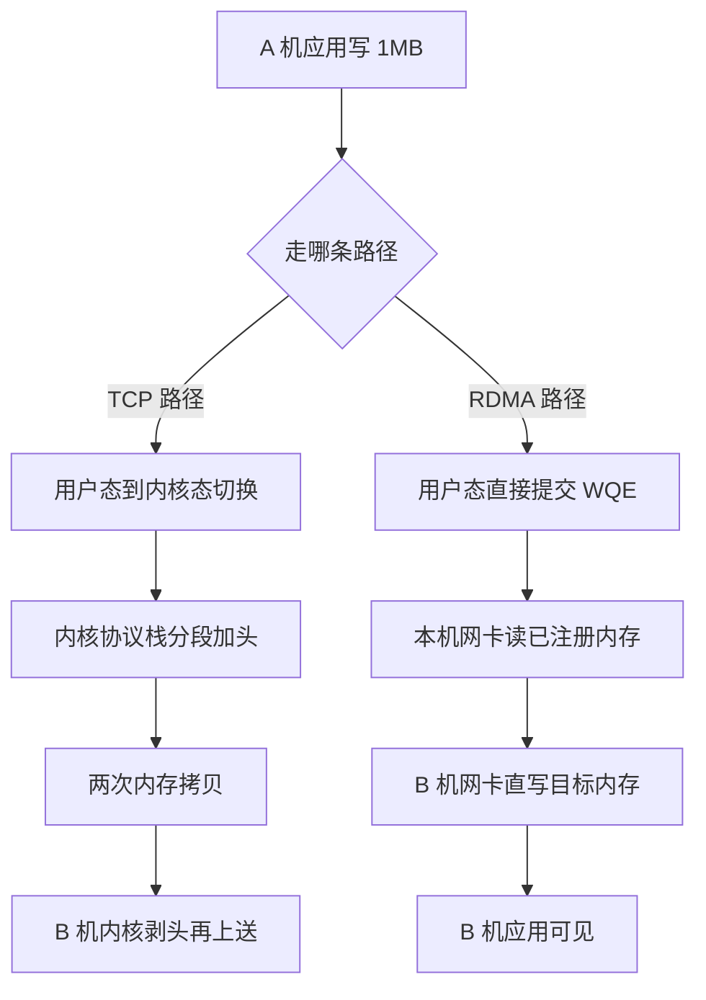

# RDMA绕过内核但要付出可运维性代价

同一个"把 1MB 数据从 A 机搬到 B 机"，TCP 协议栈要经过两侧内核的协议处理与多次拷贝，RDMA（Remote Direct Memory Access，远程直接内存访问）让网卡直接读写对方机器的内存，CPU 与内核全程不参与数据路径。要解决的问题：分布式训练与分布式存储这类机器间大吞吐搬运场景里，TCP 协议栈的 CPU 开销与拷贝延迟成为瓶颈，RDMA 把这条路径压到微秒级、CPU 占用接近零。

## 机制：绕过内核的三层代价表

RDMA 的收益来自三件事：网卡直接搬运（zero-copy，零拷贝，数据不经过内核缓冲区）、内核旁路（CPU 不进协议栈）、用户态直接提交工作请求（verbs API）。绕过内核的代价分布在三层：

| 层 | 代价 | 说明 |
| --- | --- | --- |
| 内存管理 | 内存注册（memory registration） | 网卡 DMA 需要物理页常驻且 pin 住，换页被禁止 |
| 语义约束 | 连接资源有界 | 每 QP（Queue Pair，队列对）占网卡内存，连接数受限 |
| 运维 | 丢包处理是黑盒 | RoCE v2 走 UDP 封装，标准以太网交换机的丢包对 PFC（优先级流控）依赖重，PFC 风暴是经典事故源 |

收益与代价的权衡：微秒延迟与零 CPU 占用换来了内存 pin 的换页损失、连接规模上限、以及以太网融合（RoCE）环境里 PFC/ECN 调优的复杂度。什么场景划算：机器间大块搬运（分布式训练梯度同步、存储副本复制）；什么场景不划算：小块低频请求（verbs 提交本身的固定开销占主导，反而不如 TCP）。



两条路径的分岔点在第一跳：TCP 把数据交给内核，后面每一步都在付协议处理与拷贝的账；RDMA 把工作请求直接交给网卡，内核只出现在连接建立与内存注册这些控制面动作里。下面那张表列的三层代价，就是这条捷径的过路费。

## 验证

```bash
# perftest 工具族直接测 RDMA 带宽与延迟
ib_write_bw -d mlx5_0 --report_gbits   # 一侧 server 一侧 client
ib_write_lat -d mlx5_0
# 对照 TCP 同机对同机
iperf3 -c <peer>
mpstat -P ALL 1                        # 观察两侧 CPU 占用差
```
预期：ib_write_bw 跑满网卡线速（如 100Gbps 网卡跑到 90+ Gbps）时 CPU 占用个位数百分比；iperf3 同吞吐下多核被打满。延迟对比：RDMA 单程微秒级、TCP 十微秒级起。数字对不上时先查 PFC 与 ECN 配置（RoCE 的丢包会触发 go-back-N 重传，吞吐断崖）。verbs 接口语义以内核文档为准，Mellanox 的 perftest 是可复现基线工具。

## 边界

本篇讲 RDMA 介质与传输机制。分布式训练怎么用 RDMA 做梯度同步（ring-allreduce 对带宽的利用）见 [[工程知识/AI 系统工程：从模型能力到生产能力/模型基础与训练/分布式训练与并行策略如何切分模型|分布式训练与并行策略如何切分模型]]。存储副本复制走 RDMA 的收益场景见 [[工程知识/数据系统：在并发与故障中保存事实/事务与存储/一致性哈希把再平衡的数据移动量压到平均槽位|一致性哈希把再平衡的数据移动量压到平均槽位]] 的再平衡移动量视角。内核内零拷贝（sendfile 一系，数据仍经内核协调）见 [[工程知识/性能工程：从用户等待到资源瓶颈/操作系统与运行时/零拷贝把数据通路的CPU让给业务|零拷贝把数据通路的CPU让给业务]]——那篇是内核协调下的拷贝消除，本篇是彻底旁路，两档不同。GPU 侧的互联（NVLink）与网络侧 RDMA 的分工见 [[工程知识/性能工程：从用户等待到资源瓶颈/处理器与内存/GPU性能取决于计算、访存、并行与通信|GPU性能取决于计算、访存、并行与通信]]。

## 相关

- [[工程知识/性能工程：从用户等待到资源瓶颈/操作系统与运行时/零拷贝把数据通路的CPU让给业务|零拷贝把数据通路的CPU让给业务]]——内核协调 vs 内核旁路两档对照
- [[工程知识/AI 系统工程：从模型能力到生产能力/模型基础与训练/分布式训练与并行策略如何切分模型|分布式训练与并行策略如何切分模型]]——RDMA 的最大消费场景
- [[工程知识/后端系统：在并发、失败与变化中维持服务/基础设施/网卡与内核旁路：中断与轮询的取舍.md]] —— 同类旁路取舍的存储场景
