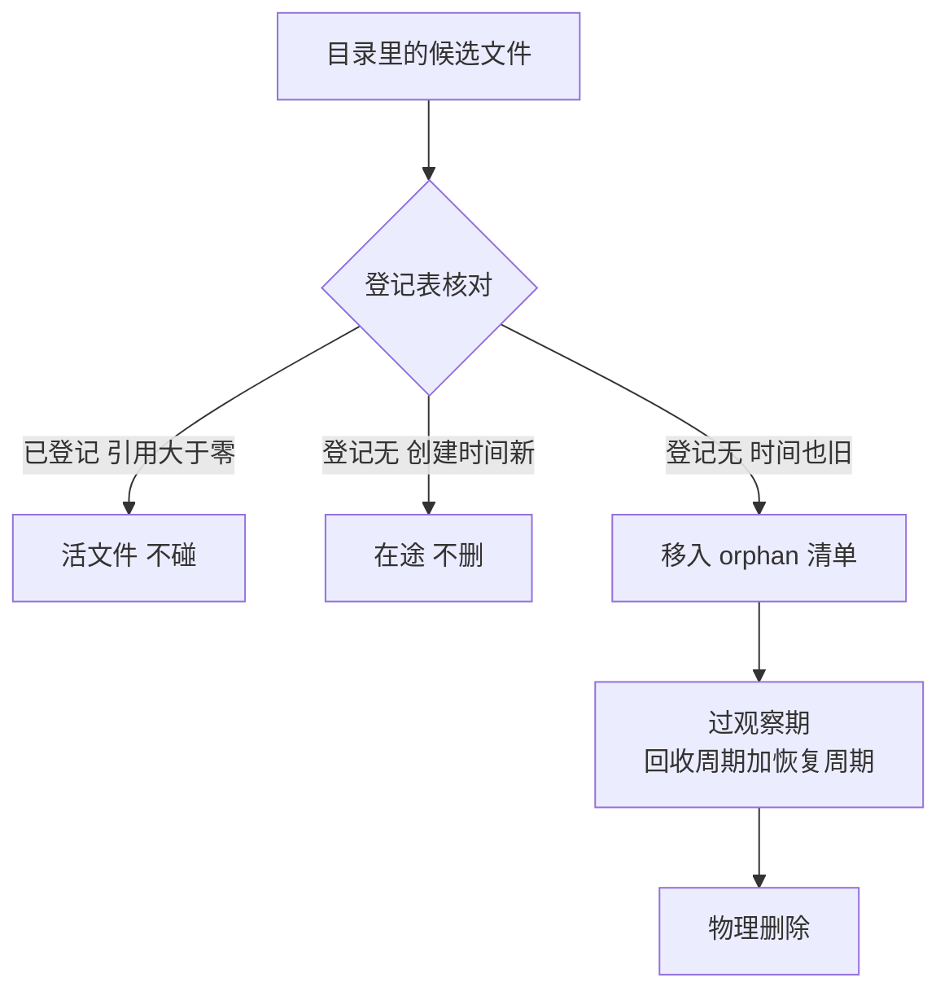

# SST 文件回收的对账：回收器要与登记表核对，不能只扫目录

> **要点**：存储引擎的文件回收是"谁有资格删"的判定题——回收器扫目录看到的所有文件都要有人认领：在引用登记表里的（活的）、登记表没有但流程还会用的（初始化中、恢复中的）、登记表漏登的（引用丢失，宁挂垃圾清单待人工也不删）；"扫到不在登记里就删"的回收器会把尚未完成登记的正常文件当垃圾删掉。

## 要解决的问题：回收器的两类误判，删错与漏删

LSM 引擎的数据存放在 SST 文件里，文件的产生（flush、compaction）与失效（compaction 后旧文件、abort 的 flush）由内部流程驱动，磁盘空间回收由独立线程执行——**两条线并发是误判的温床**：回收器扫目录的瞬间，新 SST 正在写（未登记）、compaction 正在切换（旧文件刚失效未除名）、恢复流程正在重建（目录里的文件是中间产物）。**两类误判**：误删存活文件（数据丢失，最重）；漏删已失效文件（空间泄漏，缓慢累积，本库磁盘三原则的水位告警兜底）。本库"空间回收要有对账表"篇给过登记原则；本篇给回收器侧的判定规则：**文件的三态与回收器的保守边界**。

## 机制：文件三态与回收判定

**第一态：已登记的活文件**。SST 在 manifest（登记表）里且引用计数大于零——回收器不碰。**判定的依据是登记表，目录内容只是候选集**：目录里出现登记表没有的文件，第一反应应该是"登记流程还没走完"，而不是"垃圾"。

**第二态：在途文件（初始化与恢复的中间产物）**。新 SST 写入过程分步：数据写入磁盘、登记表写入、引用可见——三步之间崩溃或并发扫描，目录里就有"数据在、登记无"的文件。恢复流程同理：重建 manifest 期间目录里的文件都是候选，回收器此时运行等于干扰。**判定规则**：回收器认"创建时间在回收周期起点之后的文件"为在途（不删），或者干脆**回收器与恢复流程互斥**（恢复进行时回收挂起）——两个机制选一个，选互斥更干净，因为时间判据在时钟回拨与长恢复面前不可靠。

**第三态：引用丢失的孤儿文件**。进程崩溃在"文件已失效、目录已删除"之前，登记表里已经没有它，目录里还在——这是真垃圾，但要走**垃圾清单**：回收器把它移入 orphan 清单（重命名或移到隔离目录），过了观察期（一个回收周期 + 一个恢复周期）才物理删除——**观察期的作用**：给"其实是活文件但登记异常"的情形留翻案窗口，判错删了活文件的后果（数据丢失）远比晚删几天垃圾（空间暂占）重。

**回收器的保守边界**：只在"登记表读取 + 目录扫描 + 清单比对"三步一致时动手；任何一步异常（manifest 读失败、目录遍历错误）就整轮跳过——**回收器是空间卫生员，权限是"删清单里的"，没有"清理一切"的权限**。上游"Fix SST files not being cleaned up in the locations folder"的缺陷正是反例：回收器漏扫 locations 目录下的文件，垃圾越积越多——漏扫（保守过头）与误删（越界）都要防，两边的判据都来自登记表。

回收器扫到一个候选文件后按登记表归到三种归宿，只有一种通向物理删除：



图回答的是「谁有资格删」的完整判定链：三种归宿里物理删除是唯一终点且要过观察期，登记异常的活文件在观察期里留有翻案窗口，误删的代价设计成远重于晚删。

## 看完能判断：回收系统的健康检查

**三个指标分开看**：目录文件数、登记表条目数、orphan 清单条目数——**三者差的走向是健康度**：目录持续多于登记（在途或漏登在涨）、orphan 清单只增不减（回收流程卡住或观察期配置错）、登记数涨目录不涨（写路径有异常）。**告警的承接位置**：目录与登记的差值超阈值（预警级）、orphan 清单老化超期（预警级）、回收器整轮跳过连续 N 次（行动级）——磁盘水位告警（本库三原则）是最后一道，这三个是先行指标。

**审计的对账动作**：定期（周级）跑一次全量对账——遍历目录、读登记、比对出三类差异（在途、孤儿、漏登），漏登的文件人工判定后补登或进清单——**对账报告是空间回收的体检报告**，等水位告警响再看，中间的异常已经演化数周。

**设计新引擎时的取舍**：登记表（manifest）的原子更新与回收器的互斥窗口是配套设计——manifest 写入用单事务、回收器启动先取 manifest 快照再扫描（快照外的动作留给下一轮），**快照隔离比加锁便宜且够用**，因为回收多删一轮的代价只是垃圾多留一个周期。

## 边界

三条边界防止防线走形。

**回收器不承担数据修复**：发现登记表与目录不一致（活文件缺失）时只上报不补——修复是恢复流程的职责，回收器补登记等于外行改账本。

**清理限速与 IO 隔离**：物理删除走限速队列（本库节流参数篇的同类核算），回收风暴（大批 compaction 后）不能挤占前台读写——删除也是 IO。

**快照与版本链的引擎特例**：多版本引擎（快照引用旧 SST）的"引用计数"含活跃快照——快照泄漏（创建后不释放）时旧 SST 永不回收，这是另一类"登记没错但引用没走"的泄漏，监控要含"最老快照年龄"。

## 验证

可复现的验证路径：

1. 误删复现：构造"文件在写、回收器并发扫描"的场景，预期在途文件零删除、扫描结果对得上登记表；
2. 漏删复现：制造崩溃点使文件成为孤儿，验证进清单、过观察期后被删、对账报告可查；
3. 指标验证：对账报告的三差值与告警阈值联动（目录登记差超阈值触发预警）；
4. 断言锚点：**回收器以登记表为唯一判据、orphan 有清单与观察期、三差值指标在监控**——三件齐备，文件回收从"扫目录就删"变成有账可对的例行流程。

```text
判据断言 = 登记表是删除的唯一依据
清单断言 = 孤儿走观察期不直删
指标断言 = 三差值先行于水位告警
```

文件回收的正确姿势是把"删什么"变成账目问题：登记表管活账，垃圾清单管悬案，对账报告管盘点——回收器的每一次删除都有账可查，空间泄漏与数据误删两个方向的错误都有闸门。

## 相关

- [[工程知识/缺陷分析：从个案到体系/硬件故障/空间回收要有对账表：引用登记让删除不漏不冤.md]] —— 引用登记的个案层
- [[工程知识/性能工程：从用户等待到资源瓶颈/存储与网络/磁盘空间管理三原则：配额水位与临时目录纪律.md]] —— 水位告警的兜底层
- [[工程知识/性能工程：从用户等待到资源瓶颈/存储与网络/存储引擎的文件一致性：元数据与数据块的对应关系要可核对.md]] —— 元数据核对的基础
- [[工程知识/缺陷分析：从个案到体系/资源与容量/案例六：容量与泄漏——连接泄漏和 SST 堆积.md]] —— 泄漏的个案形态
