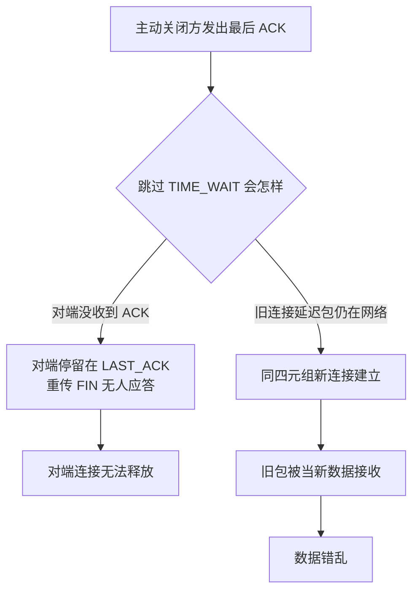

# TIME_WAIT是连接收尾的代价与设计

连接建立被讨论得多，连接收尾的 TIME_WAIT 状态却是线上事故的常客：短连接高频场景下几万条 TIME_WAIT 把端口耗尽，服务拒绝新连接。要解决的问题：主动关闭方为什么必须停留 2MSL（最长报文段寿命的两倍，Linux 默认 60 秒），以及这份代价在什么场景下会从保险变成瓶颈。

## 机制：两个存在理由与一张代价表

TIME_WAIT 只出现在主动关闭一方（先发 FIN 的一方）。它有两个存在理由，都源自 TCP 的不可靠信道假设：

| 存在理由 | 保护什么 | 丢失它的后果 |
| --- | --- | --- |
| 迟到的最后 ACK 丢了 | 对端重传 FIN 时能再回 ACK | 对端滞留 LAST_ACK，无法释放 |
| 旧连接的延迟包到达 | 旧数据不会污染复用同四元组的新连接 | 新连接收到上个连接的迷途报文，数据错乱 |

代价表（同一四元组的消耗维度）：

| 维度 | 量级 | 说明 |
| --- | --- | --- |
| 端口（客户端视角） | 临时端口约 28k-64k 个 | 同目标同端口四元组耗尽即无法建连 |
| 内存 | 每条约 3KB 内核结构 | 10 万条约 300MB，量大但通常不是瓶颈 |
| 路由表项 | conntrack 表项 | NAT 环境下先于端口耗尽 |

治理选项各有代价：`tcp_tw_reuse` 只对出方向连接安全（依赖时间戳，让旧包因 PAWS 判旧丢弃）；`tcp_tw_recycle` 已因 NAT 下误杀正常连接被内核移除；连接池与长连接是从源头减少关闭次数的正解。收益是可靠性保险，代价是短连接高频场景的端口池消耗——权衡点在于你的连接模式是否复用同一四元组。



两条支路就是 TIME_WAIT 存在的两个理由：上面一条保护「对端能不能正常收尾」，下面一条保护「新连接会不会收到上个连接的迷途报文」。停留 2MSL 是在等两件事都不再可能发生——这段等待期吃掉端口，是保险的保费；短连接高频场景里保费按连接数累积，才会出现端口耗尽。

## 验证

```bash
# 观察 TIME_WAIT 数量与增长
ss -s | grep -i timewait
watch -n1 'ss -t state time-wait | wc -l'
# 制造压力确认端口耗尽阈值
for i in $(seq 20000); do curl -so /dev/null http://127.0.0.1:8787/ & done; wait
# 修复后复测
sysctl net.ipv4.tcp_tw_reuse
```
预期：短连接压测后 TIME_WAIT 数量与并发数同量级，60 秒后自动回落；`tcp_tw_reuse=2`（loopback 之外的自动复用）下出方向连接不再堆积。数字对不上（TIME_WAIT 持续超高不回落）时查是否有 `so_reuseport` 之外的异常关闭模式。Bernat 的文章给出了各内核参数的精确语义与 NAT 陷阱，是这份参数表的权威来源。

## 边界

本篇讲 TCP 连接状态机的收尾段。连接建立段的握手与状态转换全貌见 [[工程知识/性能工程：从用户等待到资源瓶颈/存储与网络/Socket与TCP把连接可靠性分成多层|Socket与TCP把连接可靠性分成多层]]。短连接风暴的源头治理（连接池把短连接变长连接）见 [[工程知识/后端系统：在并发、失败与变化中维持服务/服务设计/服务发现与负载均衡决定请求发往哪里|服务发现与负载均衡决定请求发往哪里]]。NAT 与 conntrack 的表项消耗属于网络中间盒维度，见 [[工程知识/性能工程：从用户等待到资源瓶颈/存储与网络/DNS解析是延迟与故障的隐形入口|DNS解析是延迟与故障的隐形入口]] 的入口层视角。端口耗尽在监控上的表现（连接失败率突增）属于告警维度，见 [[工程知识/性能工程：从用户等待到资源瓶颈/观测与诊断/排队论给容量一个可推导的模型|排队论给容量一个可推导的模型]] 的容量视角。

## 相关

- [[工程知识/性能工程：从用户等待到资源瓶颈/存储与网络/Socket与TCP把连接可靠性分成多层|Socket与TCP把连接可靠性分成多层]]——连接状态机全貌，本篇是其收尾段展开
- [[工程知识/性能工程：从用户等待到资源瓶颈/存储与网络/QUIC把传输握手与加密合流到用户态|QUIC把传输握手与加密合流到用户态]]——QUIC 用连接 ID 替代四元组，从结构上消解 TIME_WAIT 问题
- [[工程知识/后端系统：在并发、失败与变化中维持服务/基础设施/TCP连接建立与断开的状态机：握手挥手与异常路径.md]] —— 状态机整机的握手挥手展开，TIME_WAIT 是其中一个状态的深挖
