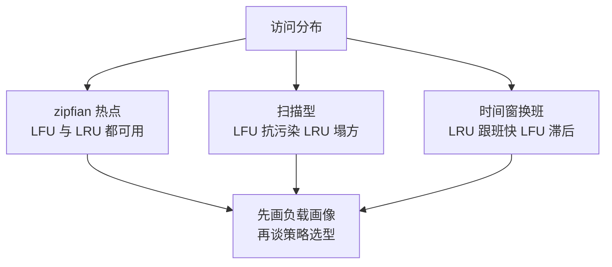

## 要解决的问题

缓存换一个驱逐策略，命中率差 20 个点，等于省 20% 的回源流量。选策略的争论常停在口头：LRU 派说"最近用过的还会再用"（时间局部性），LFU 派说"经常用的才该留"（频率局部性），FIFO 派说"简单就是快"。口头争论的盲区：**命中率的决定者是负载的访问分布，策略哲学的争论要排在分布之后**——_zipfian 热点分明的负载与扫描型负载（周期性全量遍历，无复用）对策略的评价完全相反。实证对比的方法：把策略放到负载分布维度下测，LRU/LFU/ARC/FIFO 各自的甜点区与盲区就清晰了，选型从信仰变成查表。

## 机制

**四类策略的行为签名**。FIFO：先进先出（队列），不管访问只管进入顺序——最便宜（O(1)，无元数据），但对热点不敏感（最早进的热键会被驱逐）。LRU：驱逐最久未访问（双向链表 + 哈希，O(1)），信时间局部性——突发的一批冷访问会污染缓存（扫描把热键全挤出，扫描完热键要重新回源）。LFU：驱逐访问频率最低（计数 + 桶，实现贵一点），信频率局部性——对稳定热点准，但新键冷启动吃亏（刚进来的热键频率计数低，先被驱逐；老键的陈年高频压着新热点， adapts 慢）。ARC（Adaptive Replacement Cache）：LRU 的两个列表（recent 与 frequent）动态调节比例，扫描污染时自动偏向 frequent 侧——自适应地兼顾时间与频率。

**负载分布决定胜负**。zipfian 热点（少数键占大头访问）：LFU 与 LRU 都不错（热点稳定时 LFU 略胜，热点漂移时 LRU 跟得快）。扫描型负载（全量遍历，键不复用）：FIFO/LRU 都被洗白（缓存命中率趋零，纯白干），LFU 抗污染（老热点的高频计数扛住扫描）但缓存对新扫描无意义。时间窗负载（工作集随时间换班，上午 A 组键、下午 B 组）：LRU 胜（跟班快），LFU 败（计数是全历史的，换班跟不上）。**扫描抗性与跟班速度是跷跷板：LFU 两头都稳但慢，LRU 快但易污染，ARC 用复杂度买两头兼顾**。

三类负载把四类策略的分出高下，同一策略在不同负载下的结局相反：

图回答的是选型的入口次序：负载分布不同，同一策略的评价完全相反，访问分布的画像比策略本身的优劣更靠前。

**真实系统的时间成本**。策略的元数据操作也在延迟路径上：LRU 每次访问要移链表节点（无锁实现难，高并发下链表指针的 CAS 竞争）；LFU 的计数更新便宜（原子加）但驱逐时的桶查找要看实现；Caffeine（Java 生态标杆）用 W-TinyLFU（频率素描 Count-Min Sketch + 新键准入窗口）把 LFU 的准确与 LRU 的敏捷缝起来，靠的是**频次估算换精确计数**（sketch 有 1% 误差，换来 O(1) 且省内存——工程上"大概率的准"胜过"精确的贵"）。延迟敏感路径选策略，元数据操作的常数项与并发行为要一起测。

**命中率的观测与收益换算**。命中率不是越高越好（容量无限时 100% 但内存爆炸），收益曲线有拐点：容量-命中率曲线（miss rate vs size）的拐点给出"性价比容量"（再加 1GB 命中率只涨 0.1%，不值得）。实证流程：记录真实访问序列（key + 时间戳）→ 离线回放各策略（多容量档）→ 曲线对比选型。线上验证：灰度双跑（新旧策略各一半流量，比命中率与回源量），A/B 的收益才可信。

## 背景与代价

思想背景：替换策略的研究从操作系统页面置换（1960s 的 Belady 最优解是理论天花板——驱逐"未来最久不用"的，需要未来知识）一路下来；ARC（IBM，2003 论文）是自适应路线的代表；Redis 近年引入 LFU 模式（4.0，2017，带衰减计数对抗陈年高频）；W-TinyLFU（2017 论文）与 Caffeine 把"素描 + 窗口"做进工业标配；Meta 公开过生产负载的 cache 策略对比数据（2022 前后的 paper，大数据集上 TinyLFU 系对 LRU 的优势量化）。

最精巧的一笔是**W-TinyLFU 用"估算的频率"替代"精确的频率"**：精确 LFU 的病根在精确（每个键一个计数器的内存、陈年计数的失效），Count-Min Sketch 用几 bit 的哈希素描以 1% 的误差把每键计数器的内存降掉数量级（每键 32 位计数器对每键若干 bit 的共享桶），加上计数衰减（定期右移，让历史频率过期）解决陈年问题。这是"分布式的精准幻觉"的破解范本：**多数负载下，1% 误差的频率信息决策出的驱逐序列与精确版几乎一致**，为 1% 的精度付出一个数量级的内存溢价是策略设计的反面教材。代价要摆明：sketch 有误判（冷键碰巧哈希到热桶，被误当热——准入窗口兜住这类误判的爆炸半径）；自适应策略（ARC/TinyLFU）的行为难解释（参数调优无理论指导，线上问题的归因多一层黑盒）；**实证对比有环境成本**（访问日志的采集与回放要基建，离线回放的结论与线上实况有偏差——回放无法重现并发时序与回源延迟的反馈环）。

## 边界

- **策略选型先看负载画像**：没有访问分布数据前，一切策略讨论是空谈。画像的两个必答题：键的复用分布（zipfian 还是均匀）、有无扫描型流量（备份、报表、爬虫的全量遍历）。画像答完，策略的候选集已经缩到一两个。
- **多级缓存的策略分工**：本地缓存（进程内，容量小延迟敏感）与远程缓存（Redis 类，容量大网络往返）的负载形态不同（本地层过滤后的访问模式更热），策略不必相同——本地 LRU 挡突发、远程 LFU 保热点是常见组合。
- **热点 key 的极端形态越过策略问题**：单个 key 打爆容量层（微博明星官宣的 key 集中读写），驱逐策略无关紧要（缓存满不了、命中率满的），要的是 key 分开（加后缀哈希打散）或本地缓存挡写。策略解决"留谁"，解决不了"全都要"。
- **一致性约束压过命中率**：写多读少的数据上缓存（命中率低 + 失效复杂），先问该不该缓存（直接读库可能更简单更快），策略优化是缓存已成立后的第二问。

## 验证

- **负载-策略矩阵实验**：合成三型负载（zipfian 稳定热点 / 扫描污染 / 时间窗换班）离线回放 FIFO/LRU/LFU/ARC 四策略（同容量多档）。预期：zipfian 下四者接近（LFU 略优）；扫描下 LFU/ARC 显著抗污染（LRU/FIFO 命中率塌方）；换班下 LRU/ARC 跟班快（LFU 滞后）。行为签名表的直接复现。
- **容量-命中率曲线**：真实访问日志回放单策略（LRU），容量从 1% 到 100% 工作集扫描。预期：曲线前段陡升后段平缓，拐点即性价比容量；不同策略的曲线对比（TinyLFU 的曲线在 LRU 上方且拐点更早——同样命中率用更少内存）。收益换算的方法验证。
- **线上灰度对照**：新策略（如 LRU 换 W-TinyLFU）灰度 50% 流量双跑一周。预期：命中率与回源量（QPS、带宽）的差值即真实收益；注意观察延迟分位数（策略元数据的操作成本可能吃掉部分收益）。决策所依据的证据来自这一层。

## 相关

- [[工程知识/性能工程：从用户等待到资源瓶颈/处理器与内存/缓存行与伪共享：64字节里的并发性能.md]] —— CPU 缓存行是硬件级 LRU 的实例，本篇是软件缓存的策略层，两级的驱逐依据都是访问局部性
- [[工程知识/数据系统：在并发与故障中保存事实/查询与索引/列式存储把扫描与压缩交给分析路径.md]] —— 扫描型负载的缓存收益趋零，分析路径的缓存策略是本篇边界条件的案例
- [[工程知识/后端系统：在并发、失败与变化中维持服务/服务设计/连接池的容量数学：池大小与排队等待的权衡.md]] —— 容量-收益曲线的拐点思维与连接池容量同构，资源分配的通用方法
