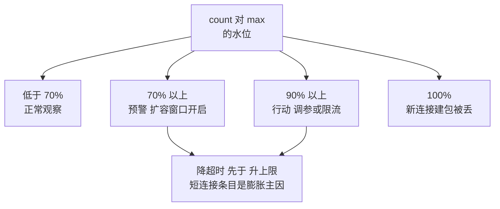

# conntrack 表满不丢连接的判定：计数、桶与协议差异

> **要点**：连接跟踪表的容量判据是 `nf_conntrack_count` 逼近 `nf_conntrack_max`（水位 70% 预警、90% 行动），溢出的直接症状是"新连接被静默丢弃、老连接正常"——读 count 与 max 的水位、按协议分别统计条目构成（TIME_WAIT 类短连接是膨胀主因），调参动上限、桶数、超时三处一起动。

## 要解决的问题：连接跟踪为什么存在，又为什么丢包

Netfilter 的连接跟踪（conntrack）为每条经过的连接在内核里建一条记录（五元组 + 状态 + 超时），NAT、状态防火墙、有状态负载均衡都依赖它——**记录的代价是内存与容量上限**：`nf_conntrack_max` 限制条目总数，表满后新连接的建包被丢弃（默认行为），表现为"偶发连不上、重试能成功"，流量高峰时变成大面积连接失败。**conntrack 问题的隐蔽性**：表满不崩进程、不打错误日志，只有内核计数器在说话——发现靠监控（count 水位），症状定位靠"老连接正常、新连接失败"的特征组合。

## 机制：计数、桶与超时

**计数与水位**：`nf_conntrack_count` 是当前条目数，`nf_conntrack_max` 是上限——**水位判定线**：持续 70% 以上预警（扩容窗口开启）、90% 以上行动（调参或限流）、100% 即丢包。`/proc/sys/net/netfilter/nf_conntrack_count` 与 `cat /proc/sys/net/netfilter/nf_conntrack_max` 两个文件是第一现场，`conntrack -S` 看 per-CPU 统计（insert_failed 计数非零即在丢）。

count 对 max 的水位决定处置动作的档位，丢包只在最后一级：



图回答的是水位分级的处置次序：70% 与 90% 两级预警给的是提前量，动作先降超时再动上限，insert_failed 计数是丢包的实证信号。

**条目的构成统计**：`conntrack -L | awk '{print $4}' | sort | uniq -c` 按协议状态统计——**膨胀的主因通常是 TIME_WAIT/短连接类条目**：每个 HTTP 短请求建一条 conntrack，条目存活到超时（默认 tcp timeout_time_wait 120 秒），QPS 万级的短连接服务几分钟就能灌满默认 65536 的表。**分别统计的意义**：确认膨胀来源（短连接 vs UDP 洪水 vs 扫描流量），不同来源的处理动作不同。

**超时参数是第二调节阀**：条目的生存期按状态分档（`nf_conntrack_tcp_timeout_time_wait`、`_established`、`_close_wait` 等）——**降超时是比升上限更优先的动作**：TIME_WAIT 120 秒降到 30 秒，同样流量下条目数降为四分之一；established 超时（默认 432000 秒 = 5 天）对大量半开失效连接的表尤其值得压。**上限、桶数、超时三处一起动**：`nf_conntrack_max` 升高的同时要核 `nf_conntrack_buckets`（哈希桶数，建议与 max 同量级或 max/4 起，桶太少查表 CPU 飙升）、按业务超时节奏调状态超时——**单动 max 是最常见的半截调参**。

**不走 conntrack 的旁路**：纯内部可信流量（监控拨测、健康检查、本机回环）可用 raw 表 NOTRACK 豁免——**豁免是精简不是优化**：每条豁免的连接不占表容量，但也不受状态防火墙保护，豁免范围要白名单化并留文档。

## 看完能判断：溢出判定的四步

1. **看水位**：count/max 比例与增长斜率——斜率陡增（分钟级从 50% 到 90%）是短连接风暴或扫描，缓增是业务自然增长（该扩容）；
2. **看构成**：按协议状态统计条目——TIME_WAIT/CLOSE 类占比高走降超时路线，ESTABLISHED 异常多查半开连接与应用泄漏（连接不关，conntrack 条目陪葬）；
3. **核丢包**：`conntrack -S` 的 insert_failed、`netstat -s | grep -i "listen queue"`——insert_failed 增长即表满丢包实锤；
4. **定动作**：临时止血（降 TIME_WAIT 超时 + 豁免可信流量）→ 中期（升 max 配桶数 + 应用侧连接池复用，从源头减少短连接）→ 长期（水位告警进监控，本库交付清单篇的阶段三第 12 项）。

**两类高发场景**：容器环境（K8s 的 kube-proxy 走 conntrack，Service 后端多、短连接密集的集群默认 max 远不够，社区常见把 max 调到百万级）；NAT 网关（出向流量的五元组复用受限，SNAT 池小 + 短连接多 = 表满加速）。

## 边界

三条边界防止防线走形。

**conntrack 表满的症状与 accept 队列满不同**：表满是"新连接的 SYN 被丢"（客户端连接超时、服务端无感）；队列满是"SYN 收到但 accept 不过来"（服务端有计数）——**两者都有"偶发连不上"的表象**，判据在 insert_failed 计数与队列溢出计数各查各的，本库"连接建立失败先看内核队列"篇是队列侧的判定。

**调参有重启生效与即时生效之分**：`sysctl -w` 即时生效但重启丢失，持久化进 `/etc/sysctl.d/`——**只调不持久化是复发性故障的经典成因**（换机器、重启后参数回默认，问题复现）。

**UDP 条目没有连接状态**：UDP 的 conntrack 条目按流超时（默认 30 秒单 180 秒多向），DNS 高频查询、QUIC 大流量场景的 UDP 条目也是膨胀源——按协议分别统计时 UDP 单列，别按 TCP 直觉判。

## 验证

可复现的验证路径：

1. 溢出复现：测试环境把 max 调小 + 短连接压测，预期 insert_failed 增长、新连接超时老连接正常，验证症状组合的判定法；
2. 调参验证：降 TIME_WAIT 超时 + 升桶数后重压，预期同流量下 count 水位降、insert_failed 归零、CPU 无明显上涨；
3. 告警验证：水位到 70% 预期预警触发、90% 预期行动级告警，交付清单第 12 项的核对有数据支撑；
4. 断言锚点：**count/max 水位监控在管（含 per-CPU insert_failed）、按协议状态的构成统计有面板、sysctl 参数持久化在配置管理**——三件齐备，"偶发连不上"从玄学变成一张水位图加一个构成表。

```text
水位断言 = count 对 max 的比例在管
构成断言 = 按协议状态分别统计
持久断言 = 调参进 sysctl.d 不靠现场
```

conntrack 的容量治理读三个数：水位（还有多少余量）、构成（谁在占）、丢失计数（是否已在丢）——三个数的组合直接给出"降超时、升上限、上连接池、做豁免"的动作选择，表满丢包的排查从内核玄学收敛为一次读表。

## 相关

- [[工程知识/性能工程：从用户等待到资源瓶颈/存储与网络/交付前的网络检查清单：二十项逐条过，三项全绿再上线.md]] —— 水位检查进上线清单
- [[工程知识/性能工程：从用户等待到资源瓶颈/存储与网络/连接建立失败先看内核队列：SYN 队列与 accept 队列是两个瓶颈.md]] —— 队列侧的同类判定
- [[工程知识/性能工程：从用户等待到资源瓶颈/存储与网络/TIME_WAIT是连接收尾的代价与设计.md]] —— 短连接条目的来源治理
- [[工程知识/性能工程：从用户等待到资源瓶颈/存储与网络/连接与文件描述符的配额要联动：ulimit 是连接数的隐形上限.md]] —— 应用侧配额的联动核算
